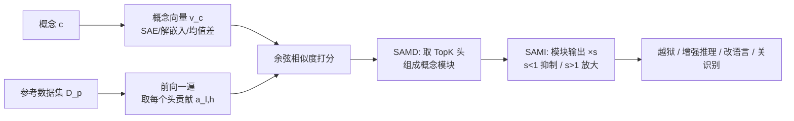

# From Concepts to Components: Concept-Agnostic Attention Module Discovery in Transformers

**会议**: ICLR 2026  
**OpenReview**: [https://openreview.net/forum?id=Va2tLzb1NX](https://openreview.net/forum?id=Va2tLzb1NX)  
**代码**: [facebookresearch/Concept-Agnostic-Attention-Module-Discovery-in-Transformers](https://github.com/facebookresearch/Concept-Agnostic-Attention-Module-Discovery-in-Transformers)  
**领域**: 机制可解释性 / 模型归因  
**关键词**: attention head attribution, concept localization, residual stream, scalar intervention, jailbreak, multilingualism  

## 一句话总结
把任意复杂"概念"抽象成一个向量，用它和每个注意力头输出做余弦相似度、取 TopK 头组成"概念模块"，再用单个标量缩放该模块的输出强度，就能定位并放大/抑制语言与视觉 Transformer 里的安全、推理、多语言、图像识别等概念。

## 研究背景与动机
**领域现状**：可解释性研究里的"归因（attribution）"试图把模型的某种行为定位到具体组件上。当前主流做法集中在 **MLP 神经元**——因为有工作发现 MLP 像"记忆"一样存储事实（Geva et al. 2021），所以大家用它来追问"知识存在哪里"。

**现有痛点**：作者点出三个长期被忽视的缺口。其一，**注意力机制被冷落**——多头自注意力是 Transformer 的决定性特征，却很少被纳入归因分析。其二，**概念太简单**——现有归因研究只能处理数量、句法、事实关联（"巴黎在法国"）、简单名词这类低复杂度概念，对"推理""安全"这种抽象概念束手无策。其三，**缺乏通用流程**——以往方法依赖人工逐个检查电路、各做各的，没有一个对各种概念都通用的 concept-agnostic 管线。

**核心矛盾**：研究者既想分析注意力、又想覆盖任意复杂概念，但"概念"本身难以统一表征，而注意力头数量庞大（几十层 × 几头）人工不可能逐个排查。

**本文目标**：提供一个能扩展到**任意 Transformer、任意概念**的注意力头归因 + 干预流程。

**核心 idea**：**残差流视角下，每个注意力头都是往残差流里线性"加"一份贡献**——那么"某个概念由哪些头负责"就等价于"哪些头的贡献向量和概念向量最像"。于是归因被简化成一次前向传播里的余弦相似度排序，干预则被简化成给这几个头的输出乘一个标量。

## 方法详解

### 整体框架
方法分两步：**SAMD（Scalable Attention Module Discovery）** 负责"找出概念对应的注意力模块"，**SAMI（Scalar Attention Module Intervention）** 负责"控制这个模块的强弱"。前提是把概念表示成一个向量 $v_c$（可来自 SAE 解码向量、ViT 解嵌入矩阵某一行、或正负数据集的均值差），再借助 Elhage et al. (2021) 的**残差流分解**——把每层注意力块进一步拆成各个头的独立贡献，使得"头 → 概念"的对齐可以直接计算。

### 关键设计

**1. 残差流分解：把注意力块拆到"头"的粒度，让贡献可加。** Transformer 的残差流把每层贡献线性累加：$r_l = r_{l-1} + \sum_{h=1}^{H} a_{l,h} + m_l$，其中 $a_{l,h}$ 是第 $l$ 层第 $h$ 个注意力头的贡献、$m_l$ 是 MLP 贡献。关键在于作者没有停在"注意力块"这一层，而是显式把多头自注意力进一步拆成 $H$ 个头各自的 $a_{l,h}$。这一步是整个方法的地基——只有把贡献摊到单个头上，后面"哪个头负责某概念"才有可比较、可定位、可单独干预的对象。

**2. SAMD：用余弦相似度给每个头打分，TopK 即模块。** 对概念 $c$，在参考数据集 $D_p$ 上对每个头计算其贡献与概念向量的平均余弦相似度，取最高的 $K$ 个头组成模块：

$$\text{module} = \arg\text{TopK}_{(l,h)} \; \frac{1}{|D_p|} \sum_{p \in D_p} \cos\angle\big(a_{l,h}(p),\, v_c\big).$$

背后的假设是"余弦相似度越高 → 语义相似度越高"。这个设计的妙处在于**极简且 concept-agnostic**：每个输入只要一次前向传播就能拿到所有头的贡献，不需要梯度、不需要逐头消融、不依赖人工检查电路，因此能直接扩展到大模型和抽象概念。实验里作者发现热图上 TopK 值往往和其余头有明显断层，所以 $K$ 一般取 3~10（SAE 概念取 5、安全取 10、ViT 识别取 3）就足够，印证了"知识被稀疏编码在少数头里"。

**3. SAMI：单标量缩放模块输出，实现概念的放大与抑制。** 找到模块后，干预只需把模块内各头的贡献乘以标量 $s$，其余头不动：

$$r_l = r_{l-1} + \sum_{h:\,a_{l,h}\notin\text{module}} a_{l,h} + \sum_{h:\,a_{l,h}\in\text{module}} s\,a_{l,h} + m_l.$$

$s>1$ 为正向干预（放大概念），$s<1$（含负值）为负向干预（抑制/反转概念）。它的高效之处在于**等价于把多头自注意力的输出投影矩阵中对应那几个头的权重乘以 $s$**——不需要任何预计算、不显著改动模型权重，且全模型只触及约 0.1% 的参数。相比之下，向量 steering（ORTHO）或改 MLP 记忆（ROME）都依赖静态预计算的向量或权重，SAMI 只用一个标量就完成了对应控制。

## 实验关键数据

实验覆盖四个域：SAE 解释特征、推理、安全对齐、视觉识别，模型涵盖 GEMMA、LLAMA、QWEN、ViT-B/32。

### 主实验表格

**越狱（HarmBench ASR，负向干预安全模块）**：

| Defender | DR | GCG | ORTHO | Safety Module (本文) |
|---|---|---|---|---|
| LLAMA-2 7B | 0.0 | 34.5 | 22.6 | **71.1** |
| QWEN 7B | 7.0 | 79.5 | 79.2 | 78.0 |
| GEMMA 7B | 8.2 | 53.5 | 73.0 | **84.3** |

相对 DR 在 LLAMA-2 上提升 **+72.7%**，且比白盒优化的 GCG 和向量法 ORTHO 更强，同时 prompt-agnostic、计算更省。

**推理（GSM8K，正向干预推理模块）**：

| Model | Baseline | CoT Module (本文) |
|---|---|---|
| LLAMA3.1-8B-Inst | 84.61 | 85.44 |
| GEMMA-7B-Base | 54.36 | 56.71 |

GSM8K 提升约 **+1.6%**（GEMMA），并能泛化到 OOD 的 MATH（40.58 vs 39.78、24.74 vs 24.16）。

**多语言（FQuAD，3188 道法语题，负向干预多语言模块）**：法语回复率从 85.35% 降到 **1.66%**，优于 SAE steering 的最佳 3.98%，且无需对干预系数做大范围搜索。

**视觉（ViT-B/32 + ImageNet）**：负向干预目标标签的识别模块可把该标签准确率压到 **0%**，而其他标签基本不受影响。

### 消融 / 副作用检查

| 检查项 | LLAMA3.1-8B / GEMMA-7B 变化 |
|---|---|
| Commonsense QA | -0.08% / +0.41% |
| HumanEval+ | +0.6% / +0.0% |
| MBPP+ | -1.8% / +1.0% |
| MT-bench（LLAMA） | -0.07 |

放大推理模块**几乎不损害**通识、代码、对话等其他能力，说明定位足够精准、干预足够局部。

### 关键发现
- **稀疏性**：各种概念都只需 3~10 个头即可定位，知识被稀疏编码在少数注意力头中。
- **支持"表层对齐假说"**：模块位置在 LLM 后训练前后**保持不变**，说明概念知识主要在预训练阶段习得。
- **印证多语言机制**："多语言"模块集中在后段层（15~26 层），佐证"LLM 先用英语思考、后段层才翻译成目标语言"。法语/西班牙语概念竟定位到**完全相同**的模块，且干预效果可推广到中文、德语、阿拉伯语。
- **正向干预 → 概念复读**：放大"safety"模块会让模型反复输出"safety/saf/cert"，暗示抽象的安全概念和字面词"safety"存在虚假关联。

## 亮点与洞察
- **统一且 concept-agnostic**：第一个对"任意复杂概念 + 大 Transformer"做注意力头归因的通用算法，跨语言/视觉、跨模型零改动复用。
- **极致简洁**：归因只需一次前向 + 余弦排序，干预只需一个标量，却同时拿下越狱、增强推理、控制语言、关闭识别四类任务。
- **干预即改权重**：SAMI 等价于缩放输出投影矩阵的对应列，仅触及约 0.1% 权重，部署成本极低。
- **可作为机制研究工具**：模块位置的稳定性直接为"表层对齐假说""多语言后段翻译"等假说提供新证据，把可解释性从"解释单个输入"推进到"定位概念组件"。

## 局限与展望
- **单语义性存疑**：负向干预"San Francisco"时模型会给出不真实回答（把纽约说成加州城市），作者推测是 SAE 特征本身 feature splitting / 多义导致模块不够单语义。
- **概念向量质量是上限**：方法重度依赖 $v_c$ 的好坏，而高质量、带解释的 SAE 特征集稀缺（实验只能基于 Lieberum et al. 2024 的 GEMMA SAE）。
- **TopK 与 $s$ 仍靠经验**：$K$ 看热图断层、缩放因子 $s$ 靠网格搜索，缺乏自动化选择准则。
- **越狱能力的双刃剑**：仅改 0.1% 权重即可大幅提升越狱成功率，凸显注意力级安全机制的脆弱性，是值得警惕的安全风险。
- **展望**：把模块发现与更单语义的特征字典结合、推广到更多模态与更细粒度概念、自动化 $K/s$ 选择。

## 相关工作与启发
- **MLP 归因（ROME/MEMIT, Meng et al.）**：本文反其道而行，证明注意力头同样是知识定位的有效载体，补上了归因研究长期偏向 MLP 的盲点。
- **残差流 / logit lens（Elhage et al. 2021, nostalgebraist 2020）**：把"部分残差流和 token 表征比较"的思路替换成"和概念向量比较"，是方法的直接灵感来源。
- **向量 steering / 权重正交化（Arditi et al. 2024 等）**：SAMI 用单标量缩放替代静态预计算向量，在越狱上更强且 prompt-agnostic。
- **多语言机制（Wendler/Zhao et al. 2024）与表层对齐假说（Zhou et al. 2023）**：本文用模块定位为这两个假说提供了新的、可量化的支持证据。

## 评分
- **新颖性**: ⭐⭐⭐⭐⭐ 把"概念→向量→TopK 头→单标量干预"串成一个极简而通用的管线，首个对任意概念做注意力头归因的工作。
- **实验充分度**: ⭐⭐⭐⭐ 四个域、多模型、跨模态验证，附带充分的副作用检查；但缺少与更多归因基线的横向定量对比，部分结论依赖少数 SAE 特征集。
- **写作质量**: ⭐⭐⭐⭐ 残差流→向量概念→SAMD→SAMI 的逻辑递进清晰，图示直观。
- **价值**: ⭐⭐⭐⭐⭐ 既是实用的可解释性/控制工具（增强推理、控制语言），又揭示了注意力级安全的脆弱性，对机制可解释性和 AI 安全社区都有较高参考价值。

<!-- RELATED:START -->

## 相关论文

- [\[ICLR 2026\] Decoupling Positional and Symbolic Attention in Transformers](decoupling_positional_and_symbolic_attention_in_transformers.md)
- [\[ICLR 2026\] Concept-TRAK: Understanding how diffusion models learn concepts through concept attribution](concept-trak_understanding_how_diffusion_models_learn_concepts_through_concept_a.md)
- [\[ICLR 2026\] Concepts' Information Bottleneck Models](concepts_information_bottleneck_models.md)
- [\[ACL 2025\] Separating Tongue from Thought: Activation Patching Reveals Language-Agnostic Concept Representations in Transformers](../../ACL2025/interpretability/separating_tongue_from_thought_activation_patching_reveals_language-agnostic_con.md)
- [\[ICLR 2026\] Adaptive Concept Discovery for Interpretable Few-Shot Text Classification](adaptive_concept_discovery_for_interpretable_few-shot_text_classification.md)

<!-- RELATED:END -->
