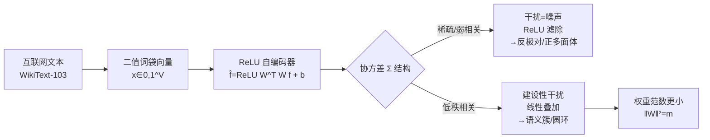

# From Data Statistics to Feature Geometry: How Correlations Shape Superposition

**会议**: ICLR 2026  
**OpenReview**: [https://openreview.net/forum?id=7akSRQS5Xh](https://openreview.net/forum?id=7akSRQS5Xh)  
**代码**: [https://github.com/LucasPrietoAl/correlations-feature-geometry](https://github.com/LucasPrietoAl/correlations-feature-geometry)  
**领域**: 机制可解释性 / 叠加表示  
**关键词**: superposition, mechanistic interpretability, feature geometry, sparse autoencoder, constructive interference  

## 一句话总结
本文指出经典的"叠加=干扰=噪声"图景对真实数据并不完整——当特征相关时，干扰可以是**建设性**的：模型按共激活模式排列特征，让活跃特征的干扰相互增强信号，从而用更小的权重范数和秩完成重构，这自然解释了真实语言模型中观察到的语义聚类和月份圆环等几何结构。

## 研究背景与动机

**领域现状**：机制可解释性（MI）的一个核心思想是神经网络表示的特征数远多于其维度，通过"叠加"（superposition）排成一个过完备基，代价是允许特征间互相干扰。这一框架推动了稀疏自编码器（SAE）等字典学习方法的发展，并被成功用于前沿大模型的特征恢复。

**现有痛点**：以往对叠加的研究几乎都在**理想化设定**下进行——特征稀疏且互不相关（Elhage et al. 2022 的 toy model）。在这种设定里，干扰被理解为必须**几何上最小化、再用 ReLU 等非线性滤掉**的噪声，由此产生正多面体（regular polytope）这类局部结构，即特征两两内积接近 0、负向干扰被压制。

**核心矛盾**：这套图景无法解释真实语言模型里观察到的结构。研究者在 LLM 激活中发现的不是局部正多面体，而是**有序的特征圆环**（如一年十二个月的圆形排列）以及**各向异性叠加**（相关特征聚成簇，而非最小化内积）。标准叠加理论恰恰预测这些不该出现。

**本文目标**：解释这一矛盾，并给出真实数据下叠加几何的统一刻画。

**核心 idea**：作者认为矛盾的根源是"真实特征既不稀疏也不互相独立"。**【关键洞察】当特征相关时，干扰不必是纯粹有害的——它也可以是建设性的**。把特征按共激活模式排列，活跃特征之间的干扰会相互增强（如"December"帮助重构"Christmas"），同时 ReLU 仍用来避免假阳性。为在可控环境验证，作者提出 **Bag-of-Words Superposition (BOWS)** 框架：用自编码器把互联网文本的二值词袋表示编码进叠加，既有真实的特征相关性又有已知的 ground-truth 特征。

## 方法详解

### 整体框架

BOWS 把"叠加几何"问题落到一个**可控但真实**的设定：从语料（WikiText-103，词表 V=10000）抽二值词袋向量，训练一个带 tied weights 的自编码器 $\hat{f}=\sigma(W^\top W f + b)$（$W\in\mathbb{R}^{m\times V}$，$m<V$），用 ReLU AE 和 Linear AE 两种解码方式对比。作者从**理论刻画**（什么时候干扰变建设性）、**合成实验**（12 维循环协方差）、**真实数据**（WikiText 词袋的语义簇/月份圆环）三层逐步验证，并最后用 presence-coding vs value-coding 的区分补全那些"没有数据相关性也出现结构"的反例。

### 关键设计

**1. 信号-干扰分解，重新定义干扰的角色**：对 tied-weight AE，特征 $f_i$ 的重构可分解为信号项与干扰项：$\hat{f}_i=\sigma\big(\|w_i\|^2 f_i + \sum_{j\neq i}\langle w_i,w_j\rangle f_j + b_i\big)$，其中 $I_i=\sum_{j\neq i}\langle w_i,w_j\rangle f_j$ 是干扰。标准图景把 $I_i$ 当噪声滤掉；本文证明当特征协方差 $\Sigma=\mathbb{E}[ff^\top]$ 有足够强的低秩结构时，$I_i$ 会与信号**对齐**。具体地，线性 AE 的最优映射 $P=W^\top W$ 是投影到 $\Sigma$ 前 $m$ 个主成分的正交投影子，此时 $P_{ij}=\langle w_i,w_j\rangle$ 恰好反映特征 $i,j$ 在主子空间内的相关性——每个 $f_j$ 按共享方差比例贡献到 $f_i$ 的重构。换句话说，**PCA 本身就是一种叠加形式**，相关特征被排列得让干扰强化信号而非需要压制。

**2. 区分线性叠加与非线性叠加**：作者用能否被**线性解码器**恢复来划界。当 $\mathrm{rank}(\Sigma)\le m$ 时数据完全落在主子空间，残差 $\varepsilon=0$，干扰 $I_i=(1-P_{ii})f_i$ 正比于信号，这是**线性叠加**（Definition 2：存在线性 $\psi_{\text{lin}}$ 使 $R_i^2\ge 1-\varepsilon$）；当 $\Sigma$ 只是近似低秩时，残差 $\|\varepsilon\|^2=\sum_{k>m}\lambda_k(\Sigma)$（Eckart–Young 下界）会引入假阳性，需要 ReLU 配合负偏置压制，这是**非线性叠加**。谱越集中、残差越小，建设性干扰越有效。

**3. 权重衰减 + 紧瓶颈偏向低秩解**：两种机制有不同的范数代价。靠 ReLU 滤干扰的经典方案需要每个特征方向接近单位范数，于是 $\|W\|_F^2\approx d$（与特征数同阶）；而投影到 $m$ 维低秩子空间时最优解是秩-$m$ 投影子，$\|W\|_F^2=\mathrm{tr}(P)=\sum_k\lambda_k(P)=m<d$。因此**当 $m\ll d$ 且加权重衰减时，即使非线性模型也会被推向利用低秩结构的解**，因为它能以小得多的权重范数达到准确重构。这解释了为何语义聚类在加 weight decay 的模型中重新出现。

**4. 两种机制可在同一模型甚至同一特征上共存**：当 $\Sigma$ 仅近似低秩时，权重几何让大部分干扰与信号对齐，ReLU + 负偏置则压掉残差带来的有害干扰。作者用"Beatles"一例直观展示：在支持性上下文里相关词（Lennon、McCartney）给目标词正向 pre-activation 帮助重构；当相似上下文不含目标词时，ReLU 阈值把假阳性滤掉。

**5. presence-coding vs value-coding，解释"无相关也有结构"的反例**：模块加法里的圆环在数据无相关时也出现，标准叠加无法解释。作者区分两类特征：**presence-coding** 特征检测离散属性（"是否是 cat 这个词"），其结构性排列依赖数据相关性，属于上面讨论的叠加范畴；**value-coding** 特征则线性编码连续变量 $v(x)\in\mathbb{R}$（如角度、坐标），$k$ 个这样的特征张成一个 $k$ 维 value space，把样本投影上去就会显现圆环或地图——但**这些结构完全由线性 value code 解释，即使没有叠加也存在**。这条线把"几何叠加"与"特征流形"两类现象彻底分开。

## 实验关键数据

### 合成数据：循环协方差下的两种机制（Figure 2）

12 维循环协方差数据上训练 Linear AE 与 ReLU AE，变化潜在维 $m$，看收敛后 $W^\top W$：

| 潜在维 $m$ | Linear AE | ReLU AE |
|---|---|---|
| 小 $m$（$m<6$）| 投影到圆形主子空间 | **复现圆环结构**（线性叠加）|
| 中等 $m$（6–10）| 仍是圆形投影 | **放弃圆环，形成反极对**（非线性叠加，ReLU 滤干扰）|
| $m\to 12$（≈输入维）| — | 权重趋于单位阵，结构消失，叠加概念失效 |

### 真实数据：月份特征确为线性叠加

- 训练线性解码器重构月份特征，得 $R_i^2(W_{\text{months}},\psi_{\text{lin}})=0.98\pm 0.00015$，且没有任意两月互相正交 → 按 Definition 2，**月份特征处于线性叠加**。
- 月份在 WikiText 中呈循环相关（一月与二月/十二月共现多于八月），其 PCA 显现圆环（Figure 4b），学到的编码权重 $W$ 的 PCA 也复现同一圆环（Figure 4c）；"Christmas"对齐到与其共现的月份，"December"建设性贡献其重构，所有月份同时出现时干扰相互抵消不致假阳性。

### value-coding 消融（Table 1）

VC+ 保留 value-coding 子空间、把正交补置零；VC− 反过来消掉 value-coding 坐标：

| 条件 | MAP Loss↓ | MAP Acc↑ | Key-freq Loss↓ | Key-freq Acc↑ |
|---|---|---|---|---|
| Baseline | 0.0536 | 97.94 | 0.0001 | 100.00 |
| VC+（保留VC，零化其余）| 0.2879 | 93.16 | 0.1649 | 93.99 |
| VC−（消掉VC）| 6.3943 | 22.43 | 11.7464 | 3.11 |

替换 90%+ 维度为均值仍保留大部分精度，而只去掉 value-coding 特征性能崩溃 → 证明 value-coding 特征才是模型计算的真正单元。城市相对方位任务中，线性探针预测坐标的 $R^2=0.98$，能把留出城市正确摆回美国地图。

### 关键发现

- **结构在不同潜在维"先后消失"**（Figure 6）：随 $m$ 增大，月份结构比罗马数字更早正交化——真实数据里不同频率/相关性的特征群占据线性↔非线性叠加谱的不同位置。
- **机制按词频分层**：在 $m=800$ 模型上以 $R=0.5$ 为阈，4073 个词处于非线性叠加，而最高频的 522 个词处于线性叠加。
- **建设性干扰确有收益**：含"Beatles"的验证样本中 81% 上下文重构优于 one-hot 重构。

## 亮点与洞察

- **范式级再框定**：把"干扰=必须滤除的噪声"翻新为"相关时干扰可建设性"，并用 PCA=叠加这一桥梁把统计学的低秩结构和 MI 的特征几何接通，解释力很强。
- **可证伪的清晰定义**：用"能否被线性解码器恢复"区分线性/非线性叠加，给出 $R^2\ge 1-\varepsilon$ 的可操作判据，月份特征 $R^2=0.98$ 是干净的实证。
- **BOWS 的设计巧妙**：词袋既给真实相关性又保留 ground-truth 特征，填补了 toy model 与真实 LLM 之间的空白。
- **value/presence coding 区分**：一举解释模块加法圆环这类"无相关也成圆"的长期困惑，并提供把"特征几何"与"特征流形"分开的原则性方法。

## 局限与展望

- 设定仍是**词袋自编码器**，并非真正的 Transformer 语言模型，从 BOWS 到真实 LLM 表示的迁移性仍需进一步验证。
- 理论分析主要建立在 **tied-weight、ReLU、协方差近似低秩**等假设上，对更复杂非线性、注意力机制下的叠加几何刻画有限。
- value-coding 与几何叠加在更复杂真实场景中的**自动区分**仍是开放问题（作者也明确列为 future work）。
- 对 SAE 训练、知识编辑、对抗鲁棒性的下游影响只是定性提及，缺乏直接的下游任务验证。

## 相关工作与启发

- **叠加的起点**：Elhage et al. (2022) 用叠加解释多义神经元，预测稀疏不相关下的正多面体/反极对；本文证明其图景在相关数据下不完整。
- **SAE 字典学习**：Bricken et al. (2023)、Templeton et al. (2024)、Gao et al. (2025) 在前沿模型上恢复线性特征，并观察到各向异性聚类——本文给出其几何成因。
- **特征圆环/流形**：Engels et al. (2025) 发现月份等周期概念的圆环；Nanda et al. (2023)、Power et al. (2022) 的模块加法圆环——本文分别归因于线性叠加与 value-coding。
- **启发**：(1) 训练时的 weight decay 与瓶颈宽度直接塑造叠加几何，可作为可解释性的"几何旋钮"；(2) 解读 SAE 特征聚类时应先问"这是数据相关性导致的叠加几何，还是任务驱动的 value code"，避免把流形误读为叠加。

## 评分
- 新颖性: ⭐⭐⭐⭐⭐ 把"干扰必为噪声"的主流叙事翻转为"相关时干扰可建设"，并用 PCA=叠加打通统计与几何，是对叠加理论的实质性再框定。
- 实验充分度: ⭐⭐⭐⭐ 合成（循环协方差）+ 真实（WikiText 月份/Beatles/语义簇）+ value-coding 消融三层互证，且有 OpenWebText 复现；但缺真正 Transformer LM 的端到端验证。
- 写作质量: ⭐⭐⭐⭐⭐ 定义清晰、图示直观、理论与实证衔接顺滑，从矛盾出发层层推进，叙事完整。
- 价值: ⭐⭐⭐⭐ 为 SAE、知识编辑、鲁棒性提供了理解特征几何的统一视角，对机制可解释性社区有方法论意义。

<!-- RELATED:START -->

## 相关论文

- [\[ICLR 2026\] Temporal Superposition and Feature Geometry of RNNs under Memory Demands](temporal_superposition_and_feature_geometry_of_rnns_under_memory_demands.md)
- [\[ICLR 2026\] Emergence of Superposition: Unveiling the Training Dynamics of Chain of Continuous Thought](emergence_of_superposition_unveiling_the_training_dynamics_of_chain_of_continuou.md)
- [\[ICLR 2026\] The Geometry of Reasoning: Flowing Logics in Representation Space](the_geometry_of_reasoning_flowing_logics_in_representation_space.md)
- [\[ICLR 2026\] On The Geometry and Topology of Representations: the Manifolds of Modular Addition](on_the_geometry_and_topology_of_representations_the_manifolds_of_modular_additio.md)
- [\[ICLR 2026\] The Shape of Adversarial Influence: Characterizing LLM Latent Spaces with Persistent Homology](the_shape_of_adversarial_influence_characterizing_llm_latent_spaces_with_persist.md)

<!-- RELATED:END -->
