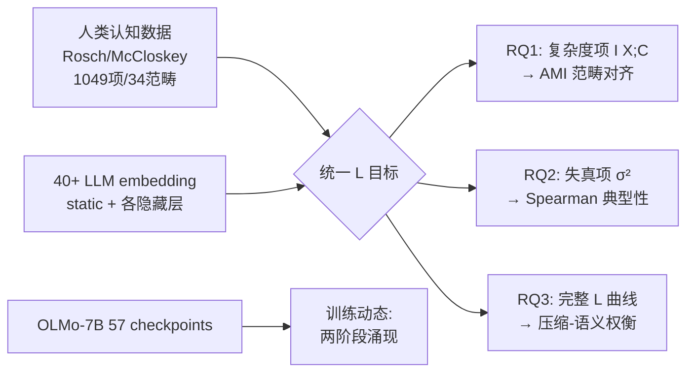

# From Tokens to Thoughts: How LLMs and Humans Trade Compression for Meaning

**会议**: ICLR 2026  
**OpenReview**: [https://openreview.net/forum?id=rkthPeHvAX](https://openreview.net/forum?id=rkthPeHvAX)  
**代码**: 待确认（作者公开了数字化后的认知科学数据集）  
**领域**: interpretability and explainable AI  
**关键词**: 信息瓶颈, 率失真理论, 概念表示, 认知科学对齐, 压缩-语义权衡, LLM embedding 分析  

## 一句话总结
用信息瓶颈/率失真框架把 40+ 个 LLM 的 embedding 和人类经典分类学认知数据放在同一把"压缩↔语义"的尺子下度量，发现 LLM 比人类更"信息论最优"地激进压缩，却以牺牲细粒度语义（典型性结构）为代价——人类那种看似"低效"的概念组织反而是适应性灵活性的来源。

## 研究背景与动机
**领域现状**：人类把知识组织成紧凑的概念范畴——一个 "bird" 压缩了上千物种的信息，却仍保留关键语义（会飞、有羽毛、下蛋），并形成 robin→bird→animal 的层级。这是效率与语义保真之间的精妙平衡。LLM 展现出惊人的语言能力，看似"理解"了概念，但它们到底是不是按人类同样的方式权衡"压缩 vs 语义"，一直没有定量答案。

**现有痛点**：两条研究脉络长期不交叉。一边是 LLM 概念分析（关系知识、可解释概念抽取、稀疏激活、embedding 几何），但缺少用信息论对"压缩-语义权衡"做严格定量、且对标丰富人类认知基准的工作；另一边是认知科学把信息论用于人类概念学习（如颜色命名的 IB 框架），但很少接到现代 LLM，且常局限于单一领域。此外，现代评测多依赖众包噪声数据，缺乏专家级高质量的人类范畴判断基准。

**核心矛盾**："统计上最优的压缩"是否等于"理解"？如果 LLM 在信息论意义上压缩得更狠、更优，但丢掉了人类概念里那些"低效"的语义冗余，那它就只是表层模仿而非真正理解。

**本文目标**：在统一的信息论框架下回答三个问题——RQ1 LLM 涌现的概念是否对齐人类范畴边界；RQ2 LLM 内部是否有人类式的"典型性"结构（robin 比 penguin 更"鸟")；RQ3 两者在压缩↔语义保真上如何权衡。

**核心 idea**：**统一框架** = 把率失真理论（RDT）与信息瓶颈（IB）改造为一个不需要外部相关变量 Y 的目标 $\mathcal{L}$，用"复杂度（压缩）+ β·失真（语义离散度）"同时刻画两端；**数据贡献** = 数字化三份奠基性认知科学数据集（Rosch 1973/1975, McCloskey & Glucksberg 1978），合成 1,049 项 / 34 范畴的机读基准。

## 方法详解

### 整体框架
论文用一把统一的尺子比较人类范畴和 40+ LLM 的 embedding 聚类：把"概念系统"看成对 items $X$ 的有损压缩 $C$（聚类），同时度量它压掉了多少信息（复杂度）和保留了多少语义一致性（失真）。三个研究问题分别由框架的不同部分回答——复杂度项答 RQ1（范畴对齐）、失真项答 RQ2（内部语义结构）、完整 $\mathcal{L}$ 目标答 RQ3（权衡），并通过 OLMo-7B 的 57 个训练 checkpoint 追踪这套策略是怎么涌现的。

### 关键设计

**1. 把 RDT 与 IB 缝合成无监督的 $\mathcal{L}$ 目标：题点在于"没有外部 Y 时怎么定义相关性"**。标准 IB 要压缩 $X$ 到 $Z$ 的同时保留对相关变量 $Y$ 的信息 $\min I(X;Z) - \beta I(Z;Y)$，但概念表示里根本没有现成的 $Y$。作者的处理是把"相关性"内化为"簇内语义一致性"——即让范畴自己保住组内相似度，于是把 RDT 的几何失真和 IB 的信息论压缩合到一个目标里：

$$\mathcal{L}(X, C; \beta) = \underbrace{I(X; C)}_{\text{复杂度: 所需比特}} + \beta \cdot \underbrace{\frac{1}{|X|}\sum_{c \in C}\sum_{e_i \in c}\|e_i - \bar{e}_c\|^2}_{\text{失真: 语义离散度}}$$

$\beta$ 调节压缩与一致性的相对重要性，整个目标无需标注，可同时套在人类范畴和 LLM 聚类上做苹果对苹果的比较。

**2. 复杂度项用互信息度量"压了多少"**。复杂度 = $I(X;C)$，直觉是：如果知道一个 item 属于哪个簇却几乎说不出它具体是谁，说明压缩很狠（复杂度低）。给定 $|X|$ 个 item 划进大小为 $\{|C_c|\}$ 的簇：

$$\text{Complexity}(X, C) = I(X; C) = \log_2 |X| - \frac{1}{|X|}\sum_{c \in C} |C_c| \log_2 |C_c|$$

这正是"被告知所属簇后 item 身份不确定性的下降量"。均匀的大簇使复杂度最小（最大压缩），单例簇使复杂度最大（不压缩）。它直接量化 RQ1：比较 $I(X; C_{\text{Human}})$ 与 $I(X; C_{\text{LLM}})$ 就能看出两者是否切出粒度相当的范畴。

**3. 失真项用簇内方差度量"语义保得好不好"**。失真衡量簇是否把语义近的东西聚得紧，即 item 到其簇质心的平均平方距离：

$$\text{Distortion}(X, C) = \frac{1}{|X|}\sum_{c \in C} |C_c| \cdot \sigma_c^2, \quad \sigma_c^2 = \frac{1}{|C_c|}\sum_{e_i \in c}\|e_i - \bar{e}_c\|^2$$

低失真意味着 robin 和 sparrow 紧紧抱团、bat 不会被硬塞进来。它服务 RQ2：作者进一步检验"典型 item 是否更靠近质心、非典型 item 更外围"，这种中心-边缘结构正是人类原型组织的标志。

**4. 两级 embedding 抽取 + 逐层扫描，把"概念几何"拆到网络深度上看**。为了对照人类对孤立词的判断，作者抽两类表示：(i) 输入层 static embedding（E 矩阵，无上下文词汇知识），(ii) 各隐藏层的 contextual embedding（受控 prompt）。对每个模型逐层算 AMI，取峰值层做 RQ1，再用同一层做 RQ2，从而暴露出"最适合切范畴的层"和"最保留组内结构的层"常常不是同一层——这是后面"架构在不同深度编码不同语义"结论的方法基础。结果对 prompt 模板与 pooling 策略稳健（附录验证）。

## 实验关键数据

### 主实验（RQ1/RQ2，static embedding，对标人类范畴）

| 维度 | 指标 | 关键结果 |
|------|------|----------|
| RQ1 范畴对齐 | AMI | 40+ 模型全部显著高于随机；static 均值 ≈0.45，contextual 峰值 ≈0.55 |
| RQ1 架构 vs 规模 | AMI | **BERT-large (340M) AMI=0.60**，匹配甚至超过大 100× 的解码器模型；Word2Vec/GloVe 也逼近现代 LLM 峰值 |
| RQ2 典型性 | Spearman ρ | 多数解码器 ρ<0.15；**BERT ρ=0.38** (p<0.05)；表示型模型 ρ≈0.25–0.40 |

### RQ3 压缩-语义权衡 / 训练动态

| 现象 | 数据 |
|------|------|
| 人类簇熵更高 | 同等 K 下人类范畴熵显著高于 LLM（统计更不紧凑、内部更多样） |
| LLM 的 $\mathcal{L}$ 更低 | 所有 K 上 LLM 聚类 $\mathcal{L}$ 都低于人类范畴（更"信息论最优"） |
| 编码器更优权衡 | 给定复杂度下 encoder（BERT/ViT/static）失真低于 decoder |
| 压缩 ≠ 能力 | $\mathcal{L}$ 与 MMLU 下游表现无相关（r=−0.20, p=0.51） |
| 训练两阶段 | OLMo-7B：①1K–100K 步快速形成范畴（10% 训练达 80% 对齐，AMI 0→≈0.45）；②100K–500K 步架构重组，语义处理从第 29 层迁到第 23 层 |

### 关键发现
- **抓得住边界，抓不住内部**：LLM 对范畴边界（压缩）对齐很好，但对典型性（语义内部结构）几乎抓不住——这正是人类与 LLM 表示策略的根本分叉点。
- **架构 > 规模**：编码器/表示型模型在人类对齐上反超大百倍的解码器，提示"理解"和"生成"可能依赖不同的表示机制。
- **最优层互斥**：最适合切范畴的层（RQ1 峰值）恰恰最不保留组内结构（RQ2），不同深度编码不同语义。
- **统计最优 ≠ 理解**：$\mathcal{L}$ 与下游能力零相关，说明人类概念的"低效"是为认知灵活性服务，而非缺陷。

## 亮点与洞察
- **把认知科学经典数据数字化**本身就是耐久贡献：Rosch 1973/1975、McCloskey & Glucksberg 1978 三份专家级范畴/典型性评分首次变成机读基准（1,049 项 / 34 范畴），质量远高于众包噪声数据。
- **一个无监督目标统一回答三问**：复杂度↔失真↔完整 $\mathcal{L}$ 干净地映射到 RQ1/RQ2/RQ3，方法论优雅。
- **"低效即智能"的反直觉论点**：把人类概念的统计次优重新诠释为对适应性、泛化、因果推理的优化，给"理解"下了一个可证伪的信息论刻画。
- **训练动态的双阶段 + 语义层上迁**：跨 AMI、注意力稀疏度、有效秩、$\mathcal{L}$ 多个独立指标同步出现"快速形成→缓慢重组"，证据收敛性强。

## 局限与展望
- **只能用开源模型的 embedding**：分析依赖隐藏层表示，GPT-5、Claude 等闭源前沿模型无法纳入，结论对最强一代模型的外推存疑。
- **原型理论是单一视角**：典型性框架基于原型理论，而样例理论（exemplar）等替代账户可能给出不同解读；作者声明框架与替代账户兼容但未裁决。
- **数据集偏经典英语范畴**：1,049 项集中在常见日用语义范畴，跨语言/跨文化/抽象概念上的结论尚待验证。
- **"更优 $\mathcal{L}$"的规范性存疑**：低 $\mathcal{L}$ 是否"更好"取决于目标——作者已说明与下游能力零相关，但这也意味着该指标对实际能力的预测力有限，更多是诊断工具而非优化目标。
- **展望**：呼吁设计能保留人类概念"有益冗余"的模型，并把该框架当作训练过程中监控"压缩↔语义"平衡的工具。

## 相关工作与启发
- **信息瓶颈 / 率失真**：Tishby 等的 IB、Shannon 的 RDT 是方法骨架；Zaslavsky 等把 IB 用于颜色命名/动物分类学的人类研究是认知侧先例，本文把它接到了现代 LLM。
- **LLM 概念几何**：与 Park 等的层级表示、Li 等的稀疏激活、可解释概念抽取互补——本文不挖单个概念结构，而是度量整体压缩-语义权衡。
- **人机抽象迁移**：与 Wu 等（2025）的行为/认知建模视角不同，本文直接量化 LLM embedding 空间内部在受控聚类下的信息保留与失真。
- **启发**：①"理解 vs 生成需要不同表示机制"为编码器复兴/混合架构提供了认知证据；②$\mathcal{L}$ 可作为表示质量的训练期监控指标；③数字化经典认知基准这一思路可推广到更多被埋没的心理学数据。

## 评分
- **新颖性**: ⭐⭐⭐⭐⭐ 把认知科学经典数据、信息瓶颈框架与 40+ LLM 表示分析三者首次严密交叉，"低效即智能"是真正反直觉且可证伪的洞见。
- **实验充分度**: ⭐⭐⭐⭐ 40+ 模型 × 多架构 × 多尺度 + 三套人类基准 + 训练动态追踪，覆盖广；扣分在闭源前沿模型无法纳入、数据偏经典英语范畴。
- **写作质量**: ⭐⭐⭐⭐⭐ RQ1→RQ2→RQ3 的"压缩→保留→平衡"递进清晰，框架与问题映射干净，图文叙事强。
- **价值**: ⭐⭐⭐⭐⭐ 既给社区留下可复用的机读认知基准与诊断框架，又对"压缩是否等于理解"这一根本问题提供了量化证据，对可解释性与认知对齐都有长期价值。

<!-- RELATED:START -->

## 相关论文

- [\[ICLR 2026\] Attention Sinks and Compression Valleys in LLMs are Two Sides of the Same Coin](attention_sinks_and_compression_valleys_in_llms_are_two_sides_of_the_same_coin.md)
- [\[ICLR 2026\] How Do Transformers Learn to Associate Tokens: Gradient Leading Terms Bring Mechanistic Understanding](how_do_transformers_learn_to_associate_tokens_gradient_leading_terms_bring_mecha.md)
- [\[ICML 2026\] Discovering Differences in Strategic Behavior Between Humans and LLMs](../../ICML2026/interpretability/discovering_differences_in_strategic_behavior_between_humans_and_llms.md)
- [\[ICLR 2026\] Learning is Forgetting: LLM Training As Lossy Compression](learning_is_forgetting_llm_training_as_lossy_compression.md)
- [\[ICLR 2026\] The Achilles' Heel of LLMs: How Altering a Handful of Neurons Can Cripple Language Abilities](the_achilles_heel_of_llms_how_altering_a_handful_of_neurons_can_cripple_language.md)

<!-- RELATED:END -->
