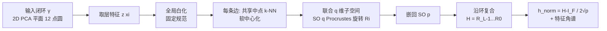

# Gauge-invariant Representation Holonomy

**会议**: ICLR 2026  
**OpenReview**: [https://openreview.net/forum?id=czJqKToDGq](https://openreview.net/forum?id=czJqKToDGq)  
**代码**: 待确认（作者承诺开源 code + seeded configs）  
**领域**: 表示学习 / 可解释性 / 表示几何诊断  
**关键词**: representation holonomy, gauge invariance, parallel transport, Procrustes alignment, representation geometry, robustness diagnostic  

## 一句话总结
把"特征沿输入闭环走一圈后累积的旋转量"定义为 **representation holonomy**——一个规范不变（gauge-invariant）的标量，用来刻画 CKA/SVCCA 等逐点相似度看不见的"路径依赖几何"，并把它和模型的对抗/损坏鲁棒性挂上钩。

## 研究背景与动机

**领域现状**：比较两个网络的内部表示，常用工具是 CKA、SVCCA、PWCCA、RSA 这类**逐点相似度**——它们在固定数据集上比较两堆激活的子空间重叠程度，对神经元置换、基变换不敏感，因此被广泛当作"表示是否相似"的标尺。

**现有痛点**：这些度量本质上是**路径无关（path-agnostic）**的。它们只看"在每个点上两个表示像不像"，却完全忽略"当输入沿某条自然方向（姿态、光照、纹理）移动时，特征是怎么旋转、扭曲的"。后果是：两个模型在 CKA 下几乎一模一样（相似度 0.987），但在对抗扰动或损坏序列下表现天差地别，因为它们的中间特征沿输入路径的旋转方式不同。

**核心矛盾**：逐点相似度衡量的是"静态重叠"，而鲁棒性关心的是"特征在输入流形上的动态几何"。前者是后者的盲区——一个度量再稳健，也无法回答"这个表示场到底弯不弯"。

**本文目标**：造一个**便宜、可扩展、规范不变**的诊断量，去测量逐点相似度测不到的"路径依赖几何（曲率）"，并验证它确实和鲁棒性相关。

**核心 idea（把对齐本身变成研究对象）**：作者不再把"对齐"当成比较的预处理步骤，而是把它升格为一个**离散联络（discrete connection）**。具体说：把某一层的表示看成输入空间上的一个向量场，相邻两个输入之间用"最优旋转"来传输（parallel transport）局部特征云；沿一个小闭环把这些旋转**乘起来**，得到的净旋转偏离单位阵的程度，就是 holonomy。这正是微分几何里 Ambrose–Singer 定理把"小环 holonomy"和"曲率"挂钩的经典构造——非零 holonomy 意味着传输不可积、表示场有隐藏曲率。

## 方法详解

### 整体框架

给定某层表示 $z:\mathbb{R}^d\to\mathbb{R}^p$ 和输入空间里的一个小闭环 $\gamma=(x_0,\dots,x_{L-1},x_L{=}x_0)$，方法分四步：先**全局白化固定规范**消除二阶各向异性；再对环上每条边估一个把两端局部特征云对齐的**旋转矩阵** $R_i\in SO(p)$；把这些旋转沿环复合得到 holonomy $H(\gamma)=R_{L-1}\cdots R_1 R_0$；最后报告归一化标量 $h_{\text{norm}}=\|H-I\|_F/(2\sqrt{p})\in[0,1]$ 和 $H$ 的特征角谱 $\{\theta_j\}$。直觉上，若表示在 $\gamma$ 上"完全平坦"（全局线性且控制了规范），这个乘积就是单位阵；偏离 $I$ 多少，就度量了学到特征的路径依赖性。

### 关键设计

**1. 全局白化固定规范，让度量"基无关"**：表示的"规范自由度"指的是——同一层激活可以做任意正交基变换 $z\mapsto Qz+b$（$Q\in O(p)$）而不改变网络函数，两个这样相关的网络是"表示等价"的。如果不固定规范，测出来的 holonomy 就会被任意基选择污染。作者用 ZCA-corr / z-score 在一个**模型无关的池**（$N_{\text{pool}}=2048$）上做全局白化 $\tilde z(x)=\Sigma^{-1/2}(z(x)-\mu)$，一次性消除二阶各向异性。这带来论文证明的几条结构性质：白化后特征被任意 $U\in O(p)$ 重参数化时 $\hat H'=U\hat H U^\top$，故 $\|\hat H'-I\|_F$ 和特征角谱完全不变（**规范不变**）；对原始特征的任意可逆仿射 $Az+b$，白化后等价于一个正交变换，因此也不变（**仿射不变**）。注意是**全局**白化——消融显示改用逐邻域局部白化会引入"逐步规范漂移"，把 $h$ 抬高 $1.59\times10^{-7}$。

**2. 共享中点 k-NN + 软中心化，杀掉"索引失配"偏差**：对每条边 $(x_i,x_{i+1})$，最朴素的做法是各自取邻居再对齐，但这会让两端用的点集不一致，制造虚假旋转。作者在边的**中点** $m_i=\tfrac12(\tilde z(x_i)+\tilde z(x_{i+1}))$ 处取**同一个** k-NN 索引集 $I_i$（白化空间里），两端共用这组行；再用 $w_j^{(i)}\propto\exp(-\|\tilde Z_{j:}-m_i\|/\sigma_i)$ 做软加权中心化对齐到共同质心。这一步的威力在消融里最触目惊心：一旦"两端用各自独立的 k-NN"，holonomy 会**灾难性爆炸**（$+2.22\times10^{-1}$，比正常信号大五六个数量级），且小半径下完全不稳定。共享中点正是把误差分解式 (4) 里的"索引失配项 $\mathrm{TV}(I_i,I_i^\star)$"压到可忽略的关键。

**3. 仅 SO(q) 子空间 Procrustes 旋转，避免反射翻转**：在共享行上把两端云记为 $X_i=Y_i=\tilde Z_{I_i}-\bar\mu_i$，取堆叠云 $[X_i;Y_i]$ 的前 $q$ 个右奇异向量 $B_i\in\mathbb{R}^{p\times q}$，在低维 $\mathbb{R}^q$ 里解正交 Procrustes：$U_i\Sigma_i V_i^\top=\mathrm{SVD}((X_iB_i)^\top W_i(Y_iB_i))$，得 $R_i^{(q)}=U_iV_i^\top$ 并**强制 $\det=+1$**（即限制在 $SO(q)$ 而非 $O(p)$）。再嵌回全空间 $\hat R_i=B_iR_i^{(q)}B_i^\top+(I-B_iB_i^\top)\in SO(p)$。为什么必须 SO 而非 O？因为允许反射会引入 $\pi$-翻转，制造 $r\to0$ 时不消失的偏差地板——消融显示放开到 $O(p)$ 平均把 $h$ 抬高 $5.37\times10^{-7}$。限制到低秩共享子空间则同时提升了数值稳定性（Davis–Kahan/Wedin 控制截断误差）和计算成本（每条边只算 $(2k)\times p$ 的瘦 SVD，复杂度 $O_c(kpq)$）。

**4. 可证明的结构保证：线性零 + 小半径线性消失**：方法不是纯经验的，作者给了几条硬性质把它锚定在"真曲率"上。**线性零（linear null）**：若 $z(x)=Bx+c$ 是仿射的，则每条边 $X_i=Y_i$、$\hat R_i=I$、$\hat H(\gamma)=I$——平坦表示 holonomy 严格为零，这是"非零=曲率"判读的合法性前提。**小半径极限**：在 $z$ 为 $C^2$ 且 Jacobian Lipschitz 的假设下，每条边 $\|\hat R_i-I\|_F=O_c(r)$，沿 $L=O_c(1)$ 条边复合得 $h_{\text{norm}}(\gamma_r)=O_c(r)$，即 holonomy 随环半径**线性消失**（Theorem 1）。再配上误差分解式 $\|\hat R_i-R_i^\star\|_F\le C_1k^{-1/2}+C_2\frac{\|\Pi_i^\perp\Sigma_i^{1/2}\|_F}{\lambda_q(\Sigma_i)^{1/2}}+C_3\mathrm{TV}(I_i,I_i^\star)+C_4\|J_z(x_{i+1})-J_z(x_i)\|_2$，把"有限样本 / 子空间截断 / 索引失配 / 曲率"四项误差显式拆开——前三项是可控的估计误差，第四项才是想测的真信号。

## 实验关键数据

数据集/模型：MNIST + 2 层 MLP（512）、CIFAR-10/100 + ResNet-18（3×3 stem，无 max-pool）。每张测试图在其 512 个像素最近邻张成的 2D PCA 平面上采 12 点圆作为闭环，半径 MNIST $\{0.01\sim0.20\}$、CIFAR $\{0.02\sim0.20\}$，默认 $(k,q)$ MNIST=(128,64)、CIFAR layer2=(192,96)，5 个种子。

### 主实验：holonomy 随半径/深度增长 & 与鲁棒性相关

| CIFAR-10 layer2, r=0.10 | n | Pearson r | Spearman ρ | Partial r \| clean | Adj R² |
|---|---|---|---|---|---|
| FGSM acc | 20 | **0.805** | 0.565 | 0.223 | 0.950 |
| PGD-10 acc | 20 | **0.809** | 0.501 | 0.276 | 0.987 |
| Corruption acc | 20 | **−0.785** | −0.421 | 0.027 | 0.977 |

- holonomy 随**环半径单调增长**（MNIST Hidden1/2 斜率 $1.54/6.10\times10^{-6}$，深层更大），与 Theorem 1 的 $O(r)$ 预测一致（CIFAR layer2 小半径拟合斜率 $1.44\times10^{-7}$）。
- holonomy 与对抗鲁棒性（FGSM/PGD）**正相关**、与干净/损坏精度负相关，刻画了 robustness–accuracy 权衡前沿。

### 训练范式对比 & 消融

| Regime (CIFAR-10 layer2) | h@r=0.10 | Clean | FGSM | Corrupt |
|---|---|---|---|---|
| ERM | 3.46e−7 | 82.37 | 36.54 | 57.11 |
| LabelSmooth | 3.04e−7 | 81.32 | 34.81 | 58.27 |
| Mixup | 3.19e−7 | 74.11 | 22.51 | 49.54 |
| **AdvPGD** | **4.74e−7** | 12.24 | **67.85** | 11.96 |

回归范式均值：$h$ vs (clean/FGSM/corrupt) ≈ (−0.96 / 0.94 / −0.96)。**对抗训练模型 holonomy 最大**，符合"鲁棒特征几何更弯"的直觉。

| 消融 / 守卫 | 对 h 的影响 |
|---|---|
| SO(p) → O(p)（放开反射） | +5.37e−7 |
| 全局白化 → 逐邻域局部白化 | +1.59e−7 |
| **共享中点 → 独立 k-NN** | **+2.22e−1（爆炸）** |
| $(k,q)$ 网格 9 种组合 | 仅变 7.20e−7（不敏感） |
| $N_{\text{pool}}$ 从 1e3→8e3 | 仅变 6.49e−9 |
| 随机平面 vs PCA 平面 | −1.92e−8 |

### 关键发现
- **CKA 盲区被点破**：把 MNIST Hidden1 激活做正交 Procrustes 对齐后 CKA 高达 0.987、Frobenius 失配仅 $2.19\times10^{-8}$，但 loop 复合后 holonomy 依然非零——逐点几乎相同的表示可以有完全不同的路径几何。
- **诚实的负面结果**：虽然范式均值层面相关性极强（≈0.94–0.96），但**逐种子条件于干净精度**的偏相关只剩 $r\approx0.22$–$0.28$（FGSM/PGD）、对损坏几乎为零——增量信号有限，作者如实报告。
- **数值地板可控**：自环（$r\approx10^{-4}$）下 $h$ 落在 $10^{-8}$ 量级噪声底，证明守卫到位后剩下的就是真曲率。

## 亮点与洞察
- **把"对齐"从工具升格成研究对象**：CKA 把对齐当预处理，本文把对齐当联络（connection），从而能问"表示场弯不弯"这个全新问题——视角转换很优雅。
- **理论+经验闭环扎实**：规范不变 / 仿射不变 / 线性零 / 小半径 $O(r)$ 都有证明，且每条性质都在实验里被数值地板验证（线性网络、自环都塌到 $10^{-8}$）。
- **消融讲清"为什么这么设计"**：三个"偏差守卫"（全局白化、共享中点、SO-only）各自的去除代价被量化，尤其"独立 k-NN 致 holonomy 爆炸 $10^5$ 倍"极有说服力，体现了估计器设计的非平凡性。
- **诊断属性正交于现有度量**：便宜（小 SVD）、可扩展（JL 投影到 1024 维）、随现有 backbone 走，定位为 CKA 的补充而非替代。

## 局限与展望
- **增量信号偏弱**：控制干净精度后偏相关掉到 0.2 量级，说明 holonomy 与鲁棒性的"独立预测力"有限，目前更像描述性指标而非强预测器。
- **规模与多样性有限**：只验证了 MNIST/MLP 与 CIFAR/ResNet-18 这种小模型小数据，未触及 ImageNet 级 backbone、Transformer、或真实 CIFAR-10-C 全套损坏（用的是"风格上类似"的简单损坏）。
- **闭环构造依赖像素空间 PCA 平面**：用 512 个像素最近邻张成 2D 平面采圆，这种"输入路径"是否对应有意义的语义变换（姿态/光照）并未直接验证。
- **理论假设较强**：小半径定理要求 $C^2$ + Lipschitz Jacobian + 子空间秩覆盖，ReLU 网络的非光滑性与之有差距。展望上把 holonomy 推到大模型、把它接到鲁棒训练目标里做正则，都是自然延伸。

## 相关工作与启发
- **逐点相似度（CKA/SVCCA/PWCCA/RSA）**：本文要补的盲区——它们看子空间重叠，本文看路径旋转，互补而非竞争。
- **局部等变性测试（Lie-derivative "local equivariance error"）**：测无穷小敏感度，但不做闭环复合的全局路径依赖；本文展示"局部近等变但全局 holonomy 非零"的现象。
- **规范/流形等变架构（gauge-equivariant CNN、manifold conv）**：把联络做进模型让传输天然可积；本文反过来——**测量**标准模型涌现出的传输，做诊断而非约束。
- **经典数学工具**：Procrustes/Kabsch（最优旋转）、Davis–Kahan/Wedin（子空间扰动界）、ZCA-corr 白化、Ambrose–Singer（小环 holonomy↔曲率）被巧妙拼装成一个可计算估计器，是"把微分几何落地成 ML 诊断"的范例。

## 评分
- **新颖性**: ⭐⭐⭐⭐⭐ 把 holonomy/联络/曲率这套微分几何语言第一次系统落地成可计算的表示诊断量，视角原创，把"对齐"升格为研究对象。
- **实验充分度**: ⭐⭐⭐ 理论验证（线性零、自环、小半径）做得严谨，消融到位；但模型/数据规模偏小，且坦承控制变量后增量信号弱，说服力打了折扣。
- **写作质量**: ⭐⭐⭐⭐ 直觉（图1的"扭转"）、形式化、证明指针、误差分解层层递进，诚实报告负面结果，可读性强。
- **价值**: ⭐⭐⭐⭐ 提供了一个便宜、规范不变、正交于 CKA 的几何诊断新维度，对表示几何与鲁棒性研究有方法论价值，但要成为实用预测工具仍需在大模型上验证。

<!-- RELATED:START -->

## 相关论文

- [\[ICLR 2026\] The Deleuzian Representation Hypothesis](the_deleuzian_representation_hypothesis.md)
- [\[ICLR 2026\] The Geometry of Reasoning: Flowing Logics in Representation Space](the_geometry_of_reasoning_flowing_logics_in_representation_space.md)
- [\[ICLR 2026\] On the Predictive Power of Representation Dispersion in Language Models](on_the_predictive_power_of_representation_dispersion_in_language_models.md)
- [\[ICLR 2026\] MICLIP: Learning to Interpret Representation in Vision Models](miclip_learning_to_interpret_representation_in_vision_models.md)
- [\[ICLR 2026\] Decoupling Dynamical Richness from Representation Learning: Towards Practical Measurement](decoupling_dynamical_richness_from_representation_learning_towards_practical_mea.md)

<!-- RELATED:END -->
