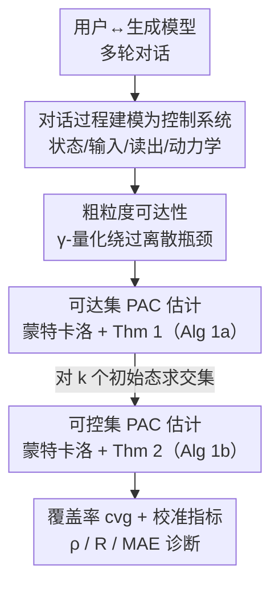

# GenCtrl — A Formal Controllability Toolkit for Generative Models

**会议**: ICLR 2026  
**OpenReview**: [https://openreview.net/forum?id=HJTFgDYoLO](https://openreview.net/forum?id=HJTFgDYoLO)  
**代码**: https://github.com/apple/ml-genctrl  
**领域**: 可解释性 / 控制理论 / 生成模型分析  
**关键词**: 可控性, 可达性, PAC 界, 控制理论, 黑盒生成模型

## 一句话总结
这篇论文把"用户与生成模型对话"建模成一个离散时间非线性控制系统，提出蒙特卡洛算法去估计模型的**可达集**与**可控集**，并给出分布无关、只需输出有界假设的 PAC（probably-approximately-correct）误差界，从而第一次能形式化地回答"这个生成模型到底可不可控"，实验发现现代 LLM 和文生图模型的可控性出人意料地脆弱且高度依赖任务设定。

## 研究背景与动机
**领域现状**：随着生成模型普及，控制其输出成了刚需，相关方法层出不穷——从提示工程（in-context、CoT）、微调（RLHF、DPO），到直接操纵激活的表示工程（activation steering）。整个领域都在比拼"怎么把模型控制得更好"。

**现有痛点**：所有这些方法都默默建立在一个从未被验证的前提上——**模型本来就是可控的**。具体拆成三条隐含假设：① 可达性（reachability）：用某种控制手段 + 某个初始提示，目标输出集合确实能被够到；② 普遍可控性（universal controllability）：目标输出从**任意**初始状态都能够到；③ 校准性（calibration）：输出是控制变量的直接函数（你调输入，输出就跟着变）。但学界根本没有工具去检验这三条到底成不成立。

**核心矛盾**：大家一直在"尝试控制"，却从没问过"这个系统是否原则上可控"。控制理论里可达性/可控性是核心概念，可惜过去把它们搬到机器学习上，要么只能分析强化学习/训练动力学，要么依赖对黑盒模型不可验证的假设（如 Lipschitz 连续），要么返回连续的可达集估计——而 LLM/文生图的可达集是**可数**的（离散瓶颈），导致连续估计被撑得"空泛地大"（vacuously large），毫无信息量。

**本文目标**：把生成模型当成黑盒非线性控制系统，给出能在现代大模型上实际跑得动、带概率保证的可达集/可控集估计工具，并用它去量化前述三条假设。

**切入角度**：作者借控制理论（Sontag 1998）的语言，把"对话"重新解读成一个反馈控制过程——用户每轮的输入是对模型的"干预"（control input），模型生成是"状态"，外部打分函数是"读出"（readout）。这个视角下，可达性/可控性有了严格定义。

**核心 idea**：用一套**分布无关、只假设输出有界**的蒙特卡洛采样算法，配上 PAC 样本复杂度界，去估计任意黑盒生成模型在对话设定下的可达集与可控集——把"试图控制"前置成"先理解控制的根本极限"。

## 方法详解

### 整体框架
GenCtrl 把"用户↔生成模型的多轮对话"形式化成一个**随机离散时间非线性控制系统** $(\phi, \mathcal{T}, X, U, h, Y)$：时间域 $\mathcal{T}=\mathbb{N}$ 是对话轮次；状态 $x_t\in X$ 是当前的字符串/图像上下文；控制输入 $u_t\in U$ 是用户这一轮给的提示（干预手段）；动力学 $\phi: X\times U\to X$ 把历史状态和输入映射到下一轮生成 $x_{t+1}=\phi(x_t,\dots,x_0;u_t,\dots,u_0)$；读出映射 $h: X\to Y$ 把生成映射成一个可度量的属性值（如文本正式度、图中物体数量，例如直接用 Python `len()`）。控制目标就是把测量值 $y_t=h(x_t)$ 限制到一个期望子集 $Y'\subset Y$。

在这个壳子上，论文要回答两个问题（图 1 中的 Q1/Q2）：**可达性** Q1——从某个固定初始提示 $x_0$ 出发，能命中哪些属性值；**可控性** Q2——从**任意**初始提示都能命中目标集合吗。方法的核心难点是 LLM/T2IM 的**离散瓶颈**：可达集是可数的，不能直接套连续可达集估计。整条流水线是：先把测量空间做粗粒度量化以绕过离散瓶颈 → 用蒙特卡洛采样 + Thm 1 估计单个初始态的可达集 → 对 $k$ 个采样初始态的可达集求交集 + Thm 2 估计可控集 → 输出覆盖率/校准指标供诊断。

### 关键设计

**1. 把"用户↔模型对话"形式化成黑盒非线性控制系统**

要回答"模型可不可控"，先得有一套能严格定义"可控"的语言。论文把一轮轮对话映射成控制论里的标准对象（Def. 1）：初始提示是初始状态 $x_0$，用户后续每句话是控制输入 $u_t$，模型生成是状态转移 $\phi$，外部打分器是读出 $h$。在这套语言下，**可达集**被定义为从固定 $x_0$ 出发、用某条输入序列在 $t$ 步内能命中的所有测量值：

$$R(x_0, U, t) = \{\tilde{y}\in Y \mid \exists\, u_0,\dots,u_{t-1}\in U \text{ s.t. } y_t=\tilde{y}\}$$

**可控性**则更强（Def. 3）：系统在 $Y'\subseteq Y$ 上可控，当且仅当存在某个 $t$，使得**所有** $x_0\in X$ 的可达集都等于 $Y'$。这个区分正好对应前面三条隐含假设——可达性管 Q1，可控性管 Q2。这套形式化的价值在于它对模型架构、输入/输出是离散还是连续都**不可知**（agnostic），因此能统一处理 LLM 的文本和 T2IM 的图像，是后面所有估计算法的地基。

**2. 粗粒度可达性：用 γ-量化绕过离散瓶颈**

LLM/T2IM 的字符串提示是离散的，导致可达集是**可数**的，哪怕测量值本身连续（如 [0,1] 的正式度分数），真实可达集也只是一堆离散点。直接套现有的连续可达集估计器，返回的集合会"空泛地大"，没有判别力。作者的解法是把可达性问题**松弛成 γ-量化版本**（Def. 4）：不再要求精确命中某个值，而是允许 $\gamma$ 的误差容忍——

$$R_\gamma(x_0, U, t) = \{\tilde{y}\in Y \mid \exists\, u_0,\dots,u_{t-1}\in U \text{ s.t. } \|y_t-\tilde{y}\|_\infty \le \gamma\}$$

比如不要求正式度恰好 0.3，而是命中 $0.3\pm0.05$ 即可。对应地，把测量空间 $Y$ 用半径 $\gamma/2$ 的 $\infty$-球做一个最小覆盖，得到有限基数 $N=|Y_q|$ 的量化空间 $Y_q$（分类型属性 $Y_q=Y$ 无需量化）。用 $\infty$-范数还有个好处：理论对多个正交读出维度（如同时控正式度和句长）天然成立。这一步是后面 PAC 界能成立的前提——只有 $Y_q$ 有限，才能谈"采够多少样本就能覆盖所有可达 bin"。

**3. 蒙特卡洛可达集估计 + 分布无关 PAC 界（Thm 1）**

生成模型是非线性、高维、动力学未知的，可达集没法解析推导，只能靠采样。论文先给采样定一个概率误差概念：用户设阈值 $p\in(0,1)$，只保留概率质量 $p_{y,t}(y_{\text{bin}})\ge p$ 的 bin（密度低于 $p$ 的视为可忽略并丢弃），得到 $p$-近似可达集 $R_{t,p}$（Def. 5）。然后给出**样本复杂度界**（Thm 1）：设 $Y_q$ 基数为 $N$，固定置信参数 $\delta\in(0,1)$，只要 i.i.d. 采样数

$$m \ge \max\!\left(N,\ \frac{\log(\delta/N)}{\log(1-p)}\right)$$

就有 $P(R^{(\gamma)}_{t,p}\subset \hat{R}_t)\ge 1-\delta$，其中 $\hat{R}_t$ 是采样点（分类型）或采样点的 $\gamma$-球并集（量化型）。这个界**分布无关**、除"输出有界"外**不需任何假设**、对任意黑盒（含随机模型）都成立，且样本数 $m$ 不依赖模型是否随机、不依赖时间步——附录给出 $m\sim O(N\log N)$。直观含义：采够 $m$ 次后就能以 $1-\delta$ 置信度断言"所有可达 bin 都被覆盖了"；若目标集 $Y^*$ 不在 $\hat{R}_t$ 里，就能以 $\ge 1-\delta$ 置信度说它**不可达**。对应 Alg 1a。

**4. 蒙特卡洛可控集估计 + PAC 界（Thm 2）**

可控性要求"从所有初始态都能到 $Y'$"，自然的估计法就是**对多个初始态的可达集求交集**。作者引入测度 $\mu(y_{\text{bin}})=P_{x_0\sim p_0}[y_{\text{bin}}\in R^\gamma_{t,p}(x_0)]$，刻画"有多大比例的初始态能 $p$-近似够到某个 bin"，并据此定义 **α-可控集**（Def. 6）：被 $\ge 1-\alpha$ 比例初始态够到的 bin 集合 $C^\alpha_t=\{y_{\text{bin}}\mid \mu(y_{\text{bin}})\ge 1-\alpha\}$。估计量是对 $k$ 个采样初始态的可达集求交 $\hat{C}_t=\cap_{i=1}^k \hat{R}_t(x_0^{(i)})$。Thm 2 回答"$k$ 要多大"：固定 $\epsilon,\delta_C,p,\alpha$，只要

$$k \ge \frac{\log \epsilon\delta_C}{\log(1-\alpha)}$$

就有 $P(\mu(\hat{C}_t\setminus C^\alpha_t)<\epsilon)\ge (1-\delta_C)(1-\delta_R)^k$。这里误差用"假阳性的 $\mu$ 测度" $\mu(\hat{C}_t\setminus C^\alpha_t)$ 衡量——由于求交集只会让运行中的可控集**收缩**，$\hat{C}_t$ 是 $C^\alpha_t$ 的严格过估计（没有假阴性）。整体置信度 $1-\delta=(1-\delta_C)(1-\delta_R)^k$ 由"每个可达集的置信 $\delta_R$"和"采够初始态的置信 $\delta_C$"复合而成，给定 $\delta$ 后自动分配 $\delta_C,\delta_R$ 以最小化总样本数 $n=m\cdot k$。对应 Alg 1b。

### 损失函数 / 训练策略
本文不训练任何模型、也不做控制器设计（不研究"该选哪个输入去达成目标"），而是把生成模型完全当黑盒，只通过采样轨迹做统计估计。唯一的"超参"是 PAC 界里的用户可调参数：置信 $\delta$、精度阈值 $p$、量化误差 $\gamma$、部分可控参数 $\alpha$、可控集误差 $\epsilon$。

## 实验关键数据

实验在多种现代 LLM 与文生图模型（T2IM）上跑可达性/可控性诊断，核心结论是**可控性脆弱且高度任务依赖**。主要评估指标：覆盖率 $\text{cvg}=|Y\cap\hat{C}_t|/|Y|\in[0,1]$（越高越好，衡量"控制器存在性"）；以及作为校准代理的 Spearman $\rho$（单调性）、Pearson $R$（线性度）、MAE（恒等性）。

### 主实验

**正式度控制（LLM，5 轮对话，δ=0.05）**：要求 LLM 生成指定正式度的文本，每轮把上一轮的实际正式度反馈回去。

| 模型 | 设定 | t=5 覆盖率 cvg | 备注 |
|------|------|----------------|------|
| SmolLM3-3B | 5-shot | 0.57 | 5 步内仍不完全可控 |
| Qwen3-4B | 5-shot | 1.00 | t=5 达到完全可控，且最忠实（中位 MAE=0.09）|
| Gemma3-4B | 5-shot | 1.00 | t=5 达到完全可控 |

0-shot 设定下三个模型在 5 步内**都不完全可控**（虽然可控集随轮次增长），且都有"偏正式"的系统性 bias。

**物体数量控制（T2IM，单轮）**：提示 "White background. [N] [obj]s."，N∈{0…20}，obj 遍历 80 个 COCO 类，用 0-shot 目标检测器作读出。

| 模型 | 中位 MAE | 校准 ρ, R | 结论 |
|------|----------|-----------|------|
| FLUX-s | 3.52 | ρ, R > 0.9 | 该任务最佳，但仍有显著计数误差 |
| FLUX-d / SDXL / DMD2 | 更差 | 更低 | 控制物体数量比预期难得多 |

### 消融实验

| 分析维度 | 关键指标 | 说明 |
|----------|---------|------|
| 0-shot vs 5-shot | cvg @ t | "反馈"还是"示例"更重要高度依赖模型：Qwen/Gemma 示例更管用，SmolLM 反之 |
| 模型规模 (Qwen 0.6B→14B) | cvg ↑, ρ/R/MAE | 可控性随规模可靠上升到 14B；但校准 R 在 ~8B 饱和，校准提升主要发生在 0.6B→1.7B 的小尺寸段 |
| 贪心 vs 采样解码 | 高层趋势 | 是否随机解码**不改变**高层结论 |
| 任务语义 (i–v) | cvg / 校准 | Gemma3-4B 在奇偶数/字符串长度上近乎完美校准，却在正式度上很差；物体位置(iv)比数量更难控，图像饱和度(v)不可控 |

### 关键发现
- **可控性远非默认成立**：哪怕是论文刻意设计的简单任务（被视为真实应用复杂度的下界），也没有任何单一模型或提示策略能在所有任务上保证可控——这正是框架的价值：能定位可控性失败。
- **对话会"过冲"（overshoot）**：即使反馈里同时给了目标正式度 $u_0$ 和上轮产出 $y_{t-1}$，模型也不收敛到目标，反而出现强烈过冲，5-shot 下更明显——说明把对话当反馈控制回路时，模型并不像理想控制器那样稳定收敛。
- **大模型更可控但校准早饱和**：可控性（表达力代理）随规模单调上升，但校准在 4B 左右饱和，连 14B 的正式度 MAE 仍约 0.25（误差容忍 γ=0.1）——可控 ≠ 校准好。
- **极度任务依赖**：同一个 Gemma3-4B 在奇偶数任务近完美、在正式度上很差；T2IM 能勉强控数量却控不了位置/饱和度。结论是必须做**逐任务**的可控性分析，不能一刀切下结论。

## 亮点与洞察
- **范式转变**：把"努力去控制模型"前置成"先形式化地理解控制的根本极限"。这是第一套能刻画生成模型控制"操作边界"的形式语言，把三条一直被默认的隐含假设（可达/普遍可控/校准）变成可检验的对象。
- **离散瓶颈的精准处理**：明确指出 LLM/T2IM 可达集是**可数**的，连续可达集估计会空泛地大，并用 γ-量化 + $\infty$-球覆盖巧妙绕过——这个洞察对任何想把控制理论搬到离散生成系统的工作都可复用。
- **PAC 界的"无假设"优势**：分布无关、只需输出有界、对随机黑盒也成立、样本数与模型随机性/时间步无关。这让理论第一次能在不透明的大模型上**实际落地**，而不是停留在需要 Lipschitz 之类不可验证假设的纸面分析。
- **求交集 = 过估计**：用 $k$ 个初始态可达集求交来逼近可控集，天然只有假阳性没有假阴性，误差可用 $\mu$ 测度严格控制——把"普遍可控"这个 $\forall x_0$ 的难题转成可采样的统计问题。

## 局限与展望
- **保证不跨设定迁移**：所有保证都绑定到从业者自己选的输入分布、读出映射、初始态分布；换一组就失效，因此每个任务的结论只对该任务成立——这既是诚实声明，也限制了"一次诊断、到处复用"。
- **黑盒 ≠ 可解释**：框架返回所有采样轨迹（输入/状态/测量值），能揭示"哪些输入触发哪些输出""哪些区域系统性不可控"，但**不提供因果诊断模型内部为何失败**的可解释性工具——论文明确把内部机理排除在范围外。
- **高精度高维下样本复杂度不 scale**：Thm 1 的样本数随可达集覆盖数 $N$ 增长，虽然实际靠"内在维度低于外在维度"缓解了维度灾难，但要高精度估计内在复杂的可达集时仍然吃力，这是高维可达集估计的公开难题；作者的 workaround 是构造基数 $N$ 可控的量化 $Y_q$。

## 相关工作与启发
- **vs 受控生成方法（提示/微调/表示工程）**：那些方法都在"怎么控制得更好"，并默认模型可控；本文不设计任何控制器，而是去**验证可控性这个前提本身**，且框架能评估上述任意控制机制——是它们的"上游体检"。
- **vs 传统数据驱动可达集估计（Devonport & Arcak 等）**：现有方法要么只管状态可达性而非输出、要么需 Lipschitz 等黑盒不可验证假设、要么返回连续集对 LLM 空泛地大。本文用粗粒度量化 + 分布无关 PAC 界，专门补上"为离散生成模型估计非空泛可达/可控集"的缺口。
- **vs 控制理论在 ML 的既往应用**：过去多限于强化学习或训练动力学分析；本文把可达性/可控性直接搬到大规模黑盒生成模型的对话设定，是少见的可落地尝试。

## 评分
- 新颖性: ⭐⭐⭐⭐⭐ 首次为生成模型可控性提供形式语言 + 分布无关 PAC 界，问对了一个被全行业默认的问题。
- 实验充分度: ⭐⭐⭐⭐ 覆盖多模型/多任务/多规模/解码方式，但多数任务复杂度偏低（作者也承认是真实应用的下界）。
- 写作质量: ⭐⭐⭐⭐⭐ 控制论与生成模型的桥接讲得清晰，定义/定理层层递进。
- 价值: ⭐⭐⭐⭐⭐ 提供开源工具 + 范式转变，把"控制"从隐含假设变成可检验对象。

<!-- RELATED:START -->

## 相关论文

- [\[ICLR 2026\] Uncovering Conceptual Blindspots in Generative Image Models Using Sparse Autoencoders](uncovering_conceptual_blindspots_in_generative_image_models_using_sparse_autoenc.md)
- [\[ICLR 2026\] FAME: Formal Abstract Minimal Explanation for Neural Networks](fame_formal_abstract_minimal_explanation_for_neural_networks.md)
- [\[ICLR 2026\] Formal Mechanistic Interpretability: Automated Circuit Discovery with Provable Guarantees](formal_mechanistic_interpretability_automated_circuit_discovery_with_provable_gu.md)
- [\[ICLR 2026\] Your VAR Model is Secretly an Efficient and Explainable Generative Classifier](your_var_model_is_secretly_an_efficient_and_explainable_generative_classifier.md)
- [\[ICML 2026\] Riemannian Generative Decoder](../../ICML2026/interpretability/riemannian_generative_decoder.md)

<!-- RELATED:END -->
