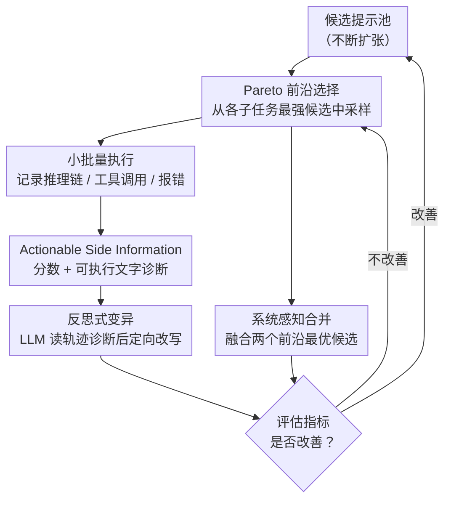

# GEPA: Reflective Prompt Evolution Can Outperform Reinforcement Learning

**会议**: ICLR 2026 (Oral)  
**arXiv**: [2507.19457](https://arxiv.org/abs/2507.19457)  
**代码**: [https://github.com/gepa-ai/gepa](https://github.com/gepa-ai/gepa)  
**领域**: 可解释性  
**关键词**: 提示优化, 进化搜索, 自然语言反思, Pareto前沿, GRPO替代

## 一句话总结
提出 GEPA（Genetic-Pareto）提示优化器，通过自然语言反思从少量执行轨迹中诊断问题并迭代优化提示，在六个任务上平均超越 GRPO 6%（最高20%），同时仅使用 1/35 的采样量。

## 研究背景与动机
大语言模型越来越多地通过强化学习方法（如 GRPO）进行下游任务的适配。然而 GRPO 等方法通常需要数千次 rollout，将丰富的执行轨迹压缩为稀疏的标量奖励信号——这丢失了大量信息。

语言本身是一种高度可解释的媒介，天然包含了比标量奖励丰富得多的学习信号。一个 LLM 的推理链条、工具调用过程和错误信息中隐含了"为什么失败"的诊断线索，但 RL 方法将这些全部丢弃，仅保留一个分数。

**核心矛盾**：RL 方法（GRPO）需要大量 rollout 但仅利用标量奖励 vs 自然语言本身携带远比标量奖励丰富的学习信号。

**切入角度**：既然 LLM 能读懂执行轨迹，为什么不让 LLM 直接反思失败原因、提出改进，从而以极少的采样实现高效优化？

**核心idea**：将提示优化建模为带反思的进化搜索过程，利用 LLM 读取完整执行轨迹进行"梯度等价"的诊断和修复，通过 Pareto 前沿选择维持多样性。

## 方法详解
GEPA 把"优化提示"建模成一场以自然语言为驱动的进化搜索：维护一个候选提示池，每一轮从池中挑一个候选，在小批量任务上跑一遍并完整记录它的推理链、工具调用与报错，然后让一个 LLM 反思器读这份轨迹、用文字诊断哪里出了问题、并据此改写出新提示。整个过程不碰模型权重、不算任何梯度，只靠"执行—反思—变异—评估"的闭环把好提示沉淀下来。

### 整体框架
系统在每一轮里完成一次"挑候选 $\to$ 跑批 $\to$ 读轨迹反思 $\to$ 改写提示 $\to$ 看分数决定去留"的循环，期间维护两样东西：一个不断扩张的候选提示池，以及一条记录"谁在哪些任务上最强"的 Pareto 前沿。每轮先从前沿上采样一个候选作为变异对象，在小批量任务上执行并榨取出"分数 + 文字诊断"的反馈，反思器据此定向改写出新提示；前沿上两个各有所长的候选也可被合并成互补的新候选。新候选只有在评估指标确有改善时才被接纳、回填进池并更新前沿，搜索就这样在多样化的候选之间一步步爬升，直到采样预算用尽。

### 关键设计

**1. Pareto 前沿选择：用多目标视角维持候选多样性**

每一轮要先决定"拿哪个候选去变异"。如果只盯着平均分挑，搜索很快会收敛到单一风格的提示，在某些子任务上一路过拟合、却把别的子任务上偶然出彩的变体丢掉。GEPA 改为维护一条 Pareto 前沿，记录在不同任务子集上各自最强的候选，挑选变异对象时从前沿上采样。这样即便某个候选总平均分不高，只要它在某类问题上独占鳌头就会被保留下来继续繁衍，搜索得以同时朝多个方向探索而不至于早熟。

**2. Actionable Side Information（ASI）：把标量奖励换成可执行的文字诊断**

选中候选跑完小批量后，回报里装什么决定了能学到多少。RL 方法的根本浪费在于把一整条信息丰富的轨迹压成一个标量分数，模型只知道"做得好不好"却不知道"为什么"。GEPA 让评估器除了返回分数，还返回一段诊断性反馈——错误信息、性能剖析、推理日志、单元测试的失败原因等等。这段文字在文本优化里扮演了"梯度"的角色：它直接指出失败的具体环节，反思器据此就能做定向修改，而不是盲目试错。正因为每次执行都榨取出这样高密度的学习信号，GEPA 才能在区区上百次评估里完成 RL 需要上万次 rollout 才能逼近的改进。

**3. 反思式变异：让 LLM 先诊断再改写，而非随机扰动**

拿到 ASI 之后就该改提示了。进化搜索通常靠随机变异探索，但提示空间巨大、随机改写命中率极低。GEPA 的变异是基于诊断的：反思器先读完失败轨迹与 ASI，回答"这个提示在这类问题上为什么会错"，再把答案落实成对提示的针对性修订，并且把所有祖先候选积累下来的教训一并带入，避免重复踩同一个坑。这种"读错题再改"的定向变异，是 GEPA 样本效率远高于 RL 的根本原因。

**4. 系统感知合并（System-aware Merge）：让两条各有所长的血脉优势互补**

除了沿单条血脉变异，前沿上常出现两个候选各擅长一片任务的情况，单纯的变异很难一次性把两边长处揉到一起。GEPA 引入合并算子：由 LLM 分析两个 Pareto 最优候选各自为何在对应任务上占优，再生成一个融合双方策略的新候选。对于含多个提示模块的复合系统，这一步尤其关键——它能把不同模块上分别调好的部分拼装成一个整体更强的版本。

### 损失函数 / 训练策略
GEPA 全程无梯度、无损失函数，是否接纳新候选完全由评估指标说了算：默认任何改善即接受，也可改成设定阈值或要求统计显著。典型预算是 100–500 次评估，而对照的 GRPO 往往需要 5000–25000 次以上的 rollout，二者差出一到两个数量级。由于只依赖 API 级别的调用、不需要触及模型权重，GEPA 可以直接优化 GPT-5、Claude、Gemini 这类只开放接口的闭源模型——这正是基于策略梯度的 RL 方法无论如何都做不到的。

## 实验关键数据

### 主实验

| 任务 | 指标 | GEPA | GRPO | MIPROv2 | 提升(vs GRPO) |
|------|------|------|------|---------|---------------|
| 6任务平均 | Accuracy | - | - | - | +6% avg, up to +20% |
| AIME-2025 | Accuracy | - | - | - | +12%(vs MIPROv2) |
| GPT-4.1 Mini+AIME | Accuracy | 56.6% | - | 46.6% | +10pp |
| DSPy MATH | Accuracy | 93% | - | 67% | - |
| ARC-AGI | Accuracy | 89% | - | 32% | - |

### 消融实验

| 配置 | 关键指标 | 说明 |
|------|---------|------|
| 完整 GEPA | 最佳 | 反思+Pareto+合并全部启用 |
| 无反思 | 性能下降显著 | 退化为随机搜索 |
| 无 Pareto 选择 | 多样性丧失 | 易陷入局部最优 |
| 无系统合并 | 中等下降 | 无法互补不同子任务优势 |

### 关键发现
- GEPA 使用的 rollout 数仅为 GRPO 的 1/35，但平均性能反而高 6%
- 在 AIME-2025 上超越领先的提示优化器 MIPROv2 达 12%
- 生成的优化提示是人类可读的，包含详细的问题解决策略
- 作为推理时搜索策略在代码优化上也展现了潜力
- 已被 DSPy、MLflow、OpenAI Cookbook、Google ADK、HuggingFace 等主流框架集成

## 亮点与洞察
- 用自然语言反思替代标量奖励，是对 RL 范式的深刻反思——语言本身就是最好的梯度
- 极低的样本需求（100-500次评估）使其可以优化API模型（GPT-5, Claude），无需权重访问
- 生成的提示是可解释的"预计算推理计划"，可直接审查和理解
- Pareto前沿维护是避免过拟合的优雅方案

## 局限与展望
- 依赖高质量的反思模型（通常需要 GPT-5 级别），成本不低
- 对于需要大规模权重更新的任务（如知识注入），提示优化的天花板有限
- 搜索过程的随机性可能导致不同运行结果差异较大
- 与 RL 的公平比较存在争议——优化的对象不同（提示vs权重）
- 对于超长提示（数千token），反思和变异的质量可能下降
- 评估 metric 的设计对最终效果影响巨大，metric 不好则 GEPA 也无法优化
- 在安全对齐等需要精确控制模型内部表示的任务上，提示优化的局限性更明显

## 相关工作与启发
- **vs GRPO/PPO**: GRPO通过策略梯度优化模型权重，需要大量rollout；GEPA优化提示文本，用反思替代梯度
- **vs MIPROv2**: 此前最强的提示优化器，GEPA通过ASI和Pareto搜索在AIME等任务上超越10%+
- **vs TextGrad**: TextGrad也用文本反馈但采用梯度模拟；GEPA的进化搜索+反思更为高效

## 评分
- 新颖性: ⭐⭐⭐⭐⭐ 用自然语言反思替代RL标量奖励的范式极具启发性，ICLR Oral当之无愧
- 实验充分度: ⭐⭐⭐⭐ 六个任务验证，与GRPO和MIPROv2充分对比
- 写作质量: ⭐⭐⭐⭐⭐ 动机阐述极清晰，方法直觉易懂
- 价值: ⭐⭐⭐⭐⭐ 已获得大规模工业采用（Shopify/Databricks/OpenAI等），实际影响力极大

<!-- RELATED:START -->

## 相关论文

- [\[ICLR 2026\] Learning Nonlinear Causal Reductions to Explain Reinforcement Learning Policies](learning_nonlinear_causal_reductions_to_explain_reinforcement_learning_policies.md)
- [\[ICLR 2026\] Reinforcement Learning Fine-Tuning Enhances Activation Intensity and Diversity in the Internal Circuitry of LLMs](reinforcement_learning_fine-tuning_enhances_activation_intensity_and_diversity_i.md)
- [\[NeurIPS 2025\] Understanding Prompt Tuning and In-Context Learning via Meta-Learning](../../NeurIPS2025/interpretability/understanding_prompt_tuning_and_in-context_learning_via_meta-learning.md)
- [\[ICLR 2026\] Evolution of Concepts in Language Model Pre-Training](evolution_of_concepts_in_language_model_pre-training.md)
- [\[ICML 2026\] Interpretability Can Be Actionable](../../ICML2026/interpretability/interpretability_can_be_actionable.md)

<!-- RELATED:END -->
