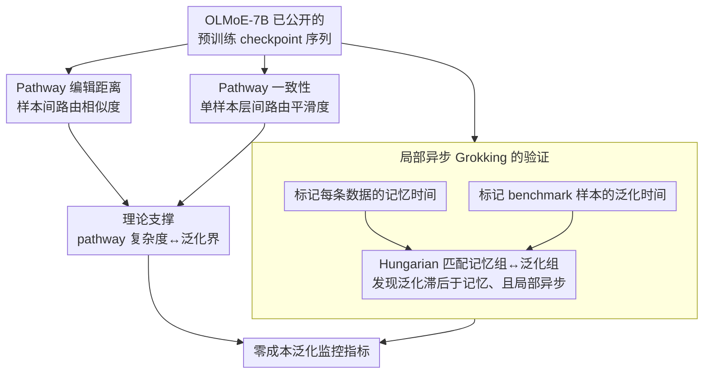

# Grokking in LLM Pretraining? Monitor Memorization-to-Generalization without Test

**会议**: ICLR 2026  
**arXiv**: [2506.21551](https://arxiv.org/abs/2506.21551)  
**代码**: 无  
**领域**: 可解释性  
**关键词**: grokking, memorization, generalization, MoE pathway, pretraining dynamics

## 一句话总结
首次在实际规模 LLM（7B MoE）的近单遍预训练中验证 grokking 现象——不同数据组异步记忆、延迟泛化；通过分析 MoE routing pathway 的演化（从 instance-specific 到 structured/shared），提出两个零成本指标来监控泛化进度，无需 instruction tuning 和 benchmark 评估。

## 研究背景与动机

**领域现状**：Grokking（延迟泛化）是训练 Transformer 时观察到的反直觉现象——训练 loss 收敛后很久，泛化性能才开始急剧提升。现有 grokking 研究限于小模型在算法数据上训练数千 epoch。

**现有痛点**：(a) LLM 预训练是近单遍的（~1 epoch），没有重复回放数据，loss 收敛机制与多 epoch 训练截然不同；(b) LLM 在异构跨域数据上训练，不同数据的记忆速度和泛化关系可能不同；(c) 监控 LLM 泛化性能代价极高——需要先做 instruction tuning 再跑 benchmark。

**核心矛盾**：预训练 loss 收敛后模型内部仍在发生什么变化？为什么 loss 不变但泛化在提升？有没有不依赖外部评估的指标来追踪泛化？

**本文目标** (a) 验证 grokking 是否在实际 LLM 预训练中存在；(b) 揭示记忆到泛化转变的内部机制；(c) 提供零成本泛化监控指标。

**切入角度**：MoE 架构天然将计算组织为 expert 选择序列（pathway），可以追踪每个样本的 pathway 如何演化——从随机/instance-specific（记忆）到结构化/跨样本共享（泛化）。

**核心 idea**：Grokking 在 LLM 预训练中以局部、异步的形式存在；MoE pathway 从个体特异到跨样本共享的演化是记忆到泛化转变的可观测信号。

## 方法详解

### 整体框架
论文不训练新模型，而是把 OLMoE-7B 已公开的一串预训练 checkpoint 当成"时间切片"来解剖。整个分析分两条线展开：一条线在这串 checkpoint 上分别标定每条训练数据"何时被记住"和每个 benchmark 样本"何时被答对"，再把两者对齐，验证 grokking 是否真的发生、以什么形式发生；另一条线把视线转向 MoE 的 routing pathway——即每个样本在各层被路由到哪些 expert 组成的序列——用两个只需训练数据、无需任何外部评估的指标量化它随训练的演化。最后用一层 MoE 的理论分析把 pathway 复杂度和泛化界挂钩，并证明这两个指标与下游泛化强相关，从而成为零成本的泛化监控信号。

### 关键设计

**1. 局部异步 Grokking 的验证：先证明 grokking 在真实预训练里确实存在，但不是全局同步的**

原始 grokking 研究都在小模型、算法数据、上千 epoch 的设定下观察，无法说明近单遍、跨域的 LLM 预训练里是否还有这回事。作者的做法是给每条训练数据标一个记忆时间点 $t_i^*$（该样本 loss 降到收敛的步数），按 $t_i^*$ 把数据分组；同时把 benchmark 样本按"预测从错变对"的时间点分组，再用 Hungarian 匹配把记忆组和泛化组配对。结果显示不同数据组在不同步骤被记忆，而泛化普遍滞后于记忆出现——而且滞后量随数据而异：数学、代码这类任务要先记住更多样本才开始泛化、延迟更长，常识 QA 则记得少、泛化快。这说明 LLM 里的 grokking 不是整体同时翻转的，而是局部的、随数据异质展开的。

**2. Pathway 编辑距离：用样本间 pathway 的相似度，捕捉"知识从个体化走向共享"**

要把"记忆→泛化"的内部转变变成可观测信号，作者盯住 MoE 的离散路由。对每个样本，把它在各层选中的 expert 拼成一个 pathway 字符串 $s_i = \text{concat}(e_1^{(i)}, ..., e_L^{(i)})$，再用 Levenshtein 编辑距离 $D_{path}(s_i, s_j)$ 度量任意两个样本走的路有多像。沿训练观察这个量会看到一条三段曲线：早期所有样本 pathway 几乎相同（编辑距离低，模型还没分化）→ 进入记忆阶段后 pathway 各自分化（编辑距离升高，每个样本走自己的专属路径）→ **记忆完成后编辑距离反而回落**——语义相关的样本开始收敛到相似的 pathway。这个回落正是"共享知识"浮现的标志：模型不再为每个样本单独记一条路，而是把可迁移的结构抽出来复用。

**3. Pathway 一致性：用单样本层间路由的平滑度，刻画 pathway 的结构化程度**

编辑距离看的是样本之间，这一指标则看单个样本内部：相邻层选中的 expert 是否在"协同工作"。作者计算相邻层所选 expert embedding 的加权余弦相似度，作为该样本 pathway 的层间一致性。训练动态显示，记忆完成后一致性持续升高——expert 选择在层间变得更平滑、更结构化，而不再是层层之间各选各的随机拼接。它和编辑距离从两个角度共同印证同一件事：泛化阶段的 pathway 正在变得更有组织。

**4. 理论支撑：把 pathway 复杂度和泛化界挂上钩**

为了说明上面两个经验指标不是偶然相关，作者在单层 MoE 上做了理论分析，建立 pathway 复杂度与泛化界之间的联系：pathway 越结构化（编辑距离更低、一致性更高），对应的泛化界越紧。这给"结构化 pathway 预示更好泛化"提供了形式化的依据。

### 损失函数 / 训练策略
- 分析对象是 OLMoE-7B 的 10 个等间隔预训练 checkpoint，全部基于已公开权重，不重新训练。
- 泛化评估：对每个 checkpoint 做一次 LoRA instruction tuning 再跑标准 benchmark，得到该时刻的"真实泛化"作为参照基准。
- 两个 pathway 指标只在训练数据上计算，不需要 instruction tuning 和 benchmark，因此是零额外成本的监控信号。

## 实验关键数据

### 主实验

**Grokking 现象验证**（4 个领域 × 多个数据组）:

| 领域 | 记忆后泛化延迟 | 数据难度效应 |
|------|-------------|------------|
| 数学 | 长延迟（需记忆大量样本）| 越晚记忆，延迟越长 |
| 代码 | 长延迟 | 同上 |
| 常识 QA | 短延迟 | 相对容易泛化 |
| 领域 QA | 中等延迟 | 中等 |

### 消融实验

| 指标 | 与泛化性能相关性 | 说明 |
|------|----------------|------|
| Pathway 编辑距离 | 强负相关 | 编辑距离下降→泛化提升 |
| Pathway 一致性 | 强正相关 | 一致性增加→泛化提升 |
| 训练 loss | 无显著相关 | loss 收敛后无法预测泛化 |

### 关键发现
- **Grokking 在 LLM 预训练中确实存在**，但是局部的、异步的——不同数据组的记忆和泛化时间点不同
- **训练 loss 不能预测泛化**：loss 收敛后泛化仍在提升，且提升幅度因领域/难度而异
- **Pathway 从个体化到结构化的转变**：记忆完成后，模型继续在"更聪明地记忆"——发现跨样本可迁移的知识结构
- **深度依赖的重组**：浅层 pathway 最先共享化（普遍表示），深层保留更多灵活性（任务特化）
- **两个指标与泛化高度相关**：可作为零成本的泛化监控工具

## 亮点与洞察
- **"更聪明的记忆"**：loss 收敛不意味着学习停止——模型继续发现更高效的编码方式（shared pathways），解释了为什么持续训练能提升泛化
- **MoE 作为可解释性工具**：expert routing 的离散性天然提供了分析计算分配的窗口，这在 dense 模型中不可能做到
- **零成本泛化监控的实用价值**：对 LLM 训练者来说，不用做 instruction tuning + benchmark 就能判断何时停止预训练，极其有价值
- **局部 grokking 暗示数据课程设计**：不同数据的记忆→泛化延迟不同，暗示可以据此设计数据混合策略

## 局限与展望
- 仅在 OLMoE-7B 上分析，更大规模模型和 dense 架构的 grokking 行为未验证
- Pathway 指标依赖 MoE 架构，不能直接推广到 dense Transformer
- instruction tuning 的选择（LoRA vs full-finetune）可能影响泛化测量
- 因果关系未完全建立——pathway 共享化是泛化的原因还是结果？

## 相关工作与启发
- **vs Power et al. (原始 grokking)**: 小模型 + 算法数据 + 数千 epoch。本文首次在 7B MoE + 近单遍预训练中验证，发现是局部异步的
- **vs Nanda et al. (grokking 机制)**: 通过 weight 分析解释。本文通过 MoE pathway 分析，更适合大规模模型
- **vs Merrill et al. (子网络稀疏性)**: 在 ReLU 网络中关联 grokking 与稀疏性。本文的 pathway 结构化与此相呼应但在 MoE 框架下

## 评分
- 新颖性: ⭐⭐⭐⭐⭐ 首次在实际规模 LLM 预训练中系统研究 grokking，发现局部异步模式
- 实验充分度: ⭐⭐⭐⭐ 4 域 × 多数据组 + 层级分析 + 理论支撑，但仅 1 个模型
- 写作质量: ⭐⭐⭐⭐⭐ 问题动机推导严谨，发现的逐步揭示非常引人入胜
- 价值: ⭐⭐⭐⭐⭐ 对 LLM 训练动态理解的根本性贡献+实用的泛化监控工具

<!-- RELATED:START -->

## 相关论文

- [\[ICML 2026\] Memorization Dynamics of Fill-in-the-Middle Pretraining](../../ICML2026/interpretability/memorization_dynamics_of_fill-in-the-middle_pretraining.md)
- [\[ICLR 2026\] Specialization after Generalization: Towards Understanding Test-Time Training in Foundation Models](specialization_after_generalization_towards_understanding_test-time_training_in_.md)
- [\[ICML 2026\] Grokking: From Abstraction to Intelligence](../../ICML2026/interpretability/grokking_from_abstraction_to_intelligence.md)
- [\[ACL 2026\] Crosscoding Through Time: Tracking Emergence & Consolidation Of Linguistic Representations Throughout LLM Pretraining](../../ACL2026/interpretability/crosscoding_through_time_tracking_emergence_consolidation_of_linguistic_represen.md)
- [\[ICLR 2026\] Evaluating SAE Interpretability Without Generating Explanations](evaluating_sae_interpretability_without_generating_explanations.md)

<!-- RELATED:END -->
