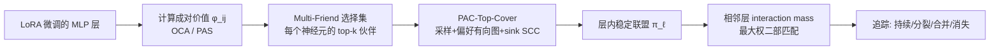

# Hedonic Neurons: A Mechanistic Mapping of Latent Coalitions in Transformer MLPs

**会议**: ICLR 2026  
**OpenReview**: [https://openreview.net/forum?id=v6HPsCu2R8](https://openreview.net/forum?id=v6HPsCu2R8)  
**代码**: [https://github.com/TaKneeAa/hedonicNeurons](https://github.com/TaKneeAa/hedonicNeurons)  
**领域**: 机制可解释性 / 合作博弈论 / LLM 内部表征  
**关键词**: hedonic game, neuron coalition, PAC-stable, LoRA, MLP, synergy, mechanistic interpretability  

## 一句话总结
把 transformer MLP 里的神经元当作合作博弈中的"理性玩家"，用 hedonic game + PAC-Top-Cover 算法找出"联合消融效果非线性叠加"的神经元联盟（coalition），从而揭示 LoRA 微调到底在哪些协同神经元组里编码了任务特征。

## 研究背景与动机
- **领域现状**：LoRA 微调能用极少参数教会 LLM 新任务，且新特征主要集中在中层 MLP；但 LoRA 的低秩更新会把新特征方向"弥散"到成千上万个神经元里，肉眼看权重更新几乎看不出任何结构。
- **现有痛点**：主流可解释性工具都只看"单个单元"或"统计邻近"——probing 抓的是神经元与标签的相关性但忽略协作，SAE 把激活拆成单义方向却抹掉了非线性依赖，clustering 只按统计相似度分组而非功能交互。它们都答不出核心问题：**哪些神经元子集是协同的（联合贡献 > 各自贡献之和）**。
- **核心矛盾**：特征不是孤立神经元算出来的，而是一群神经元"合伙"算出来的；但要枚举所有 $2^{n-1}$ 个可能的子集来找联盟在计算上完全不可行。
- **本文目标**：给出一个有理论保证、可扩展的框架，自动发现 MLP 层内的稳定协同联盟，并追踪它们随深度的演化（持续 / 分裂 / 合并 / 消失）。
- **核心 idea**：**【博弈论类比】** SGD 给神经元施加了一种"选择压力"——只有能降 loss 的方向才能存活，而很多神经元只有组合在一起才有用。于是可以把神经元看成 hedonic game 里的 agent，其效用衡量"我的存活有多依赖与他人的协同"，**稳定联盟 = 在训练中一起存活下来的神经元组**。

## 方法详解

### 整体框架
方法分两阶段：先在单层内把"找协同联盟"形式化为一个带 hedonic 效用的合作博弈，用 PAC-Top-Cover 算法求出 PAC 稳定的神经元划分；再用最大权二部匹配把相邻层的联盟连起来，追踪这些"元神经元"如何随深度演化。

### 关键设计

**1. 成对价值函数：OCA 与 PAS 两条互补路线**——一切的起点是给每对神经元 $(i,j)$ 估一个协同分 $\phi_{ij}$，正值表示协同、负值表示冗余。结构启发式 OCA（Orthogonal-Co-Activation）认为"权重正交但激活相关"的神经元在算互补特征，$\phi_{OCA}(i,j)=(1-|\cos(W_i,W_j)|)\,\rho(a_i,a_j)$，其中 $\rho$ 是激活的 Pearson 相关；功能式 PAS（Pairwise Ablation Synergy）则直接测二阶交互——把神经元重置回 LoRA 之前的权重做消融，$\Delta_{ij}(x)=\ell(x)-\ell_{-i}(x)-\ell_{-j}(x)+\ell_{-(i,j)}(x)$，$\phi_{PAS}(i,j)=\mathbb{E}_x[\Delta_{ij}(x)]$，正值即"联合消融比单独消融之和改变得更多"。为了在大 $n$ 下可算，PAS 用混合二阶导 $\partial^2\ell/\partial a_i\partial a_j$ 乘激活差近似。两条路线一结构一功能，用来检验框架的鲁棒性。

**2. Multi-Friend 选择集把博弈变得可解（top-responsive）**——直接枚举偏好不可行，所以把博弈限制成 top-responsive：每个神经元只关心自己最看重的一小撮伙伴。具体地，神经元 $i$ 在联盟 $S$ 里的选择集取协同分最高的 $k$ 个伙伴，$\mathrm{Ch}(i,S)=\arg\max_{T\subseteq S\setminus\{i\},|T|=k}\sum_{j\in T}\phi_{ij}$，效用归一化为 $u_i(S)=\frac{1}{k}\sum_{j\in\mathrm{Ch}(i,S)}\phi_{ij}$。这样每个神经元不必考虑所有可能分组，只比较自己最值钱的伙伴集，刻画了"多伙伴协同"——某个神经元只有在几个互补特征同时在场时才有意义。

**3. PAC-Top-Cover：用采样换可扩展性 + 稳定性保证**——这是把博弈解出来的引擎。它从分布 $D$ 上重复采样联盟（先采子集大小 $s$ 再均匀采该大小的子集），对每个玩家保留其 MFC 效用最高的采样联盟 $T_i^\star$，再取 top-k 估出选择集 $B_i$；据此构造偏好有向图（$i\to j$ 当 $j\in B_i$），输出那些对选择集闭合的 **sink 强连通分量** 作为联盟，输出后移除已分配节点、在残余集上迭代。理论上只需 $m=\mathrm{poly}(n,1/\epsilon,\log(1/\delta))$ 个样本，就能以 $\ge 1-\delta$ 概率得到 $\epsilon$-PAC 稳定划分——即"在分布 $D$ 下观察到能拆台的 blocking coalition 的概率 $\le\epsilon$"，给"发现的联盟反映了稳健合作结构"提供了理论支撑。

**4. 跨层追踪：interaction mass + 最大权匹配**——把联盟当"元神经元"后，要看它们随深度怎么变。对相邻层联盟对 $(C,C')$ 定义 interaction mass $M(C,C')=\frac{1}{|C||C'|}\sum_{p\in C}\sum_{q\in C'}(W^{(\ell+1)}_{up}[q,p]+W^{(\ell+1)}_{gate}[q,p])\cdot A_p$，同时覆盖加性（up）和门控乘性（gate×SiLU）两条通路，并用联盟尺寸归一化。把这些质量装成二部矩阵求最大权匹配对齐联盟；再算源联盟输出流入目标的比例 $\alpha$、目标输入来自源的比例 $\beta$，据此把转移分成持续（两者都高）、分裂（低 $\alpha$ 高 $\beta$）、合并（高 $\alpha$ 低 $\beta$）、消失（两者都低）。作者强调这一步是探索性的——残差连接让神经元影响所有更深层，本方法只抓局部动态。

## 实验关键数据

模型：LLaMA-3.1-8B / Mistral-7B-v0.1 / Pythia-6.9B，均用 LoRA（rank 8）只微调 MLP 层 7–14。任务：MS MARCO 上的三个标量目标——CQTR（查询词覆盖率）、Mean-TF/L（长度归一词频均值）、RM（监督排序，NDCG）；OOD 在 TREC DL-19/20 评测。

### 主实验表格（外在评估：OOD Drop ↑ 与 Feature Alignment $R^2$ ↑）

| 任务/算法 | LLaMA OOD Drop | LLaMA Align $R^2$ | Mistral OOD Drop | Pythia Align $R^2$ |
|---|---|---|---|---|
| K-means | 0.02 | 0.12 | 0.03 | 0.11 |
| Hier. clustering | 0.03 | 0.15 | 0.03 | 0.13 |
| Hedonic (OCA) | 0.07 | 0.41 | 0.09 | 0.45 |
| **Hedonic (PAS)** | **0.11** | **0.58** | **0.13** | **0.63** |

（上表为 CQTR 任务节选；RM 任务上 Hedonic-PAS 的 OOD Drop 达 0.14–0.17、Align $R^2$ 达 0.63–0.67。）联合消融一个 hedonic 联盟造成的 OOD 性能下降比 clustering 大 **3–5×**，激活与 BM25/IDF/覆盖度等 IR 启发式的对齐 $R^2$ 从 ~0.11–0.18 升到 0.55–0.67。

### 消融实验表格（联盟预测力：用联盟当宏特征做 ridge 回归，OOD $R^2$ ↑）

| 算法 | CQTR | Mean-TF/L | RM |
|---|---|---|---|
| Random | 0.08 | 0.09 | 0.12 |
| K-means | 0.16 | 0.15 | 0.21 |
| Hier. clustering | 0.18 | 0.17 | 0.21 |
| Hedonic (OCA) | 0.34 | 0.33 | 0.38 |
| **Hedonic (PAS)** | **0.43** | **0.42** | **0.47** |

把联盟作为宏特征，PAS 的 OOD $R^2$ 约为 clustering 的 2–3×，OCA 也稳居第二，说明"尊重协同"的效用确实产出可迁移的鲁棒特征而非普通共激活簇。

### 关键发现
- **跨层动态（层 7→14）**：vanish 主导（典型 60–75% 的联盟在下一层消失），splits 常见（~20–50%），merges 近乎为零，persistence 普遍 <12%。这支撑了核心论断——**深层 MLP 主要做特征过滤/精炼，而非特征创造**；协同单元被形成后大多被剪枝或细化，而非被融合。
- Mean-TF/L 剪枝最猛（多处 vanish >70%），符合"简单频率统计被早期隔离、后期激进剔除"的直觉。
- 置信区间普遍很窄，跨 3 个种子估计稳定。

## 亮点与洞察
- **首次把合作博弈论用于神经元层面**：用 hedonic game + PAC 稳定性这套有理论保证的工具，去发现、验证并追踪微调 LLM 中的协同神经元组，视角新颖且自洽（SGD 的选择压力 ↔ 博弈的稳定联盟）。
- **超越 disentanglement 的"高阶结构"**：与 SAE"重新表达激活空间"不同，hedonic 联盟保留神经元为基本单元、扎根于权重几何与偏好结构，抓的是 SAE/clustering 看不见的非线性协同。
- **因果 + 语义双重验证**：联盟既功能不可或缺（消融造成大 OOD 退化），又语义可解释（强对齐 BM25/IDF/coverage），不是事后讲故事。
- **"元神经元"追踪给出可操作洞见**：联盟级的持续/分裂/消失，为模型对比、迁移学习、模块化编辑等"在联盟粒度而非单权重粒度"干预指明了方向。

## 局限与展望
- **只抓局部跨层动态**：残差连接让神经元影响所有更深层，interaction mass 只看相邻层，必然低估长程交互，跨层追踪被作者明确定性为"探索性"。
- **PAS 代价高**：PAS 价值估计需二阶交互/混合导，PAC-Top-Cover 在 PAS 下要跑 280 分钟（OCA 仅 90 分钟），4×A100 才扛得住，扩展到全模型全层仍有成本压力。
- **任务面较窄**：实验集中在 IR 标量输出任务（CQTR/Mean-TF/L/RM）与中层（7–14），是否能推广到生成、分类、更深/更浅层尚待验证。
- **"理性 agent"是类比而非事实**：神经元并非真的理性，hedonic 框架的解释力依赖 SGD 选择压力这一假设，需谨慎对待因果声明。

## 相关工作与启发
- **机制可解释性**：probing、SAE（Huben et al. 2024）、neuron clustering 是三类主流路线，本文的核心差异是显式建模"协同"而非"相关/单义/邻近"。
- **合作博弈与 PAC 稳定**：hedonic game（Dreze & Greenberg 1980）、top-responsive 游戏的 Top-Covering 算法、Sliwinski & Zick (2017) 的 PAC 稳定化是直接的理论基座。
- **LoRA 与中层 MLP**：Hu et al. (2022)、Nijasure et al. (2025) 关于 LoRA 主要更新中层 MLP 的观察，是本文"为什么聚焦 7–14 层"的动机来源。
- **启发**：把"协同/联盟"作为可解释性的一等公民，提示后续工作可以从"单元 → 联盟 → 联盟动力学"分层去理解大模型，也为联盟级干预（编辑、合并、迁移）打开口子。

## 评分
- 新颖性: ⭐⭐⭐⭐⭐ 首次将 hedonic 合作博弈 + PAC 稳定性引入神经元级可解释性，视角独到且与训练动力学自洽。
- 实验充分度: ⭐⭐⭐⭐ 三模型三任务、内在/外在双重评估、跨层动态、3 种子置信区间齐全；但任务局限于 IR 标量输出、仅中层，外推性待证。
- 写作质量: ⭐⭐⭐⭐ 动机—理论—方法—验证链条清晰，类比讲得有说服力；PAS 近似与跨层 mass 公式略密，需对照附录。
- 价值: ⭐⭐⭐⭐ 提供了"协同联盟"这一可操作的新分析单元与联盟级干预的潜在路径，对理解 LoRA 微调内部机制有实际意义。

<!-- RELATED:START -->

## 相关论文

- [\[ICLR 2026\] Latent Concept Disentanglement in Transformer-based Language Models](latent_concept_disentanglement_in_transformer-based_language_models.md)
- [\[NeurIPS 2025\] Bigram Subnetworks: Mapping to Next Tokens in Transformer Language Models](../../NeurIPS2025/interpretability/bigram_subnetworks_mapping_to_next_tokens_in_transformer_language_models.md)
- [\[ICLR 2026\] Latent Thinking Optimization: Your Latent Reasoning Language Model Secretly Encodes Reward Signals in Its Latent Thoughts](latent_thinking_optimization_your_latent_reasoning_language_model_secretly_encod.md)
- [\[ICLR 2026\] Latent Planning Emerges with Scale](latent_planning_emerges_with_scale.md)
- [\[ICLR 2026\] Noise Stability of Transformer Models](noise_stability_of_transformer_models.md)

<!-- RELATED:END -->
