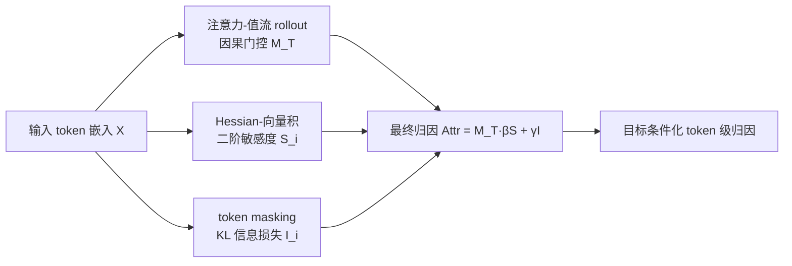

# Hessian-Enhanced Token Attribution (HETA): Interpreting Autoregressive LLMs

**会议**: ICLR 2026  
**OpenReview**: [https://openreview.net/forum?id=XsEZcigEjq](https://openreview.net/forum?id=XsEZcigEjq)  
**代码**: [https://github.com/VishalPramanik/HETA](https://github.com/VishalPramanik/HETA)  
**领域**: 可解释性 / Token 归因  
**关键词**: token attribution, decoder-only LLM, Hessian, second-order sensitivity, KL divergence, faithfulness  

## 一句话总结
HETA 把"因果语义流门控 + Hessian 二阶曲率敏感度 + KL 信息损失"三种信号融合成统一的 token 归因分数，专为 decoder-only 自回归 LLM 设计，在忠实度、对解码超参与句法改写的鲁棒性上都显著超过现有方法。

## 研究背景与动机
- **领域现状**：LIME、KernelSHAP、Integrated Gradients、Grad-CAM、LRP 等经典特征归因方法绝大多数为 encoder 架构设计，依赖局部线性 / 一阶导数近似，假设模型在输入附近近似线性。
- **现有痛点**：这一线性假设在自回归 LLM 上崩塌——token 交互高度非线性且强依赖上下文；注意力权重只反映"模型看哪里"而非"什么真正影响输出"，可被扰动而不改变预测，且跨层聚合时忽略残差/MLP 上的多跳间接路径；一阶梯度在梯度消失但函数仍对有限扰动敏感的区域会完全错过影响。
- **核心矛盾**：encoder 模型双向注意力、只需一张归因图；decoder-only 模型自回归逐 token 生成、需要在每个目标位置给出条件归因。直接把 encoder 时代的方法搬过来"不平凡且常常不忠实"，而 ContextCite/TDD/Peering 等近期生成式方法又各有短板（稀疏线性代理对冗余敏感且只能句级、logit lens 混淆相关与因果、表示匹配只对逐字片段有效）。
- **本文目标**：构建一个尊重生成模型因果与上下文结构、对解码设置和句法改写都稳定的 token 级归因框架。
- **核心 idea**：**[二阶 + 因果 + 信息论三位一体]** 用注意力-值流的因果 rollout 做门控保证"指向目标的因果方向性"，用 Hessian-向量积捕获一阶梯度漏掉的曲率敏感度，用 KL 散度度量 mask 掉某 token 后输出分布的信息损失，三者相乘/相加形成统一归因分。

## 方法详解

### 整体框架
HETA 把"token $x_i$ 对预测目标 token $x_T$ 的贡献"分解为三个互补分量：语义转移影响（因果门控）、Hessian 二阶敏感度、KL 信息贡献。最终分数把门控当作因果掩码、把曲率和信息项当作其内部强度，得到目标条件化、曲率感知的 token 级解释。

### 关键设计

**1. 语义流门控：用因果 rollout 保证"指向目标"的方向性。** 为避免后验注意力聚合把重要性误派给与输出无因果连接的 token，HETA 在 decoder 因果掩码下追踪只终止于位置 $T$ 的注意力-值流。对每层 $l$、每头 $h$，用掩码注意力矩阵 $A^{(l,h)}$、值向量 $V^{(l,h)}$ 与输出投影 $W_O^{(l,h)}$ 计算目标条件 rollout $\Phi^{(l,h)}(i\to T)$，只聚合"终点为 $T$"的路径，得到语义转移影响 $M_T[i]=\frac{1}{Z}\sum_{l,h}\Phi^{(l,h)}(i\to T)\lVert V_i^{(l,h)}W_O^{(l,h)}\rVert_1$。它经单纯形归一（$\sum_i M_T[i]=1$），只给"存在到 $T$ 因果路径"的 token 赋质量。相比单纯注意力，这里同时编码了"对齐"（注意力）与"语义强度"（值向量范数）。

**2. Hessian 二阶敏感度：在梯度消失处仍能发现影响。** 本文的核心动机是二阶 Taylor 展开 $f(x)=f(x_0)+\nabla f(x_0)^\top(x-x_0)+\tfrac12(x-x_0)^\top\nabla^2 f(\xi)(x-x_0)$——当一阶梯度在饱和区（如 $\log(1+e^{w^\top x+b})$ 的 $w^\top x+b\ll0$）几乎为零时，函数变化完全由 Hessian 编码的曲率驱动，一阶方法会系统性低估甚至漏掉影响。HETA 取目标对数概率对嵌入的 Hessian $H_T=\nabla^2_X\log P_\theta(x_T\mid x_{<T})$。由于显式构造 $(Td)\times(Td)$ 的 Hessian 不可行，它用 Hutchinson 估计器 + Pearlmutter trick 的 Hessian-向量积（HVP）估计每个 token 块的敏感度 $S_i^{(T)}\approx\frac1m\sum_k\lVert\Pi_i H_T(\Pi_i r_k)\rVert_1$（$r_k$ 为限制在第 $i$ 块上的 Rademacher 向量），并可选 Gauss-Newton/Fisher 代理提升数值稳定性。工程上默认用 rank-64 分块低秩 + 512-token 窗口 50% 重叠（HETA-LR+WIN），对 70B 模型只在最后六层算二阶项，大幅降本而几乎不掉质量。

**3. KL 信息贡献：用 mask 扰动量化输出分布位移。** 为给贡献一个概率论解释，HETA 对每个 $x_i$ 做 mask，比较原始目标分布 $P_{\text{orig}}$ 与 mask 后分布 $P^{(i)}_{\text{masked}}$ 的 KL 散度 $I(x_i\to x_T)=D_{KL}(P_{\text{orig}}\,\Vert\,P^{(i)}_{\text{masked}})$，直接度量"抽掉这个 token 后预测不确定性变了多少"。

**4. 统一归因分数：门控 × (曲率 + 信息)。** 三者融合为 $\mathrm{Attr}(x_i\to x_T)=M_T[i]\big(\beta S_i^{(T)}+\gamma I(x_i\to x_T)\big)$，其中门控 $M_T[i]$ 把归因限制在有因果路径的 token 并在这些路径上重新分配质量，$\beta,\gamma\ge0$ 分别加权曲率敏感度与信息贡献（默认各 0.5）。这样得到的分数同时是因果接地、曲率感知、且对生成式 decoder-only 模型鲁棒的。

## 实验关键数据

设置：四个 decoder-only 模型（Qwen2.5-3B、GPT-J-6B、Phi-3-Medium-14B、LLaMA-3.1-70B），基准 LongRA / TellMeWhy / WikiBio + 自建 2000 条混合段落数据集；单卡 A100-80GB；忠实度用 Soft-NC / Soft-NS，对齐用自定义 DSA 指标。

### 主实验：忠实度（Soft-NC↑ / Soft-NS↑，GPT-J 6B）

| 方法 | LongRA NC | LongRA NS | TellMeWhy NC | TellMeWhy NS | WikiBio NC | WikiBio NS |
|------|----------|----------|--------------|--------------|-----------|-----------|
| Integrated Gradients | 1.87 | 0.45 | 1.54 | 0.04 | 1.38 | 0.77 |
| Peering (PML) | 2.05 | 0.50 | 1.68 | 0.06 | 1.50 | 0.83 |
| Attention Rollout | 0.41 | -0.01 | 0.25 | -0.09 | 1.91 | 0.46 |
| ReAgent (次优) | 1.68 | 0.37 | 1.45 | 0.36 | 1.22 | 0.39 |
| **HETA (Ours)** | **10.3** | **2.31** | **9.2** | **2.04** | **3.80** | **2.20** |

HETA 的 Soft-NC 在 LongRA/TellMeWhy 上超过次优 ReAgent 2 倍以上；Phi-3、LLaMA 上趋势一致。

### 对齐实验：DSA 指标（曲线数据集，↑ 越高越好）

| 方法 | GPT-J | LLaMA | Phi-3 | Qwen2.5 |
|------|-------|-------|-------|---------|
| Integrated Gradients | -0.34 | -0.28 | -0.41 | -0.31 |
| Attention Rollout | -0.44 | -0.39 | -0.52 | -0.41 |
| ReAgent (次优) | 3.60 | 3.78 | 3.35 | 3.50 |
| **HETA (Ours)** | **4.80** | **5.10** | **4.25** | **4.65** |

梯度/注意力类方法在有干扰段落时 DSA 为负，说明无法隔离因果 token；HETA 在所有模型上 DSA≥4.2。

### 消融与鲁棒性

- **组件消融**（图 2）：去掉语义流、Hessian、KL 任一分量都一致降低忠实度与对齐，证明三者互补。
- **解码超参鲁棒性**（表 2，最大相对变化 ∆%↓）：在温度/top-p/top-k/重复惩罚网格 + 3 seed 下，HETA 所有指标 ∆%<1%，而每个 baseline 都 >2%。
- **应力测试**（图 3）：HETA 在高斯扰动敏感度（↓）、主被动句改写鲁棒性（Spearman ↑）、与 GPT-4o/GPT-5 标注的对齐 F1（↑）三项上全面最优。

### 关键发现
ReAgent 稳居第二，SEA-CoT、Progressive Inference 较传统方法有中度提升；而一阶梯度与注意力类方法常给出低或负的 Soft-NS / DSA，印证了"线性假设在自回归生成上失效"的核心论点。

## 亮点与洞察
- **二阶视角的明确动机**：用"梯度为零但 Hessian 非零"的饱和激活反例，把"为什么需要曲率"讲得很硬，而非堆术语。
- **三信号正交互补**：因果门控管"方向"、Hessian 管"非线性强度"、KL 管"信息论冲击"，消融显示缺一不可。
- **可扩展工程化**：HVP + Hutchinson + 低秩窗口 + 仅末几层二阶，让 70B 级别模型的二阶归因变得可算。
- **新评测基准 + DSA 指标**：用 NarrativeQA 干扰段 + SciQ 证据段拼接，构造"语义丰富但非诊断"的对照，能直接量化归因是否落在真正预测性证据上（标注 F1=0.91、κ=0.89）。

## 局限与展望
- **计算成本仍高**：即便低秩+窗口，二阶项与逐 token mask 的 KL 都比一阶方法昂贵；对超长上下文/超大模型需进一步近似（如只算末六层）。
- **权重需调**：$\beta,\gamma$ 默认各 0.5，最优配比可能随任务/模型变化，论文未给自适应方案。
- **评测依赖 LLM 标注**：DSA 的金标准由 GPT-4o/GPT-5 标注取交集，存在标注模型偏差的潜在风险。
- **理论保证**：误差界放在附录，正文未充分展开 HVP 估计在低秩近似下的偏差-方差权衡。

## 相关工作与启发
- **归因方法谱系**：从 LIME/SHAP/IG/Grad-CAM/LRP 的一阶范式，到 ContextCite（稀疏线性代理）、TDD（logit lens）、Peering（表示匹配）、ReAgent 等生成式专用方法，HETA 定位为"补上二阶 + 因果门控"的一支。
- **范数视角注意力**（Kobayashi et al. 2020）启发了语义流里"注意力×值范数"的设计。
- **Hessian 敏感度**（Alvarez-Melis & Jaakkola, Dhamdhere et al.）的思路被搬到 token 嵌入层面并做可扩展估计。
- **启发**：对任何"线性/一阶近似失效"的解释场景，二阶信号 + 因果路径约束 + 信息论扰动三件套可作为通用增强模板；其可扩展 HVP 估计也适用于其他需要 Hessian 的可解释性/优化任务。

## 评分
- **新颖性**: ⭐⭐⭐⭐ — 把二阶曲率、因果注意力流、KL 信息损失系统融合并用 HVP 做可扩展估计，专攻 decoder-only 归因，组合新颖且动机扎实。
- **实验充分度**: ⭐⭐⭐⭐ — 4 模型 × 多数据集 × 多 baseline，含忠实度、对齐、组件消融、解码超参与句法改写鲁棒性，覆盖面广；但部分结果（Qwen）挪到附录、误差界未在正文展开。
- **写作质量**: ⭐⭐⭐⭐ — 动机推导（二阶 Taylor + 饱和激活反例）清晰，公式与流程图配合好，逻辑顺畅。
- **价值**: ⭐⭐⭐⭐ — 为自回归 LLM 提供了更忠实、更稳定的归因工具 + 可复用的评测基准与 DSA 指标，对可解释性社区有实用价值。

<!-- RELATED:START -->

## 相关论文

- [\[ICML 2026\] Towards Long-Horizon Interpretability: Efficient and Faithful Multi-Token Attribution for Reasoning LLMs](../../ICML2026/interpretability/towards_long-horizon_interpretability_efficient_and_faithful_multi-token_attribu.md)
- [\[ICML 2025\] On the Power of Context-Enhanced Learning in LLMs](../../ICML2025/interpretability/on_the_power_of_context-enhanced_learning_in_llms.md)
- [\[ICLR 2026\] Multiple Token Divergence: Measuring and Steering In-Context Computation Density](multiple_token_divergence_measuring_and_steering_in-context_computation_density.md)
- [\[ICLR 2026\] Thought Branches: Interpreting LLM Reasoning Requires Resampling](thought_branches_interpreting_llm_reasoning_requires_resampling.md)
- [\[ACL 2026\] Jacobian Scopes: Token-Level Causal Attributions in LLMs](../../ACL2026/interpretability/jacobian_scopes_token-level_causal_attributions_in_llms.md)

<!-- RELATED:END -->
