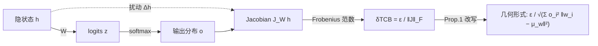

# How Stable is the Next Token? A Geometric View of LLM Prediction Stability

**会议**: ICLR 2026  
**OpenReview**: [https://openreview.net/forum?id=Zjz8F6gdrw](https://openreview.net/forum?id=Zjz8F6gdrw)  
**代码**: 待确认  
**领域**: 可解释性 / LLM 预测鲁棒性  
**关键词**: 预测稳定性, 输出嵌入几何, Jacobian, 上下文鲁棒性, 提示工程  

## 一句话总结
本文提出 **Token Constraint Bound（δTCB）**——一个量化「LLM 内部隐状态 $h$ 在被扰动多少之后下一个 token 的预测才会显著改变」的几何指标，并证明它由输出嵌入空间相对当前预测分布的「概率加权离散度」决定，从而揭示困惑度/准确率看不见的局部预测鲁棒性。

## 研究背景与动机

**领域现状**：LLM 能力惊人，却对上下文微扰极度敏感——仅改变 prompt 格式准确率可波动 76%，仅调换示例顺序可在 54%–93% 间漂移，且模型规模变大并不天然带来鲁棒性，甚至引入新的敏感性。可靠部署亟需能刻画这种「脆性」的稳定性指标。

**现有痛点**：常用评测指标失灵。准确率只给聚合表现，看不到单条预测的稳定性；困惑度（PPL）把整段序列的概率混在一起，掩盖了局部动态，也不反映内部状态的几何结构；置信度/校准类指标主要把概率对齐到「是否正确」，并不直接衡量「当前 top-1 预测对内部表示 $h$ 扰动的抵抗力」。

**核心矛盾**：softmax 归一化会**伪装**稳定性。一个 token 的高概率可能只是相对归一化的产物，并不保证产生它的内部状态 $h$ 本身是稳健的——即一个校准良好、高置信的预测，背后可能是一个「随时会翻车」的不稳定平衡点。

**本文目标**：回答核心问题——*如何量化某个 prompt/context 诱导出的 LLM 即时预测状态，对内部小扰动的稳定性？* 即为隐状态 $h$ 找出一个「安全裕度」。

**核心 idea**：**[局部扰动半径]** 不去解释输出概率 $o$ 的绝对大小，而是问「$h$ 最多能被扰动多大，输出分布的变化才不超过容忍度 $\epsilon$」——这个最大半径就是稳定性度量 δTCB，且它可被解析地翻译成输出嵌入的几何离散度。

## 方法详解

### 整体框架
LLM 末层隐状态 $h\in\mathbb{R}^d$ 经输出矩阵 $W\in\mathbb{R}^{V\times d}$ 得到 logits $z=Wh$，再 softmax 成分布 $o$。本文把「预测稳定性」形式化为：给隐状态加扰动 $\Delta h$，用一阶 Jacobian 把输出变化 $\Delta o$ 与 $\Delta h$ 联系起来，反解出在容忍 $\|\Delta o\|_2\le\epsilon$ 下允许的最大扰动半径，即 δTCB；最后把决定这个半径的 Jacobian 范数精确改写成输出嵌入相对概率加权均值的几何离散度，从而把「稳定性」与「嵌入几何」打通。

### 关键设计

**1. 用 Jacobian 把内部扰动线性传递到输出（δTCB 的定义）**：一阶近似下 $\Delta o\approx J_W(h)\,\Delta h$，其中 softmax 的 Jacobian 为 $J_W(h)=(\mathrm{diag}(o)-oo^\top)W$。借矩阵范数不等式 $\|\Delta o\|_2\le\|J_W(h)\|_F\|\Delta h\|_2$，要求输出变化不超过容忍 $\epsilon$ 就等价于约束扰动半径 $\|\Delta h\|_2\le \epsilon/\|J_W(h)\|_F$。于是把这个上界直接定义为指标：$\delta_{\mathrm{TCB}}(h):=\dfrac{\epsilon}{\|J_W(h)\|_F}$。它的含义很直观——以 $h$ 为球心、半径 $\delta_{\mathrm{TCB}}$ 的超球内任意扰动，都（一阶意义上）保证输出分布漂移不超过 $\epsilon$；半径越大说明当前预测对「内部抖动」越稳。$\epsilon$ 只是无量纲的尺度因子，实验固定 $\epsilon=1$，因为关心的是相对稳定性而非绝对值。

**2. 把 Jacobian 范数解析成输出嵌入的几何离散度（核心命题）**：本文的关键不是定义本身，而是 Prop.1 给出的精确等式 $\|J_W(h)\|_F^2=\sum_{i=1}^{V} o_i^2\,\|w_i-\mu_w(h)\|_2^2$，其中 $\mu_w(h)=\sum_j o_j w_j=W^\top o$ 是**概率加权均值嵌入**（输出嵌入的「质心」）。这把抽象的敏感度变成了可解释的几何量：稳定性由「各 token 嵌入 $w_i$ 离质心 $\mu_w$ 有多散」决定，而每个距离平方还被该 token 概率的平方 $o_i^2$ 加权。$o_i^2$ 加权是精髓——低概率 token 即便几何上离得很远也几乎不贡献，高概率 token 才被二次放大地计入。代回定义即得几何形式 $\delta_{\mathrm{TCB}}(h)=\dfrac{\epsilon}{\sqrt{\sum_i o_i^2\|w_i-\mu_w(h)\|_2^2}}$：嵌入越「抱团」、分布越尖锐，分母越小，稳定半径越大。

**3. 用几何形式解释两种置信度区间的稳定性来源**：这套几何展开自然预测了稳定性在不同区间由不同因素主导。**高置信区间**（$V_\mathrm{eff}\to1$，$o$ 集中在 token $k$）：$\mu_w\to w_k$，使 $\|J_W\|_F^2\to0$、$\delta_{\mathrm{TCB}}\to\infty$，此时求和近似为 $\sum_{j\ne k}o_j^2\|w_j-w_k\|_2^2$；由于竞争者概率 $o_j$ 对 top-2 logit 间隔 $z_k-z_{j^*}$ 超指数敏感，间隔越大稳定性越高——这解释了高置信下 δTCB 与 logit margin 强正相关。**不确定区间**（$V_\mathrm{eff}$ 较大、$o$ 平坦）：多个 token 概率非零，若它们的嵌入远离 $\mu_w$ 则离散度大、δTCB 小；但若这些高概率嵌入几何聚簇，即便分布平坦 δTCB 仍可较大——凸显「几何优先」。在简化假设下可推得 $\|J_W\|_F^2\propto1/V_\mathrm{eff}$，即 $\delta_{\mathrm{TCB}}\propto\sqrt{V_\mathrm{eff}}$，与多样 prompt 上的经验相关一致。

**4. 把 δTCB 用作提示工程的稳定性诊断与协同优化目标**：因为 δTCB 暴露了准确率/置信度看不见的脆性，本文提出四类「准确率–稳定性冲突」场景（准确但脆弱、错误但稳定、自信但不稳、不确定但稳健），并据此做迭代式 prompt 优化：先用多随机种子跑 baseline 区分「很有把握的题（VCQ）」和「模糊题（AQ）」，再对 AQ 系统调整 ICL 示例与指令措辞，**同时**优化准确率和 δTCB，最后在扰动数据上评估鲁棒性增益。

## 实验关键数据

模型 LLAMA-3.1-8B；数据集 MMLU、GSM8K，外加自建的 Diverse Prompts（DPD, N=309）与 Low-V_eff Targeted（LVD, N=360）做相关性分析；扰动半径容忍 $\epsilon=1.0$。

### 主实验：区间相关性验证（Table 1）

| 数据集 | Corr(δTCB, V_eff) | Corr(δTCB, z_k−z_j*) |
|--------|-------------------|----------------------|
| Diverse Prompts (DPD, N=309) | **0.95**（强正，由分布平坦度驱动） | −0.40（中等负） |
| Low-V_eff Targeted (LVD, N=360) | 0.08（近零） | **0.62**（强正，由 top-token 分离驱动） |

→ 高置信下稳定性由 top-2 logit 间隔决定，宽置信下由分布整体平坦度决定，与理论预测一致。

### 消融：几何敏感性验证（Table 2）

固定 $o$、只操纵 $W$（聚簇/离散竞争者嵌入），检验假设 $\delta_{\text{cluster}}>\delta_{\text{orig}}>\delta_{\text{disperse}}$ 是否成立：

| Prompt 类别 | 假设成立比例 |
|-------------|--------------|
| Low V_eff (<20) | 95% |
| Medium V_eff (20–100) | 92% |
| High V_eff (>100) | 80% |
| **总体** | **90%** |

→ 即使概率分布完全不变，仅靠嵌入几何就能改变 δTCB，证明它捕捉了概率类指标遗漏的几何维度。

### 提示工程增益（Table 3 / Table 4）

| 场景 | 指标 | Baseline | δTCB-Enhanced |
|------|------|----------|---------------|
| MMLU 模糊题(AQ) | Acc | 0.40 | **0.70** |
| MMLU AQ | Avg. δTCB | 1983.0 | **2734.0** |
| MMLU AQ | PDR(性能下降率) | 30% | **10%** |
| MMLU AQ | 最差准确率 Acc_worst | 15% | **30%** |

与「只按困惑度选 prompt」对比，δTCB 协同优化在扰动下取得更高的最差准确率（PPL-Guided vs δTCB-Guided）。

### 关键发现
- 模糊题的平均 V_eff 仍然很低——**模型可以「自信地答错」**，说明置信度不等于正确性也不等于稳定性。
- δTCB 能在文本生成过程中提前标记「萌芽中的不稳定」，这是困惑度忽略的动态。

## 亮点与洞察
- **把「稳定性」从模糊直觉变成可计算的闭式几何量**：$\delta_{\mathrm{TCB}}=\epsilon/\sqrt{\sum o_i^2\|w_i-\mu_w\|^2}$ 一行公式同时连接了 Jacobian 敏感度、softmax 几何与提示鲁棒性。
- **$o_i^2$ 加权的洞察**：它使该量区别于普通的概率加权协方差迹，强调高概率 token 的几何被二次放大——这是正确解读稳定性的关键，也是论文反复强调的「几何优先于概率形状」。
- **诊断价值落地**：四类准确率–稳定性冲突 + δTCB 协同优化，让一个分析指标真正能指导 prompt engineering，而不只是停留在解释层面。

## 局限与展望
- **一阶近似**：δTCB 建立在 Jacobian 线性化与 Frobenius 范数上界之上，对较大扰动或强非线性区域可能偏松/偏保守。
- **扰动建模在隐空间**：$\Delta h$ 是对内部表示的抽象扰动，与真实的「输入级」扰动（改格式、换示例）之间还隔着编码过程，二者的定量映射未完全打通。
- **实验规模**：主实验集中在 LLAMA-3.1-8B 与 MMLU/GSM8K，跨模型规模、跨任务（尤其开放式长文本生成）的普适性仍需更大规模验证；多张表标注为「示意性观察趋势」。
- **展望**：把 δTCB 作为训练/解码时的正则或选择信号（而非仅事后分析），以及与不确定性/校准指标融合成统一的可靠性面板。

## 相关工作与启发
- **对上下文敏感性的实证**（Sclar 2023；Zhao 2021；Lu 2021）记录了格式/顺序导致的剧烈波动，本文提供了一个解释这种脆性的内部几何视角。
- **困惑度与置信度/校准**（Jelinek 1977；Tian 2023；Geng 2023）关注序列似然与「概率对齐正确性」，本文指出它们都不直接衡量 top-1 预测对内部扰动的抵抗力，δTCB 是互补维度。
- **启发**：softmax 输出层的 Jacobian 几何是一个被低估的分析入口——「质心 $\mu_w$ + $o_i^2$ 加权离散度」这一构造可能迁移到检索、解码温度调节、对抗鲁棒性等需要刻画「预测有多容易翻」的场景。

## 评分
- **新颖性**: ⭐⭐⭐⭐ —— 把预测稳定性形式化为隐状态扰动半径，并给出精确的输出嵌入几何闭式（Prop.1），角度新且自洽，区别于以往概率/校准类指标。
- **实验充分度**: ⭐⭐⭐ —— 相关性、几何敏感性消融与 prompt 优化三条线齐全且支持理论，但主实验集中在单一 8B 模型与两个推理数据集，部分表格为示意性趋势，跨模型/开放生成验证偏少。
- **写作质量**: ⭐⭐⭐⭐ —— 从动机到 Jacobian 到几何形式再到区间解释推导清晰，图 1/2/3 直观，符号统一。
- **价值**: ⭐⭐⭐⭐ —— 提供了一个可计算、可解释、可指导 prompt 工程的鲁棒性指标，对可靠部署与可解释性研究都有实用与启发价值。

<!-- RELATED:START -->

## 相关论文

- [\[ICLR 2026\] Noise Stability of Transformer Models](noise_stability_of_transformer_models.md)
- [\[ICLR 2026\] Token Alignment Heads: Unveiling Attention's Role in LLM Multilingual Translation](token_alignment_heads_unveiling_attentions_role_in_llm_multilingual_translation.md)
- [\[ICML 2026\] GEM: Geometric Entropy Mixing for Optimal LLM Data Curation](../../ICML2026/interpretability/gem_geometric_entropy_mixing_for_optimal_llm_data_curation.md)
- [\[ICLR 2026\] Explainable K-means Neural Networks for Multi-view Clustering](explainable_k_-means_neural_networks_for_multi-view_clustering.md)
- [\[ACL 2026\] How Context Shapes Truth: Geometric Transformations of Statement-level Truth Representations in LLMs](../../ACL2026/interpretability/how_context_shapes_truth_geometric_transformations_of_statement-level_truth_repr.md)

<!-- RELATED:END -->
