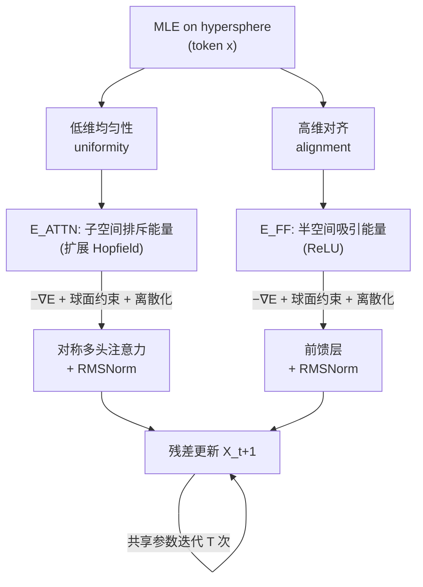

# Hyper-SET: Designing Transformers via Hyperspherical Energy Minimization

**会议**: ICLR 2026  
**arXiv**: 待确认（OpenReview: [FinhjyDgYA](https://openreview.net/forum?id=FinhjyDgYA)）  
**代码**: [github.com/huyunzhe/hyper-set](https://github.com/huyunzhe/hyper-set)  
**领域**: 可解释性 / 白盒 Transformer 设计  
**关键词**: 能量模型, Hopfield 能量, 超球面, 递归深度 Transformer, 白盒架构, 表征坍缩  

## 一句话总结
把 Transformer 层重新理解为「超球面上 token 的最大似然估计」，并将其拆成**低维子空间的分布均匀性**与**高维空间的语义对齐**两个互补目标，用两个扩展 Hopfield 能量函数量化后做迭代能量最小化——对称注意力、前馈层、RMSNorm、残差连接全都自然"长出来"，得到一个参数共享、可解释、性能逼近原版 Transformer 的递归深度模型 HYPER-SET。

## 研究背景与动机

**领域现状**：Transformer 已成为 CV/NLP/机器人/科学发现的基础架构，但它的核心组件——单个 Transformer 层——基本是自底向上、靠工程经验堆出来的启发式设计。大量实证研究观察到 LLM 深层高度冗余、中间层表征趋同、某些层可随意置换，暗示"一层到底在干什么"其实有某种收敛的功能，但我们对它的理解仍然有限。

**现有痛点**：已有的可解释性工作（机制可解释性、因果中介分析、可视化）大多是**事后解释**和现象学描述，不能反过来指导设计。能量视角里最接近的 Energy Transformer 把注意力层类比成对 Hopfield 能量的迭代下降，但它停留在"和联想记忆的机制类比"，没有把公式根植到具体的表征挑战上，也无法构造性地推导出新组件。

**核心矛盾**：能不能找到一个**自顶向下的设计先验**，让模型"天生可解释"（interpretable by construction）——既能重新解释现有组件，又能构造性地推导出新架构？这要求设计目标足够基础、足够通用，而不是绑死在某个任务先验上。

**本文目标**：从一个尽可能基础的原理（最大似然估计）出发，导出 Transformer 的全部核心组件，并保留可推广性。

**核心 idea（白盒能量设计）**：把前向动力学形式化为超球面上 token 的联合 MLE，拆出两个互补属性——高维空间的**语义对齐（mode seeking）**与低维子空间的**分布均匀性（mass covering）**；用两个 Hopfield 风格能量函数分别量化，再做带球面约束的迭代能量最小化，让架构组件从优化过程中"涌现"出来。

## 方法详解

### 整体框架

HYPER-SET 把一个 Transformer 层看成对偶能量 $E = E_{\text{ATTN}} + E_{\text{FF}}$ 在超球面约束下的一步交替最小化：**排斥性能量** $E_{\text{ATTN}}$ 推动 token 在多个低维子空间上散开（防坍缩）→ 导出对称注意力；**吸引性能量** $E_{\text{FF}}$ 把 token 拉向高维空间里编码语义的基方向（压冗余）→ 导出前馈层；两个能量的球面约束 $\|W_h^\top x\|=\sqrt{p}$、$\|D^\top x\|=\sqrt{M}$ 则恰好对应 RMSNorm，离散化能量梯度流时的步长成了残差连接里的可学习系数。整个模型只有一层可训练参数，靠反复迭代（recurrent-depth）达到任意"等效深度"。

### 关键设计

**1. 超球面 MLE 原理：把"好表征"拆成对齐与均匀两个能量**。本文的出发点是一个关于表征的猜想——有效表征应同时满足高维空间的语义对齐和低维子空间的分布均匀，二者分别对应 mode seeking（保信息）与 mass covering（防熵坍缩）。形式上写成单个目标 $\min_x \sum_h D_{KL}\big(p(z)\|p_\phi(z_h|x)\big) - \log p_\theta(x)$：第一项让子空间投影 $z_h$ 逼近超球面上的均匀先验，最大化熵、抑制坍缩；第二项用 von Mises–Fisher 分布建模 token 与若干语义均值方向的对齐。它与对比学习里"对齐+均匀"的统一目标神似，但本文走的是能量路线——把这两个属性各自量化成 token $x$ 的可优化函数，从而能反过来诱导出架构。

**2. 排斥性子空间能量 → 对称注意力**。token 被 $H$ 个基矩阵 $W_h$ 投到 $p$ 维子空间得到 $z_i^h=W_h^\top x_i$。原始 Hopfield 能量倾向于把动态 token 对齐到静态 pattern，但自注意力里是所有动态 token 互相作用，硬对齐会把表征塌成退化簇（即 oversmoothing / rank collapse）。为此作者把 Hopfield 能量改造成 token 之间的**排斥力**：$E_{\text{ATTN}}^h = \beta^{-1}\sum_i \log\sum_j \exp\big(\beta (z_i^h)^\top z_j^h\big)$，在约束 $\|W_h^\top x_i\|_2=\sqrt{p}$ 下对全部子空间求和。对它做梯度流 $\dot X = -\nabla_X E_{\text{ATTN}}$ 并离散化，自然得到一个**双重对称（行/列 softmax 同时出现）**的多头注意力算子，更新式里 $\beta=1/\sqrt{p}$ 恰好就是原版 Transformer 的缩放因子；而球面约束 $\|W_h^\top x\|=\sqrt{p}$ 落实下来就是对投影做 RMSNorm。这种行列对称结构还和用双随机注意力做 Wasserstein 梯度流的工作对上了。

**3. 吸引性半空间能量 → 前馈层**。在高维原始空间里，本文要"富化"表征：从信息瓶颈视角，好表征应压缩无用冗余、保留显著信息，于是鼓励 token 对齐到一组编码数据知识的方向 $D=[d_1,\dots,d_M]$（受"前馈层是 Transformer 的知识存储"这一实证发现启发，把基 $D$ 解释成语义方向）。吸引能量取 $E_{\text{FF}} = -\frac{1}{2}\sum_i\sum_m \big(\text{ReLU}(d_m^\top x_i)\big)^2$，在 $\|D^\top x_i\|_2=\sqrt{M}$ 下优化。它只把 token 拉向与之成锐角（被 ReLU 过滤）的那些基方向——几何上每个 token 被一组"吸引半空间"的并集牵引，意味着能组合式地绑定超出基数量 $M$ 的 pattern。对它做梯度流 $\dot X = D\,\text{ReLU}(D^\top X)$ 并加球面约束离散化，得到的前馈更新 $X_{t+1}=X_t+\gamma_t D\,\text{ReLU}(\text{RMSNorm}(D^\top X_t))$ 在权重空间上是对称的——同一组基 $D$ 既做"上投影"又做"下投影"。

**4. 自适应步长 + 递归深度 + 可推广变体**。把注意力步长 $\alpha_t$ 和前馈步长 $\gamma_t$ 用一个以迭代序号 $t$ 和初始 token $x^{(0)}$ 为条件的小网络学出来（通道级作用、零初始化便于大迭代收敛），既保证能量持续下降，又让模型能在测试时外推到训练之外的迭代数。最终整个模型只有**一层可学习参数**，靠迭代叠出深度，参数量随等效深度增加而几乎不涨。更重要的是，框架的通用性允许换能量函数生成新组件：把注意力能量换成核函数式 → 线性注意力；推广前馈能量 → 门控前馈；再叠一层 depth-wise LoRA，可在每次迭代给共享权重加轻量低秩调制，进一步提升可扩展性。

## 实验关键数据

### 主实验

**Sudoku（结构化推理）**：单层递归模型，9k 训练 / 1k 测试。HYPER-SET 同分布准确率 54.70% vs Transformer 49.30%；而 Energy Transformer 和白盒模型 CRATE 在该任务上**直接失败**（训练曲线扁平、几乎零准确率）。测试时把迭代数加到训练的 2×，HYPER-SET 外推更稳、增益更大（24→48 迭代：56.2%→57.2%）。

**图像分类（单层递归深度，ImageNet-1K 计参数）**：

| 模型 | 宽度 d | 参数(M) | CIFAR-10 | CIFAR-100 | IN-100 | IN-1K |
|------|------|------|------|------|------|------|
| Transformer | 384 | 2.38 | 89.90 | 61.89 | 69.44 | **66.94** |
| CRATE | 768 | 3.00 | 84.81 | 58.22 | 68.52 | 57.00 |
| Energy Transformer | 512 | 2.39 | 76.39 | 50.60 | 36.68 | 34.24 |
| **HYPER-SET** | 512 | 2.39 | **90.11** | 63.41 | **70.16** | 62.76 |
| **HYPER-SET** | 640 | 3.40 | 89.96 | **64.60** | 69.31 | 66.21 |

在参数对齐设置下，HYPER-SET 在 CIFAR-10/100、IN-100 上超过所有对手，但在大规模 IN-1K 上落后原版 Transformer；加宽 d 可缩小差距，说明其结构归纳偏置在**资源受限**场景更占优。

**掩码图像建模（ImageNet-100, 单层）**：同迭代数下 HYPER-SET 参数减半（3.94M vs 8.85M）但各指标略逊；把迭代加到 24、前馈宽度 $M$ 加到 $8d$ 后（8.07M），PSNR/SSIM 追平 Transformer（PSNR 15.955 vs 15.953）。

### 消融实验

**组件替换（CIFAR）**：默认 Bi-Softmax 注意力 90.11/63.41，换 Sigmoid 注意力降到 85.93/59.72、线性注意力 84.88/56.97；默认 ReLU 前馈最好，Softmax 前馈次之，门控前馈最差。学习步长（90.11）显著优于固定步长（$\alpha=\gamma=0.5$ 仅 25.81）。

**Depth-wise LoRA（IN-100）**：基础 70.16%，加 LoRA 后秩越大越好，$r=32$ 时升到 72.20%（参数仅从 1.93M 增到 2.72M）。

### 关键发现
- **能量真的在降**：即便不给步长加正号约束，注意力能量与前馈能量在 Sudoku/CIFAR 上仍单调下降，且总能量下降与性能提升同步——架构确实对齐了优化目标。
- **均匀性可验证**：子空间有效秩随迭代稳步上升、全秩不变，token 间平均夹角趋向正交，印证了"防熵坍缩"的设计意图。

## 亮点与洞察
- **真·构造性白盒**：不是事后解释，而是从 MLE 一路推导出对称注意力 + 前馈 + RMSNorm + 残差，每个组件都有能量含义，且能换能量换出线性注意力 / 门控前馈等新变体。
- **"对齐 vs 均匀"的能量化**：把对比学习里的 alignment-uniformity 直觉搬到 token 动力学上，并落成两个可优化的 Hopfield 能量，视角统一漂亮。
- **参数极致复用**：一层参数 + 递归深度，参数效率随堆叠层数增加越发明显，特别适合资源受限场景。
- **诚实的对照**：直接展示 Energy Transformer、CRATE 在 Sudoku 上彻底失败，反衬"更基础的目标假设带来更好优化对齐"。

## 局限与展望
- **大规模落后**：IN-1K 上仍输原版 Transformer，结构归纳偏置反而限制了在大数据上的 scaling，需要靠加宽/加迭代追平。
- **代价转移**：掩码建模追平 Transformer 是靠把迭代和前馈宽度翻倍换来的，省了参数却费了计算。
- **递归深度的老问题**：参数共享虽省参数，但迭代次数多时推理计算量上升；step-size 学习对收敛较敏感（固定步长会崩）。
- **理论假设**：均匀+对齐的双目标是猜想性先验，对语言等更复杂模态是否成立、能否 scale 到基础模型规模，仍待验证。

## 相关工作与启发
- **Energy Transformer**（Hoover 2024）：用 Hopfield 能量解释注意力，但停在机制类比；本文把能量根植到具体表征挑战并构造性地推导组件。
- **CRATE / 稀疏率约简**（Yu 2023）：同样走白盒路线、用率约简推导 Transformer，本文借鉴其交替最小化思路但换成超球面能量、覆盖更多组件。
- **递归/循环 Transformer**（Universal/Looped/Relaxed Recursive, Bae 2025 等）：共享跨层权重、支持迭代推理，本文的 depth-wise LoRA 正是从中借力。
- **对比学习的 alignment-uniformity**（Wang & Isola 2020）：思想源头，本文用能量重新诠释。
- 启发：可解释架构设计可以从"先写下你想要的表征性质 → 量化成能量 → 让组件涌现"这条路走，给"为什么注意力长这样"提供了一个可证伪的答案。

## 评分
- **新颖性**: ⭐⭐⭐⭐⭐ 从 MLE 自顶向下构造性导出整个 Transformer 层（含对称注意力/前馈/RMSNorm/残差），并能换能量生成新组件，是少见的"白盒到底"工作。
- **实验充分度**: ⭐⭐⭐⭐ 覆盖推理(Sudoku)、分类(4 数据集)、掩码建模三类任务，消融与能量/秩/角度的可视化扎实；但 IN-1K 落后、缺语言模态大规模验证。
- **写作质量**: ⭐⭐⭐⭐ 推导清晰、图示直观（token 在超球面演化、能量轨迹），动机与结论自洽；公式较密，对非能量背景读者门槛偏高。
- **价值**: ⭐⭐⭐⭐ 为"可解释且高效的 Transformer 设计"提供了原理性范式，资源受限场景与架构搜索方向有实用潜力。

<!-- RELATED:START -->

## 相关论文

- [\[ICLR 2026\] Spilled Energy in Large Language Models](spilled_energy_in_large_language_models.md)
- [\[ICLR 2026\] DIVERSE: Disagreement-Inducing Vector Evolution for Rashomon Set Exploration](diverse_disagreement-inducing_vector_evolution_for_rashomon_set_exploration.md)
- [\[ICLR 2026\] SEED-SET: Scalable Evolving Experimental Design for System-level Ethical Testing](seed-set_scalable_evolving_experimental_design_for_system-level_ethical_testing.md)
- [\[ICLR 2026\] How Do Transformers Learn to Associate Tokens: Gradient Leading Terms Bring Mechanistic Understanding](how_do_transformers_learn_to_associate_tokens_gradient_leading_terms_bring_mecha.md)
- [\[ICLR 2026\] Emergent Discrete Controller Modules for Symbolic Planning in Transformers](emergent_discrete_controller_modules_for_symbolic_planning_in_transformers.md)

<!-- RELATED:END -->
