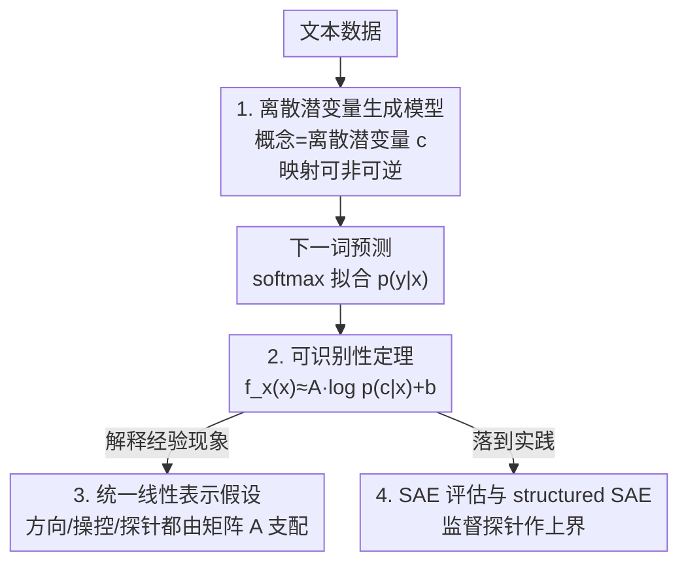

# I Predict Therefore I Am: Is Next Token Prediction Enough to Learn Human-Interpretable Concepts from Data?

**会议**: ICLR 2026  
**OpenReview**: [https://openreview.net/forum?id=vVYD74U5KE](https://openreview.net/forum?id=vVYD74U5KE)  
**论文**: [Project Page](https://sites.google.com/view/yuhangliu/projects/ntp)  
**领域**: 可解释性 / 表示学习理论  
**关键词**: 下一词预测, 可识别性, 线性表示假设, 潜变量模型, 稀疏自编码器

## 一句话总结
本文构建了一个把"人类可理解概念"形式化为离散潜变量的文本生成模型，并严格证明：仅靠下一词预测训练出来的 LLM 表示，在温和条件下近似等于这些潜在概念后验对数 $\log p(c\mid x)$ 的一个线性变换，从而为线性表示假设、steering vector、线性探针乃至稀疏自编码器（SAE）评估给出了统一的理论根基。

## 研究背景与动机

**领域现状**：大量经验研究发现，LLM 的内部表示（激活）里编码了人类可理解的概念——情感、写作风格、真假、语言种类等，而且往往以"线性"的形式出现：概念可以表示成表示空间里的一个方向（如 Rep("man")−Rep("woman") ≈ Rep("king")−Rep("queen")），可以用 steering vector 单独操控，也可以用线性探针读出。这被统称为"线性表示假设"。

**现有痛点**：这些线性现象几乎全是经验观察，缺乏一个能解释"它们为什么会出现"的原理性框架。已有的潜变量建模尝试又各有局限：Park et al. (2023) 只能处理二元概念；Park et al. (2024) 推广到类别概念但只关注概念间的层级结构，难以覆盖文本中其他可能的依赖；Rajendran et al. (2024) 干脆把概念和文本都建成连续变量，这与语言本质上的离散性相悖，而且为了做可识别性分析往往还要求潜变量到观测的映射可逆。

**核心矛盾**：真实文本的生成映射既是**离散**的，又通常**不可逆**（多对一：不同情感组合可能产生同一句话；说话人意图、语气等潜在概念可能根本没显式出现在表层文本里）。既往工作为了证明可识别性，要么假设连续、要么假设可逆，恰恰回避了这两个最贴近语言的特征。

**本文目标**：在不假设映射可逆、把所有变量都建成离散、不对潜变量图结构做限制的前提下，回答一个根本问题——仅靠下一词预测这一种训练目标，LLM 究竟能不能、以及以什么形式"学到"这些潜在概念？

**切入角度**：作者把问题放进"可识别性分析"的框架里。下一词预测本质上是在用 softmax 拟合真实条件分布 $p(y\mid x)$，而这个真实分布又可以用贝叶斯规则从潜变量生成模型反推出来。把"模型学到的 $p(y\mid x)$"和"生成模型导出的 $p(y\mid x)$"两边对齐，就能在 LLM 表示 $f_x(x)$ 和潜变量后验之间建立桥梁。

**核心 idea**：用一个允许非可逆映射的离散潜变量生成模型，证明 $f_x(x)$ 近似是潜变量后验对数 $\log p(c\mid x)$ 的线性变换，并以此统一解释所有线性表示现象、顺带导出一套有理论依据的 SAE 评估方法。

## 方法详解

### 整体框架

全文是一条"从假设到定理、再从定理到洞察与应用"的理论链条，而不是一个可训练的算法管线。它分四步推进：**(1)** 先立一个生成模型——把人类概念当作离散潜变量 $c$，由它同时生成上下文 $x$ 和下一词 $y$；**(2)** 在下一词预测框架里做可识别性分析，证明核心定理：$f_x(x)$ 等于 $\log p(c\mid x)$ 的线性变换加常数加一个随不可逆误差趋零而消失的余项；**(3)** 把这个"线性性质"反过来解释 concepts-as-directions、steering vector、linear probing 三类经验现象，说明它们都由同一个线性矩阵 $A$ 支配；**(4)** 把定理落到实践，导出一种用监督探针作上界来评估 SAE 是否真正学到单义概念的方法，并提出加结构正则的 structured SAE。

### 关键设计

**1. 离散且可非可逆的潜变量生成模型：贴近语言本质的建模假设**

本文针对的痛点是既往潜变量模型为了好分析而假设连续或可逆，丢掉了文本最重要的两个特征。作者提出的生成模型写成 $p(x,y)=\sum_c p(x\mid c)\,p(y\mid c)\,p(c)$，其中 $c=[c_1,\dots,c_m]$ 是一组离散潜变量（每个 $c_k$ 取自有限集 $V_k$），$x$ 是上下文、$y$ 是下一词，二者由同一映射 $g$ 从 $c$ 生成。两个刻意的设计：其一，**全离散**——潜变量代表"体育/政治/科技"这类范畴性区分，观测就是离散 token，这与人类分类信息的方式一致；其二，**不要求 $g$ 可逆**，并且不对潜变量之间的因果图做任何限制（允许任意 DAG）。为了在非可逆下还能谈"近似可识别"，作者用一个误差项 $\epsilon$ 量化"近似可逆程度"：$1-p(c=c^*\mid x,y)=\epsilon$，其中 $c^*$ 是后验的主导众数。$\epsilon$ 越小说明给定 $(x,y)$ 后潜变量越确定、映射越接近可逆。这个放松的条件意味着只能得到近似（而非精确）可识别性，但正因为放松，模型才能逼近真实文本。

**2. 可识别性定理：把 LLM 表示钉死为后验对数的线性变换**

这是全文的理论核心。下一词预测用 softmax 拟合 $p(y\mid x)=\dfrac{\exp(f_x(x)^\top f_y(y))}{\sum_{y_j}\exp(f_x(x)^\top f_y(y_j))}$，其中 $f_x$ 把上下文映到表示空间、$f_y$ 是末层权重（look-up table）。而真实的 $p(y\mid x)$ 又能由生成模型经贝叶斯规则写成 $\sum_c p(y\mid c)\,p(c\mid x)$。把两种表达对齐、取对数，就在 $f_x$ 与 $c$ 之间建立了初步联系。作者再引入三个温和的正则条件——**Diversity 条件**（存在足够多样的 $y$ 使差分向量 $f_y(y_j)-f_y(y_0)$ 张成的矩阵 $\hat L$ 可逆，这在随机初始化下几乎必然成立）、**TV 条件**（后验 $p(c\mid y)$ 随单个 token 变化缓慢，对应"一个 token 通常只由少数概念生成、一个概念却可对应许多 token"的多对一结构）、**Coverage 条件**（条件后验的对数差被常数 $\delta$ 界住、不塌缩）——最终得到定理 3.1：

$$f_x(x) = A\,[\log p(c=c_i\mid x)]_i + b - (\hat L^\top)^{-1}h_y,$$

其中 $A=(\hat L^\top)^{-1}L$ 由数据多样性条件决定。关键结论是：当 $\epsilon=0$ 时余项消失，$f_x(x)=A[\log p(c\mid x)]_i+b$ 精确成立；当 $\epsilon\to0,\delta\to0$ 时近似成立。也就是说，**LLM 表示本质上就是潜在概念后验对数的一个线性读出**——这直接给出了下一词预测"为什么能抓到生成因子"的理论解释。

**3. 用矩阵 $A$ 统一三类线性现象：让经验观察落到同一个根上**

定理把表示写成线性形式后，作者顺势证明所有线性表示现象都由这同一个 $A$ 支配，从而"统一"了散落的经验观察。Corollary 4.2 说明：对只在第 $k$ 个概念上不同的一对 $(x_0,x_1)$，表示差 $f_x(x_1)-f_x(x_0)\approx \tilde A_k\big(\log p(c_k\mid x_1)-\log p(c_k\mid x_0)\big)$，其中 $\tilde A_k=AB_k$（$B_k$ 是把单概念后验广播到全配置的二值提升矩阵）。这一式子同时解释了**概念即方向**（"man−woman"与"king−queen"之所以近似，是因为两对都只在性别概念上变化、被同一个 $\tilde A_k$ 表达式驱动）和**概念可操控性**（加 steering vector 等价于修改感兴趣概念的后验分布，进而改变输出）。Corollary 4.3 进一步证明这类表示沿 $c_k$ 的变化**线性可分**，存在线性分类器权重 $W$ 满足 $W\tilde A_k\approx I$，其 logit 恰是 $[p(c_k\mid x)]$——这就解释了**线性探针**为何有效。三类现象至此被收束到"同一个 $A$、$W\tilde A_k\approx I$"这一组关系上，给线性表示假设提供了统一视角。

**4. SAE 评估与 structured SAE：把定理变成可落地的工具**

SAE 想用稀疏线性组合 $\beta z$ 重构表示，并让每个特征 $z_i$ 对应一个单义概念；但难点在于缺少概念的 ground truth，无法直接评估解耦得好不好。本文借定理给出突破口：既然 $f_x(x)\approx A[\log p(c\mid x)]_i$ 而 SAE 又有 $\beta z\approx f_x(x)$，那么 $\beta z\approx A[\log p(c\mid x)]_i$，即 SAE 特征 $z$ 应与后验对数线性相关。于是若某维 $z_i$ 真学到单一概念 $c_k$，它就应只依赖 $\log p(c_k\mid x)$。怎么拿到 $p(c_k\mid x)$？依据 Corollary 4.3，用只在第 $k$ 个二值概念上不同的成对数据 $(x_0,x_1)$ 监督训练一个线性分类器，其 logit 即对 $p(c_k=1\mid x)$ 的估计——**监督探针因此成了评估 SAE 的可计算上界**。在此评估下作者发现单纯稀疏正则不足以充分解耦概念（因为潜变量本身存在强相互依赖），遂提出 structured SAE，在稀疏之外加低秩正则，把特征拆成 $z=S+R$ 并最小化

$$\mathcal L = \mathbb E_{x}\big[\|f_x(x)-\bar f_x(x)\|_2^2 + \lambda_t\|S\|_{p_t}^{p_t} + \gamma\|R\|_{\text{nuc}}\big],$$

其中 $\|S\|_{p_t}^{p_t}$ 是促稀疏的自适应 $L_{p_t}$ 范数（沿用 p-annealing 策略），$\|R\|_{\text{nuc}}$ 是核范数、用来对 $R$ 施加低秩结构以建模概念间关系。

## 实验关键数据

实验目标是间接验证定理（理论无法直接拿到真实潜变量），分仿真、真实 LLM、SAE 三块。

### 主实验

| 实验 | 设置 | 验证对象 | 关键观察 |
|------|------|----------|----------|
| 仿真：观测变量规模 | 固定潜变量数，逐步增大观测变量 $x$（提升 $c\to x$ 的可逆程度） | 定理 3.1 | 线性分类准确率随 $x$ 增大而提升，与"$\epsilon$ 越小近似越紧"一致 |
| 仿真：潜变量图结构 | 随机 ER1/ER2/ER3 图，变化潜变量规模 | 定理 3.1 普适性 | 不同图结构与规模下分类准确率均保持，结论稳健 |
| 真实 LLM：$A_sW_s$ | 取自 Park et al. (2023) 的 27 对反事实对，构造 $A_s$（概念方向）与 $W_s$（探针权重） | Corollary 4.3 | 归一化后乘积 $A_sW_s$ 近似单位阵 $I$（对角≈1、非对角更小），在 LLaMA-2 与 Pythia 上成立 |

仿真数据由随机 DAG（伯努利条件概率，参数取自 [0.2, 0.8]）生成，经独热+随机置换矩阵的非线性混合得到二值观测，再随机 mask 一部分来模拟下一词预测。真实 LLM 实验覆盖 Pythia、LLaMA-2/3、DeepSeek-R1 模型族，结果一致。

### SAE 对比实验

| SAE 变体 | Pearson 相关（越高越好） | 重构 MSE（越低越好） |
|----------|--------------------------|----------------------|
| top-k SAE | 较低 | 较高 |
| batch-top-k SAE | 中 | 中 |
| p-annealing SAE | 中 | 中 |
| **structured SAE（本文）** | **最高** | **最低** |

在 Pythia-70m / 1.4b / 2.8b 上、用 The Pile 训练四种 SAE，再用 27 对反事实对训练线性分类器得到 $p(c_k\mid x)$，按 $\exp(z_i)$ 与 $p(c_k\mid x)$ 的 Pearson 相关为每个概念挑最匹配特征。⚠️ 表中各 SAE 的具体数值原文以图（Figure 4）呈现，此处为趋势归纳，精确值以原文为准。

### 关键发现
- **可逆程度决定近似紧度**：增大观测维度（提升可逆性）会让线性可分性变好，直接对应定理里"$\epsilon\to0$ 近似才精确"的论断，是对理论最直接的经验支撑。
- **$A_sW_s\approx I$ 是新验证点**：Corollary 4.2 对应的"概念即方向"前人已验证过，本文特意去验前人没碰过的 $W\tilde A_k\approx I$（即 4.3），乘积趋近单位阵说明探针方向与概念方向确实对齐。
- **稀疏不够、需要结构**：四种 SAE 的 Pearson 相关全部低于 0.8（1.0 为完美恢复），说明即便在这个高精度小基准上概念解耦仍未饱和；structured SAE 在评估指标和重构 MSE 上都最好，印证了"潜变量强相互依赖、需要低秩等结构正则"的判断。
- **评估框架本身有效**：所提评估能灵敏区分四种 SAE，且趋势与传统重构指标一致，说明它是可靠的解耦度量代理。

## 亮点与洞察
- **把"为什么有效"讲成定理**：最让人"啊哈"的是它没有停在"LLM 表示是线性的"这个经验观察，而是反推出 $f_x(x)\approx A\log p(c\mid x)+b$——表示不是任意线性，而恰好是后验对数的线性读出，这给整片经验文献安了一个共同地基。
- **非可逆 + 离散的建模选择很务实**：用误差项 $\epsilon$ 量化近似可逆，既保留了语言"多对一、概念隐含"的真实结构，又让可识别性分析仍可进行，是"放松假设换贴近现实"的范例。
- **从定理直接长出可用工具**：用监督线性探针当 SAE 评估的上界，是一个可迁移的思路——凡是"想评估无监督解耦但没有 ground truth"的场景，都可以借一个有理论保证的监督代理来卡上界。
- **structured SAE 的低秩直觉**：把"概念彼此依赖"翻译成对特征的低秩约束 $\|R\|_{\text{nuc}}$，是从理论假设（潜变量有依赖）到正则项的一次干净落地。

## 局限与展望
- **依赖一组强假设**：定理建立在 Diversity / TV / Coverage 三个条件之上，且核心结论是"近似"——只有当 $\epsilon,\delta\to0$ 时才精确成立，真实 LLM 离这个理想还有多远难以量化。
- **验证是间接的**：无法直接采集真实数据的全部潜变量，只能靠推论间接验证；真实 LLM 实验依赖仅 27 对人工构造的反事实对，规模小、且构造反事实句子本身极难，难以覆盖复杂语义。
- **SAE 上限仍低**：所有 SAE 的 Pearson 相关都低于 0.8，既说明基准有区分度，也说明现有 SAE（含 structured 版）离真正单义解耦还差得远。
- **改进方向**：作者建议未来研究"线性解混"——直接从潜在后验里抽取单个高层概念的概率；扩大高质量反事实对的数量、把理论推广到更弱的条件，也都是自然的下一步。

## 相关工作与启发
- **vs Park et al. (2023/2024)**：他们用潜变量模型解释线性表示，但分别局限于二元概念、概念层级结构；本文不限图结构、覆盖任意离散概念，并把方向/操控/探针统一到同一个矩阵 $A$。
- **vs Rajendran et al. (2024)**：他们把概念与文本都建成连续变量、且常需可逆映射；本文坚持全离散、允许非可逆，更贴合语言的离散与多对一本质。
- **vs 传统 SAE 评估**：常规做法主要看重构 loss，无法衡量"特征是否单义"；本文用有理论依据的监督探针上界来评估解耦，并据此提出加低秩正则的 structured SAE。

## 评分
- 新颖性: ⭐⭐⭐⭐⭐ 首次在非可逆+离散假设下给出 LLM 表示≈后验对数线性变换的可识别性定理，并统一线性表示假设。
- 实验充分度: ⭐⭐⭐⭐ 仿真+多模型族+SAE 三层验证齐全，但真实验证间接、反事实对仅 27 对、规模偏小。
- 写作质量: ⭐⭐⭐⭐ 理论链条清晰、条件交代充分，但定理与推论符号密集，对读者门槛较高。
- 价值: ⭐⭐⭐⭐⭐ 为大量线性表示经验现象提供统一理论根基，并给出可落地的 SAE 评估范式，对可解释性研究有方法论意义。

<!-- RELATED:START -->

## 相关论文

- [\[ICLR 2026\] How Stable is the Next Token? A Geometric View of LLM Prediction Stability](how_stable_is_the_next_token_a_geometric_view_of_llm_prediction_stability.md)
- [\[ICLR 2026\] Sparse Autoencoders Trained on the Same Data Learn Different Features](sparse_autoencoders_trained_on_the_same_data_learn_different_features.md)
- [\[ICLR 2026\] SAE as a Crystal Ball: Interpretable Features Predict Cross-domain Transferability of LLMs without Training](sae_as_a_crystal_ball_interpretable_features_predict_cross-domain_transferabilit.md)
- [\[ICLR 2026\] Concepts' Information Bottleneck Models](concepts_information_bottleneck_models.md)
- [\[ICLR 2026\] Concept-TRAK: Understanding how diffusion models learn concepts through concept attribution](concept-trak_understanding_how_diffusion_models_learn_concepts_through_concept_a.md)

<!-- RELATED:END -->
