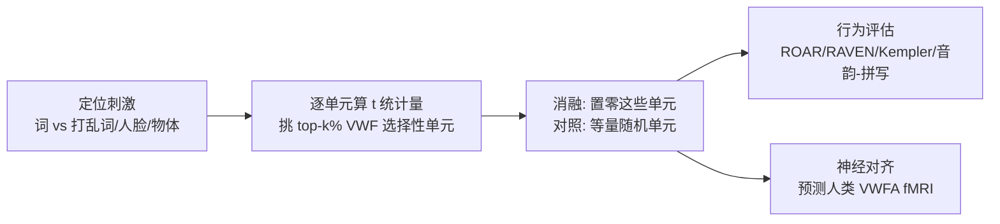

# Inducing Dyslexia in Vision Language Models

**会议**: ICLR 2026  
**OpenReview**: [https://openreview.net/forum?id=AQhpxQ1xfa](https://openreview.net/forum?id=AQhpxQ1xfa)  
**代码**: 待确认（论文称 Code available via GitHub）  
**领域**: 可解释性 / 计算神经科学（VLM 功能定位与消融）  
**关键词**: 视觉词形区(VWFA), 功能定位, 单元消融, 失读症建模, Qwen2-VL, 脑疾病计算建模  

## 一句话总结
通过在视觉-语言模型中"功能定位"出对视觉词形选择性的单元并将其消融，作者在不损伤一般视觉与推理能力的前提下，复现了人类失读症的核心特征（选择性阅读缺陷 + 偏音韵的缺损），并证明这些单元能预测人类 VWFA 的真实 fMRI 响应。

## 研究背景与动机
- **领域现状**：失读症（dyslexia）是一种持续性阅读障碍，影响约 5–20% 人群，长期被认为与左腹侧枕颞皮层的**视觉词形区（VWFA）活动减弱（hypoactivation）**相关。传统行为学与神经影像方法能观测相关性，却**很难做因果操纵实验**——你无法在真人大脑里"精确关掉"某个区域看后果。
- **现有痛点**：已有的脑疾病计算模型多为基于连接组（connectome）的粗粒度动力学模型，无法刻画词形识别这种精细的神经机制；少量针对失读症的计算工作只触及视觉信息处理或笔迹异常，**没有任何工作用系统级神经网络模型来模拟脑疾病**。
- **核心矛盾**：VWFA 的异常到底是阅读障碍的"因"还是"果"在学界仍有争议，而真人实验做不到可控的因果消融。
- **本文目标**：建立一个可控、可操纵、可扩展的"in-silico 失读症"框架——成功的模拟应当**只损伤阅读、保留一般智力与推理**。
- **核心 idea**：**【神经科学启发的功能定位 + 因果消融】** 把研究健康大脑的"功能定位器（functional localizer）"范式搬到 VLM 上，先用词/非词对比刺激找出模型里的"视觉词形选择性单元"，再把它们置零（人造损伤），观察是否出现失读症式的选择性缺陷。

## 方法详解

### 整体框架
方法是一条"**定位 → 消融 → 行为/神经评估**"的三步因果链。先用经典 fMRI 定位刺激（词、打乱词、人脸、物体）在模型每个单元上算 t 统计量，挑出最偏好"词"的 top-k% 单元作为 VWF 选择性单元；再把这些单元在语言解码器中置零（并以等量随机单元作对照）；最后用一套为人类设计的临床测评（ROAR 阅读、RAVEN 视觉 IQ、Kempler 句子理解、音韵/拼写词汇判断）评估损伤是否"只针对阅读"，并对照人类 VWFA 的真实 fMRI 响应做对齐验证。

### 关键设计

**1. 功能定位 VWF 选择性单元：把 fMRI localizer 搬进模型。** 作者借用 Saygin 等人的经典定位范式，给模型呈现四类图像刺激——书写词、打乱的词、线条人脸、线条物体。对每个候选单元，计算"对词图像的响应"相对"对三类非词控制刺激响应"的 **t 统计量**：$t$ 越大说明该单元越稳定、越专一地偏好词形。把所有单元按 t 统计量降序排列，取前 $k\%$ 即定义为模型的 VWF 选择性单元。这一步的精神是：不预设哪些参数负责读字，而是用刺激对比"让模型自己暴露"出词形通路，正如神经科学家用对比刺激在皮层上圈出 VWFA。

**2. 最小子网络与失读症阈值：把"多严重才算失读"量化成可停的搜索。** 作者并不武断地砍掉固定比例，而是从 0% 掩码开始**逐步增大**被消融的 top-k% 单元比例，每一步都在 ROAR 训练子集上测准确率，一旦准确率跌破 **65% 的失读症阈值**（该阈值取自人群均值下 1 个标准差，并与 5–20% 患病率的流行病学区间吻合）就停止。满足条件的**最小**掩码比例即定义为致损子网络——在 Qwen2-VL-72B 上仅约 **6.89%** 的语言解码器 MLP 单元。这种"刚好越过临床阈值"的最小干预，确保观察到的缺陷不是大面积破坏的副产物。

**3. 层类型与扰动强度的因果甄别：证明"是哪些单元"而非"砍了多少"在起作用。** 作者系统比较了消融位置：视觉编码器自注意力、视觉 merger、语言解码器自注意力输出、以及语言解码器 MLP gate 投影层。只有**语言解码器 MLP 层**（80 个 transformer block 的 `model.layers.{i}.mlp.gate_proj`）的消融才产生"只伤 ROAR、不伤 RAVEN"的选择性效应，与 MLP 层承载知识特异性表征的已有发现一致。在扰动强度上，作者把单元激活按 $[-2, 4]$ 的缩放因子调节，发现只有**完全置零（缩放因子=0）**才稳定复现失读症式选择性损伤；正向缩放几乎无效，负向缩放则非选择性地把输出整体搞崩。两项控制共同说明：失读效应依赖于**被消融单元的身份**，而非数量或层级分布——这正是与"等量随机单元消融"对照实验互补的因果证据。

**4. 用人类临床测评做"读字 vs 不读字"的双分离。** 评估刻意复用为真人设计的标准化测试：ROAR（词/伪词的词汇判断，只取准确率不计反应时）测阅读；RAVEN（非语言推理）与 Kempler（句子-图像匹配，改造成 VQA）作为一般智力/理解的对照；Luke 等人的词汇判断基准进一步把阅读缺陷拆成**音韵敏感**（同音词 brake/break、伪同音词 beaf/beef）与**拼写敏感**（换位字母词 blots/bolts、换位非词 golve/glove）两类。这套设计让"选择性"可被严格证伪——若消融真模拟了失读症，应当只压低 ROAR/音韵项，而 RAVEN/拼写项不受显著影响。

## 实验关键数据

### 主实验：选择性阅读缺陷（消融 VWF 单元 vs 随机单元）

| 消融对象 | ROAR(阅读) | RAVEN(视觉IQ) | Kempler(句子理解) | 是否跌破失读阈值 |
|---|---|---|---|---|
| VWF 选择性单元 | **−32%**, $p\ll0.01$ | 不变, $p\approx0.75$ | 不降（双尾测显示 **+10%**, $p\ll0.01$） | **是** |
| 等量随机单元(同层) | −21%, $p<0.003$ | −21%, $p<0.004$ | −13%, $p<0.042$ | 否($p\approx0.87$) |

消融 VWF 单元只压垮阅读、保留甚至轻微提升推理/理解，与失读症"阅读差但智力正常"高度吻合；随机消融则全面普跌且不达临床阈值，说明缺陷取决于单元身份。

### 音韵 vs 拼写双分离（对照人类行为）

| 刺激类型 | 消融后模型 | 人类失读者 |
|---|---|---|
| 音韵敏感 | **−8%**, $p\ll0.01$ | −9%, $p\ll0.01$ |
| 拼写敏感 | 不显著, $p>0.059$ | −6%, $p\ll0.01$ |

模型复现了"以音韵缺陷为主"的主流失读症观点；人类同时有拼写损伤，作者归因于数据集未标注的共病异质性。

### 消融实验：超参数敏感性与跨模型/字体泛化
- **掩码大小**：ROAR 随消融比例单调骤降，RAVEN 仅在大掩码时才受影响；选取首个跌破阈值的比例（6.89%）。
- **跨模型**：在 Molmo-72B、PixTral-12B 上同样诱发出阅读特异性缺陷。
- **字体效应**：消融后的"失读模型"在 OpenDyslexic、Comic Sans、KG Primary Penmanship 等专为失读者设计的字体上**显著变好**（$p\ll0.001$），在 Papyrus 上变差——与"特定字体能帮助失读者"的经验现象一致；完好模型对字体不敏感。
- **神经对齐**：在小子集（0.25%–1.25%）下，VWF 选择性单元预测人类 VWFA fMRI 响应（noise-normalized）显著优于等量随机单元，说明这些单元编码了与大脑相关的结构。

### 关键发现
- 仅约 6.89% 的语言解码器 MLP 单元就构成"失读最小子网络"；只有完全置零才稳定致损。
- 缺陷依赖单元身份：同层等量随机消融或全网随机消融都得不到选择性阅读损伤（后者甚至直接让输出崩成乱码/空响应）。
- 消融模型的错误并非随机退化，而是呈现可解释的"读字崩溃"画像，可归为五类：

| 错误类型 | 现象 | 示例 |
|---|---|---|
| 空白(Blank) | 完全不输出 | accustomed(真词) → 无输出 |
| 误分类 | 把真词判为伪词或反之 | yammerring(真) → "看起来像伪词" |
| 上下文过度解读 | 硬给伪词编出词义/来源 | hus(伪) → "是 husk 的名词，一种玉米" |
| 模棱两可 | 拒绝下结论，称视语境而定 | dood(伪) → "可能是也可能不是真词" |
| 乱码/损坏 | 输出无意义碎片或重复 | imeyits(伪) → "image of the image of..." |

## 亮点与洞察
- **把脑科学的 localizer 范式工程化进 VLM**：首次用系统级神经网络模型"造出"一种脑疾病，提供了真人实验做不到的可控因果操纵平台。
- **三重一致性证据**：行为（选择性阅读缺陷 + 偏音韵）、神经（VWFA fMRI 对齐）、临床现象（字体效应）同时对上，远超单一相关性。
- **严谨的因果甄别**：随机单元对照 + 层类型对照 + 扰动强度扫描，逐一排除"数量/层级/整体破坏"的替代解释。
- **可证伪的"选择性"设计**：用为人类设计的成套测评，让"只伤阅读"这一主张可被严格检验。

## 局限与展望
- **机制 ≠ 病因**：消融模拟的是 VWFA 活动减弱这一"假设的神经表型"，刻意抽象掉了遗传等致病因素，因此回答的是"如果 VWFA 减弱会怎样"，而非失读症的根本成因。
- **拼写缺陷未复现**：人类失读者在拼写敏感项也有损伤，模型没有，作者归因于数据共病未标注——但也可能暴露模型与人脑机制的差异。
- **依赖超大模型与英文刺激**：主分析在 72B 级模型、英文词表上完成，跨语言（尤其深/浅正字法语言）与小模型的普适性待验证。
- **"完全置零才有效"略显脆弱**：参数化缩放几乎无中间地带，提示该效应可能对具体实现敏感，是否对应真实的渐进性 hypoactivation 仍需讨论。
- **展望**：把同一框架推广到其他脑疾病（如语言障碍、面孔失认），并探索"修复/干预"方向（如训练能否重建子网络）。

## 相关工作与启发
- **模型即大脑模型**：延续 Yamins、Schrimpf 等把 ANN 当作腹侧视觉流/语言皮层预测模型的传统，本文把它从"健康大脑"推进到"脑疾病"。
- **LLM 功能定位**：直接受 AlKhamissi 等人在 LLM 中定位"语言选择性单元"并消融的启发，本文将其扩展到视觉-语言模态以触达词形通路。
- **知识在 MLP 层**：MLP 层承载知识特异性表征（Meng、Zhang 等）的发现，为"为何 MLP 消融才选择性致损"提供了机制解释。
- **启发**：功能定位 + 因果消融是一条通用的"可解释性 × 神经科学"研究范式，可迁移到任何"特定能力是否由可定位子网络承载"的问题。

## 评分
- **新颖性**: ⭐⭐⭐⭐⭐ 首个用系统级 VLM 模拟脑疾病（失读症），把神经科学 localizer 范式与因果消融结合，方向开创性强。
- **实验充分度**: ⭐⭐⭐⭐ 行为/神经/字体三重证据 + 随机/层类型/扰动强度多重对照 + 跨三个模型验证，扎实；唯英文与超大模型为主，跨语言泛化欠缺。
- **写作质量**: ⭐⭐⭐⭐ 动机与逻辑链清晰，图表与临床测评对应明确；部分超参敏感性讨论可更深入。
- **价值**: ⭐⭐⭐⭐ 为计算精神病学/可解释性提供了可操纵的 in-silico 实验平台，对脑疾病机制研究与模型可解释性都有借鉴意义。

<!-- RELATED:START -->

## 相关论文

- [\[ICLR 2026\] Linear Mechanisms for Spatiotemporal Reasoning in Vision Language Models](linear_mechanisms_for_spatiotemporal_reasoning_in_vision_language_models.md)
- [\[ICLR 2026\] A Comprehensive Information-Decomposition Analysis of Large Vision-Language Models](a_comprehensive_information-decomposition_analysis_of_large_vision-language_mode.md)
- [\[ICLR 2026\] MICLIP: Learning to Interpret Representation in Vision Models](miclip_learning_to_interpret_representation_in_vision_models.md)
- [\[ICLR 2026\] Cross-Modal Redundancy and the Geometry of Vision-Language Embeddings](cross-modal_redundancy_and_the_geometry_of_vision-language_embeddings.md)
- [\[ICLR 2026\] DIVERSE: Disagreement-Inducing Vector Evolution for Rashomon Set Exploration](diverse_disagreement-inducing_vector_evolution_for_rashomon_set_exploration.md)

<!-- RELATED:END -->
