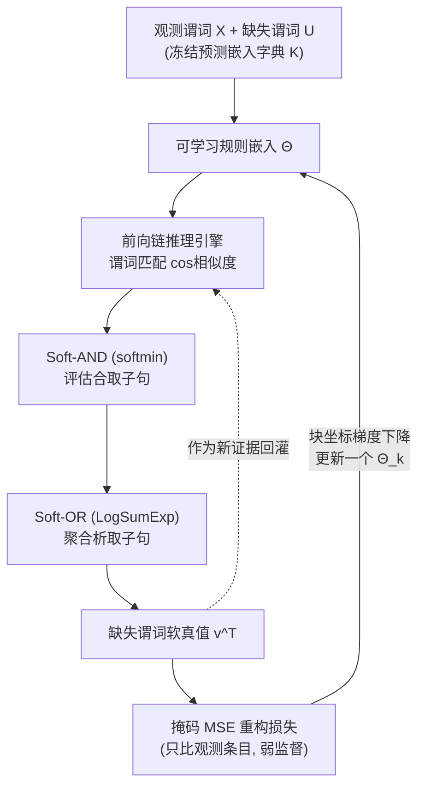

# Inferring the Invisible: Neuro-Symbolic Rule Discovery for Missing Value Imputation

**会议**: ICLR 2026  
**OpenReview**: [https://openreview.net/forum?id=26Msp6pV5i](https://openreview.net/forum?id=26Msp6pV5i)  
**代码**: [https://github.com/conniemessi/infer_missing](https://github.com/conniemessi/infer_missing)  
**领域**: 可解释性 / 神经符号推理（Neuro-Symbolic ILP）  
**关键词**: 缺失值填补, 神经符号推理, 逻辑规则归纳, 前向链推理, 块坐标下降, 可解释性  

## 一句话总结
把"缺失的表格条目"当成待推断的隐谓词，用一个可微的前向链推理引擎让**规则归纳**和**缺失值填补**互为证据、彼此强化，从而在补全数据的同时学出人类可读的逻辑规则。

## 研究背景与动机
**领域现状**：神经符号推理（neuro-symbolic）把神经表示学习的抗噪能力和符号逻辑的可解释性结合起来，归纳逻辑编程（ILP）是其中学规则的主流路线。但传统规则归纳方法（如 BRCG、RRL、DR-NET）几乎都假设数据"完整"，从完整观测里抽取规则。

**现有痛点**：现实数据普遍残缺——医疗诊断里关键指标常缺测。两条已有路线都不理想：(1) 概率模型如马尔可夫逻辑网络（MLN）能把未观测事实当隐谓词处理，但依赖**固定规则库 + 昂贵的联合推断**，难以扩展到大规模异构数据；(2) 主流缺失值填补方法（统计派 MICE/MissForest、深度派 GAIN/扩散/VAE）只靠统计相关性"猜"数值，**完全不显式建模变量间的逻辑关系**，填出来的值是黑箱、不可解释。

**核心矛盾**：规则学习需要完整数据，而填补缺失又需要规则——这是个"鸡生蛋"的死结。现有做法把填补当成独立的预处理步骤，填补的误差会直接传播进下游规则学习/分类，无法纠正。

**本文目标**：在一个**可微的单循环**里同时学规则和填值，让两者形成反馈回路；并且要能统一处理离散+连续混合的异构数据。

**核心 idea**：**(1) 隐谓词视角**——每个缺失表格条目被看作一个未观测的接地事实（grounded fact），是待推断的隐谓词实例；**(2) 反馈回路**——更好的规则带来更好的填补，更好的填补又为后续规则精炼提供更强证据；**(3) 软逻辑统一异构数据**——用 soft-min 近似 AND、soft-max 近似 OR，连续特征学成软谓词（sigmoid 阈值+斜率），无需预先离散化就能统一做前向链。

## 方法详解

### 整体框架
模型叫 **NS-FCN（Neuro-Symbolic Forward Chaining Network）**。把谓词分成两类：$X$ 是完全观测的谓词，$U$ 是至少有部分缺失的隐谓词。每个谓词先冻结一个固定嵌入作为"字典"；规则用**可学习的规则嵌入** $\Theta$ 表示。训练时，前向链引擎用当前规则集对缺失谓词推出软真值，再用观测条目上的掩码重构损失反向更新规则嵌入——这就是"推断→比对观测→更新规则"的循环。为了在表达力很强（多跳链 + 析取头）的规则空间里保持可解，学习用**分阶段块坐标下降**：一次只更新一个规则块、固定其余，析取头则先序贯覆盖找多条子句、再联合微调。

### 关键设计

**1. 隐谓词 + 前向链：把填补变成逻辑推断** 不同于传统潜变量模型，本文把"缺失的接地值"直接当成要靠逻辑推理推断的隐谓词。规则写成 OR-of-ANDs 形式 $Q_k \leftarrow (P_1 \wedge P_2) \vee (P_3 \wedge P_4) \vee \cdots$，只要任一子句满足就推出头谓词。给定观测事实集 $E$，前向链每当某子句被（近似）满足就生成头谓词并把新事实回灌进 $E$，复用推断出的事实当证据，从而支持多跳级联推理。状态更新只改未观测项：$v^{t+1} = M \circ v^t + (1-M) \circ g(v^t; \Theta)$，其中 $M$ 是观测掩码，未观测项初始化为 $0.5$。实际只跑 $T = 2\sim5$ 步而非迭代到不动点，以避免梯度饱和。这个设计是整篇的灵魂——**填补不再是预处理，而是规则推理的副产品，且推断值能反过来支撑规则归纳**。

**2. 软逻辑算子：让离散/连续异构数据在同一引擎里前向链** 推理引擎只在 $[0,1]$ 真值上运作。合取（AND）用 soft-min 近似：对子句里所有 $2h$ 个标量（$h$ 个谓词当前值 + $h$ 个匹配相似度 $s_j = \cos(K_j^*, \theta_j)$）做 $\text{softmin}(x;\tau) = -\frac{1}{\tau}\log(\frac{1}{2h}\sum_i \exp(-x_i/\tau))$，$\tau \to 0$ 时逼近 $\min$。析取（OR）用 LogSumExp 近似：$g_k = \frac{1}{\mu}\log\sum_r \exp(\mu\, v_{f_{k,r}})$，$\mu \to \infty$ 时逼近 $\max$。连续特征不再靠人工分箱，而是为每个特征 $c$、每个 bin 学一个阈值 $\epsilon_{c,r}$ 和斜率 $\beta_{c,r}$，定义软谓词 $P_{c,r}(v_c) = \sigma(\beta_{c,r}(v_c - \epsilon_{c,r}))$。这样医疗数据里的 `age > 60`、`chol > 250` 这类带数值阈值的临床规则能被端到端学出来，而 baseline 必须先把连续值离散化才能用。论文实测 $\tau=0.1$、$\mu=10$ 全程固定即可，对温度不敏感。

**3. 块坐标下降 + 序贯覆盖：在 NP-hard 规则空间里保持可解** 规则参数按头谓词切块，每个隐谓词 $U_k$ 对应一块 $\Theta_k$。块坐标下降每轮随机顺序遍历隐谓词，只更新一块、冻结其余，最小化掩码 MSE $L_{U_k}(\Theta_k) = \text{mean}\big(\|(v_{U_k} - U_{k,\text{obs}})\odot M_k\|^2\big)$。这种 Gauss–Seidel 式更新减少候选解释之间的相互干扰，且每步保证损失不增；某块在观测上几乎完美拟合（填补精度 >0.99）后就冻结。对**析取头**这个老大难（某些子句因数据缺失被严重低估），分两阶段：**Stage 1 序贯覆盖**——一次学一条子句，只用当前"未被覆盖"的观测正例训练，子句输出 >0.99 就标记覆盖并移出活跃集，重复直到凑齐 $R_k$ 条，保证子句多样性；**Stage 2 联合微调**——通过 soft-OR 聚合反向传播一起优化所有子句，捕捉子句间的交互。作者也坦言精确规则集归纳等价于最小集合覆盖（NP-hard），所以不声称全局最优，而是靠"完美才冻结 + 多样初始化"防局部最优。

## 实验关键数据

### 合成数据主实验（图3(b) 析取规则，观测比 0.2，30 个随机种子，2万样本）

| 头谓词 | 填补精度(微调前) | 填补精度(微调后) | 学到的规则 | 规则精度 |
|---|---|---|---|---|
| X3 | 1.000±0.000 | / | $X_0 \wedge X_1$（真值） | 1.00 |
| X4 | 1.000±0.000 | / | $X_2 \wedge X_7$（真值） | 1.00 |
| X5 | 0.893±0.072 | **0.954±0.053** | $(X_0\wedge X_4)\vee(X_3\wedge X_6)$（真值） | 0.53 |

简单合取规则（X3/X4）完美恢复；复杂析取规则（X5）经微调后填补精度从 0.89 提到 0.95，且 top 规则结构含至少一条正确子句。

### 消融实验：微调对析取规则 X5 的作用

| X5 指标 | 微调前 | 微调后 |
|---|---|---|
| 恢复的规则结构 | $(X_0\wedge X_2)\vee(X_0\wedge X_4)$（错） | $(X_3\wedge X_6)\vee(X_0\wedge X_4)$（对） |
| 未观测填补精度 | 0.8729 | **1.0** |

**联合微调对析取规则是决定性的**——它修正了序贯覆盖阶段被低估的子句，把精度从 0.87 拉满到 1.00。

### 真实数据：可解释 baseline 对比（Birds 数据集，90% 缺失）

| 方法 | 填补精度 | 学到的规则示例 |
|---|---|---|
| LEN | 0.57 / 0.55 | abnormal_bird ← (ostrich∧¬wounded)∨(bird∧wounded)（错） |
| RRL | 0.53 / 0.51 | （结构不对） |
| BRCG | 0.50 / 0.47 | abnormal_bird ← bird∧ostrich（不完整） |
| DR-NET | 0.56 / 0.53 | （冗余项） |
| **NS-FCN** | **1.00 / 1.00** | **abnormal_bird ← ostrich∨(bird∧wounded)；can_fly ← bird∧¬abnormal_bird（完全正确）** |

### 真实数据：下游医疗诊断（填补后分类，10 个种子）

| 方法 | Heart Acc | Heart F1 | SPECT Acc | SPECT F1 |
|---|---|---|---|---|
| MICE | 0.83 | 0.81 | 0.78 | 0.87 |
| MissForest | 0.83 | 0.81 | 0.79 | 0.87 |
| GAIN | 0.84 | 0.82 | 0.76 | 0.85 |
| DR-NET | 0.85 | 0.82 | 0.89 | 0.92 |
| RRL | 0.78 | 0.80 | 0.90 | 0.94 |
| **NS-FCN** | **0.89** | **0.89** | **0.92** | **0.96** |

### 关键发现
- **可解释规则派的填补精度天花板被打破**：在 Birds 上 NS-FCN 唯一做到 1.00 填补并完美恢复真值规则，而所有可解释 baseline 都在 0.5~0.57 徘徊。
- **填补精度追平黑箱、可解释性碾压**：连续特征数据集 Heart 上 NS-FCN 的填补精度（如 thalach 90%）与 MICE/GAIN/VAE 等先进统计/生成 baseline 相当，但提供完整逻辑可解释性。
- **联合优化避免误差传播**：下游诊断上 NS-FCN 全面领先，因为它把规则发现和目标推断联合优化，而 baseline 是"先填补、再训分类器"，填补误差不可逆地传到下游。
- **数据高效 + 廉价**：1000 样本即可恢复复杂析取规则；5万样本仅需约 3 分钟 CPU。

## 亮点与洞察
- **视角转换的优雅**：把"缺失值"重新定义为"待推断的隐谓词"，一举把缺失值填补和逻辑规则归纳统一进同一个可微框架——这是全文最漂亮的一招，让两个看似独立的任务互为弱监督信号。
- **软逻辑真正吃下了异构数据**：soft-min/soft-max + 可学软谓词（sigmoid 阈值斜率）让连续特征不必预离散化就能进规则，学出的 `age > 60`、`chol > 250` 是带数值阈值的临床可读规则，这是其它纯二值规则学习器做不到的。
- **工程上的务实**：前向链只跑 2~5 步而非到不动点（防梯度饱和）、块完美拟合就冻结（省算力）、温度参数全程固定（免调参）——一堆细节让方法既稳又快。
- **序贯覆盖 + 联合微调的两段式**精准命中了析取规则在高缺失下"子句被低估"的痛点，消融实验显示这是从"学错规则"到"学对规则"的关键。

## 局限与展望
- **NP-hard 本质未解**：精确规则集归纳等价于最小集合覆盖，方法靠"完美才冻结 + 多样初始化"启发式防局部最优，不保证全局最优；析取规则的规则精度（如 X5 的 0.53）说明单条最优子句的恢复仍不稳定。
- **块坐标的顺序效应**：实验（表3）显示规则学习顺序会影响收敛效率，现实中真值依赖结构未知时需要多轮 cycle 才能学全。
- **规则形式受限**：目前是 OR-of-ANDs，未涉及否定的灵活组合、递归规则、或带量词的一阶逻辑更复杂结构。
- **谓词嵌入冻结**：预测嵌入是固定 one-hot 字典，没有学习谓词层面的语义相似性，规模很大的谓词空间下匹配可能成瓶颈。
- **可扩展性验证有限**：最大测到 5万样本/22 特征（SPECT），更大规模、更高维表格上的表现还需检验。

## 相关工作与启发
- **神经嵌入 ILP**：TransE/TransH/TransR/ComplEx 做 KB 补全，NTP（可微后向链）、Campero 的前向链归纳网络——但都依赖手工模板。本文是无模板的前向链规则发现。
- **可解释规则学习**：BRCG（整数规划搜子句）、RRL（梯度嫁接学规则列表）、DR-NET（DNF 决策规则）、LEN（熵准则抽 FOL）——都聚焦完整数据的二值分类。本文把规则学习直接和缺失填补耦合。
- **规则式缺失填补**：MINTY 用规则模型但缺神经符号推理学复杂关系；本文的反馈回路让规则发现和填补互相强化，是与 MINTY 的核心差异。
- **启发**：这种"把缺失/未知当隐变量、用可微逻辑做闭环推断"的范式，可迁移到知识图谱补全、时序事件推断、甚至需要可解释中间推理的 LLM 工具调用场景——凡是"既要补全又要解释"的任务都值得借鉴这种弱监督闭环。

## 评分
- **新颖性**: ⭐⭐⭐⭐ 把缺失值重定义为隐谓词、用可微前向链让填补与规则归纳互为弱监督，视角转换很巧；软谓词统一连续/离散异构数据也有新意。扣分点是各组件（软逻辑、序贯覆盖、块坐标）多为已有技术的组合。
- **实验充分度**: ⭐⭐⭐⭐ 合成数据系统验证链式/析取/长链规则恢复，真实数据覆盖三个数据集 + 三类共 9 个 baseline + 下游诊断 + 消融/顺序效应/噪声/样本效率分析，附录翔实。扣分点是数据集规模偏小、可解释 baseline 偏弱。
- **写作质量**: ⭐⭐⭐⭐ 动机清晰、公式与框架图配合好、把复杂的神经符号管线讲得有条理。
- **价值**: ⭐⭐⭐⭐ 在医疗等高风险、强可解释需求场景里，"填补精度追平黑箱 + 全程可读规则"的组合很有吸引力，代码开源，落地潜力不错。

<!-- RELATED:START -->

## 相关论文

- [\[CVPR 2026\] VIRO: Robust and Efficient Neuro-Symbolic Reasoning with Verification for Referring Expression Comprehension](../../CVPR2026/interpretability/viro_robust_and_efficient_neuro-symbolic_reasoning_with_verification_for_referri.md)
- [\[ICLR 2026\] GAVEL: Towards Rule-Based Safety through Activation Monitoring](gavel_towards_rule-based_safety_through_activation_monitoring.md)
- [\[ICLR 2026\] Explainable Mixture Models through Differentiable Rule Learning](explainable_mixture_models_through_differentiable_rule_learning.md)
- [\[ICLR 2026\] Priors in Time: Missing Inductive Biases for Language Model Interpretability](priors_in_time_missing_inductive_biases_for_language_model_interpretability.md)
- [\[ICLR 2026\] Emergent Discrete Controller Modules for Symbolic Planning in Transformers](emergent_discrete_controller_modules_for_symbolic_planning_in_transformers.md)

<!-- RELATED:END -->
