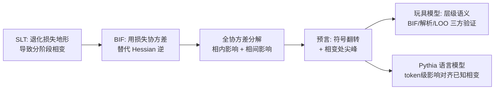

# Influence Dynamics and Stagewise Data Attribution

**会议**: ICLR 2026  
**OpenReview**: [https://openreview.net/forum?id=8epkNiuAQC](https://openreview.net/forum?id=8epkNiuAQC)  
**代码**: 待确认  
**领域**: 可解释性 / 训练数据归因（Developmental Interpretability）  
**关键词**: 训练数据归因, 影响函数, 奇异学习理论, 分阶段学习, 贝叶斯影响函数, 相变  

## 一句话总结
本文用奇异学习理论（SLT）把"训练数据归因"从静态视角升级为**分阶段（stagewise）视角**：证明一个样本对另一个样本的影响并非固定不变，而是会在模型发育的相变点处发生**符号翻转**和**尖峰**，并用贝叶斯影响函数（BIF）在玩具模型和真实语言模型上验证了这一预言。

## 研究背景与动机
- **领域现状**：训练数据归因（TDA）研究"哪些训练数据塑造了模型行为"，是 AI 可解释性与安全的核心问题。主流工具是**影响函数（IF）**，它通过对训练点做无穷小上调权重、再看其对最终参数 $w^*$ 处某观测量的影响来度量归因。
- **现有痛点**：经典 IF 继承自正则统计模型分析，隐含假设"数据顺序不影响归因"——即影响是**静态、全局**的。这要求存在唯一稳定极小点 $w^*$ 且 Hessian $H(w^*)$ 可逆。但神经网络的损失地形是**退化（degenerate）**的：极小点非孤立、Hessian 秩亏，经典 IF 在理论上**ill-defined**、实践中**不稳定**（必须加阻尼项），尤其在未收敛的中间 checkpoint 上彻底失效。
- **核心矛盾**：SLT（Watanabe）预言退化会导致**分阶段发育**——模型在训练中经历一系列**相变**，在质变的解之间跳转，伴随退化度与 Hessian 秩的改变。既然学习本身是分阶段的，归因工具却仍是静态的，二者根本不匹配。"早期帮助模型学会'狗'的数据，后期可能反而损害它区分'贵宾犬'和'梗犬'。"
- **本文目标**：建立一个把影响函数与发育相变连接起来的理论框架，把 TDA 从"哪些数据重要"扩展到"数据在**何时、为何**重要"。
- **核心 idea**：**【从静态到分阶段】** 用 SLT 的相变理论预言"影响是动态量"，并改用对退化地形稳健的**贝叶斯影响函数（BIF）**来追踪影响随训练时间的完整轨迹。

## 方法详解

### 整体框架
框架沿用 Developmental Interpretability 的三步配方：先用理想化的**贝叶斯学习过程**建模优化器轨迹，再用 SLT 对分阶段发育做预言，最后在真实网络上实证检验。核心是把度量工具从经典 IF 换成 BIF，再用"全协方差分解"推导出影响在相变处的动态行为，最后在玩具模型与语言模型两个尺度验证。

### 关键设计

**1. 贝叶斯影响函数（BIF）：用协方差替代 Hessian 逆，让归因在退化地形上良定义。** 经典 IF 形如 $\mathrm{IF}(z_i,\phi) = -\nabla_w\phi(w^*)^\top H^{-1}(w^*)\nabla_w\ell_i(w^*)$，依赖 Hessian 可逆这一在神经网络上失效的假设。本文转而度量"观测量的后验期望 $\mathbb{E}[\phi(w)]$ 如何随样本权重变化"，其导数恰好等于观测量与样本损失的负协方差：

$$\mathrm{BIF}(z_i,\phi) = \frac{\partial}{\partial\beta_i}\mathbb{E}_{p_\beta(w|D)}[\phi(w)]\Big|_{\beta=1} = -\mathrm{Cov}_{p(w|D)}(\ell_i(w),\phi(w))$$

这个形式有三个关键好处：它是**分布式的**（天然契合 SLT 的贝叶斯框架）；它**无需 Hessian**（用协方差估计替代有问题的 Hessian 逆，因此在退化地形上仍良定义）；它在训练轨迹的**任意一点**都有定义，而不只在稳定极小点处——这正是把影响当作动态量研究的前提。当正则性假设成立时，BIF 在大数据极限下渐近恢复经典 IF，因此它是经典影响函数的高阶推广。实践中用 RMSProp 预条件的 SGLD（随机梯度 MCMC）采样器从每个 checkpoint $w^*_t$ 估计局部 BIF。

**2. 全协方差分解：把总影响拆成"相内基线"与"相间跳变"两项，从数学上预言尖峰与符号翻转。** 在统计物理语言里，BIF 是一种**广义磁化率**，度量系统对扰动的响应；而磁化率在相变处会发散，这天然提示用它来探测相变。把一阶相变建模为后验在两个邻域 $U,V$ 上的混合分布 $p(w|D)=\pi_U p(w|U)+\pi_V p(w|V)$，再用全协方差定律按相 $Z\in\{U,V\}$ 条件分解 $\mathrm{BIF}(z_i,\ell_j)=-\mathrm{Cov}(\ell_i,\ell_j)$：

$$\mathrm{Cov}(\ell_i,\ell_j) = \underbrace{\pi_U\mathrm{Cov}_U(\ell_i,\ell_j)+\pi_V\mathrm{Cov}_V(\ell_i,\ell_j)}_{\text{相内平均影响（基线）}} + \underbrace{\pi_U\pi_V(\mu_{i,U}-\mu_{i,V})(\mu_{j,U}-\mu_{j,V})}_{\text{相间影响}}$$

其中 $\mu_{i,U}=\mathbb{E}[\ell_i|U]$。无相变时 $\pi_U=1$，只剩基线项即退化为静态视角。这一分解直接产出两条与经典视角分道扬镳的预言：**(a) 影响可变号**——若两相的相内影响差异显著，或相间项在过渡期足够大以压过基线，影响幅度会剧变甚至翻转符号；**(b) 影响在相变处尖峰**——相间项在后验质量均分（$\pi_U\approx\pi_V\approx 0.5$）时最大化，其幅度正比于 $(\mu_{i,U}-\mu_{i,V})$，意味着尖峰最大的恰是"两相最不一致的样本"，从而**影响尖峰能定位刻画某次相变的关键样本**。

**3. 玩具模型上的三方交叉验证：BIF / 解析解 / LOO 重训练相互印证。** 在 Saxe 等人的层级语义数据集上训练 2 层深度线性网络（MSE 损失），该模型已知会**渐进式**学习层级结构：先学"动物 vs 植物"，再学"哺乳类 vs 鸟类"，最后学"狗 vs 猫"。本文同时用三种独立手段度量影响动态：用 SGLD 估计**局部 BIF**、利用模型可解析性**解析推导**影响轨迹、以及做**留一法（LOO）重训练**度量损失差 $\Delta\ell^{\backslash i}_{j,t}=\ell^D_{j,t}-\ell^{D\backslash i}_{j,t}$。三者一致显示影响随训练**非单调变化并会变号**：上调"狗"在早期学"动物 vs 植物"时对学习"麻雀"有帮助（负影响），但在后期学"哺乳类 vs 鸟类"时反而有害（正影响）。更进一步，隐层表示的 MDS 轨迹中各层级的**分支节点时刻恰好对齐影响尖峰**——模型开始区分一个新层级时，该层级内样本间影响达到峰值。配合"时间窗口消融"实验（仅在 BIF 峰值时段移除样本造成最大损失差），证实该度量准确识别了样本驱动学习的关键窗口。

**4. 语言模型上的 token 级分阶段归因：影响动态对齐已知发育相变。** 在 Pythia 套件上，BIF 的一大优势是按 token 计算影响**零额外开销**——自回归损失本就逐 token 计算 $\ell_i(w)=\sum_k\ell(x_{i,k}|x_{i,0\dots k-1},w)$，存下逐 token 损失即可估计 token 级 BIF 矩阵。按 Baker 等人的方法把 token 分为句法类（左/右定界符、格式 token）、形态类（词的部分/词尾）与结构类（构成归纳模式的 token），再计算类间"组影响"。结果显示：**归纳（induction）关系**的类间 BIF 早在 128 步就出现拐点，持续增强约 3 万步后达峰再回落——与 Tigges 等人发现的"Pythia 归纳回路在 30k 步达顶点"完全吻合；**左右定界符**早期互为构造性（负）影响，随后迅速反转为正，反映模型学会区分"作用域与配对"。一个分阶段干预实验进一步验证实用价值：仅在归纳回路开始形成的窗口内上调归纳模式样本，能比在此之前上调**显著加速**归纳头的形成。

## 实验关键数据

### 主实验（玩具模型）

| 验证手段 | 观测对象 | 关键结论 |
|---|---|---|
| 局部 BIF（SGLD） | 狗→其他样本影响轨迹 | 非单调、随训练变号 |
| 解析 IF | 影响的解析表达式 | 与 BIF 趋势一致；影响是输入-输出协方差奇异模强度的函数（时变） |
| LOO 重训练 | $\Delta\ell^{\backslash i}_{j,t}$ | 与 BIF/解析解同形，验证三者等价 |
| MDS 分支节点 | 隐表示层级发育 | 分支时刻对齐影响尖峰 |

### 关键发现
- **符号翻转**：同一数据点（狗）对查询点（麻雀）的影响在不同发育阶段从"有帮助（负）"翻转为"有害（正）"。
- **尖峰定位相变**：影响峰值出现在新层级开始被学习的时刻，且峰值最大的样本是"两相最不一致"的样本。
- **时间窗口消融**：只在 BIF 峰值时段移除样本造成的损失差最大 → 度量正确识别了"关键学习窗口"。
- **语言模型对齐**：归纳关系 BIF 在 128 步拐点、30k 步达峰回落，与已知归纳回路发育时间表吻合；定界符影响发生符号翻转。
- **分阶段干预**：在归纳回路形成窗口内上调归纳样本，加速归纳头形成的效果显著优于窗口外上调。

## 亮点与洞察
- **把统计物理的"磁化率发散于相变"直接迁移到数据归因**：BIF 作为广义磁化率，使"影响尖峰"成为探测相变最直观的宏观信号，理论优雅且可操作。
- **三方交叉验证（BIF / 解析 / LOO）极具说服力**：在可解析的玩具模型上同时用三种独立方法得到一致结论，几乎排除了"度量本身的伪影"这一质疑。
- **对 unrolling 类方法（TracIn/SOURCE）的批判一针见血**：既然影响会变号，沿训练路径积分的累积归因可能发生**抵消效应**，从而掩盖样本在特定发育阶段的真实作用。
- **为"隐式课程"提供了更细粒度机制**：不同数据在不同时刻变得"重要"，等价于一个动态自组织的课程，解释了为何显式课程学习常常收效有限。

## 局限与展望
- **SLT 贝叶斯过程与 SGD 非平衡动力学的理论鸿沟仍未弥合**：全文用理想化贝叶斯学习近似真实随机优化，这一桥梁仍是主要理论缺口。
- **仍是行为层面而非机制层面的归因**：度量了"哪些样本何时有影响"，但尚未连接到模型内部学到的具体特征/回路（mechanistic interpretability）。
- **BIF 估计依赖 SGLD 采样**：超参（如 $\beta,\epsilon,\gamma$）敏感，需仔细调，扩展到超大模型的稳定性与成本仍待检验。
- **token 分类不完备也不互斥**：部分 token 无类别或同属多类，组影响统计存在噪声。
- 未来方向：从行为归因走向"数据→损失地形几何→学习动态→模型内部结构"的完整对应链条。

## 相关工作与启发
- **经典影响函数**（Cook 1977；Koh & Liang）：静态、全局、依赖 Hessian 可逆——本文的批判靶子。
- **贝叶斯影响函数**（Giordano 2017；Kreer 2025）：本文主工具的来源，BIF 估计器与局部化阻尼项均沿用 Kreer 2025。
- **奇异学习理论 / Developmental Interpretability**（Watanabe 2009；Lehalleur 2025；Hoogland 2024；Baker 2025）：提供"分阶段相变"的理论与实证基础。
- **轨迹/unrolling 归因**（TracIn、HyDRA、SOURCE）：沿训练路径积分影响，与本文互补但目标不同——前者求累积总量，本文研究轨迹本身。
- **层级特征学习玩具模型**（Saxe 2019a）：提供可解析的渐进式层级学习平台。
- **启发**：把"何时"纳入数据归因，对数据筛选、训练课程设计、模型调试与可控训练都有直接价值——可在相变窗口精准上调/下调数据来引导学习。

## 评分
- **新颖性**: ⭐⭐⭐⭐⭐ 首次把奇异学习理论的相变框架系统连接到数据归因，提出"分阶段数据归因"新范式，理论与视角都很原创。
- **实验充分度**: ⭐⭐⭐⭐ 玩具模型三方交叉验证扎实，语言模型对齐已知相变且有干预实验佐证；但语言模型部分多为定性/类间统计，缺大规模定量基准。
- **写作质量**: ⭐⭐⭐⭐⭐ 理论推导清晰、物理类比贴切、图示（相变/MDS/类间影响）有力，论证层层递进。
- **价值**: ⭐⭐⭐⭐ 为可解释性、数据筛选与训练课程提供了"何时重要"的新工具与新视角，对 unrolling 方法的批判也有方法论意义。

<!-- RELATED:START -->

## 相关论文

- [\[ICLR 2026\] Learning to Weight Parameters for Training Data Attribution](learning_to_weight_parameters_for_training_data_attribution.md)
- [\[ICLR 2026\] Dissecting Representation Misalignment in Contrastive Learning via Influence Function](dissecting_representation_misalignment_in_contrastive_learning_via_influence_fun.md)
- [\[ICML 2026\] ExPLAIND: Unifying Model, Data, and Training Attribution to Study Model Behavior](../../ICML2026/interpretability/explaind_unifying_model_data_and_training_attribution_to_study_model_behavior.md)
- [\[ICLR 2026\] The Shape of Adversarial Influence: Characterizing LLM Latent Spaces with Persistent Homology](the_shape_of_adversarial_influence_characterizing_llm_latent_spaces_with_persist.md)
- [\[ICLR 2026\] f-INE: A Hypothesis Testing Framework for Estimating Influence under Training Randomness](f-ine_a_hypothesis_testing_framework_for_estimating_influence_under_training_ran.md)

<!-- RELATED:END -->
