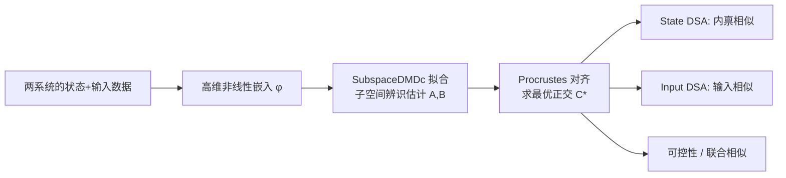

# InputDSA: Demixing, then comparing recurrent and externally driven dynamics

**会议**: ICLR 2026  
**OpenReview**: [https://openreview.net/forum?id=2FrAvRz1E7](https://openreview.net/forum?id=2FrAvRz1E7)  
**代码**: 待确认  
**领域**: 神经动力学 / 表示与动力学相似性  
**关键词**: 动力学相似性, DSA, Koopman, DMDc, 子空间辨识, 输入驱动动力学, RNN, 神经数据  

## 一句话总结
把"比较两个动力系统是否相似"的 DSA 方法从自治系统扩展到受外部输入驱动的非自治系统，用带控制的子空间动态模态分解（SubspaceDMDc）同时估计内禀算子 $A$ 与输入算子 $B$，从而能在部分观测、含噪、甚至只有代理输入的情况下分别比较"内禀动力学"和"输入驱动动力学"。

## 研究背景与动机
- **领域现状**：比较两个系统（大脑、RNN、物理系统）是否"做同一件事"是跨学科共性问题。主流做法比较状态的几何（RSA / CKA / Procrustes / CCA）或拓扑，但都不刻画**时间动力学**。Ostrow 等人 2023 的 DSA（Dynamical Similarity Analysis）填补了这点——它用 Koopman 思想把非线性动力学嵌入高维空间、拟合线性状态转移算子 $A$，再在算子层面比较，已成功用于 RNN、训练动力学和神经数据。
- **现有痛点**：DSA 以及后续所有动力学比较方法都**默认系统是自治的**（$x_{t+1}=Ax_t$），完全忽略外部输入。可现实中的大脑和机器学习系统几乎都是**非自治**的——持续接收感觉信号、跨脑区通信、闭环反馈。
- **核心矛盾**：同样内禀动力学的两个系统，若被不同输入驱动，会被 DSA 误判为"不同"；反之亦然。输入的混入会**污染**对内禀动力学的比较，也无法单独回答"这两个系统对输入的响应方式是否一样"。
- **本文目标**：提出一个能**分离（demix）内禀动力学与输入驱动**、并对二者可联合或分别比较的相似性度量，且在部分观测、噪声、输入未知时依然鲁棒。
- **核心 idea**：**[拆分再比较]** 同时显式估计状态转移算子 $A$ 与输入到状态的映射 $B$，把相似性建立在**可控性矩阵**上；**[子空间辨识去偏]** 用经典控制论的子空间辨识（N4SID / PO-MOESP）替代朴素 DMDc，解决部分观测导致 $B$ 被内禀动力学污染的偏差；**[Procrustes 加速]** 把相似性优化化简为 Procrustes 对齐，相对原 DSA 指数级提速。

## 方法详解

### 整体框架
InputDSA 在 DSA 的"嵌入→拟合线性算子→比较算子"三步流水线上做扩展：对两个系统各自采集状态和输入数据，嵌入高维空间，用 **SubspaceDMDc** 拟合带控制的线性状态空间模型 $x_{t+1}=Ax_t+Bu_t,\; y_t=Cx_t$，最后在学到的算子上分别计算**可控性相似度、状态相似度、输入相似度**。灰色部分是相对 DSA 新增的环节（输入算子估计 + 输入侧度量）。

### 关键设计

**1. 可控性即相似性度量：把输入算子纳入比较。** DSA 只在 $A$ 上定义 $\min_{C\in O(n)}\|CA_1C^T-A_2\|_F$。InputDSA 注意到输入驱动系统的关键特征是**可控性**——输入序列能否在有限步把状态推到任意点，这由 $T$ 步可控性矩阵 $K(T)=[B,\,AB,\,A^2B,\dots,A^{T-1}B]$ 刻画，且可控性在状态空间正交变换下保持（$A_1=CA_2C^T,\,B_1=CB_2 \Rightarrow K_1=CK_2$）。于是把度量扩展为对**整条可控性矩阵**的对齐：
$$\text{InputDSA}(A_1,A_2,B_1,B_2,T)=\min_{C\in O(n)}\sum_{i=0}^{T}\|CA_1^iB_1-A_2^iB_2\|_F^2=\min_{C\in O(n)}\|CK_1-K_2\|_F^2.$$
求出最优 $C^*$ 后，就能拆开看两个可解释的子分数——状态分数 $\|C^*A_1C^{*T}-A_2\|_F^2$ 与输入分数 $\|C^*B_1-B_2\|_F^2$，分别回答"内禀动力学像不像"和"对输入的响应像不像"。

**2. Procrustes 加速：把迭代优化变成闭式对齐。** 原 DSA 的 $A$ 对齐需要在正交群 $O(n)$ 上迭代优化，代价高。由于新度量被写成 $\|CK_1-K_2\|_F^2$ 的形式，本质是一个**正交 Procrustes 问题**，可由 SVD 一步闭式求解，带来相对原工作"指数级"的加速——这也是把该方法推广到大规模/多系统比较的现实基础。

**3. SubspaceDMDc：解决部分观测对输入算子的污染。** 朴素地用 DMDc（$\phi(x_{t+1})=A\phi(x_t)+B\phi(u_t)$）在**部分观测**场景（如只录到神经群体中一小撮神经元）会出问题：输入既直接作用于观测维，又通过**未观测维**在后续时刻间接影响观测状态，导致估计出的 $B$ 把这部分间接效应误算进内禀动力学，使 $B$ 系统性偏向 $A$。本文据此引入 **SubspaceDMDc**——把控制信号纳入子空间 DMD，借用控制论的 N4SID / PO-MOESP 算法去辨识 $x_{t+1}=Ax_t+Bu_t,\,y_t=Cx_t$ 这类**只观测到 $y_t,u_t$** 的系统。其思想类似工具变量回归：先把待预测的未来（lifted）状态投影到"过去输入+过去状态"张成的基上，再做回归估计 $A,B$，这一投影顺带滤掉了观测噪声与过程噪声，带来噪声鲁棒性。

**4. 代理输入与超参选择：让方法落地真实神经数据。** 真实场景常常拿不到驱动系统的"真输入"（如一个脑区给另一个脑区的信号），只能用行为变量 / 任务指令 / 感觉特征作**代理输入**。InputDSA 进一步把度量扩展为对输入也做联合对齐（不显著增加优化难度），从而容忍代理输入是真输入经上游变换后的版本。超参（算子秩、延迟数、非线性基）则用"在能最好预测未来状态的前提下取最小秩"来定，借 Kalman 滤波做高效一步预测，并用 AIC 等准则辅助选择。

## 实验关键数据

### 主实验：部分观测下区分内禀 vs 输入动力学
在 20 维、仅观测 2 维、5000 时间点的随机 RNN 上构造 4 类系统（两两共享 $A$ 或共享 $B$），用 silhouette 分数（聚类可分性，1.0 最佳，基于真值标签）衡量距离矩阵质量：

| 方法 | 状态相似 silhouette | 输入相似 silhouette |
|------|------|------|
| DMD（Hankel，DSA）| 0.60 | — （无法比较输入）|
| DMDc | 0.68 | 0.19（部分观测下失效）|
| **SubspaceDMDc（本文）** | **0.94** | **0.83** |

- 系统维度从 2 扫到 1000（始终只观测 2 维）：所有方法状态分数随系统增大优雅退化，SubspaceDMDc 明显领先；DMDc 的输入分数**始终不鲁棒**，而 SubspaceDMDc 的输入分数在所有规模下都鲁棒（单边 Mann-Whitney U 检验显著）。

### 鲁棒性：噪声与代理输入
- 对输入施加 10 类扰动（部分观测、时间平滑、乘性高斯、漂移、旋转、脉冲等），用信噪比 SER 衡量：即便 SER 逼近 1，与真值距离的相关仍保持 $r>0.75$；得益于延迟嵌入纳入输入历史 + 降秩回归剔除虚假噪声模态。
- 4 阶随机多项式变换输入后，状态 DSA 相关性最鲁棒，其次是联合、输入 DSA。
- Random Target Reach 任务的 RNN：用动作 / 位置 / 速度 / 任务指令等代理输入替代真输入，**内禀（状态）距离即便用随机输入都强相关**于真值；输入侧则越相关的代理越准（动作+位置组合最佳）。

### 应用一：RL 智能体个体差异随学习演化（Plume Tracking 闻味追踪）
- 15 个独立训练的 RNN 智能体（深度 RL），取最好 5 个（Top，成功率 20%–65%）与最差 5 个（Bottom，从未成功）。
- InputDSA 发现 Top 智能体彼此的**输入驱动动力学显著更相似**且与 Bottom 清晰分离，而**内禀动力学组间无显著差异**——说明成功追踪主要依赖对风向/气味的快速输入响应。
- 输入映射算子 $B$ 的奇异值谱：Top 智能体衰减更慢，即输入能激发更多 RNN 维度（可直接控制各维而非间接耦合）。
- 训练过程中 Top 智能体收敛到更一致的输入动力学，Bottom 智能体则发散为各异的特异动力学——印证"安娜·卡列尼娜原则"（成功者彼此相似，失败者各有各的失败）。

### 应用二：大鼠神经群体动力学跨任务阶段的变化（听觉证据累积）
- Neuropixels 记录 6 个额叶/纹状体脑区，4 只大鼠 >15 个 session；以左右听觉脉冲计数作 2 维输入。
- 围绕"神经承诺时刻"（nTc）比较 Pre/Post：状态与输入动力学都显著变化。Post 期 $A$ 的特征谱幂律指数 $\beta$ 更小（衰减更慢、内禀动力学更持久），$\|A\|$ 增大而 $\|B\|$ 减小，可控性 Gramian 的 Frobenius 范数显著下降（$p<0.001$，可控性能量中位数下降约 47.6%）。
- 结论：群体活动在 nTc 处发生**机制切换**——从输入驱动的证据累积期转入内禀主导的决策承诺期。用朴素 DMDc 复现不出该结构（部分观测所致）。

### 关键发现
SubspaceDMDc 是把"动力学相似性比较"推向真实、部分观测、含噪、输入未知系统的关键；分离出的输入侧分数能揭示仅靠内禀比较看不到的差异（RL 成功/失败的分水岭在输入响应、神经决策的相位切换体现在可控性下降）。

## 亮点与洞察
- **把"输入"提升为一等公民**：第一个在动力学相似性框架里显式建模并单独比较输入驱动动力学的方法，回答了"两个系统是否以相同方式响应输入"这一此前无法度量的问题。
- **可控性作为相似性的统一语言**：用控制论的可控性矩阵/Gramian 既定义了度量，又给出"输入能激发多少状态维度""系统多容易被驱动"这类可解释量，把抽象的相似性接到具体的神经科学叙事（证据累积 vs 决策承诺）。
- **方法学背书代理输入**：理论与实验都表明弱相关的代理输入也能稳健估计内禀相似性，为计算神经科学普遍使用行为/感觉代理输入的做法提供了原则性支持。
- **去偏与提速兼得**：子空间辨识既修正部分观测偏差又滤噪，Procrustes 化简还顺带让优化指数级加速（50 维 / 1 万时间点 / 100 延迟在 M1 Pro 上约 1 分钟）。

## 局限与展望
- **仅支持加性输入**：假设 $Ax+Bu$，无法很好近似乘性输入（gain modulation 等常见神经机制）。
- **状态-输入纠缠时失效**：当输入与状态同步、或输入是状态的线性函数（闭环）时，分离内禀与输入贡献困难或不可解（虽有闭环子空间辨识可借鉴）。
- **依赖可辨识性条件**：输入须"持续激励"否则状态模态被低估；非线性基选不好则线性模型表达力不足——本质受限于系统辨识与 Koopman 近似本身的能力边界。
- **计算瓶颈在拟合**：比较极快，但 SubspaceDMDc 拟合是主要开销。
- **展望**：可结合光遗传/电刺激等已知扰动做模型-生物的脉冲响应对比验证；可用不同代理输入反推跨脑区通信的信息内容；可推广到任意时间序列数据。

## 相关工作与启发
- **几何/拓扑相似性**：RSA、CKA、Procrustes、CCA 比较状态几何，持久同调比较拓扑——都不含时间动力学，InputDSA 是其互补维度。
- **DSA 谱系**：直接扩展 Ostrow 等 2023 的 DSA（Procrustes over Vector Fields + Koopman 算子比较），并修正其忽略输入的缺陷。
- **带控制的 Koopman/DMD**：建立在 DMDc（Proctor 2016）与子空间 DMD（Takeishi 2017）之上，结合 N4SID/PO-MOESP 等经典子空间辨识。
- **启发**：在比较/解释神经网络与大脑时，"它对输入怎么响应"和"它内部怎么演化"是两个应当分开度量的轴；可控性/Gramian 这类控制论工具值得引入到表示与动力学分析中。

## 评分
- **新颖性**: ⭐⭐⭐⭐⭐ 首次把输入驱动动力学纳入动力学相似性比较，可控性度量 + SubspaceDMDc 去偏 + Procrustes 加速三点都有原创性。
- **实验充分度**: ⭐⭐⭐⭐⭐ 合成系统（含规模/噪声/代理输入消融）+ RL 智能体 + 真实大鼠神经数据三层验证，silhouette、SER、特征谱、Gramian 等定量充分。
- **写作质量**: ⭐⭐⭐⭐ 动机清晰、理论与实验衔接好；部分技术细节（子空间辨识、超参选择）下放附录，主线读起来需要一定控制论背景。
- **价值**: ⭐⭐⭐⭐⭐ 为计算神经科学与可解释性提供了一个能分离内禀/输入动力学的通用、鲁棒、高效工具，应用面广（脑区比较、模型验证、训练动力学分析）。

<!-- RELATED:START -->

## 相关论文

- [\[ICLR 2026\] Block Recurrent Dynamics in Vision Transformers](block_recurrent_dynamics_in_vision_transformers.md)
- [\[ICLR 2026\] Comparing the learning dynamics of in-context learning and fine-tuning in language models](comparing_the_learning_dynamics_of_in-context_learning_and_fine-tuning_in_langua.md)
- [\[ICLR 2026\] Discovering Alternative Solutions Beyond the Simplicity Bias in Recurrent Neural Networks](discovering_alternative_solutions_beyond_the_simplicity_bias_in_recurrent_neural.md)
- [\[ICLR 2026\] ExPO-HM: Learning to Explain-then-Detect for Hateful Meme Detection](expo-hm_learning_to_explain-then-detect_for_hateful_meme_detection.md)
- [\[ICLR 2026\] Influence Dynamics and Stagewise Data Attribution](influence_dynamics_and_stagewise_data_attribution.md)

<!-- RELATED:END -->
