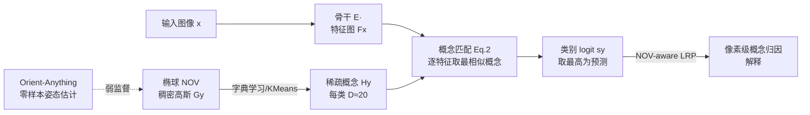

# Interpretable 3D Neural Object Volumes for Robust Conceptual Reasoning

**会议**: ICLR 2026  
**OpenReview**: [https://openreview.net/forum?id=VSPLa2Sito](https://openreview.net/forum?id=VSPLa2Sito)  
**代码**: [github.com/phamleyennhi/CAVE](https://github.com/phamleyennhi/CAVE)  
**领域**: 可解释性 / 鲁棒图像分类 / 3D 感知表示  
**关键词**: 神经物体体积(NOV)、概念解释、OOD 鲁棒性、LRP、可解释分类

## 一句话总结
CAVE 把 NOVUM 中上千个稠密 3D 高斯特征通过字典学习压成每类约 20 个稀疏概念，得到一个既 OOD 鲁棒、又「设计即忠实」可解释的图像分类器，并提出无需部件标注的 3D-C 指标来度量概念跨视角/跨退化的空间一致性。

## 研究背景与动机
**领域现状**：可信 AI 同时需要鲁棒性和可解释性，但两条研究线长期割裂。一边是 3D 感知分类器（如 NOVUM）把图像特征匹配到物体的体积化表示（NOV），在遮挡、恶劣天气等 OOD 场景下大幅提升鲁棒性；另一边是概念型 XAI 方法（CRAFT、ICE、ProtoPNet、CBM 等）追求解释，却几乎不考虑分布漂移。

**现有痛点**：① NOVUM 这类 3D 感知分类器虽然鲁棒，但每个类别用上千个高斯特征做 bag-of-words 匹配，决策过程极度不透明，根本看不出是哪些特征在起作用；② 现有内在可解释模型在设计时没把鲁棒性纳入考量，OOD 下解释会失真——大雾/换背景时常常抓不到一致、有意义的概念；③ NOVUM 还硬性依赖训练时的真值 3D 姿态标注，成本高、可扩展性差；④ 评估概念一致性的指标普遍依赖人工标注的物体部件，而模型其实是为任务精度优化、未必对齐这些部件。

**核心矛盾**：鲁棒性与可解释性各有成熟方案，但把二者统一在同一个分类器里既要解释忠实于计算、又要在 OOD 下稳定，这件事远非简单拼接。

**本文目标**：构建一个同时 OOD 鲁棒、且内在可解释（解释忠实于模型计算）的图像分类器，并配一个不依赖部件标注的概念一致性度量。

**核心 idea**：**用稀疏概念替换稠密高斯**——对每个类的 NOV 做字典学习/聚类，提取一组「几何接地」的高层概念作为新的体积表示；用概念匹配代替原始高斯匹配做分类，从而在保持 NOVUM 忠实性的同时获得可解释性；并用真值 CAD 网格而非人工部件标注来度量概念一致性。

## 方法详解

### 整体框架
CAVE（Concept Aware Volumes for Explanations）建立在 NOVUM 之上：先用骨干网络（ResNet-50）抽取图像特征 $F_x$，把每个类用一个椭球状 NOV 表示（表面均匀分布 $K$ 个带特征的 3D 高斯），再对每类高斯特征做字典学习压成 $D$ 个稀疏概念，分类时把图像特征与这组概念做 bag-of-words 余弦匹配取最大并求和得到类别 logit，最后用改造过的 LRP 把概念相关性反传到像素得到忠实解释。

### 关键设计

**1. 从稠密高斯到稀疏概念：用字典学习把 NOV 概念化**。NOVUM 的每个类 NOV $G_y\in\mathbb{R}^{K\times C'}$ 含上千个高斯，匹配时不知道谁在贡献决策。CAVE 把概念提取写成字典学习问题 $\min_{W_y,H_y}\|G_y-W_yH_y^\top\|_F^2$，其中字典 $H_y^*=[h_y^{(1)},\dots,h_y^{(D)}]^\top$ 就是 $D$ 个概念向量。作者用 K-Means 硬聚类求解，使权重矩阵 $W_y^*$ 退化成 one-hot 指派——每个高斯只归属一个概念，稀疏到极致因而最可解释。得到的 $H^*$ 作为新的「概念型 NOV」直接替换原稠密 NOV，分类公式从对 $G$ 取 max 改成对 $H$ 取 max：$s_y=\phi(F_x,H_y)=\sum_i\max_{j\le D} f_i\cdot h_y^{(j)}$。由于 $f_i$ 与 $h_y^{(j)}$ 都做了 L2 归一化，每个点积是 $[-1,1]$ 的余弦相似度；更关键的是 logit 完全由这些概念激活精确算出，因此沿袭了 NOVUM 的「设计即忠实」，又额外换来了稀疏可读性。实验里 $D=20$ 就把每类约 1130 个高斯压掉约 98%，精度反而在 OOD 下持平或略超。

**2. NOV-aware LRP：堵住 3D 感知架构里的相关性泄漏**。要把概念落回像素做解释，作者基于 LRP（相关性逐层反传）。LRP 的核心是守恒律——总相关性在网络各层应保持不变。但作者实测发现直接把 LRP 套到 NOV 架构上时，概念匹配这种非标准算子会让相关性「不忠实地泄漏」，守恒被破坏。CAVE 为概念匹配算子 $\phi(F_x,H)$ 设计了专门的相关性再分配规则，强制 $\sum_{f_i\in F_x}R_{f_i}=\sum_{h\in H}R_{\phi(h)}=R_{y^*}$，即像素层拿到的总相关性恰等于概念层、也恰等于最终预测的相关性。这样才能在 OOD（雪天、重遮挡）下得到空间连贯的归因，而 vanilla LRP 和 Grad-CAM 在同样条件下给出的是散乱的解释。

**3. 弱 3D 监督 + 更贴合的椭球形状：去掉姿态标注依赖、提升表示质量**。NOVUM 训练硬依赖真值 3D 姿态来对齐 NOV 与图像中的物体。CAVE 改用 Orient-Anything 的零样本姿态估计提供「弱 3D 监督」，从而摆脱昂贵的姿态标注、显著提升可扩展性（代价是 OOD 下有小幅精度回落）。同时，NOVUM 常用立方体/球这类粗糙形状近似物体；CAVE 系统比较了立方体、球、椭球、原型 CAD 几种几何，最终选椭球作为概念提取的载体，因为它在 OOD 精度与可解释性之间取得最佳折中。

**4. 3D-C：用 CAD 网格而非人工部件标注度量概念一致性**。一个有意义的概念，应在不同姿态/OOD 退化下稳定映射到物体的同一语义区域。作者据此提出 3D 一致性指标 3D-C：对类 $y$ 的每个概念 $h$，把它在各测试图上的正归因 $A^+(x,h)$ 通过姿态（有真值用真值、否则用 Orient-Anything 估计）投影到该类 CAD 网格的三角面片上聚合，得到 $\Omega_y(A^+(x,h))$；再用归一化后跨图投影分布的 $L_1$ 差异定义 $3\text{D-C}(X_y,h)=1-\frac{1}{2}\big(\frac{1}{n_y^2}\sum_{x\ne x'}\|\Omega_y(A^+(x,h))-\Omega_y(A^+(x',h))\|_1\big)$，落在 $[0,1]$，越高越一致。为避免少样本造成的假一致，出现率低于 $\tau=50\%$ 的概念被排除。这条指标的价值在于：它不需要人工部件标注，用物体几何作公共参照面，让不同概念方法可以公平横比。

## 实验关键数据

### 主实验：概念可解释性（Pascal-Part / Pascal3D+ / ImageNet3D / OccludedP3D+ / OOD-CV）

| 方法 | 类型 | 定位↑ | 覆盖↑ | 3D-C P3D+ | 3D-C ImgNet3D | 3D-C OccP3D+ | 3D-C OOD-CV |
|---|---|---|---|---|---|---|---|
| NOVUM+CRAFT | post-hoc | 0.18 | 0.42 | 0.28 | 0.26 | 0.15 | 0.15 |
| NOVUM+ICE | post-hoc | 0.12 | 0.44 | 0.28 | 0.27 | 0.15 | 0.15 |
| TesNet | ad-hoc | 0.25 | 0.44 | 0.20 | 0.18 | 0.18 | 0.12 |
| MGProto | ad-hoc | 0.25 | 0.35 | 0.19 | 0.16 | 0.16 | 0.07 |
| **CAVE（弱监督）** | ad-hoc | **0.28** | **0.80** | **0.40** | **0.40** | **0.23** | **0.24** |
| CAVE（全 3D 监督） | ad-hoc | 0.28 | 0.87 | 0.42 | 0.43 | 0.23 | 0.26 |

CAVE 即便只用弱监督，定位、覆盖、各设定下的 3D-C 全面领先；物体覆盖约 80%，远超次优 LF-CBM 的约 56%。

### 主实验：分类精度（%，↑）

| 方法 | 无需真值姿态 | Pascal3D+ | ImageNet3D | OccludedP3D+ | OOD-CV |
|---|---|---|---|---|---|
| LF-CBM | Yes | 98.4 | 83.3 | 66.4 | 73.5 |
| TesNet | Yes | 97.6 | 77.9 | 63.8 | 70.1 |
| MGProto | Yes | 97.2 | 64.2 | 73.8 | 72.3 |
| **CAVE（弱监督）** | Yes | **99.0** | **84.6** | **76.8** | **80.3** |
| CAVE（全 3D 监督） | No | 99.4 | 88.5 | 81.3 | 84.0 |
| NOVUM（全 3D 监督） | No | 99.5 | 88.3 | 81.7 | 81.3 |

弱监督 CAVE 在 OccludedP3D+ 比对手高约 10%，OOD-CV 上 80.3% 对次优 LF-CBM 73.5%；全监督版几乎追平甚至在 ImageNet3D(+0.2)、OOD-CV(+2.7) 上略超 NOVUM，而表示稀疏得多。

### 消融实验

| 消融维度 | 关键结论 |
|---|---|
| 概念数 $D\in\{5,10,20,40\}$ | 3D-C 跨设定基本稳定，重遮挡下随 $D$ 增大略升；$D=20$ 是稀疏-精度的拐点 |
| 稀疏-精度权衡 | 约 20 个概念即把 NOVUM 约 1130 高斯压掉约 98%，精度持平/OOD 略超，且预测更自信、类间更可分 |
| NOV-aware LRP | 去掉它会让相关性泄漏、归因散乱；它对 OOD 下可靠的概念归因是必需的 |
| 形状（立方体/球/椭球/CAD） | 椭球在 OOD 精度与可解释性之间折中最佳 |

### 关键发现
- 稀疏化不仅没损精度，反而让 OOD 表现持平或略升，并提升预测置信度与类间可分性。
- post-hoc 方法（ICE/CRAFT）能蹭到 NOVUM 的 3D 监督拿到不错的 in-dist 一致性，但 OOD 下全线下滑，CAVE 始终保持最高。

## 亮点与洞察
- **首次把 3D 感知鲁棒分类与内在可解释性统一**：填补了「鲁棒但黑箱」和「可解释但脆弱」之间的空白，且解释忠实于计算（faithful-by-design）。
- **稀疏化是免费午餐**：上千高斯 → 约 20 概念，压缩约 98% 还略涨 OOD 精度，说明 NOVUM 的稠密表示存在大量冗余。
- **评估范式创新**：3D-C 用物体网格作公共参照，绕开人工部件标注这一长期瓶颈，让隐式/显式概念方法可公平横比。
- **务实地去标注依赖**：用 Orient-Anything 弱监督替换真值姿态，把 NOV 类方法从昂贵标注中解放出来。

## 局限与展望
- 椭球只是物体的粗近似，对结构复杂物体概念仍只能「大致」映射到网格，几何保真度有上限。
- 弱监督相比全监督在 OOD 下仍有可见回落，姿态估计质量是性能上界的瓶颈。
- 概念由无监督聚类隐式涌现，缺乏显式语义命名，人类要理解每个概念仍需事后看可视化；与 CBM/原型网络的显式语义不同。
- 评测集中在以物体为中心、有 CAD 网格可用的类别（Pascal3D+/ImageNet3D 系），向无网格、场景级或细粒度任务的迁移性待验证。

## 相关工作与启发
- **3D 感知鲁棒分类**：NOVUM 开创用 3D 姿态拟合立方体 NOV 做鲁棒分类，是本文基座；CAVE 用零样本姿态估计（Orient-Anything）去掉其标注依赖。
- **概念型解释**：post-hoc 的 CRAFT/ICE/MCD/PCX 分解激活找概念但只近似、不忠实；显式的 CBM、ProtoPNet/TesNet/PIP-Net/MGProto 用监督接地语义/原型。CAVE 介于之间——忠实且隐式，概念经无监督聚类涌现。
- **启发**：把「字典学习压缩内部表示」与「3D 几何接地」结合，提示了一条让大模型内部单元既稀疏可读又物理有据的通用路径；3D-C 这种「用结构真值替代人工标注做一致性评估」的思路也可迁移到其他需要跨视角稳定性的解释任务。

## 评分
- **新颖性**: ⭐⭐⭐⭐ 把 3D 感知鲁棒性与内在可解释性首次统一，字典学习概念化 NOV + NOV-aware LRP + 3D-C 三件套均有原创性，方向新。
- **实验充分度**: ⭐⭐⭐⭐ 覆盖 in-dist/OOD 多数据集、9 个强基线、定位/覆盖/一致性/精度多指标、10 随机种子、形状与概念数消融齐全；弱监督与全监督对照清晰。
- **写作质量**: ⭐⭐⭐⭐ 动机-矛盾-方案逻辑顺畅，公式与图示（Fig.1-7）配合到位，概念-像素归因的忠实性论证严谨。
- **价值**: ⭐⭐⭐⭐ 面向安全攸关场景同时给出鲁棒与可信解释，稀疏化与去姿态标注都很实用，3D-C 指标对社区有外溢价值。

<!-- RELATED:START -->

## 相关论文

- [\[ICLR 2026\] Uncovering Conceptual Blindspots in Generative Image Models Using Sparse Autoencoders](uncovering_conceptual_blindspots_in_generative_image_models_using_sparse_autoenc.md)
- [\[NeurIPS 2025\] Superposition Yields Robust Neural Scaling](../../NeurIPS2025/interpretability/superposition_yields_robust_neural_scaling.md)
- [\[ICLR 2026\] Features Emerge as Discrete States: The First Application of SAEs to 3D Representations](features_emerge_as_discrete_states_the_first_application_of_saes_to_3d_represent.md)
- [\[CVPR 2026\] VIRO: Robust and Efficient Neuro-Symbolic Reasoning with Verification for Referring Expression Comprehension](../../CVPR2026/interpretability/viro_robust_and_efficient_neuro-symbolic_reasoning_with_verification_for_referri.md)
- [\[ICLR 2026\] RADAR: Reasoning-Ability and Difficulty-Aware Routing for Reasoning LLMs](radar_reasoning-ability_and_difficulty-aware_routing_for_reasoning_llms.md)

<!-- RELATED:END -->
