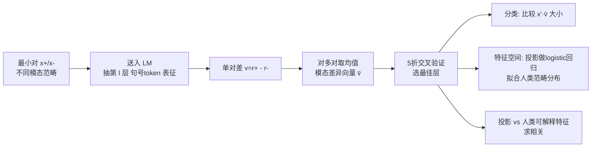

# Is This Just Fantasy? Language Model Representations Reflect Human Judgments of Event Plausibility

**会议**: ICLR 2026  
**OpenReview**: [https://openreview.net/forum?id=Czul60ELOH](https://openreview.net/forum?id=Czul60ELOH)  
**代码**: 论文声明开源（"Code available here"，仓库链接见原文脚注）  
**领域**: 机械可解释性 / 认知科学交叉  
**关键词**: 模态范畴、线性表征、对比激活、差异向量、世界模型、人类判断建模  

## 一句话总结
作者用对比激活（CAA）从多种 LM 的隐藏状态里抽出区分「可能 / 不可能 / 不可设想」等模态范畴的**线性差异向量（modal difference vectors）**，证明 LM 对句子模态的内部判断比此前研究认为的可靠得多，且这些向量随训练/层数/规模按由粗到细的顺序涌现，还能反过来建模人类的细粒度范畴判断行为。

## 研究背景与动机
**领域现状**：LM 既要回答关于真实世界的问题，又要写奇幻小说，因此必须能分辨一句话描述的是**真实、假设、还是彻底荒谬**——也就是判断句子的「模态范畴」。哲学和认知科学早就用模态直觉（一件事可能、不可能、还是不可设想）来刻画人对世界因果结构的「直觉理论」。

**现有痛点**：近期工作（Kauf et al. 2023；Michaelov et al. 2025）发现 LM 对**表层特征**过于敏感，导致用句子概率（next-token 概率之和）来判断模态范畴并不靠谱——因为概率里掺杂了大量与模态无关的因素。于是出现一个怀疑：LM 到底是把模态范畴**编码成了独立连贯的特征**，还是仅仅隐含地、通过不可靠的概率估计来表达？

**核心矛盾**：「LM 概率判断模态不靠谱」≠「LM 内部没有模态表征」。之前用概率做行为测试，可能严重低估了模型真实掌握的模态知识。

**本文目标**：绕开输出概率，直接探查 LM **隐藏状态内部**是否存在模态范畴的表征，并回答四个 RQ——(1) 内部表征是否优于输出概率；(2) 这些表征如何随训练/层/规模发展；(3) 是否反映人类细粒度的范畴判断；(4) 对应哪些可解释特征。

- **核心 idea**：用对比激活把「模态范畴之差」提炼成一个可分类、可解释、可对照人类行为的**线性方向**，把机械可解释性工具同时变成「探查 LM 世界模型」和「生成人类认知假设」的探针。

研究采用 4 个模态范畴（取自 Hu et al. 2025b）：**Probable**（可能且常见，如用冰镇饮料）、**Improbable**（可能但少见，如用雪镇饮料）、**Impossible**（违反自然律，如用火镇饮料）、**Inconceivable**（因选择限制违例而无法评估，如「用昨天镇饮料」）。

## 方法详解

### 整体框架
方法分三步：先用一个含全部模态范畴最小对（minimal pair）的数据集（Hu et al. 2025b）抽出**模态差异向量**；再把这些向量当分类器，在多个「泛化数据集」上对未见过的句子对做模态分类，与概率/主成分/随机向量等 baseline 对比；最后把这些向量当「特征空间」去拟合人类的范畴判断分布，并与人类对可解释维度（如想象难易度、事件可能性）的评分做相关。

### 关键设计

**1. 模态差异向量：把「范畴之差」压成一个方向。** 方法核心借用对比激活加法（CAA, Panickssery et al. 2023）。给定一对仅模态范畴不同的最小对 $(x_+, x_-)$，分别前向一遍取第 $l$ 层句末「.」token 的表征 $r_+ = M_l(x_+)$、$r_- = M_l(x_-)$，单对差 $v = r_+ - r_-$，再对 Hu et al. 2025b 中大量同类最小对求均值得到模态差异向量 $\bar{v}$。分类时不训练任何分类器，只看投影大小：对一对新句子 $(x'_+, x'_-)$，若 $x'_+ \cdot \bar{v} > x'_- \cdot \bar{v}$ 就判对。这一比较范式刻意对齐了「用句子整体概率分类」的先前做法，从而把「内部表征 vs 输出概率」放在同一把尺子上比。每对范畴各自训一个向量，最佳层由 5 折交叉验证独立选取（平局取中位层）。

**2. 三种 baseline 对照，堵住「概率/任意方向也行」的质疑。** 为证明模态向量不是随便一个方向都能做到，作者设了三类对照：**概率分类器**按先前工作把句子 log 概率求和，并假设 $p(\text{inconceivable}) < p(\text{impossible}) < p(\text{improbable}) < p(\text{probable})$；**主成分分类器**在 WikiText 上算每层前三个主成分，同样用交叉验证挑最能分开两范畴的那个主成分；**随机向量**则从每层随机采方向重复同样流程。三者共用与模态向量完全相同的「投影比大小」分类协议，确保差异只来自方向本身。

**3. 用「泛化数据集」逼出真正的范畴抽象。** 向量在 Hu et al. 2025b 上抽取，却在三个风格迥异的数据集上评测：Goulding et al. 2024 的不可能源于**生物**违例（如「即将生出两只翅膀」）而非物理；Vega-Mendoza 2021 与 Kauf 2023 的不可设想源于**动物性（animacy）**违例（如「笔记本电脑买下了老师」）。更狠的是设置了**对抗对**——Vega-Mendoza 让不可设想句含语义相关词、improbable 句含无关词；Kauf 让不可设想句与 probable 句**用同一批词只换语序**（"The teacher bought the laptop" vs "The laptop bought the teacher"），从而剔除词频/词汇捷径。能跨这些数据集泛化，才说明向量抓住的是「不可能性」这一抽象，而非某种表层物理细节。

**4. 把向量当特征空间，建模人类的「带分歧」判断。** 在 Study 3，作者选 probable-improbable、improbable-impossible、impossible-inconceivable 三条**共线性最小**的向量构成 3 维特征空间，把句子投影进去后，用 logistic 回归（Adam，lr=0.01，200 epoch，软标签交叉熵）去预测一群人类被试对该句的**范畴选择分布**（多少人选 probable / improbable / …），并用留一交叉验证评估。关键洞察是这个空间天然按模态范畴聚类，而**落在簇间过渡带的句子恰恰对应人类分歧最大**的句子——即向量的几何结构编码了人类判断的不确定性。Study 4 再把同样三条向量的投影与人类对「事件可能性、想象难易度、语法性、唤起度」等可解释维度的评分求相关。

## 实验关键数据

### 主实验（Study 1：分类准确率，≥2B 模型，跨泛化数据集均值）
模型覆盖 GPT2-{S/M/L/XL}、Llama-3.2-{1B,3B}、OLMo-2-{1B,7B,13B}、Gemma-2-{2B,9B}。

| 分类方法 | 各对模态范畴上的表现 |
|---|---|
| **Modal Difference（本文）** | 在全部范畴对上**匹配或大幅超过**其他方法，对抗子集上同样成立 |
| Probability（概率） | 多数范畴对上明显落后于模态向量 |
| Principal Component | 落后于模态向量 |
| Random | 接近随机基线 |

结论：模态差异向量比输出概率**更可分**，证明 LM 内部确有比概率更可靠的模态判断（RQ1 成立）。

### 发展规律（Study 2：涌现顺序）

| 维度 | 现象 |
|---|---|
| 参数量 | <2B 与 ≥2B 之间存在**质变断层**，2B 以下泛化能力明显差 |
| 训练步 / 层深 / 规模 | 一致按**由粗到细**顺序涌现：先把 inconceivable 与其余分开 → 再分 probable/impossible → 再 probable/improbable → 最后 improbable/impossible |

这一顺序复现并扩展了 Hu et al. 2025b 基于 surprisal 的发现，但本文是在**内部表征**层面；且发现表征会随参数量发展（而 surprisal 在 Hu 的工作里对规模不敏感）。

### 建模人类行为（Study 3 & 4）
- Study 3：在 Hu 2025b / Hu 2025a / Goulding 三个数据集上，模态向量特征空间在**整体相关、MSE、熵相关**三项指标上都稳定优于概率/主成分/随机 baseline。定性例子（Gemma-2-9B）：

| 场景（Someone is about to...） | 模态向量 P(可能) | 概率 P(可能) | 人类 P(可能) |
|---|---|---|---|
| clean a car | 0.99 | 0.70 | 1.0 |
| clean a cloud | 0.09 | 0.57 | 0.05 |
| stay awake for 5 days | 0.67 | 0.63 | 0.53 |
| stay awake for 5 years | 0.25 | 0.60 | 0.05 |

可见概率几乎分不开（都在 0.6 附近），而模态向量能贴合人类判断的梯度变化。

### 关键发现（Study 4：可解释性）
- **probable-improbable** 向量与人类「主观事件可能性」**高度且选择性**相关；
- **impossible-inconceivable** 向量选择性地与「想象难易度 / 是否含物理实体 / 场景地点」相关——暗示**「能否想象一个场景」是区分不可能与不可设想的关键成分**，这与 Hume、Yablo 的可设想性哲学传统吻合，是认知科学尚未实证过的新假设。

## 亮点与洞察
- **翻案性结论有说服力**：用「内部表征」而非「输出概率」重新检验，直接修正了「LM 不会判断模态」的悲观论调，且用对抗数据集和多 baseline 把质疑堵得很严。
- **三向贯通**：同一组向量既做 LM 分类（机械可解释性）、又复现发展心理学的「由粗到细」涌现、还能建模人类范畴判断并生成可证伪的认知假设，把 ML 与认知科学真正接到了一起。
- **几何即不确定性**：簇间过渡带对应人类分歧最大的句子，是一个优雅且有解释力的观察。
- **零训练分类器**：纯靠投影比大小，方法极简、可复现性强。

## 局限与展望
- **<2B 模型失效**：小模型上模态向量普遍变差，probable vs inconceivable 甚至不如概率，说明不存在单一方向能同时覆盖 animacy 和 concreteness 两类选择限制违例。
- **因果性偏弱**：向量是否真正驱动模型行为（而非附带现象）只在附录给了**初步**的 steering 证据，缺乏系统的因果干预。
- **范畴与数据集有限**：仅 4 个模态范畴，不可能性主要靠物理/生物违例、不可设想靠选择限制违例，覆盖面窄。
- **人类对照样本小**：Study 4 中 Ranked Inconceivability 仅 12 句，可解释相关分析偏探索性。
- **展望**：可造受控的物理违例数据集，用模态向量系统检验 LM 编码了哪些物理约束；以及实证检验「想象力区分不可设想/不可能」这一新认知假设。

## 相关工作与启发
- **对比激活 / 线性表征**：CAA（Panickssery et al. 2023）、Marks & Tegmark 2024 的差异向量分类，是方法直接来源。
- **LM 世界模型**：Mitchell 2025、Li et al. 2023、Vafa et al. 2024 等关于 LM 是否编码世界因果原理的争论，本文给出了一个可量化的探针。
- **模态的认知科学**：Shtulman & Carey 2007、McCoy & Ullman 2019、Hu et al. 2025a/b 关于儿童与成人模态直觉的发展研究，本文在 LM 上复现了同构的发展顺序。
- **启发**：把「概念之差」做成线性方向并用同一协议对照概率/主成分/随机，是一个干净、可移植的可解释性评测范式，可推广到其它需要区分「真实 vs 虚构 vs 荒谬」的安全/事实性场景。

## 评分
- **新颖性**: ⭐⭐⭐⭐⭐ 把机械可解释性的差异向量首次系统用于模态范畴，并反向生成可证伪的人类认知假设，跨学科切口新颖。
- **实验充分度**: ⭐⭐⭐⭐ 覆盖 11 个模型、4 个数据集、含对抗对与多 baseline，训练/层/规模三维发展分析扎实；扣分在因果性仅附录初探、小模型与小样本分析较弱。
- **写作质量**: ⭐⭐⭐⭐⭐ 四个 RQ 逐一推进，图表与定性例子配合清晰，论证链条严密。
- **价值**: ⭐⭐⭐⭐ 对「LM 是否有模态/世界模型」的争论给出有力新证据，并为认知科学提供可检验假设，长期价值高。

<!-- RELATED:START -->

## 相关论文

- [\[ACL 2026\] Dual Alignment Between Language Model Layers and Human Sentence Processing](../../ACL2026/interpretability/dual_alignment_between_language_model_layers_and_human_sentence_processing.md)
- [\[ICLR 2026\] Hidden Breakthroughs in Language Model Training](hidden_breakthroughs_in_language_model_training.md)
- [\[ACL 2026\] AdaptiveK: Complexity-Driven Sparse Autoencoders for Interpretable Language Model Representations](../../ACL2026/interpretability/adaptivek_complexity-driven_sparse_autoencoders_for_interpretable_language_model.md)
- [\[ICLR 2026\] Evolution of Concepts in Language Model Pre-Training](evolution_of_concepts_in_language_model_pre-training.md)
- [\[ICML 2025\] Supernova Event Dataset: Interpreting Large Language Models' Personality through Critical Event Analysis](../../ICML2025/interpretability/supernova_event_dataset_interpreting_large_language_models_personality_through_c.md)

<!-- RELATED:END -->
