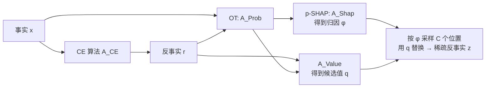

# Joint Distribution–Informed Shapley Values for Sparse Counterfactual Explanations

**会议**: ICLR 2026  
**OpenReview**: [https://openreview.net/forum?id=3vIe5pNiUN](https://openreview.net/forum?id=3vIe5pNiUN)  
**代码**: [https://github.com/youlei202/XAI-COLA](https://github.com/youlei202/XAI-COLA)（PyPI: `xai-cola`）  
**领域**: 可解释 AI / 特征归因 / 反事实解释  
**关键词**: Counterfactual Explanation, Shapley Value, Optimal Transport, Sparsity, Post-hoc XAI  

## 一句话总结
提出 COLA 框架：用最优传输（OT）在事实集与反事实集之间求一个耦合矩阵，再用它驱动 Shapley 归因（p-SHAP）来精修任意现成的反事实解释，使其在保持目标翻转效果的前提下只改 26–45% 的原始特征。

## 研究背景与动机
**领域现状**：可解释 AI 里有两条主线——特征归因（FA，如 Shapley 值）告诉你"哪个特征重要"，反事实解释（CE）告诉你"怎么改输入才能翻转预测"。前者偏诊断、后者偏行动。CE 算法已有上百种，分别面向单实例、群组、全局、分布等不同场景，且有的要求模型可微、有的只服务树模型。

**现有痛点**：CE 方法普遍"过度修改"——为翻转一个预测改动了比必要数量更多的特征，降低了解释的清晰度与可执行性（actionability）。一个直觉解法是"先跑 FA 挑出重要特征，只改这些"，但论文指出 FA 与 CE **解耦**会适得其反：常规重要性高的特征未必正好落在通往目标反事实结果的路径上。

**核心矛盾**：要在不假设模型结构、不绑定某个特定 CE 生成器的前提下，找到一个**动作最少**（稀疏）的修改方案，同时保住反事实效果——这本质是一个 L0 稀疏约束的组合优化，即使 d=1 的线性模型也是计算困难的。

**本文目标**：给定一组事实实例，设计一个需要**最少特征修改**就能达到期望反事实结果的行动计划，且方法对模型与 CE 生成器都保持 agnostic。

**核心 idea**：**用 OT 耦合替代随机基线**——把 FA 中"特征缺失用什么参考值代替"这个老问题，从随机背景分布升级为 OT 求得的事实↔反事实最优对齐，让 Shapley 归因的注意力质量集中在"性价比最高的修改路径"上，从而引导贪心选择丢弃非必要特征。

## 方法详解

### 整体框架
COLA（COunterfactuals with Limited Actions）是一个 model- 和 generator-agnostic 的后处理框架：先用任意 CE 算法拿到一份反事实 $r$，再用 OT 在事实 $x$ 与 $r$ 之间求联合分布 $p$，用 $p$ 同时驱动 Shapley 归因（得到选哪些特征的概率）和取值（得到改成什么值），最后在不超过 $C$ 次修改的预算内精修出稀疏反事实 $z$。

### 关键设计

**1. p-SHAP：把"特征缺失的参考值"统一为联合分布问题。** 经典 Shapley 归因都要回答"某特征缺席时用什么值代替"：B-SHAP 用单个固定基线、RB-SHAP 用训练集背景分布的期望、CF-SHAP 用每个实例的反事实分布。论文把它们统一写成一个由联合概率 $p$ 参数化的集合函数 $v^{(i)}(S)=\mathbb{E}_{r\sim p(r\mid x_i)}\big[f(x_{i,S};r_{F\setminus S})\big]-\mathbb{E}_{r\sim p(r)}[f(r)]$，其中 $p=A_{\text{Prob}}(x,r)$。当 $A_{\text{Prob}}$ 取不同形态时，p-SHAP 优雅退化为 B-SHAP（确定 $i\leftrightarrow j$ 对齐）、RB-SHAP（与 CE 无关的任意分布）或 CF-SHAP（已知 CE 分布），因此它是这三者的真正母集。

**2. 用熵正则 OT 求联合分布，把归因变成"运输问题"。** p-SHAP 的关键不是随机基线，而是用 OT 求出的最优耦合 $p^{OT}$ 作为联合分布。它求解 $p^{OT}=\arg\min_{p\in\Pi(\mu,\nu)}\sum_{i,j}p_{ij}\lVert x_i-r_j\rVert_2^2+\varepsilon\sum_{i,j}p_{ij}\log\frac{p_{ij}}{\mu_i\nu_j}$，其中第一项是把事实搬到反事实的运输代价、第二项是熵正则（$\varepsilon>0$ 用 Sinkhorn 加速）。这一步把特征归因从"预测值分解"重新诠释为"最小化解释成本的运输问题"，也是它区别于 CF-SHAP 的核心：$A_{\text{Prob}}$ 只依赖事实与反事实本身、与具体 CE 生成机制无关，从而避免被不同 CE 生成器的随机性污染。

**3. 双重理论保证：成本上界 + 不远离事实。** 在 $f$ 满足 Lipschitz 连续（常数 $L$）时，定理 4.1 给出 $W_1(f(x),y^*)\le L\sqrt{\sum_{i,j}p^{OT}_{ij}\lVert x_i-r_j\rVert_2^2}\le L\sqrt{\sum_{i,j}p_{ij}\lVert x_i-r_j\rVert_2^2}$，即 $p^{OT}$ 在所有传输计划里给出反事实效果违背量的**最紧上界**——这是 NP-hard 的 L0 稀疏问题的一个凸代理，引导算法把归因质量压到最高效路径上。定理 4.2 进一步证明 $v^{(i)}(S)$ 等于在特征 $S$ 上做 do 干预后的因果效应 $\mathbb{E}[f(r)]+v^{(i)}(S)=\mathbb{E}[f(r)\mid do(r_S=x_{i,S})]$，赋予归因干预语义。定理 5.1 保证精修结果不会比对齐参考更远离事实：$\lVert z-x\rVert_F\le\lVert q-x\rVert_F$。

**4. COLA 算法：归因当策略、采样定动作。** 拿到归因矩阵 $\phi$（取 Shapley 值逐元素绝对值后归一化到和为 1）后，把它当成选位置的概率策略——按 $\phi$ 采样 $C$ 对 $(i,k)$ 令 $c_{ik}=1$；同时 $A_{\text{Value}}$ 从 $r$ 和 $p$ 计算候选值矩阵 $q$（$A^{\max}$ 取概率最大的那一行 $q_{ik}=r_{\tau(i),k},\ \tau(i)=\arg\max_j p_{ij}$；$A^{\text{avg}}$ 取加权平均）；最后只在 $c_{ik}=1$ 处把 $x_{ik}$ 改成 $q_{ik}$，其余保持不动，得到稀疏反事实 $z$。整体复杂度为 $O(M_{CE})+O(nm\log(1/\varepsilon))+O(ndM_{\text{Shap}})+N$。

## 实验关键数据

### 实验设置
4 个二分类数据集（HELOC / German Credit / Hotel Bookings / COMPAS）× 5 种 CE 算法（DiCE、AReS、GlobeCE、KNN、Discount，覆盖单实例/群组/分布型目标）× 12 个分类器（Bagging、LightGBM、SVM、GP、RBF、XGBoost、DNN、RandomForest、AdaBoost、GradBoost、LR、QDA），一个"场景"= 数据集 × CE 算法 × 模型。对比 6 种方法，其中 CF-pOT 即提出的 p-SHAP，其余为消融基线。

### 主实验：动作最小化（达到 80% / 100% 反事实效果所需修改特征数）

| 数据集 | 方法 | 80% 效果 #改特征 | $\lVert z-x\rVert/\lVert r-x\rVert$ | 100% 效果 #改特征 | 比例 |
|---|---|---|---|---|---|
| German Credit | CF-pOT | 1.70(±0.02) | 24.3% | 3.13(±0.03) | 44.9% |
| Hotel Bookings | CF-pOT | 2.50(±0.03) | 14.6% | 4.44(±0.02) | 26.0% |
| COMPAS | CF-pOT | 1.25(±0.03) | 14.8% | 2.45(±0.03) | 30.0% |
| HELOC | CF-pOT | 2.35(±0.03) | 13.4% | 7.745(±0.05) | 44.7% |

关键观察：**只有 CF-pOT（p-SHAP）能达到 100% 反事实效果**，而 RB-pUni / RB-pOT / CF-pUni / CF-pRnd 多数情况下连 80% 都达不到（表中以 "–" 标记）。达到 80% 效果时 p-SHAP 仅需 13–25% 的特征改动。

### 消融实验（Result II，Figure 3：横轴允许修改数 C，纵轴 $D(f(z),y^*)$）

| 对比对 | 结论 |
|---|---|
| RB-pUni/RB-pOT vs 其它 | RB 系（不用 CE 信息）显著最差 → FA 必须用上 CE 信息 |
| CF-pOT vs RB-pOT | 两者只差在 $A_{\text{Shap}}$；CF-pOT 更优 → OT 的增益来自事实-反事实对齐本身 |
| CF-pOT vs CF-pUni/CF-pRnd | p-SHAP 显著更优 → 光有 CE 信息不够，必须有 OT 给出的恰当对齐 |

### 关键发现
- **解耦 FA 与 CE 适得其反**：常规重要特征未必落在通往目标的路径上（Result II 验证）。
- **OT 对齐胜过"真实 CE 对齐"**：Result III 中，即便和已知精确事实-反事实对齐的 CF-pEct 对比，OT 联合分布仍能在 German Credit 上逼近 MILP 最优，说明"消除 CE 生成机制影响"是有益的。

## 亮点与洞察
- **统一视角**：把 B-/RB-/CF-SHAP 统一进一个由联合分布参数化的母框架 p-SHAP，三者只是 $A_{\text{Prob}}$ 的特例，理论上干净。
- **视角转换**：把"特征归因"从预测值分解重新诠释为"最小化解释成本的最优传输"，给 Shapley 的基线选择提供了一个有原则的答案。
- **即插即用**：model- 和 generator-agnostic，能精修任意现成 CE 的输出而无需重训或假设可微，工程落地友好（已发 PyPI 包）。
- **理论扎实**：成本上界、do-干预语义、邻近性保证三条定理覆盖了"为什么有效""归因含义""不会变差"三个问题。

## 局限与展望
- **依赖上游 CE 质量**：COLA 是后处理精修，若初始 $r$ 本身偏差大，OT 对齐也救不回来。
- **MILP 最优性验证范围窄**：Result III 仅在 German Credit 上做（MILP 计算太重），近最优性的普适性证据有限。
- **OT 成本是 L0 的凸代理**：定理只 bound 运输成本，与真正的离散稀疏目标之间仍有 gap，靠贪心采样桥接。
- **仅二分类表格数据**：4 个数据集都是表格二分类，未涉及高维/图像/文本等更复杂模态。
- **超参敏感性**：熵正则 $\varepsilon$、预算 $C$ 的选择对结果的影响缺乏系统分析。

## 相关工作与启发
- **Shapley 归因谱系**：B-SHAP（Lundberg & Lee 2017）、RB-SHAP（SHAP 库）、CF-SHAP（Albini et al. 2022）——本文把它们收编为 p-SHAP 的特例。
- **反事实解释**：DiCE、AReS、GlobeCE、KNN-CE、Discount（You et al. 2025）覆盖单实例/群组/分布型目标，COLA 站在它们之上做稀疏化。
- **最优传输 × 可解释性**：把 Sinkhorn OT 引入特征归因的基线对齐，是"用 OT 做模型解释"这一线的新落点。
- **启发**：当两个解释工具（FA 与 CE）单用都有短板时，用一个统一的概率耦合把它们 join 起来，往往比简单串联更有效——这一"耦合优于解耦"的思路可迁移到其它解释模块的组合。

## 评分
- **新颖性**: ⭐⭐⭐⭐ — 把 OT 耦合引入 Shapley 基线选择并统一三类 SHAP，视角新颖、理论干净，但 OT+Shapley+CE 的组件本身都是已有工具的拼装。
- **实验充分度**: ⭐⭐⭐⭐ — 4 数据集 × 5 CE × 12 模型的组合很全面，消融设计严谨；但限于表格二分类、MILP 最优性仅一例。
- **写作质量**: ⭐⭐⭐⭐ — 问题动机清晰、统一框架与退化关系讲得透，定理与算法配图（Figure 2）易懂。
- **价值**: ⭐⭐⭐⭐ — 即插即用、agnostic、有 PyPI 包，对需要可执行稀疏反事实解释的实际场景（信贷、医疗）有直接落地价值。

<!-- RELATED:START -->

## 相关论文

- [\[CVPR 2026\] Back to the Feature: Explaining Video Classifiers with Video Counterfactual Explanations](../../CVPR2026/interpretability/back_to_the_feature_explaining_video_classifiers_with_video_counterfactual_expla.md)
- [\[ICML 2025\] DeltaSHAP: Explaining Prediction Evolutions in Online Patient Monitoring with Shapley Values](../../ICML2025/interpretability/deltashap_explaining_prediction_evolutions_in_online_patient_monitoring_with_sha.md)
- [\[ICLR 2026\] PolySHAP: Extending KernelSHAP with Interaction-Informed Polynomial Regression](polyshap_extending_kernelshap_with_interaction-informed_polynomial_regression.md)
- [\[NeurIPS 2025\] SHAP Values via Sparse Fourier Representation](../../NeurIPS2025/interpretability/shap_values_via_sparse_fourier_representation.md)
- [\[CVPR 2026\] MedLIME: A Distribution-Aligned and Evidence-Supported Framework for Medical Saliency Explanations](../../CVPR2026/interpretability/medlime_a_distribution-aligned_and_evidence-supported_framework_for_medical_sali.md)

<!-- RELATED:END -->
