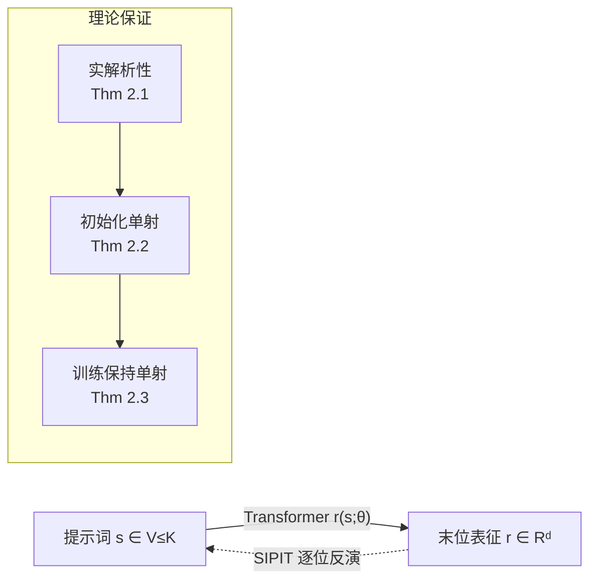

# Language Models are Injective and Hence Invertible

**会议**: ICLR 2026  
**arXiv**: 待确认（OpenReview: [0kHbD6ad07](https://openreview.net/forum?id=0kHbD6ad07)）  
**代码**: [github.com/giorgosnikolaou/SIPIT](https://github.com/giorgosnikolaou/SIPIT)  
**领域**: 可解释性 / Transformer 理论  
**关键词**: 单射性, 可逆性, 实解析函数, 提示词反演, SIPIT, 隐藏状态  

## 一句话总结
本文从数学上证明了 decoder-only Transformer 语言模型几乎必然是**单射**（不同提示词产生不同的末位 token 表征），并据此提出 SIPIT 算法，能在线性时间内从隐藏状态**精确**重建输入文本。

## 研究背景与动机
- **领域现状**：人们普遍假设 Transformer 是「有损」的。因为它大量依赖非线性激活、LayerNorm（沿样本统计量做归一化）、以及多对一的注意力机制，直觉上这些组件会丢弃信息——不同输入可能塌缩到同一个隐藏状态。
- **现有痛点**：这种「有损」直觉直接引发了对透明度、鲁棒性与安全部署的担忧：如果文本和表征之间的映射本质上是有损的，那就无法从模型内部状态精确恢复输入，可解释性与探针分析也失去了可靠的根基。
- **核心矛盾**：单个组件（LayerNorm、残差相消、注意力秩衰减）确实是非单射的，但**整体的「离散提示词 → 连续表征」映射**是否也非单射？此前没有人严格回答过这个问题——它被当作公理而非定理。
- **本文目标**：把这个「长期被假设的性质」替换成一个「严格的定理」，并把它从理论变成可操作的工具（精确反演算法）。
- **核心 idea**：**「整体视角 + 实解析性」**——不去看单个组件，而是把整个 Transformer 看作参数 θ 的实解析函数；实解析函数的零集要么处处为零，要么测度为零。只要能构造**一组**让两个提示词不碰撞的参数，碰撞集就必然是测度零，从而几乎处处单射。

## 方法详解

### 整体框架
论文分两步走：先用实分析工具证明「Transformer 几乎必然单射」（初始化时成立，训练过程保持），再把这个存在性结论转化为构造性算法 SIPIT，利用 Transformer 的**因果结构**逐位置精确反演出原始提示词。

### 关键设计

**1. 实解析性奠基：把碰撞集压成测度零。** 整篇证明的地基是 Theorem 2.1——固定嵌入维度 $d$ 和上下文长度 $K$ 后，映射 $(s,\theta)\mapsto r(s;\theta)\in\mathbb{R}^d$ 关于参数 $\theta$ 是**实解析**的。原因是每个积木都实解析：嵌入与投影是多项式、注意力的 softmax 是指数函数、带 $\varepsilon>0$ 的 LayerNorm 是倒数平方根、MLP 用解析激活（tanh/GELU），而实解析函数对加、乘、商、复合都封闭。这一步的威力在于：实解析函数有一个「二分法」——要么恒为零，要么其零集的 Lebesgue 测度为零。于是「碰撞」（两个不同提示词产生完全相同表征）只可能发生在测度零的参数集上，是数学上的例外而非常态。

**2. 初始化几乎必然单射：只需举一个反例。** Theorem 2.2 把单射性落到初始化。对任意两个不同提示词 $s\neq s'$，定义 $h(\theta)=\|r(s;\theta)-r(s';\theta)\|_2^2$，它由第 1 点是实解析的。要排除「$h\equiv0$」这一病态情况，只需**构造出一组**让 $r(s)\neq r(s')$ 的参数即可：若 $s,s'$ 在末位不同，就冻结网络让末位状态退化为「嵌入+位置」，选不同的行就分开了；若在更早位置 $i^\star$ 首次不同，就调一个注意力头让末位几乎完全注意到 $i^\star$、把它的 token 编码进 value，从而强制输出不同。既然 $h\not\equiv0$，碰撞集 $\{\theta:h(\theta)=0\}$ 测度为零；而标准初始化（Gaussian / uniform / Xavier）都有密度，采到这种参数的概率为零。

**3. 训练保持单射：梯度下降是体积保持的换元。** Theorem 2.3 说明训练不会破坏单射。单步 GD 是映射 $\phi(\theta)=\theta-\eta\nabla L(\theta)$；因为网络和 softmax 交叉熵损失都实解析，$\phi$ 也实解析，其 Jacobian 行列式 $\det D\phi(\theta)$ 实解析且不恒为零，故 $\{\det D\phi=0\}$ 测度为零。在其余处由反函数定理，$\phi$ 是局部可逆的光滑换元——可以拉伸弯曲空间，但**不能把正体积区域塌缩到低维集合**上。因此把绝对连续分布通过 $\phi$ 推前仍是绝对连续分布；逐步复合，任意有限步 GD 都保持参数分布的绝对连续性，单射性也就「以概率 1」保持。推论进一步覆盖了 SGD、mini-batch（任意 batch 选择）以及有限提示词集合的两两可区分。

**4. SIPIT：用因果结构把单射变成线性时间反演。** 单射只保证「能逆」，SIPIT（Sequential Inverse Prompt via ITerative updates）回答「怎么逆」。关键利用 Transformer 的**因果性**：位置 $t$ 的隐藏状态只依赖前缀 $\langle s_1,\dots,s_{t-1}\rangle$ 和当前 token $s_t$。于是已知前缀时，观测到的 $\hat h_t$ 唯一确定 $s_t$——把每个候选 token $v_j$ 接到前缀后算出 $h_t(\pi\oplus v_j)$，看哪个落进观测状态的 $\varepsilon$-球即可命中。逐位置迭代（候选顺序可用随机策略或梯度引导策略）就重建出整条序列。Theorem 3.1 保证最多 $T|V|$ 步以概率 1 精确恢复（线性时间）；Theorem 3.2 进一步给出**鲁棒性**：只要每步扰动 $\|e_t\|_2<\Delta_{\pi_t,t}/2$（$\Delta$ 是相邻候选 token 表征的最小间距），仍能精确恢复，这正是它对量化噪声鲁棒的理论依据。

## 实验关键数据

### 主实验：寻找碰撞（§4.1）
从 wikipedia-en / C4 / The Pile / python-github-code 混合采样 10 万提示词，约 **50 亿次**两两比较，跨 6 个 SOTA 模型与所有层**未发现任何碰撞**。末位表征最小 $\ell_2$ 距离远高于碰撞阈值 $10^{-6}$：

| 模型 | layer 1 | layer L/2 | layer L |
|---|---|---|---|
| Llama-3.1-8B | 0.001 | 0.129 | 0.620 |
| Mistral-7B-v0.1 | 0.002 | 0.187 | 1.274 |
| Phi-4-mini-instruct | 0.014 | 1.336 | 9.020 |
| TinyStories-33M | 0.029 | 1.434 | 2.793 |

距离随深度增大；穷举碰撞测试在「最接近的 10 个前缀」上每模型 **3430 亿+** 对候选仍无碰撞。

### 反演实验（§4.2，GPT-2 Small，每条 20 token）

| 方法 | 平均时间 (s) | 准确率 |
|---|---|---|
| HARDPROMPTS | 6132.59 ± 104.61 | 0.00 |
| BRUTEFORCE (ours) | 3889.61 ± 691.17 | 1.00 |
| **SIPIT (ours)** | **28.01 ± 35.87** | **1.00** |

### 鲁棒性与词表缩放（FP4 量化模型）

| 模型 | 词表 | 准确率 | 探索词表比例 |
|---|---|---|---|
| Mistral-7B-v0.1 | 32000 | 100% | 0.19 ± 0.08 % |
| Llama-3.1-8B | 128255 | 100% | 0.21 ± 0.10 % |

### 关键发现
- **量化不破坏单射反而拉大间距**：FP4/INT8 量化后最小距离比 FP32 翻倍以上，且 14B/70B 大模型依旧保持清晰间隔。
- SIPIT 平均只探索 **<0.22%** 的词表即可 100% 恢复，跨两种词表规模比例近乎恒定，经验证实了线性缩放。
- 反演时间随层深仅轻微上升（浅层迭代更多、深层信息更丰富，二者抵消）。

## 亮点与洞察
- **把直觉证伪**：用一行实分析二分法（实解析函数零集测度为零）就把「Transformer 有损」的长期假设，替换成「几乎处处无损」的定理，且对**有限宽度、有限深度、有限训练步**都成立，而非渐近理想化。
- **存在性 → 构造性**：单射证明只保证「能逆」，论文不满足于此，再用因果结构给出 SIPIT，把抽象的可逆性变成可跑、可证、线性时间的工具。
- **精确指出何时会碰撞**：理论同时刻画了「故意」制造碰撞的途径——量化、权重绑定（两个 token 共享嵌入）、非解析激活——这反过来说明标准流水线下碰撞概率为零。
- **作者署名顺序由 Mario Kart 决定**，是论文里少见的彩蛋。

## 局限与展望
- **威胁模型不完整**：SIPIT 假设能拿到某一层**所有位置**的隐藏状态（如泄露的 KV-cache、共享推理管线、暴露中间表征的 API）；仅从最终单个嵌入做高效反演虽理论上可行，但作者明确留作未来工作。
- **失败案例可人为构造**：对抗者若把两个 token 赋成完全相同的嵌入、或令两个位置编码精确相等并抑制其他位置信号，就能手工制造碰撞——单射是「几乎必然」而非「绝对」。
- **穷举不可行**：提示词数量随序列长度指数增长，真正的全空间搜索做不到，实验只能做受控的穷举近似。
- **隐私双刃剑**：可逆性对可解释性是利好，但也意味着隐藏状态泄露等价于明文泄露，对安全部署提出新要求。

## 相关工作与启发
- **Transformer 组件的非单射性**：LayerNorm 沿样本统计量塌缩（Ba 2016）、纯注意力栈秩随深度双指数衰减（Dong 2021）、softmax 瓶颈（Yang 2018）——本文的关键转折是把视角从「$\mathbb{R}^d$ 上的组件函数」换到「离散提示词 → 连续表征」的整体映射，后者才是真正单射的对象。
- **语言模型反演**：HARDPROMPTS（Wen 2023）用梯度做近似提示词发现；Morris 2023、Nazir 2025 等在黑盒下用 logprob/logit 序列训练辅助反演器，输出近似且不保证精确。SIPIT 与它们互补但不可直接比较——它是**白盒、训练无关、从隐藏状态精确反演**。
- **启发**：实解析性 + 零集二分法是分析神经网络结构性质的利器，这套框架或可推广到「编码器 Transformer 是否单射」「扩散模型潜空间是否可逆」等问题。

## 评分
- **新颖性**: ⭐⭐⭐⭐⭐ 把被默认为公理的「有损性」彻底证伪，并替换成严格定理，视角切换（组件→整体映射、$\mathbb{R}^d$→离散到连续）极为漂亮。
- **实验充分度**: ⭐⭐⭐⭐ 6 个模型、50 亿+（穷举 3430 亿+）对比较、量化与大模型覆盖全面；略憾在 SIPIT 反演主表只在 GPT-2 Small 上系统评测。
- **写作质量**: ⭐⭐⭐⭐⭐ 定理—证明草图—直觉解释三层递进，配图（实解析零集、碰撞箱线图）清晰，可读性极佳。
- **价值**: ⭐⭐⭐⭐⭐ 为可解释性、探针、因果分析提供了「表征无损」的坚实地基，同时对隐私安全提出严肃警示，理论与工程双重影响。

<!-- RELATED:START -->

## 相关论文

- [\[ICLR 2026\] Inducing Dyslexia in Vision Language Models](inducing_dyslexia_in_vision_language_models.md)
- [\[ICLR 2026\] On the Predictive Power of Representation Dispersion in Language Models](on_the_predictive_power_of_representation_dispersion_in_language_models.md)
- [\[ICLR 2026\] Learning to Interpret Weight Differences in Language Models](learning_to_interpret_weight_differences_in_language_models.md)
- [\[ICLR 2026\] Latent Concept Disentanglement in Transformer-based Language Models](latent_concept_disentanglement_in_transformer-based_language_models.md)
- [\[ICLR 2026\] Language Models Use Lookbacks to Track Beliefs](language_models_use_lookbacks_to_track_beliefs.md)

<!-- RELATED:END -->
