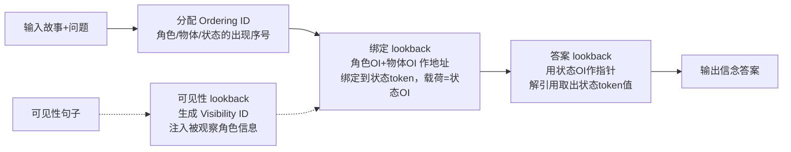

# Language Models Use Lookbacks to Track Beliefs

**会议**: ICLR 2026  
**OpenReview**: [https://openreview.net/forum?id=6gO6KTRMpG](https://openreview.net/forum?id=6gO6KTRMpG)  
**代码**: [https://belief.baulab.info](https://belief.baulab.info)  
**领域**: 机制可解释性 / Theory of Mind  
**关键词**: 信念追踪, Theory of Mind, 机制可解释性, 因果中介分析, 因果抽象, 变量绑定, lookback 机制  

## 一句话总结
本文用因果中介与因果抽象方法，逆向工程出大模型追踪角色信念（Theory of Mind）时所依赖的一套通用算法——"lookback 机制"：模型把同一份参考信息复制成"指针"与"地址"两份分置不同 token，靠 QK 注意力回看取出后面要用的"载荷"，由此实现角色—物体—状态的绑定、信念检索与可见性更新。

## 研究背景与动机
- **领域现状**：已有大量研究证明 LM 能在部分 Theory of Mind（ToM）任务上表现良好（如 Sally-Anne 错误信念测试），但这些研究几乎都是**行为层面**的评测——只看模型答得对不对，不揭示模型内部到底用什么计算来表示和操纵"角色的心理状态"。
- **现有痛点**：现有 ToM 数据集是为行为测试设计的，缺少做因果分析所必需的**反事实配对样本**（counterfactual pairs），无法用 activation patching 定位信息流；同时，已有可解释性工作多停留在"信念可被线性探针解码"层面，没有给出端到端的**机制**。
- **核心矛盾**：模型究竟是学到了一个**系统化、可泛化的算法**来追踪冲突信念，还是仅靠表层统计关联蒙对答案？这个问题无法靠行为评测回答。
- **本文目标**：逆向工程 Llama-3-70B / Llama-3.1-405B / Qwen2.5-14B 在追踪角色信念时的内部计算，验证是否存在一个可被因果干预证实的高层算法。
- **核心 idea**：**[机制发现]** 提出并验证一个反复出现的计算模式——**lookback 机制**：源参考信息被复制成"地址（address）"与"指针（pointer）"两份，分别置于较早的"被回看 token"和较晚的"回看 token"，后者通过 QK 注意力回看前者、解引用指针取出"载荷（payload）"。信念追踪正是由 3 个 lookback（绑定 / 答案 / 可见性）级联完成。

## 方法详解

### 整体框架
作者先构造可做因果分析的 **CausalToM** 数据集（两角色各操作一物体改变其状态，可选是否互相可见），用**因果中介分析**粗粒度定位信息流，再用**因果抽象**提出一个不依赖 Transformer 细节的高层因果模型，最后通过**针对性 interchange intervention（活动替换）**把因果模型的变量逐一对齐到 LM 残差流的具体 token 与层，并用 IIA（interchange intervention accuracy）量化对齐程度。整套机制由 3 个 lookback 串成。

### 关键设计

**1. lookback 机制：用"指针—地址—载荷"做条件回看，而非直接搬运。** 这是全文的核心抽象，也是区别于 induction head 的关键。一份源参考信息（source reference）经注意力被复制成两份：一份"地址（address）"留在较早出现的**被回看 token（recalled token）**的残差流里，与一个"载荷（payload）"并置；另一份"指针（pointer）"被搬到文本后面的**回看 token（lookback token）**残差流里。当模型需要这份信息时，指针在回看 token 处构成注意力 query 向量，地址在被回看 token 处构成 key 向量，二者经 $W_Q$、$W_K$ 变换后点积很高，于是建立起一条 QK-circuit 桥梁，模型沿这座桥把载荷经 OV-circuit 搬到回看 token。注意指针与地址**不必是源参考的精确拷贝**，只要变换后高点积即可。这与 induction head 本质不同：induction head 只把前文信息传给紧邻的下一个 token、不做复制；lookback 则把同一信息**同时**复制到"信息所在处"和"将来要取它的目标处"两端。作者给出训练直觉：LM 顺序处理文本、不知道未来会被问什么，于是把关键信息连同地址提前安置好，等问题到来时再构造指针去解引用——这是一种为下游任意问题做的"预先布址"。

**2. 绑定 lookback（Binding lookback）：用 Ordering ID 把角色—物体—状态三元组绑在一起。** 模型先给每个角色 / 物体 / 状态 token 分配 **Ordering ID（OI）**——一个编码"第一个还是第二个出现"的低秩子空间表示（如 Bob=OI₁、Carla=OI₂）。随后把角色 OI 和物体 OI 的**地址拷贝**搬到对应**状态 token** 的残差流，与状态 OI（载荷）并置，从而把"角色—物体—状态"三元组共址绑定在一起。当问题询问某个角色对某物体的信念时，模型在最终 token 处构造该角色与物体 OI 的**指针拷贝**，解引用后取回正确的**状态 OI**。因果实验验证：在状态 token 残差流上交换地址与载荷（层 33–38）能让输出翻转到另一状态；在角色 / 物体 token 上交换源参考、同时冻结状态 token（层 20–34）同样能翻转输出——说明源参考确实编码在角色/物体 token，再被转移到被回看与回看 token。

**3. 答案 lookback（Answer lookback）：用状态 OI 当指针，解引用取回真正的状态词。** 绑定 lookback 取回的是状态的"序号"（状态 OI），还不是答案文本。答案 lookback 把状态 OI 当成指针：状态 OI 的**地址拷贝**留在状态 token 残差流并与**状态词本身（载荷）**绑定，其**指针拷贝**经绑定 lookback 被搬到最终 token；模型解引用该指针，从正确的状态 token 取回词值（如 coffee）作为输出。一个反直觉的强证据：把反事实的"答案指针"打入原始运行（层 34–52），输出会变成**既非原始也非反事实**的第三个值（beer），恰好印证模型是"按指针去取"而非"直接搬运词值"；而交换"答案载荷"（层 56 之后）则输出反事实答案。由此定位答案 lookback 发生在层 52–56。

**4. 可见性 lookback（Visibility lookback）：用 Visibility ID 把被观察者的信息注入观察者的信念。** 当故事显式声明"角色 A 能/不能观察角色 B 的动作"时，模型在该可见性句子处生成一个 **Visibility ID** 作为源参考：其地址拷贝留在可见性句子残差流，指针拷贝转移到后续 token；模型经 QK-circuit 解引用该指针、取出载荷（初步证据表明载荷编码的是**被观察角色的 OI**），从而把被观察者的知识并入观察者的信念状态。因果实验用"可见性翻转"的反事实，分别对齐源参考（层 10–23）、载荷（层 31 之后）、以及同时干预地址+指针（层 24–31 才显著对齐，因为单独干预一端会造成地址—指针失配、抑制解引用），三组实验共同支撑这一机制。

## 实验关键数据

### 主实验：因果模型变量在 LM 中的逐层定位（IIA）

| Lookback / 变量 | 定位 token | 对齐层范围 | 关键现象 |
|---|---|---|---|
| 答案载荷（状态词值） | 最终 token ":" | 层 56 之后 | 交换载荷 → 输出反事实答案（tea） |
| 答案指针（状态 OI） | 最终 token ":" | 层 34–52 | 交换指针 → 输出第三值（beer，非原非反事实） |
| 绑定 地址+载荷 | 状态 token | 层 33–38 | 交换 → 输出翻转到另一状态 |
| 绑定 源参考 | 角色/物体 token | 层 20–34 | 冻结状态 token 后交换 → 输出翻转 |
| 可见性源参考（Visibility ID） | 可见性句子 | 层 10–23 | 翻转可见性 → unknown 变为可见答案 |
| 可见性 地址+指针 | 句子+问答 token | 层 24–31 | 同时干预两端才显著对齐 |

实验在每个模型答对的 **n = 80** 个样本上进行，IIA 同时报告"全残差流"与"识别出的低秩子空间"两种干预，子空间维度低至 14–167 即可承载对应变量。

### 关键发现
- **端到端时间线**：信念追踪始于层 20–34（角色/物体 OI 编码于各自 token）→ 层 33–38（OI 转移到状态 token）→ 层 34（指针拷贝到最终 token 并解引用取回状态 OI）→ 层 34–52 状态 OI 驻留 → 层 52–56 解引用取回答案词。
- **子空间可定位**：每个高层变量都能被压进低维子空间（Desiderata-based Component Masking 学到的稀疏二值掩码），说明这些算法变量是**线性可分离**的真实表示，而非分析者强加的解释。
- **跨模型 / 跨数据集泛化**：同一 lookback 机制在 Qwen2.5-14B 与 Llama-3.1-405B 上复现（附录 N），并能泛化到 BigToM 数据集（附录 M）。
- **机制可泛化性**：lookback 不止服务 ToM，作者认为它是支撑**上下文内推理 / 变量绑定**的基础性通用计算。

## 亮点与洞察
- **把"信念"还原成可干预的算法**：不再停留在"信念能被探针解码"，而是给出从输入到输出、可被反事实因果证实的完整算法链路，把 ToM 从黑箱行为推进到机制层面。
- **"第三值"证据极具说服力**：交换答案指针后输出既非原始也非反事实的现象，是"按指针解引用而非直接搬运"的强因果证据，比单纯的探针相关性硬得多。
- **lookback 与 induction head 的清晰区分**：明确指出二者差异（是否双向复制信息），把一个易混的现象界定为独立机制。
- **方法学示范**：因果中介（定位"哪里"）+ 因果抽象（定位"是什么"）+ 子空间掩码（定位"在哪个方向"）三层递进，是 ToM 乃至变量绑定研究的可复用范式。

## 局限与展望
- **任务高度受控**：CausalToM 只有两角色、两物体、单层可见性关系，结构极简；真实 ToM 涉及多角色、嵌套信念、时序更新，lookback 是否同样组织尚待验证。
- **可见性载荷语义未定**：两角色设定下无法判定可见性 lookback 载荷的确切语义，作者只能给出"载荷≈被观察角色 OI"的初步证据。
- **依赖"答对样本"**：所有分析建立在模型答对的 80 个样本上，对模型**失败**情形的机制（为何会算错信念）未作刻画。
- **展望**：把 lookback 作为上下文推理的通用原语，去解释更广的变量绑定、实体追踪、多跳推理任务，并探究该机制在训练中如何涌现（呼应 Wu et al. 2025 的变量绑定分阶段涌现）。

## 相关工作与启发
- **ToM 行为评测**（Kosinski 2024、Strachan 2024 等）建立了"LM 能否做 ToM"的基准，但缺机制；本文用 CausalToM 补上因果反事实，把问题从"能不能"推到"怎么做到的"。
- **实体追踪 / 变量绑定**：Li et al. 2021（实体状态线性可解码）、Prakash et al. 2024（少量注意力头按位置追踪属性）、Feng & Steinhardt 2023（Binding ID）、Dai et al. 2024（Ordering ID，本文直接复用）共同构成 lookback 的技术地基；本文给出了把这些绑定原语串成端到端 ToM 的机制。
- **ToM 机制可解释性**：Zhu et al. 2024、Herrmann & Levinstein 2024、Bortoletto et al. 2024 证明信念可线性解码、可干预，但未揭示"模型如何用这些表示解题"，本文正是补上这一步。
- **启发**：lookback 的"预先布址、按需解引用"思想，可迁移到任何需要"现在存信息、将来按 key 取信息"的上下文推理分析，是研究 in-context learning 内部寻址机制的有力视角。

## 评分
- **新颖性**: ⭐⭐⭐⭐⭐ 首次把 ToM 信念追踪还原为可因果验证的通用 lookback 算法，并清晰区别于 induction head，机制层面贡献突出。
- **实验充分度**: ⭐⭐⭐⭐ 三层因果方法逐层定位、跨 3 模型 + BigToM 泛化、子空间验证扎实；但受控任务过简、未覆盖失败案例，留有空间。
- **写作质量**: ⭐⭐⭐⭐⭐ 概念抽象（指针/地址/载荷）干净，图示与"第三值"证据讲解清晰，逻辑由表及里。
- **价值**: ⭐⭐⭐⭐⭐ 既深化了对 LM ToM 的理解，又提炼出对上下文推理具普适意义的基础机制，方法范式可复用，影响面广。

<!-- RELATED:START -->

## 相关论文

- [\[ICLR 2026\] Mixing Mechanisms: How Language Models Retrieve Bound Entities In-Context](mixing_mechanisms_how_language_models_retrieve_bound_entities_in-context.md)
- [\[ICLR 2026\] Latent Concept Disentanglement in Transformer-based Language Models](latent_concept_disentanglement_in_transformer-based_language_models.md)
- [\[ICLR 2026\] Linear Mechanisms for Spatiotemporal Reasoning in Vision Language Models](linear_mechanisms_for_spatiotemporal_reasoning_in_vision_language_models.md)
- [\[ICLR 2026\] Medical Interpretability and Knowledge Maps of Large Language Models](medical_interpretability_and_knowledge_maps_of_large_language_models.md)
- [\[ICLR 2026\] Inducing Dyslexia in Vision Language Models](inducing_dyslexia_in_vision_language_models.md)

<!-- RELATED:END -->
