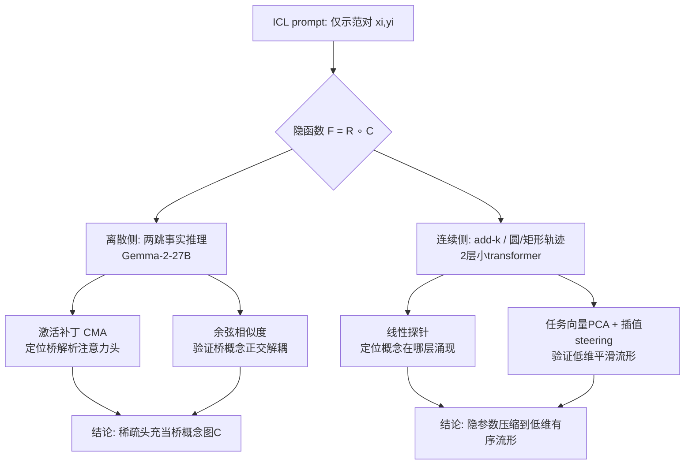

# Latent Concept Disentanglement in Transformer-based Language Models

**会议**: ICLR 2026  
**OpenReview**: [https://openreview.net/forum?id=k3SEVOW2Dg](https://openreview.net/forum?id=k3SEVOW2Dg)  
**代码**: 未公开  
**领域**: 可解释性 / 机制可解释性  
**关键词**: in-context learning, 机制可解释性, 隐变量, 任务向量, 激活补丁, 概念组合  

## 一句话总结
本文用机制可解释性方法证明：transformer 在做 in-context learning 时会显式地把示例里隐含的"概念"解耦出来——离散世界知识任务里由一小簇注意力头先解析出隐藏的"桥实体"再组合出答案，连续数值任务里则把隐参数压缩到一条低维平滑流形上，且这条流形可被线性插值和因果干预。

## 研究背景与动机
**领域现状**：LLM 仅凭几条示范就能在新任务上泛化（in-context learning，ICL），这暗示模型在内部推断出了 prompt 里没明说的"隐概念/隐规则"。已有工作（task vector、function vector、线性表示假设 LRH）发现 ICL 任务的输入-输出关系能被压缩进稀疏的向量方向，但大多停留在单步、简单任务（Country→Capital、反义词、首字母大写）上，且只关注高层 task vector "存在与否"。

**现有痛点**：当任务有更复杂的隐结构时——比如需要多跳推理、或隐变量是连续数值——人们并不清楚 transformer 究竟是走"捷径"直接从输入跳到输出，还是真的在隐藏激活里构造出中间概念再组合。"模型有没有解耦隐概念"和"这些概念在表示空间里长什么样"这两个问题都缺乏机制级证据。

**核心矛盾**：高准确率既可能来自捷径式的记忆映射，也可能来自结构化的概念组合，单看 accuracy 无法区分二者；而要在真实大模型里定位"概念在哪、是不是可复用、几何结构如何"，需要可控到能做因果实验、又能反映真实现象的实验设计。

**本文目标**：用一组干净可控的 ICL 任务，机制性地回答 transformer 是否、以及如何表示与利用隐概念，覆盖"离散世界知识"和"连续数值参数"两类隐结构。

**核心 idea**：把隐函数显式拆成 $F = R \circ C$ —— $C$ 把输入映到低维"概念空间"，$R$ 再把概念精炼成输出；然后用**激活补丁（activation patching）+ 相关性分析 + 线性探针 + 任务向量插值**四件套，分别在预训练 Gemma-2 和从零训练的小 transformer 上定位 $C$、检验它的可迁移性与几何结构。

## 方法详解

### 整体框架
论文不提新模型，而是用统一的"隐概念图 $C$"视角设计两类 ICL 探测任务，并对每类任务跑因果 + 相关两路证据。离散侧用预训练 Gemma-2-27B 做两跳事实推理，靠激活补丁定位负责解析"桥实体"的注意力头；连续侧用从零训练的 2 层 1 头小 transformer 做 add-k / 圆轨迹 / 矩形轨迹，靠线性探针 + 任务向量 PCA + 插值 steering 揭示隐参数的低维几何。

### 关键设计

**1. 两跳"源→目标"任务 + 隐桥假设对撞：把"捷径 vs 真两跳"做成可证伪问题。** 论文把两条共享"桥实体"的事实拼成 ICL 谜题 $\{(S_i, r_1, B_i, r_2, T_i)\}$，prompt 形如 "Sydney, Canberra. Nantes, Paris. Oshawa," 而桥实体（国家）从不出现在 prompt 里——模型只能从示范中自己悟出 $r_1$（属于哪国）和 $r_2$（首都是）。这样就把问题逼成两个对立假设：Hypothesis 1 捷径论认为模型直接把输入映到答案，Hypothesis 2 隐两跳论认为模型先在隐表示里解出桥概念（"Canada"）再精炼成输出（"Canada 的首都"）。关键在于设计了一个判别性的"类型纠正"评测：把一个 [City→Capital] 的 normal prompt 和一个 [Landmark→Calling Code] 的 alternative prompt 配对，如果某组件真是抽象桥概念图 $C$，那它的激活应当**跨源/目标类型迁移**——补进去之后答案应从 Washington 移向 Beijing（桥从 USA 换成 China，但输出类型仍是 Capital），而非退化成 alternative 的字面答案 86。

**2. 因果中介分析（CMA / 激活补丁）定位稀疏的"桥解析头"。** 形式上设 normal/alternative 两个 prompt，缓存末位 token 的注意力头激活 $(a^{(\text{norm})}_{\ell,h}, a^{(\text{alt})}_{\ell,h})$，在 normal 前向中把某头激活替换为 alternative 的对应激活、放任其余前向跑完，再用 logit difference 和答案 rank 的前后变化衡量该组件的因果作用（针对 Gemma-2-27B 的 grouped-query attention，按 2 个一组打补丁，效果比单头更强）。实验发现头组 (24,30;31) 因果效应一枝独秀：在 [University, Code]→[City, Capital] 实验里，打这一组补丁后至少 73% 的样本把类型纠正答案的 rank 推进 top 10、超 40% 直接顶到 top-1，而干预前该答案 rank 通常在数百到数千名。这把"桥解析"这一抽象计算定位到了极稀疏的几个头上。

**3. 余弦相似度验证桥概念的正交解耦。** 单有因果还不够，论文进一步可视化头组 (24,30;31) 在末位 token 的输出嵌入：取 "Italy"/"Spain" 作桥值，跨 12 种桥×源-目标类型组合共 120 条 prompt 算两两余弦相似度。结果显示嵌入按桥值强聚类、跨桥值近正交，且与源/目标类型无关——即同一桥概念的表示内聚、不同桥概念间低维正交，正是隐概念图 $C$ "可复用、低维"的标志。论文还在附录给出：ICL 示例越多，解耦越强、桥头的因果重要性越大；2B 模型只有 27B 这套机制的"弱噪声版"，说明模型规模显著影响隐概念解耦能力。

**4. 数值任务的任务向量几何 + 插值 steering：证明隐参数被压成有序低维流形。** 对从零训练的小 transformer，用线性探针逐层检测概念在哪涌现——发现 add-k 的任务类型在 layer-2 注意力处被解耦、输出在 layer-2 MLP 处算出，于是把 layer-2 注意力末位嵌入（对 200 条序列取均值）当作任务向量。对其做 PCA：add-k 的任务向量落在一条 1D 直线上（首 PC 解释 >99.9% 方差），且偏移量 $k$ 从小到大在流形上左到右有序排列；圆轨迹任务的半径向量落在 2D 平滑流形（前 2 PC 解释 93–97% 方差），半径有序。最关键的是因果插值：令 $t_1, t_K$ 为两端偏移的任务向量，用 $(1-\beta)t_1 + \beta t_K$ 去 steering 模型，输出会被精确推向插值目标偏移 $(1-\beta)k_1 + \beta k_K$（target 的 top-3 准确率≈100%、圆轨迹半径的 MSE 最低）。这说明 layer-2 注意力头就充当了把输入元组映到隐参数的概念图 $C$，且这个映射保了隐变量的几何与序关系。

## 实验关键数据

### 主实验（离散两跳，Gemma-2-27B）

| 实验 | 设置 | 关键结果 |
|------|------|---------|
| 基线准确率 | Source→Target 两跳 ICL | 比单跳更难（需更多示例），20-shot 时高准确率 |
| 桥头补丁 | [University,Code]→[City,Capital] | 打 (24,30;31) 后 ≥73% 样本类型纠正答案进 top-10，>40% 进 top-1（原 rank 数百~数千） |
| 桥概念正交性 | 120 prompt × 12 组合 | 嵌入按桥值强聚类、跨桥值近正交，与源/目标类型无关 |

### 数值任务（2 层 1 头小 transformer）

| 任务 | 任务向量几何 | 方差解释 | Steering 结果 |
|------|------------|---------|--------------|
| add-k | 1D 直线，k 有序 | 首 PC >99.9% | 插值 target top-3≈100% |
| Circular-Trajectory | 2D 平滑流形，半径有序 | 前 2 PC 93.68%–97.05% | target 半径 MSE 最低 |
| Rectangular-Trajectory | 2D 流形（两边长正交分离） | 前 2 PC 主导 | 平滑插值轨迹形状 |

### 关键发现
- **规模决定解耦**：2B 模型只有 27B 桥解析电路的弱噪声版，模型越大隐概念解耦/组合能力越强。
- **示例越多解耦越强**：增加 ICL 示例同时提升桥头因果重要性和桥嵌入的角度可分性，说明模型在更多示范下"更充分地调用"了相关子电路。
- **自然 prompt 可迁移**：把学到的概念嵌入注入开放式生成，能连贯地把生成引向目标国家/实体类型且保持流畅，说明概念不只是"谜题专用"。
- **两段式电路分工明确**：浅层一簇注意力头负责解析中间桥概念，更深处的另一组头与 MLP 负责把抽象桥（如"Canada"）落地成具体输出（如"Ottawa"），印证了 $F=R\circ C$ 的物理分层。
- **跨数据集复用**：在规模更小的 Company 数据集（公司名作桥实体）上同样观察到桥解析机制，且驱动它的注意力头与地理数据集有重叠，说明机制不是单一数据集过拟合的产物。
- **数值与世界知识两类任务呈现同构现象**：无论隐概念是离散世界实体还是连续数值参数，模型都倾向于用稀疏组件 + 低维有序表示来承载它，暗示这可能是 transformer 处理隐结构的一种通用倾向。

## 亮点与洞察
- **把"捷径 vs 真推理"做成可证伪的因果实验**：通过"类型纠正答案"这个判别性指标，干净地把两跳的中间概念从字面答案里剥离出来，避免了 logit difference"只是削弱原答案"的混淆。
- **同时拿到因果 + 相关 + 几何三类证据**：激活补丁给因果、余弦相似度给解耦、PCA+插值给几何，互相印证，结论比单一证据扎实得多。
- **为线性表示假设提供"连续参数化"的新证据**：以往 LRH 多是离散概念方向，本文展示隐参数沿表示方向连续、有序地编码，把 LRH 推进到可插值的连续谱。
- **从零训练给出"几何只来自任务结构"的干净因果**：小模型完全可控，能断言任务向量的几何确实只源于隐任务结构而非预训练杂质，补足了同期 Hu et al. 在大模型上的观察。
- **任务设计兼顾"干净"与"启发性"**：实验既受控到能做电路级分析，又指向"模型会内化任务隐结构、且这些结构可定位可解释"这一更普遍的猜想。

## 局限与展望
- **任务高度受控且简单**：两跳地理/公司、add-k、圆/矩形轨迹都是合成谜题，能否外推到真实复杂多跳推理仍待验证（论文自己也强调这是 stepping stone）。
- **自然 prompt 迁移只是小规模初步证据**：开放式生成 steering 仅作 preliminary，缺乏大规模定量评估。
- **机制定位偏经验**：稀疏桥头、特定层涌现等结论依赖具体模型与数据集，普适性（"任意复杂任务都由稀疏头/低维编码捕获"）目前是 posit 而非定论。
- **缺理论刻画**：为何会形成低维有序流形、规模如何定量影响解耦，论文留到附录 C 作展望，尚无形式化证明。
- **桥头分组打补丁的工程取舍**：为应对 grouped-query attention 而按 2 头一组干预虽然效果更强，但也让"单头职责"的粒度变粗，精确到单个头的归因仍不完全清晰。

## 相关工作与启发
- **ICL 机制可解释性**（Olsson 的 induction head、Todd/Hendel 的 task/function vector）：本文把这条线从单步、简单任务推进到有隐桥的两跳和连续参数化任务。
- **线性表示假设 LRH**（Park 等）：以往找 truthfulness/sentiment/toxicity 等离散概念方向，本文新增"连续隐参数沿方向平滑编码且可插值"的证据。
- **任务/函数向量**（Liu、Merullo、Hu et al. 同期）：本文不止关注高层 task vector 的存在，而是拆解模型如何解耦并组合对回答有用的隐概念，并在完全可控的小模型上确认几何来自任务结构。
- **多跳事实回忆**（TwoHopFact 等）：本文可看作其系统化的 ICL 版本——关系不靠预训练知识硬编码，而需模型从示范中即时推断 source-bridge 与 bridge-target 两段关系。
- **启发**：把"隐函数 = 概念图 ∘ 精炼图"这一分解配上因果+几何的双路探测，是研究更复杂推理（多跳、组合泛化、工具调用）内部机制的一个可复用范式；"任务向量可插值"也提示了用概念几何做可控生成/编辑的潜力。
- **对安全与对齐的延伸**：既然世界知识桥概念可被定位并干预，这套方法也可用于审计模型是否依赖正确的中间事实、或检测/纠正多跳推理中的错误归因。

## 评分
- 新颖性: ⭐⭐⭐⭐ 把隐概念分解 $F=R\circ C$ 与因果+几何双路证据系统结合，并首次给出连续隐参数可插值流形的干净证据，视角新颖。
- 实验充分度: ⭐⭐⭐⭐ 覆盖大模型（27B/2B）离散任务与小模型多类数值任务，因果/相关/探针/插值多重交叉验证，附录详尽；扣分在真实复杂任务与自然 prompt 迁移仅初步。
- 写作质量: ⭐⭐⭐⭐ 假设对撞、实验设计和证据链条叙述清晰，图示直观。
- 价值: ⭐⭐⭐⭐ 为 ICL 机制可解释性和 LRH 提供了可复用的实验范式与扎实证据，对理解 transformer 隐概念组合有较强参考价值。

<!-- RELATED:START -->

## 相关论文

- [\[ICLR 2026\] Hedonic Neurons: A Mechanistic Mapping of Latent Coalitions in Transformer MLPs](hedonic_neurons_a_mechanistic_mapping_of_latent_coalitions_in_transformer_mlps.md)
- [\[ICLR 2026\] Noise Stability of Transformer Models](noise_stability_of_transformer_models.md)
- [\[ICLR 2026\] Latent Thinking Optimization: Your Latent Reasoning Language Model Secretly Encodes Reward Signals in Its Latent Thoughts](latent_thinking_optimization_your_latent_reasoning_language_model_secretly_encod.md)
- [\[ICLR 2026\] Emotions Where Art Thou: Understanding and Characterizing the Emotional Latent Space of Large Language Models](emotions_where_art_thou_understanding_and_characterizing_the_emotional_latent_sp.md)
- [\[ICLR 2026\] Medical Interpretability and Knowledge Maps of Large Language Models](medical_interpretability_and_knowledge_maps_of_large_language_models.md)

<!-- RELATED:END -->
