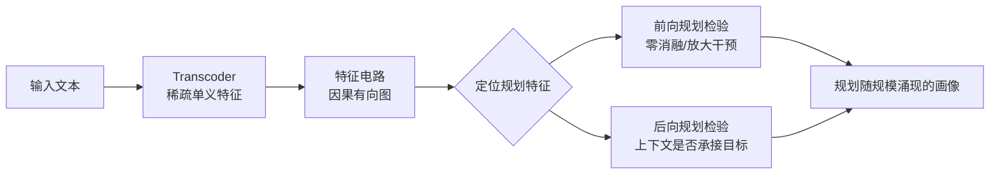

# Latent Planning Emerges with Scale

**会议**: ICLR 2026  
**OpenReview**: [https://openreview.net/forum?id=H0B7pDTT0M](https://openreview.net/forum?id=H0B7pDTT0M)  
**代码**: [https://github.com/hannamw/model-planning-public](https://github.com/hannamw/model-planning-public)  
**领域**: 可解释性 / 机制可解释性（Mechanistic Interpretability）  
**关键词**: 隐式规划、特征电路、Transcoder、Qwen-3、规模效应、AI 安全  

## 一句话总结
作者给"LLM 隐式规划"下了一个**可因果验证**的定义（前向规划 + 后向规划），用 transcoder 特征电路在 Qwen-3（0.6B–14B）家族上做实验，发现规划能力随模型规模涌现：简单语法一致任务（a/an）在 14B 才稳定成功，押韵对句任务里模型只会前向规划而几乎不会后向规划。

## 研究背景与动机
**领域现状**：LLM 能写连贯故事、生成正确代码，这些任务看上去需要"规划"——即推理为达成目标该走哪些步骤——但模型并没有把计划显式说出来。这种"隐式规划"如果存在，会带来 AI 安全隐患：模型可能在不惊动外部监控的情况下"暗中盘算"。

**现有痛点**：以往关于隐式规划的证据基本都是**观测性**的。研究者用探针（probe）或 Patchscopes 从模型激活里解码出"未来 token / 文本属性"，就把"能解码"当作"在规划"。但探针众所周知会解码出模型并未真正使用的信息——一个总是输出固定 token、或输出 0,2,4,6… 的模型，其未来 token 也能被探针预测，可这显然不需要规划。

**核心矛盾**：**可解码性 ≠ 因果使用**。要证明规划，必须给出因果证据，而非相关性证据。此前只有 Lindsey 等人（2025）在闭源模型上提供了因果证据，开源模型上的机制证据极其有限。

**本文目标**：（1）给隐式规划一个能被因果检验的严格定义；（2）在一个可控的开源模型家族上，量化规划能力如何随规模变化，并找出底层机制。

**核心 idea**：**【定义即贡献】** 把规划拆成两个必须同时成立的因果条件——*前向规划*（某内部表征因果导致模型在未来位置输出目标 token t）和 *后向规划*（该表征还因果导致模型生成一个能"承接"t 的上下文）。**【机制证据】** 用 transcoder 特征电路把这两条件落到可干预、可观测的具体特征上，再在 Qwen-3 五个尺寸上扫描，得到"规划随规模涌现"的机制画像。

## 方法详解

### 整体框架
方法分三步：先用 **transcoder** 把每层 MLP 的稠密多义激活分解成稀疏单义特征；再对单条输入构造 **特征电路**（feature circuit）——一张刻画输入、特征、logit 之间因果直接效应的加权有向无环图；最后在三类任务（简单语法一致、押韵对句、散文中受控引导）上，用电路定位"规划特征"并做消融/放大干预，验证它们是否满足前向/后向规划两条件。

### 关键设计

**1. 把"规划"重定义为两条因果条件：从可解码升级到可干预。** 作者反对把"未来 token 能被探针解码"等同于规划，转而要求一个针对目标 token 或概念的内部表征同时满足：条件一（前向规划）——它*因果导致*模型在位置 $n+k,\ k>1$ 输出特定 token $t$，比仅"可预测"更强；条件二（后向规划）——它*因果导致*模型产出一个能承接 $t$ 的上下文。一个关键判别例子是 "The capital of Texas is Austin"：模型在 Texas 处可能已有 Austin 表征，消融它会让模型不再输出 Austin（满足前向），但这只有在 Austin 表征还导致模型先输出 "is" 时才算后向规划——而不知道 Austin 也能预测出 "is"，所以这里并非真正的后向规划。这个定义把"规划"从松散的相关性标签收紧成必须靠干预才能坐实的机制主张。

**2. 用 transcoder 特征电路把抽象条件落到可干预节点上。** Transcoder 是替代 MLP 的辅助模型：输入一层 MLP 的激活 $h\in\mathbb{R}^d$，算出稀疏表征 $z=f(W_{\text{enc}}h+b_{\text{enc}})$，再重建该 MLP 输出 $\tilde{h}'=W_{\text{dec}}z+b_{\text{dec}}$。它训练成稀疏且单义，便于把"模型在想 accountant"这种概念对应到具体特征。在此之上构造的特征电路是一张加权有向无环图，边权是源节点对目标节点的**精确直接效应**（在给定注意力模式和 LayerNorm 分母条件下可被精确计算），于是"哪个特征因果地推高了正确 token"变成可读、可干预的子图——图 1 中 Qwen-3 14B 的 *accounting* 特征推高 *accountant* 特征、后者再推高冠词 *an*，整条链条一目了然。这一步是把前一节的因果定义变成可执行实验的桥梁。

**3. 设计简单语法一致任务作为规划的最小可控测试床。** 作者构造三类任务（a/an、is/are、el/la），每条输入逼模型输出一个特定内容词，而它前面有一个必须与之"一致"的功能词，功能词的形式由后面的内容词决定——例如 "Someone who handles financial records is __ accountant" 必须填 an，因为 accountant 以元音开头。这些任务被刻意选成预训练中常见的形态，且把"是否规划"压缩成一个二选一的功能词预测，让因果干预的效果（消融让 p(正确) 下降、放大让其上升）能干净地读出来。它是验证两条件的最小载体，也是观察规模涌现的起点。

**4. 双向干预 + 直接效应隔离，分离"真规划"与"捷径"。** 为坐实规划特征确实驱动预测，作者做两类干预：对成功样本把规划特征**零消融**（应使表现变差），对失败样本把规划特征**放大到 5 倍**（应使表现变好）。结果两种干预主要影响少数类 an（模型要逆着先验工作的情形），符合预期。但这还不够——*accountant* 特征可能只是碰巧与 *an* 的 unembedding 余弦相似度高，靠直接效应推高 logit，无需真正规划。为此作者做**直接效应干预**：放大规划特征但冻结其它特征，阻断二阶效应；此时效果显著减弱（放大干预帮倒忙的次数和帮忙差不多），说明规划特征的作用无法用直接效应解释，必须经由 "say a/an" 这类中介特征——也即真的存在前向+后向的规划链路，而非词表捷径。

## 实验关键数据

### 主实验：规划能力随规模涌现

| 任务 | 现象 | 涌现规模 |
|------|------|---------|
| a/an（语法一致） | 全部模型对多数类 a 召回 >0.8；少数类 an 召回 >0.8 仅 Qwen-3 14B 达到，中等模型平滑上升，0.6–1.7B 总是预测多数类 | ~4B–8B 出现雏形，14B 稳定成功 |
| 押韵对句（rhyme） | 大模型完美押韵准确率 50%+，14B 约 60%；放宽到协音（仅元音）押韵 8B 已 >70%，14B 达 0.8 | 押韵能力随规模上升 |
| 散文受控引导（say X） | 引导 say X 特征常能让模型输出 X；其中连贯且含 X 的输出里，大模型更会把上下文改写成 "in the night" 等完整短语 | 后向规划仅在 8B–14B 微弱显现 |

### 消融 / 干预实验

| 干预 | 对 a/an 任务的效果 | 结论 |
|------|------|------|
| 规划特征零消融 | 损害表现，但几乎只作用于少数类 an | 规划特征对"逆先验"的样本才关键 |
| 规划特征 ×5 放大 | 大幅提升 an 准确率，大模型提升略多；对 a 几乎无效 | 因果相关，且 4B/8B 与 14B 用相似机制 |
| 仅直接效应干预 | 效果明显减弱，放大有时反而帮倒忙 | 规划不能由直接效应解释，需经 "say a/an" 中介特征 |
| 押韵特征引导（首行 ×-3，新韵 ×7） | 8B–14B 模型会改输出成新韵（前向规划成立，准确率约 40%，与基线 60% 同量级） | 前向规划随规模成立 |
| 押韵后向规划检验 | 给"引导生成的上下文"与"原上下文"，模型预测新韵的准确率几乎相同 | 引导后的上下文并未更好地"承接"新韵 → **后向规划基本缺失** |

### 关键发现
- **前向规划比后向规划发展得更快**：简单任务上 4B–8B 已有规划相关特征（即便整体表现差），押韵任务上大模型能前向规划改韵脚，但几乎不会反过来改写上下文去承接韵脚。
- **规划是"分块涌现"而非统一机制**：是否在某任务上规划，取决于模型容量 × 任务复杂度 × 任务在训练中的频率/重要性，导致能力零散，而非一套统一规划机制。
- **中等模型失败的根因**：4B/8B 在 an 失败时激活的规划特征远少于成功时；小模型几乎从不激活规划特征；14B 则在成功与失败两种情形都激活大量规划特征。

## 亮点与洞察
- **方法论纠偏**：旗帜鲜明地指出"探针可解码 ≠ 模型在规划"，把规划重新锚定到必须靠因果干预才能验证的两条件上，给后续隐式规划研究立了更严的证据门槛。
- **迄今最大规模的开源模型特征电路研究**：在 Qwen-3 五个尺寸上系统跑特征电路，把"机制如何随规模生长"这件事第一次在开源家族上量化出来。
- **细粒度的"涌现"画像**：不是笼统说"大模型会规划"，而是分出前向/后向、简单/长程，指出二者发展速度不同、且规划是分块拼起来的。

## 局限与展望
- **后向规划证据偏负**：押韵任务上后向规划基本没观测到，长程规划机制是否真的存在、还是只是更强的前向规划，仍未定论。
- **任务偏简单且常见**：刻意选了预训练中高频的语法一致任务，能否推广到真正复杂、低频的规划任务（多步代码、长篇叙事谋篇）尚不清楚。
- **局部规划特征罕见且对引导强度敏感**：say X 类局部规划特征只出现在少数对句里，且效果对引导超参敏感，作者也承认"还需更多研究确认这些特征的作用"。
- **依赖 transcoder 质量与电路假设**：结论建立在 transcoder 单义性、特征电路精确直接效应等假设之上，机制解释的可靠性受这些工具上界约束。

## 相关工作与启发
- 承接 **Lindsey et al. (2025)** 在 Claude Haiku 押韵对句上的因果规划证据，把方法迁移并放大到开源 Qwen-3 家族；与 Pal et al. (2023)、Pochinkov (2025)、Dong et al. (2025) 等观测性工作划清界限。
- 方法栈建立在 transcoder（Dunefsky et al., 2024）与特征电路（Marks et al., 2025；Ameisen et al., 2025）之上，使用 circuit-tracer 库做电路发现与干预。
- 与同期工作呼应：Nainani et al. (2025) 在 Gemma-2 上找代码规划电路、Maar et al. (2025) 用探针研究跨模型诗歌能力，本文在"因果证据 + 规模扫描"上更进一步。
- **启发**：对 AI 安全监控而言，"模型会前向规划但弱于后向规划"意味着当前模型尚难做复杂的、需改写上下文掩盖意图的"暗中盘算"，但随规模这种能力可能逐步涌现，值得提前布局机制级监测。

## 评分
- **新颖性**: ⭐⭐⭐⭐⭐ — 把隐式规划从"可解码"重定义为"可因果干预的前向+后向条件"，并首次在开源模型家族上做规模扫描，定义层面的贡献含金量高。
- **实验充分度**: ⭐⭐⭐⭐ — 三类任务 + 双向干预 + 直接效应隔离 + 五个尺寸，证据链扎实；后向规划偏负但作者诚实呈现，长程规划仍留白。
- **写作质量**: ⭐⭐⭐⭐⭐ — 定义清晰、反例（Austin/Texas）有力、图示直观、附录详尽，论证逻辑环环相扣。
- **价值**: ⭐⭐⭐⭐ — 为隐式规划研究立了更严的证据标准，并给 AI 安全提供了机制级的规模趋势参考，对可解释性与安全社区都有实用价值。

<!-- RELATED:START -->

## 相关论文

- [\[ICML 2026\] Where's the Plan? Locating Latent Planning in Language Models with Lightweight Mechanistic Interventions](../../ICML2026/interpretability/wheres_the_plan_locating_latent_planning_in_language_models_with_lightweight_mec.md)
- [\[ICLR 2026\] Latent Thinking Optimization: Your Latent Reasoning Language Model Secretly Encodes Reward Signals in Its Latent Thoughts](latent_thinking_optimization_your_latent_reasoning_language_model_secretly_encod.md)
- [\[ICLR 2026\] Emergent Discrete Controller Modules for Symbolic Planning in Transformers](emergent_discrete_controller_modules_for_symbolic_planning_in_transformers.md)
- [\[ICLR 2026\] Internal Planning in Language Models: Characterizing Horizon and Branch Awareness](internal_planning_in_language_models_characterizing_horizon_and_branch_awareness.md)
- [\[ICLR 2026\] Path Channels and Plan Extension Kernels: A Mechanistic Description of Planning in a Sokoban RNN](path_channels_and_plan_extension_kernels_a_mechanistic_description_of_planning_i.md)

<!-- RELATED:END -->
