# Latent Thinking Optimization: Your Latent Reasoning Language Model Secretly Encodes Reward Signals in Its Latent Thoughts

**会议**: ICLR 2026  
**OpenReview**: [https://openreview.net/forum?id=2jkAk3EP0v](https://openreview.net/forum?id=2jkAk3EP0v)  
**代码**: 待确认  
**领域**: 可解释性 / 潜在推理 / 测试时优化  
**关键词**: latent reasoning, Huginn-3.5B, reward model, test-time scaling, interpretability, process reward  

## 一句话总结
本文系统解剖了潜在推理语言模型 Huginn-3.5B 的"潜在思考"过程，发现正确与错误的潜在思维轨迹在隐空间里高度可分，于是训练一个轻量分类器作为"潜在奖励模型(LRM)"，并提出 Latent Thinking Optimization (LTO) ——一个用接受-拒绝采样在隐空间里挑出高奖励轨迹的概率算法，把奖励建模和测试时扩展直接搬进隐空间。

## 研究背景与动机
**领域现状**：主流推理 LLM 靠在自然语言里生成 chain-of-thought 来"思考"，每一步都能被检查、被过程奖励模型(PRM)打分。但近期出现了一类潜在推理架构——Huginn-3.5B 把中间推理步骤表示成一串隐状态(latent thoughts)，用一个 recurrent block 递归地把初始高斯噪声 $h_0$ 迭代成 $h_{1:T}$（默认 $T=32$ 步），最后由轻量解码模块从 $h_T$ 生成答案。这种方式高效、避免冗长的逐字推理，且天然适合处理难以言说的抽象逻辑。

**现有痛点**：潜在思考是把双刃剑——它躲进了不可解释的隐状态里，**既看不懂也没法监督**。自然语言 CoT 里每步都能被审查、能用 PRM 打分，而潜在思维轨迹完全是内部 hidden state，无从下手。更糟的是模型是无监督训练出来的，没有任何信号告诉它什么是"好的"潜在思考，于是产生一个根本质疑：模型究竟是在隐空间里真的学会了思考，还是只是把答案背进了参数里？

**核心矛盾**：潜在推理的效率优势 vs. 它彻底丧失了可解释性与可监督性——为潜在思考做奖励建模、做错误纠正，看起来无路可走，因为所有为自然语言推理设计的纠错/验证方法都不适用于隐空间。

**本文目标**：搞清楚 Huginn-3.5B 到底如何在隐空间里思考，以及外部监督信号能否改善它的潜在思考过程。

**核心 idea**：**潜在思维本身就秘密编码了正确性信号**。作者发现正确 vs. 错误的潜在轨迹在结构、信息量、几何形态上都呈现显著不同的模式，因此一个轻量分类器就能直接从潜在思维里可靠预测答案是否正确——这个分类器即可充当**潜在奖励模型(LRM)**；进而把"改善潜在思考"形式化成一个隐空间里的奖励优化问题，用概率采样而非参数更新去逼近最优潜在策略。

## 方法详解

### 整体框架
方法分两大块：先做**"解剖"**——用可视化、表示质量指标、探针分类器三层证据证明潜在思维可分且其正确性可预测；再做**"优化"**——把分类器当成 LRM，提出 LTO 用 KL 正则化的策略优化目标，并通过接受-拒绝采样在不显式计算策略概率的前提下采到符合最优分布的轨迹。整条链路完全不动 base model 参数，只在测试时对一批候选轨迹做筛选。

```mermaid
flowchart TD
    A[问题 x] --> B[Huginn 原策略 πref<br/>采样 N 条潜在轨迹 z]
    B --> C[LRM r&#40;x,z&#41;<br/>潜在分类器打分]
    C --> D[接受-拒绝采样<br/>ϕ=exp&#40;&#40;r-rmax&#41;/β&#41;]
    D --> E[收集 M 条高奖励轨迹 C]
    E --> F[解码生成答案 y]
    G[训练集采样轨迹+正确性标签] -.训练.-> C
```

### 关键设计

**1. 三层证据证明"潜在思维秘密编码了正确性"：从可视化到可分性。** 这是全文的立论根基。作者先用 PCA 把潜在轨迹投到 3D 可视化，观察到正确轨迹在隐空间里**紧凑、收敛于一致的解路径**，而错误轨迹**发散、缺乏稳定模式**；同时不同思考阶段动态不同——早期步骤剧烈跳变(探索/回溯)，中期平滑(迭代精化)，末期收敛(得出结论)。再用四个表示质量指标量化：正确轨迹的**熵更高、有效秩更低**(信息更丰富、噪声更少，呼应"语言建模即压缩"的观点)，**各向异性与内在维度更高**(几何结构更复杂、表达力更强)，而错误轨迹塌缩成更扁平、无序的结构。最后用经典探针技术训一个序列分类器，给前 $t$ 步轨迹 $h_{1:t}$ 预测正确性：在 SVAMP 上 ROC-AUC 逼近 1.0，MBPP 上约 0.8，且随思考步数增加性能稳步上升后趋于平台——证明正确性信号不只藏在某一步，而是编码在整条轨迹的演化动态里。

**2. 把潜在思考改善形式化为 KL 正则化的奖励优化问题。** 引入二元变量 $O$ 表示轨迹 $z$ 是否正确，目标是找最优潜在策略 $\pi^*(z|x)=\arg\max_{\pi} \mathbb{E}_{z\sim\pi}\,p(O=1|x,z)$。由于第一块训出的分类器恰好预测 $p(O=1|x,z)$，它就被复用为潜在奖励模型 $r(x,z)$。为防止优化后的策略塌缩成偏离原策略太远的退化解，加一项权重为 $\beta$ 的 KL 惩罚，目标变为 $\pi^*(z|x)=\arg\max_{\pi}\,\mathbb{E}_{z\sim\pi}[r(x,z)]-\beta D_{\mathrm{KL}}(\pi(z|x)\,\|\,\pi_{\mathrm{ref}}(z|x))$。作者特别论证了 KL 的必要性：若令 $\beta\to0$，LTO 退化为隐空间里的 best-of-N 采样——这只在 LRM 近乎完美时才奏效；而真实 LRM 有误差，无正则时 LTO 会**钻 LRM 的漏洞**选到次优轨迹，KL 惩罚则约束策略不漂太远、保住采样多样性、缓解对奖励噪声的过拟合。

**3. 闭式解 + 接受-拒绝采样，不动参数就采到最优分布。** 直接在潜在策略上优化很难，作者改用 $N$ 条采样轨迹 $\{z_i\}$ 近似 $\pi(z|x)$，证明目标有闭式解(Theorem 1)：$\pi_r(z_i|x)=\dfrac{\pi_{\mathrm{ref}}(z_i|x)\exp(\frac{1}{\beta}r(x,z_i))}{\sum_j \pi_{\mathrm{ref}}(z_j|x)\exp(\frac{1}{\beta}r(x,z_j))}$。但直接从 $\pi_r$ 采样仍难，因为要精确估计每个 $\pi_{\mathrm{ref}}(z_i|x)$。于是借鉴接受-拒绝采样设计 Algorithm 1：从原策略采 $N$ 条候选，记录最大奖励 $r_{\max}$，对每条候选以接受概率 $\phi_i=\exp((r(z_i,x)-r_{\max})/\beta)$ 决定接受/拒绝，重复直到收集 $M$ 条。Theorem 2 保证被接受的样本恰好服从 $\pi_r(z|x)$，即闭式最优分布——整个过程无需显式计算策略概率、无需任何参数更新。

**4. 从 Huginn 推广到通用 LLM，并指向通用化奖励建模。** 关键观察是：通用 LLM(OLMo / Llama / Mistral)虽不显式做潜在思考，但其跨层的隐表示可被解释为"潜在的思维链"。于是 LRM 与 LTO 可直接套用——用通用 LLM 的隐表示训 LRM，照样能分类正确性。更进一步，自然语言 PRM 因依赖领域特定的推理格式往往局限于数学等窄领域，而潜在思维共享统一的隐表示形式，**天然更易跨域迁移**：作者用一个数据集训的 LRM 去优化另一个数据集，乃至训一个混合所有数据的"通用 LRM"，验证了跨域可迁移性，朝隐空间通用奖励模型迈进。理论上(Appendix F.3)还证明了提升 LRM 精度直接转化为更高的期望正确率——只需扩大/精化 LRM 即可改善思考，无需昂贵地微调 base model。

## 实验关键数据

数据集覆盖三个领域：数学(GSM8K / SVAMP / GSM-Symbolic)、常识推理(CommonsenseQA)、代码生成(MBPP)。

### 主实验表格：Huginn-3.5B 上各纠错方法对比(答案正确率)

| Method | GSM8K | GSM-Symbolic | SVAMP | CommonsenseQA | MBPP |
|---|---|---|---|---|---|
| Base Model | 0.326 | 0.265 | 0.517 | 0.500 | 0.278 |
| Majority Voting | 0.333 | 0.269 | 0.511 | 0.504 | 0.288 |
| Self-Correction w. Confidence | 0.342 | 0.281 | 0.524 | 0.507 | 0.288 |
| Self-Correction w. Verbal Eval | 0.262 | 0.193 | 0.518 | 0.505 | 0.226 |
| Latent Correction w. CoE-R | 0.330 | 0.259 | 0.510 | 0.504 | 0.276 |
| Latent Correction w. CoE-C | 0.324 | 0.256 | 0.516 | 0.507 | 0.280 |
| Weighted Majority Voting w. LRM | 0.375* | 0.301* | 0.537* | 0.509 | 0.295* |
| **LTO w. LRM** | **0.385*** | **0.305*** | **0.538*** | **0.517*** | **0.299*** |

LTO 在所有数据集上稳定超越 base model 与最强 baseline；为自然语言推理设计的纠错方法(尤其 Verbal Evaluation)甚至常常拖累性能，证明它们不适配隐空间。

### 消融/扩展表格：LTO 应用于通用 LLM(节选)

| Model | Method | GSM8K | SVAMP | CommonsenseQA | MBPP |
|---|---|---|---|---|---|
| OLMo-7B | Base | 0.124 | 0.297 | 0.464 | 0.244 |
| OLMo-7B | **LTO** | **0.252*** | **0.552*** | **0.602*** | **0.308*** |
| Llama-2-13B | Base | 0.306 | 0.521 | 0.398 | 0.247 |
| Llama-2-13B | **LTO** | **0.534*** | **0.791*** | **0.650*** | **0.322*** |
| Mistral-7B | Base | 0.368 | 0.548 | 0.671 | 0.315 |
| Mistral-7B | **LTO** | **0.565*** | **0.771*** | **0.708*** | **0.388*** |

即使只用 $N=20$ 的小采样预算，LTO 对通用 LLM 也能带来最高 **103%** 的相对提升。

### 关键发现
- **LRM 极擅长检测错误潜在思维**：标准多数投票几乎无收益，但把 LRM 奖励当权重后，加权多数投票就显著涨点——说明 LRM 提供了可靠的正确性估计。
- **跨域可迁移**：用 CommonsenseQA 训的 LRM 仍能提升数学任务(GSM8K/SVAMP)，跨域 gap 再大也有效；通用 LRM 性能与领域专属 LRM 持平，指向隐空间通用奖励模型的可能。
- **分类器越早越准**：仅前几步潜在思维就足以高 ROC-AUC 区分对错，意味着可以早停、节省计算。

## 亮点与洞察
- **视角新颖且自洽**：把"语言建模即压缩"用到潜在思维分析上——正确思考=高熵(信息丰富)+低有效秩(去噪)，给出了一个可量化、可解释的"好思考"刻画，而不是空谈。
- **奖励建模搬进隐空间**：传统 PRM 受困于领域特定文本格式，本文证明隐空间因表示统一反而更易跨域，这是对 test-time scaling 范式的一个有意思的反向论证。
- **零参数更新 + 理论保障**：LTO 纯靠采样筛选，配 Theorem 1/2 保证采到闭式最优分布，且 LRM 精度提升直接转化为正确率提升——工程上极轻量。
- **KL 必要性论证扎实**：把 $\beta\to0$ 退化为隐空间 best-of-N 的分析，把"为什么需要正则"讲得很清楚，避免了 reward hacking。

## 局限与展望
- **绝对正确率仍偏低**：Huginn-3.5B 的 base 本身就弱(GSM8K 仅 0.326)，LTO 提升到 0.385 虽显著但离实用还远，提升幅度更多是相对而非绝对意义上的。
- **依赖采样多样性**：LTO 本质是从原策略候选里筛选，若原策略根本采不出正确轨迹，再好的 LRM 也无能为力——它纠错而非创造。
- **跨域迁移未达完全通用**：作者自己承认尚未实现对所有任务的完全迁移，通用 LRM 只是"有潜力"。
- **"通用 LLM 隐表示=潜在思维链"的假设较强**：把多层 hidden state 解释成思维链借自他人工作，其物理含义与 Huginn 的显式潜在思考并不等价，理论基础略松。
- 展望：构建真正的隐空间通用奖励模型、把 LTO 与训练时优化结合、扩展到更强的潜在推理架构。

## 相关工作与启发
- **潜在推理架构**：Huginn-3.5B(Geiping et al., 2025)是本文的解剖对象与出发点，代表了把推理从 token 空间搬到隐空间的尝试。
- **过程奖励模型(PRM)**：本文的 LRM 可视作隐空间版的 PRM，思路上承接 Wang et al. 2024、Lu et al. 2024，但摆脱了对自然语言步骤标注的依赖。
- **KL 正则化策略优化**：目标函数与 DPO/RLHF(Rafailov et al. 2023、Ziegler et al. 2019)同源，把 RLHF 的 KL-正则范式迁移到隐空间策略上。
- **接受-拒绝采样**：Algorithm 1 借鉴经典采样理论(Flury 1990、Grover et al. 2018)，巧妙绕开了显式估计策略概率。
- **启发**：可解释性研究不必停留在"看懂"，看懂之后可以反过来构造监督信号去优化——"解剖→建模→优化"这条闭环对其他黑箱模块(如 diffusion 的中间步、MoE 路由)同样适用。

## 评分
- **新颖性**: ⭐⭐⭐⭐⭐ 把奖励建模与 test-time scaling 完整搬进隐空间，并配可视化+指标+探针的三层证据与理论保障，视角原创且自洽。
- **实验充分度**: ⭐⭐⭐⭐ 覆盖 3 领域 5 数据集、4 个通用 LLM、跨域迁移与多 baseline 对比，较完整；但绝对正确率偏低、缺更大规模潜在模型验证。
- **写作质量**: ⭐⭐⭐⭐ 从研究问题到方法推导层层递进，KL 必要性与采样定理讲得清楚；公式与算法表述规范。
- **价值**: ⭐⭐⭐⭐ 为不可解释的潜在推理提供了可监督、可优化的实用路径，对 latent reasoning 这一新兴方向有较强启发价值。

<!-- RELATED:START -->

## 相关论文

- [\[ICLR 2026\] Latent Concept Disentanglement in Transformer-based Language Models](latent_concept_disentanglement_in_transformer-based_language_models.md)
- [\[ICLR 2026\] Latent Planning Emerges with Scale](latent_planning_emerges_with_scale.md)
- [\[ICLR 2026\] Your VAR Model is Secretly an Efficient and Explainable Generative Classifier](your_var_model_is_secretly_an_efficient_and_explainable_generative_classifier.md)
- [\[ICLR 2026\] Hedonic Neurons: A Mechanistic Mapping of Latent Coalitions in Transformer MLPs](hedonic_neurons_a_mechanistic_mapping_of_latent_coalitions_in_transformer_mlps.md)
- [\[ICLR 2026\] The Shape of Adversarial Influence: Characterizing LLM Latent Spaces with Persistent Homology](the_shape_of_adversarial_influence_characterizing_llm_latent_spaces_with_persist.md)

<!-- RELATED:END -->
