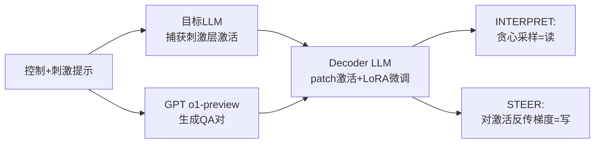

# LatentQA: Teaching LLMs to Decode Activations Into Natural Language

**会议**: ICLR 2026  
**代码**: https://latentqa.github.io  
**领域**: 可解释性 / 表征探测  
**关键词**: LatentQA, 激活解码, 表征探测, 模型引导, 可解释性, instruction tuning  

## 一句话总结
本文把"读懂模型激活"重塑成一个开放式问答任务 LatentQA——给定激活和一个自然语言问题，让一个微调过的 decoder LLM 直接用自然语言作答；这既能"看懂"激活（监控），又能用自然语言描述的损失反传梯度来"改写"激活（引导）。

## 研究背景与动机
**领域现状**：自上而下的可解释性（top-down transparency）主要靠两类工具——用 probe 读激活、用 steering vector 写激活。监控类 probe 通常只输出一个标量（如某概念的强度）或单个 token（如 logit lens），引导类方法则依赖 in-context 示例或任务专属数据。

**现有痛点**：标量/单 token 输出严重限制了能表达的行为范围——你只能检测预先定义好的概念，无法回答"这个激活里模型对用户有什么偏见？"这类开放式问题。而 SelfIE、Patchscopes 这类把激活直接 patch 进 LLM 副本、靠 LLM 自身解码能力来读激活的方法，由于激活分布与 embedding 分布之间存在偏移（distribution shift），往往很脆弱、泛化差。

**核心矛盾**：我们既想要 LLM 级别的语言表达力来描述复杂行为，又需要解码器对真实激活分布鲁棒——而免训练的 patching 方法表达力够但不鲁棒，线性 probe 鲁棒但表达力不够。

**本文目标**：训练一个能可靠执行 LatentQA 的 decoder，让它在已知答案的读取任务上超过强 probing 基线，并能精确到足以把目标模型引导出训练时从未见过的行为。

**核心 idea**：**[把激活解读当作 instruction tuning]** 仿照 Visual Instruction Tuning 用 GPT 把图文对转成 VisualQA 数据集，本文构造一个 (激活, 问答对) 数据集，并用 Latent Interpretation Tuning (LIT) 微调一个 decoder LLM，让它学会把激活翻译成自然语言——既消除了分布偏移，又保留了语言先验。

## 方法详解

### 整体框架
方法分两步：先用一个强 LLM（o1-preview）合成 LatentQA 数据集——把"控制提示 + 刺激提示"喂给目标模型、捕获刺激部分的激活、再让 GPT 描述这段对话的定性属性生成 QA 对；然后用 LIT 微调一个 decoder（目标模型的副本），通过 patch 激活 + 在 QA 对上做交叉熵训练。训练好的 decoder 同时支持两种用途：贪心采样得到答案即"读"（INTERPRET），对激活求 QA 对 logprob 的梯度即"写"（STEER）。

### 关键设计

**1. 用控制提示制造可解读的定性行为：** 直接采集任意 prompt 的激活几乎没用——"天空是什么颜色"这类提示只会触发模型的默认风格，激活里没有值得描述的定性属性。本文给每个刺激提示前面拼一个**控制提示**（control prompt，如"假装你是海盗"），让目标模型生成带有鲜明定性行为的补全，再让 GPT 把这段对话描述成 QA 对（如"Q: 助手会怎么说话？A: 像海盗"）。最终得到三元组 (prompt = control + stimulus, completion, QA)，激活则从 prompt 或 stimulus 部分捕获。数据由 o1-preview 分三步生成（先造控制例子、再扩成对话、再写 QA），并区分描述型 QA（预测控制本身）和推理型 QA（预测控制的隐含影响），共 16,732 条（4670 goals + 3359 personas + 8703 extractive QA）。

**2. 激活掩码防止抄近路：** 如果 decoder 同时看到控制 token 和刺激 token 的激活，它可能直接"读"残差流里控制 token 的 embedding 来作弊，而非真正理解激活语义。为此本文有时**掩码掉控制激活、只提供刺激激活**。表面看这让任务变得不可能（控制信息没了），但刺激 token 的激活通过 attention 机制仍然保留了控制的信息，所以 decoder 被迫学会从激活里推断而非照抄。

**3. 三类数据增强覆盖全部任务：** 为让系统应对不同输入，训练混合三种数据——control（解码 prompt 里显式指定的属性）、stimulus（从激活里预测属性）、stimulus + completion（含 prompt 和 completion 的激活）。control/stimulus 只含 prompt 激活，stimulus + completion 含成对激活，三者合起来覆盖了论文评测的所有 LatentQA 任务。

**4. LIT 训练与读/写双用途：** 给定三元组，把目标 LLM 第 $k$ 层（取 $k=15$，中间层语义最丰富）的激活 patch 进 decoder 的第 $\ell$ 层（取 $\ell=0$，给 decoder 最多处理步数），训练 decoder 最大化答案的 logprob $\log p(\text{answer} \mid [\text{Act}] + \text{question})$。读取时定义 $\text{INTERPRET}([\text{Act}], q)$ 为在 $[\text{Act}]+q$ 上贪心采样；控制时定义 $\text{STEER}([\text{Act}], c)$ 为 decoder 对控制 QA 对 logprob 关于 $[\text{Act}]$ 的梯度，反复用该梯度更新激活即可把它推向自然语言描述的目标——实践中把梯度反传到目标模型权重上，因此是改权重而非改激活。

## 实验关键数据

### 主实验表格（关系信息抽取，Llama-3-8B-Instruct，前 15 层平均准确率 %）

| 方法 | Country_Curr | Food_Country | Ath_Position | Ath_Sport | Prod_Company | Star_Const |
|------|------|------|------|------|------|------|
| Linear Probe | 17.7 | 5.1 | 75.9 | 53.8 | 58.9 | 17.5 |
| Patchscope | 24.3 | 36.2 | 51.0 | 28.9 | 28.0 | 24.6 |
| **LIT (ours)** | **86.9** | **68.9** | 65.2 | **90.4** | **71.5** | **39.2** |

LIT 平均比线性 probe 高 32.2%、比 Patchscope 高 38.2%（关系查询不在训练集中，说明 decoder 在调用语言先验泛化）。在揭露隐藏系统提示任务上，仅靠用户消息的激活，LIT 比同时拿到用户消息和模型回复的 GPT-4 还高 18.7%（hard）/ 2.7%（easy），比 SelfIE 高 76–77%。

### 消融实验表格（CrowS Pairs 去偏，对数似然差越低越好）

| 方法 | 对数似然差均值 | 刻板印象占比 % |
|------|------|------|
| No control | 4.05 | 64.3 |
| Prompting | 3.95 | 67.9 |
| RepE | 4.38 | 61.5 |
| SFT | 4.61 | 64.5 |
| DPO | 3.82 | 61.7 |
| **LIT (ours)** | **3.70** | **60.9** |

LIT 是唯一在两个指标上都统计显著降低偏见的方法；RepE 反而增大了对数似然差（它把刻板句压过了相等点），作者推测偏见这类概念非线性表示，而线性 steering 无法处理。

### 关键发现
- **泛化到未见行为**：仅靠自然语言描述的损失，LIT 能把模型引导成 Golden Gate Claude（几乎每句话都提金门大桥），并能从安全对齐模型中诱出有害知识，这些行为训练时都没见过。
- **可扩展性**：LIT 随数据规模和模型规模同步提升，支持"用 LLM 可扩展地理解 LLM 自身"这一方向。
- **样本效率**：在难 persona 推断上，LIT 比直接 prompt GPT-4 更省样本。

## 亮点与洞察
- **读写统一**：同一个 decoder，前向采样就是"读"，对激活求梯度就是"写"，两种能力来自同一训练目标，优雅且自洽。
- **范式迁移漂亮**：把 Visual Instruction Tuning 的"GPT 造数据 + 指令微调"配方原样搬到激活解读，证明了激活解码本质上也是一个可被 instruction tuning 解决的开放式生成任务。
- **训练消除分布偏移**：相比免训练的 Patchscope/SelfIE，训练一个 decoder 这个看似"重"的选择，恰恰是鲁棒性的来源——SelfIE 在 persona 任务上落后 76% 以上就是明证。
- **掩码细节有洞察**：控制激活掩码这一招，揭示了"信息通过 attention 渗透到刺激 token"的机制，并把 decoder 从抄近路逼向真正的语义理解。

## 局限与展望
- **依赖强 LLM 造数据**：整套数据集由 o1-preview 合成，数据质量与覆盖面受限于生成模型，可能引入其自身偏见。
- **聚焦定性属性**：当前只预测"未来补全的定性属性"，对精确事实、数值等定量信息的解码能力未充分验证。
- **控制改权重**：STEER 实际反传到目标模型权重，相当于一次微调而非纯激活编辑，部署成本与可逆性需权衡。
- **展望**：若在分层指令遵循等更多类型数据上训练 LatentQA 系统，可用于评估模型是否遵守用户指令、改善长上下文指令遵循等新应用。

## 相关工作与启发
- **解码表征**：线性 probe、SAE、logit lens（nostalgebraist）、单神经元解释（Bills et al.）都只能输出预定义概念或少量 token；SelfIE、Patchscopes 直接 patch 激活但脆弱——本文用训练化解了二者的局限。
- **控制行为**：相比 SFT/RLHF 缺乏对模型内部的细粒度控制、相比 RepE/ActAdd 等只能线性 steering，LatentQA 用自然语言损失实现了非线性、可描述的控制。
- **启发**：把"模型内部状态"当作一种可被自然语言查询的模态，是一条让 LLM 可扩展地自我理解的有前景路径——任何"标量/单 token"探针任务都值得重新审视能否升级为开放式 QA。

## 评分
- 新颖性: ⭐⭐⭐⭐⭐ 把激活解读重塑为开放式 QA + instruction tuning，是干净且有想象力的范式迁移。
- 实验充分度: ⭐⭐⭐⭐ 覆盖读取（系统提示、关系抽取）与控制（去偏、未见 persona）多场景，并有 scaling 验证；定量控制实验略少。
- 写作质量: ⭐⭐⭐⭐⭐ 三个设计决策动机清晰，读写统一的叙述优雅，图例直观。
- 价值: ⭐⭐⭐⭐⭐ 为监控、审计、安全引导提供了表达力强且鲁棒的统一工具，方向延展性大。

<!-- RELATED:START -->

## 相关论文

- [\[ICLR 2026\] REAL: Reading Out Transformer Activations for Precise Localization in Language Model Steering](real_reading_out_transformer_activations_for_precise_localization_in_language_mo.md)
- [\[ICLR 2026\] Fresh in Memory: Training-order Recency is Linearly Encoded in Language Model Activations](fresh_in_memory_training-order_recency_is_linearly_encoded_in_language_model_act.md)
- [\[ICLR 2026\] Negative Pre-activations Differentiate Syntax](negative_pre-activations_differentiate_syntax.md)
- [\[ICLR 2026\] Sparling: End-to-End Spatial Concept Learning via Extremely Sparse Activations](sparling_end-to-end_spatial_concept_learning_via_extremely_sparse_activations.md)
- [\[ACL 2026\] Similarity-Distance-Magnitude Activations](../../ACL2026/interpretability/similarity-distance-magnitude_activations.md)

<!-- RELATED:END -->
