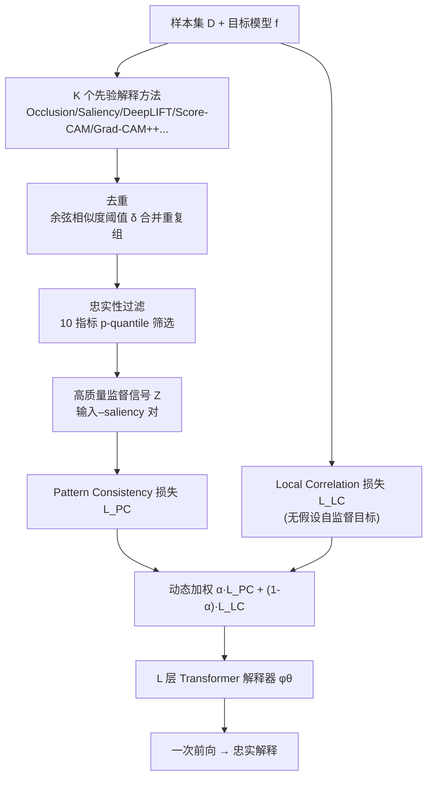

# Learning for Highly Faithful Explainability

**会议**: ICLR 2026  
**OpenReview**: [https://openreview.net/forum?id=bLgkkEGgBy](https://openreview.net/forum?id=bLgkkEGgBy)  
**代码**: 已开源（论文 GitHub Repository）  
**领域**: 可解释 AI / 忠实性解释  
**关键词**: Learning to Explain, 摊销解释器, 忠实性, 自监督, 动态联合优化  

## 一句话总结
本文提出 DeepFaith：从十种忠实性指标里推导出一个无需对目标模型/任务做假设的自监督目标，再用「去重 + 忠实性过滤」把多个先验解释方法聚合成高质量监督信号，最后用动态加权把两者联合优化，训练出一个一次前向就能给出比所有先验方法更忠实解释的摊销解释器。

## 研究背景与动机
**领域现状**：可解释 AI 里有一个新兴范式叫 Learning to Explain（也称摊销解释，amortized explanation）——训练一个神经网络当「解释器」，推理时一次前向传播就能给目标模型生成解释，把和目标模型反复交互的算力开销前移到训练阶段，从而大幅降低推理时的解释成本。这条路线主要有两派：自监督优化派（解释器训练时直接和目标模型交互，最小化一个衡量解释质量的自监督损失）和先验解释驱动派（先用已有 XAI 算法对目标模型生成一批归因，再训练解释器去拟合「输入→解释」的映射）。

**现有痛点**：作者点出三个卡住整个范式的关键挑战。一是自监督目标几乎都建立在对目标模型或任务的理想假设上——VerT 假设特征严格分成信号和噪声、L2X 假设任务有可清晰分离的特征、CXPlain 假设输入特征捕获了所有影响预测的因素——而深度模型编码高阶交互、真实混杂因子又不可观测，这些假设几乎都不成立，泛化性受限。二是先验解释驱动派难以保证监督信号的质量，拟合的本质是模仿已有 XAI 方法，性能天花板就被这些标签的质量锁死。三是单独用任一路线都不行：只用自监督目标在高维/复杂模型上收敛困难、扩展性差；只用先验解释又无法超越所拟合标签的质量。

**核心矛盾**：摊销解释器既想要「不靠假设、能超越先验」的上限（自监督的潜力），又想要「能稳定收敛、快速获得基本解释能力」的下限（先验监督的稳健），但这两个目标的局部/全局最优点不同、梯度方向冲突，简单地一起优化会互相拖累。

**本文目标**：把 XAI 里的「忠实性（faithfulness）」这一可量化指标引入 Learning to Explain，系统性地同时解决上述三个挑战，让摊销解释器即便面对复杂、高维模型也能产出比所有先验方法更忠实的解释。

**核心 idea**：**忠实性既当理论标尺又当工程过滤器**——一方面把十种忠实性指标统一形式化、证明存在一个同时在所有指标上最优的解释映射，由此导出无假设的自监督目标；另一方面用忠实性给先验解释打分做过滤，得到高质量监督信号；最后用动态加权策略让「先拟合监督信号快速收敛、再逼近理论最优映射提质」两阶段平滑衔接。

## 方法详解

### 整体框架
DeepFaith 把解释器实例化为一个 L 层 Transformer Encoder $\phi_\theta: \mathcal{X} \to [0,1]^n$，对图像 patch / 文本 token / 表格行编码后输出 $n$ 维 saliency 解释。训练由两条损失驱动：理论侧的 Local Correlation 损失 $\mathcal{L}_{LC}$（自监督，对应推导出的最优忠实性目标）和经验侧的 Pattern Consistency 损失 $\mathcal{L}_{PC}$（拟合过滤后的高质量监督信号）。监督信号本身是一条独立的离线流水线：用 $K$ 个现成解释方法对每个样本各生成一份 saliency，再经去重和忠实性过滤留下高质量「输入–解释」对。最后用一个动态权重 $\alpha$ 把两条损失联合起来，按训练动态在「拟合监督」与「自监督提质」之间切换主导权。

### 关键设计
**1. 统一忠实性形式化与最优映射存在性：把十个指标证成同一个数学本质。** 作者先区分两类解释——saliency 解释 $S_f: \mathcal{X} \to [0,1]^n$（给每个 $x_i$ 一个重要度分数）和 permutation 解释 $\Pi_f: \mathcal{X} \to S_n$（只给重要度排序），二者可通过 $P(s)=\text{argsort}_\downarrow\{s\}$ 与 $\Sigma(\pi)_i=(n-\pi(i)+1)/n$ 互转。在统一记号下把十种被广泛验证的忠实性指标（saliency 视角的 FC、FE、INF、MC，permutation 视角的 DEL、INS、NEG、POS、RP、IROF）拆出共享的函数组件——输入扰动 $x\setminus I$、扰动效应 $\Delta$、保持效应 $\Delta^-$、相关性度量 $\tau$。Proposition 1 证明：存在一个 saliency 映射 $S_f^*=\arg\max_{S_f}\tau\big[(\sum_{j\in I_i}S_f(x)_j)_{i=1}^N, (\Delta[f(x),f(x\setminus I_i)])_{i=1}^N\big]$ 同时在 FC/FE/INF/MC 上最优；Theorem 1 进一步证明由它诱导的 permutation 映射 $\Pi_f^*=P[S_f^*]$ 同时在 DEL/INS/NEG/POS/RP/IROF 六个指标上也最优。结论是这十个看似形态各异的指标共享同一个最优解释映射，Eq.(1) 就是「最忠实解释映射」的一致目标函数。

**2. Local Correlation 损失：把理论最优目标变成可优化的无假设自监督损失。** 理想的 $S_f^*$ 对所有子集做了过强要求、实际不可解，但 DeepFaith 不去直接求解它，而是用 Monte Carlo 近似把它变成一个明确的优化方向。给定样本集 $D$，定义 $\mathcal{L}_{LC}(\phi_\theta;D,f)=\tfrac{1}{2}-\tfrac{1}{2|D|}\sum_{x\in D}\tau\big[(\sum_{i\in I_j}\phi_\theta(x)_i)_{j=1}^k, (\Delta[f(x),f(x\setminus I_j)])_{j=1}^k\big]$，其中扰动索引集 $I_j\sim P([n])$ 随机采样、子集数 $k$、扰动效应 $\Delta$、相关性 $\tau$ 都由用户指定。关键之处在于：这个损失完全从「解释忠实性本身」出发，不对目标模型或任务做任何假设，因此天然摆脱了 VerT/L2X/CXPlain 那类假设的束缚——这正是对挑战一的回应。

**3. 高忠实监督信号生成：用忠实性给先验解释做去重 + 过滤。** 针对挑战二（监督信号质量无保证），DeepFaith 对每个样本 $x^{(i)}$ 用 $K$ 个先验 saliency 方法各生成一份解释，再做两步净化。去重：算两两余弦相似度，按阈值 $\delta$ 把高度相似的解释归为重复组、每组只留第一份，避免近乎重复的解释给训练引入偏置、同时提升信号多样性，留下 $K_{dedup}^{(i)}\le K$ 份。过滤：对剩下的每份解释用全部十个忠实性指标打分得 $(r_1,...,r_{10})$，对每个指标在 $K_{dedup}^{(i)}$ 份分数上算 $p$-quantile 阈值（越小越好的指标取 $1-p$ 分位），只保留满足 $\forall j, r_j\ge\bar r_j$（或 $\le$）的那些，得到 $K_{filter}^{(i)}$ 份。最后把 $x^{(i)}$ 复制 $K_{filter}^{(i)}$ 份分别配对，组成监督集 $Z$，并以 $\mathcal{L}_{PC}(\phi_\theta;Z)=\tfrac{1}{|Z|}\sum_{(x,s)\in Z}(1-\tau[\phi_\theta(x),s])$ 来拉近解释器输出与高质量监督的 pattern 一致性。

**4. 动态加权联合优化：用方差监控自动在两阶段间切换主导权。** 两条损失的最优点不同、梯度方向冲突，直接相加会互相拖累，所以总目标写成 $\mathcal{L}_{OBJ}=\alpha\mathcal{L}_{PC}+(1-\alpha)\mathcal{L}_{LC}$ 并让 $\alpha$ 随训练动态变化。初始 $\alpha=1$，让解释器先靠拟合监督信号快速获得基本解释能力（应对挑战三里自监督收敛难的问题）；训练中持续监控 $\mathcal{L}_{PC}$ 在 $e$ 个迭代窗口内的方差 $\sigma^2_{PC}$，一旦低于阈值 $\epsilon$ 判定其已收敛，便按 $\alpha\leftarrow 1-\tfrac{1}{1+\exp(-(t-t_0)/C)}$ 逐步衰减 $\alpha$、让 $\mathcal{L}_{LC}$ 接管以进一步提质；若期间 $\sigma^2_{PC}$ 又超过 $C\epsilon$，说明 $\mathcal{L}_{LC}$ 的优化方向跑偏、$\alpha$ 重置回 1 让监督信号重新主导。实验中单独优化 $\mathcal{L}_{LC}$（即 $\mathcal{L}'_{LC}$）剧烈震荡且不收敛，而这套策略下 $\mathcal{L}_{LC}$ 虽有振荡仍能稳步收敛。

## 实验关键数据
覆盖图像（ImageNet、OCT，解释 ResNet50/EfficientNet-b0/DeiT）、文本（IMDb、AGNews，解释 LSTM/Transformer）、表格（NAP、WCD，解释 MLP）三种模态共 12 个解释任务；监督信号由 Captum 里 14 个解释方法生成（如 ImageNet+DeiT 用 2 万验证样本生成 patch 级解释）。硬件为 8×A6000。

### 主实验：12 任务 vs 先验解释方法（平均排名，越低越好）

| 方法 | OCT+DeiT | ImageNet+DeiT | IMDb+LSTM | AGNews+Trans | NAP+MLP | WCD+MLP |
|------|----------|---------------|-----------|--------------|---------|---------|
| **DeepFaith (ours)** | **3.4** | **4.4** | **2.3** | **2.7** | **1.8** | **1.8** |
| Integrated Grads | 7.8 | 6.4 | 3.3 | 5.9 | 2.8 | 5.2 |
| DeepLIFT | 5.8 | 7.0 | 6.1 | 5.9 | 4.4 | 2.3 |
| Saliency | 13.2 | 10.7 | 5.2 | 5.8 | 2.8 | 4.9 |

DeepFaith 在所有任务、所有忠实性指标上平均排名最优，证明摊销解释器能超越其训练时用到的先验方法，并在复杂模型 / 高维任务上依然有效。

### 对比其它 Learning to Explain 方法（test set 平均，Mean Rank 越低越好）

| 任务 | 解释器 | FC↑ | INS↑ | DEL↓ | NEG↑ | IROF↑ | Mean Rank |
|------|--------|-----|------|------|------|-------|-----------|
| NAP+MLP | **DeepFaith** | **0.788** | 0.844 | **0.031** | 0.770 | **0.844** | **1.3** |
| | VerT | 0.772 | 0.564 | 0.467 | 0.518 | 0.603 | 2.8 |
| | FastSHAP | 0.071 | 0.849 | 0.714 | 0.837 | 0.126 | 3.7 |
| ImageNet+DeiT | **DeepFaith** | **0.026** | **0.568** | **0.127** | **0.417** | **0.672** | **1.6** |
| | VerT | 0.005 | 0.363 | 0.323 | 0.365 | 0.588 | 2.7 |
| | L2X | 0.004 | 0.486 | 0.526 | 0.520 | 0.385 | 3.9 |

相比 VerT / L2X / CXPlain / FastSHAP，DeepFaith 在每个任务上都拿到最优平均排名。

### 消融实验（OCT+DeiT，越接近忠实越好）

| 配置 | FC↑ | INS↑ | DEL↓ | NEG↑ | IROF↑ |
|------|-----|------|------|------|-------|
| $\mathcal{L}_{OBJ}$（全损失） | **0.217** | **0.944** | **0.356** | **0.917** | **0.638** |
| 仅 $\mathcal{L}_{PC}$ | 0.032 | 0.913 | 0.463 | 0.904 | 0.534 |
| 仅 $\mathcal{L}_{LC}$ | 0.101 | 0.763 | 0.830 | 0.809 | 0.162 |
| $\mathcal{L}^d_{OBJ}$（仅去重） | 0.097 | 0.923 | 0.447 | 0.906 | 0.552 |
| $\mathcal{L}^f_{OBJ}$（仅过滤） | 0.156 | — | — | — | — |

### 关键发现
- 完整 $\mathcal{L}_{OBJ}$ 在四个设置、所有指标上都最优；只用 $\mathcal{L}_{LC}$ 因收敛困难忠实性最差，印证了动态联合优化的必要性。
- 监督信号生成里，只去重或只过滤都会掉点，其中只去重（缺忠实性筛选）掉得更狠，验证忠实性过滤是质量来源。
- 训练曲线显示：$\mathcal{L}_{PC}$ 早期快速收敛并被策略维持低位，$\mathcal{L}_{LC}$ 随后稳步下降；而单独优化 $\mathcal{L}'_{LC}$ 剧烈震荡且不收敛。

## 亮点与洞察
- **「十个指标共享一个最优映射」是真正的洞见**：把 saliency 与 permutation 两类、共十种忠实性指标拆出共同函数组件并证明它们同源，既给自监督目标提供了无假设的理论依据，也为「为什么一个解释器能在所有指标上全面占优」给出了解释。
- **忠实性身兼两职**——既是导出自监督损失的理论标尺，又是过滤先验解释的工程筛子，一个概念把三个挑战串成了一套连贯方案。
- **动态加权用 $\mathcal{L}_{PC}$ 方差当信号**自动判断「监督拟合是否收敛、自监督是否跑偏」，把两个梯度冲突目标的衔接做成了可监控、可回退的过程，而非简单线性加权。

## 局限与展望
- 监督信号生成依赖跑 $K$（实验中达 14）个先验解释方法并对每个样本算十种忠实性指标，离线预处理成本不低（ImageNet+DeiT 用了 2 万样本），大规模数据集 / 更多模型时这步开销值得关注。
- 引入的超参数较多（子集采样数 $k$、相似度阈值 $\delta$、分位数 $p$、方差阈值 $\epsilon$、窗口 $e$、缩放因子 $C$），论文虽做了敏感性研究，跨任务调参负担仍存在。
- 自监督目标的 Monte Carlo 近似质量取决于扰动索引集采样，理论最优 $S_f^*$ 与实际逼近之间的差距、以及不同 $\Delta/\tau$ 选择的影响仍有讨论空间。

## 相关工作与启发
本文站在 Learning to Explain / amortized explanation 这条线上（FastSHAP、VerT、L2X、CXPlain），与传统逐样本 XAI 方法（Occlusion、LIME、SHAP、Grad-CAM、Integrated Gradients、LRP 等）相比，核心区别是把解释生成摊销成一次前向。它最值得借鉴的是「先把一族评测指标统一形式化、证明共享最优解，再据此设计无假设训练目标」的范式——这套「评测即目标」的思路对其它依赖多指标评估的领域（如生成质量、对齐、检索）同样有启发；同时「用评测指标反过来过滤/筛选训练监督信号」也是一种通用的数据净化策略。

## 评分
- **新颖性**: ⭐⭐⭐⭐⭐ 首次在 Learning to Explain 里引入忠实性作为统一标尺，证明十个指标共享最优映射并据此导出无假设自监督目标，三个「首次」贡献扎实。
- **实验充分度**: ⭐⭐⭐⭐ 覆盖图文表三模态 12 任务、多架构，既比先验方法又比 Learning to Explain 同类，消融 + 敏感性齐全；可惜缺少更大规模模型与推理成本的系统横评。
- **写作质量**: ⭐⭐⭐⭐ 三挑战→三贡献的结构清晰，理论命题与工程流水线衔接顺畅；公式记号偏密集，对读者门槛略高。
- **价值**: ⭐⭐⭐⭐ 给摊销解释器提供了可超越先验、跨模态通用的训练范式，对追求高忠实、低推理成本解释的落地场景有实际意义。

<!-- RELATED:START -->

## 相关论文

- [\[ICLR 2026\] Toward Faithful Retrieval-Augmented Generation with Sparse Autoencoders](toward_faithful_retrieval-augmented_generation_with_sparse_autoencoders.md)
- [\[ICLR 2026\] Bridging Explainability and Embeddings: BEE Aware of Spuriousness](bridging_explainability_and_embeddings_bee_aware_of_spuriousness.md)
- [\[ACL 2026\] Interpreto: An Explainability Library for Transformers](../../ACL2026/interpretability/interpreto_an_explainability_library_for_transformers.md)
- [\[ICLR 2026\] Temporal Geometry of Deep Networks: Hyperbolic Representations of Training Dynamics for Intrinsic Explainability](temporal_geometry_of_deep_networks_hyperbolic_representations_of_training_dynami.md)
- [\[ICLR 2026\] Towards Cognitively-Faithful Decision-Making Models to Improve AI Alignment](towards_cognitively-faithful_decision-making_models_to_improve_ai_alignment.md)

<!-- RELATED:END -->
