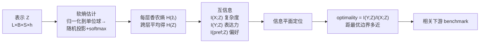

# Learning is Forgetting: LLM Training As Lossy Compression

**会议**: ICLR 2026  
**OpenReview**: [https://openreview.net/forum?id=tvDlQj0GZB](https://openreview.net/forum?id=tvDlQj0GZB)  
**代码**: 待确认（论文承诺开源）  
**领域**: 可解释性 / 表示学习理论  
**关键词**: Information Bottleneck, Rate Distortion Theory, 表示压缩, 预训练动力学, 可解释性  

## 一句话总结
把 LLM 预训练看成一次"有损压缩"：用率失真理论（Rate Distortion Theory）和信息瓶颈（Information Bottleneck）刻画模型如何在训练中先扩张、后压缩表示，并证明"模型压缩得有多接近最优"以及"压缩后留下了什么信息"能直接预测下游 benchmark 表现。

## 研究背景与动机
**领域现状**：我们对 LLM 表示空间到底如何组织所知甚少。现有的可解释性工作大致分两类——一类是行为学/探针法（把模型当心理语言学被试，或训一个线性分类器去探测潜表示里有没有某类信息），另一类是机制可解释性（mechanistic interpretability，用 sparse auto-encoder 找单语义神经元、解释具体电路）。这些方法要么远离表示本身、只刻画下游行为，要么聚焦于单个电路/神经元这样的"局部零件"。

**现有痛点**：可解释性方法能在大模型上跑，但和"学习/泛化的既有理论"几乎脱节；反过来，深度学习理论（信息瓶颈、率失真）只在 MNIST、小型前馈网络这种玩具设定里验证过，能否推广到 Transformer + 万亿 token 这种复杂序列任务一直悬而未决。Shwartz-Ziv & Tishby 在 MNIST 上证实了 IB 的"两阶段"预测，但后续工作质疑其普适性（压缩相位可能只是非线性激活的产物，且压缩未必是泛化的必要条件）。

**核心矛盾**：分布式系统（如神经网络）"整体不等于零件之和"，盯着单个电路无法解释"模型为什么在这么多任务上都这么强"；但要在整模型尺度上给出一个既有理论根基、又能落地产出可行动洞察的解释框架，此前没人做到。

**本文目标**：在 LLM 尺度上把率失真理论"操作化"，回答三个问题——LLM 是否最优压缩了表示？压缩后哪些信息存活下来？哪些表示结构驱动了性能？

**核心 idea**：**[把训练等价于压缩]** 学习的本质是"遗忘"——模型只保留训练数据中与目标相关的信息，丢掉其余的以节省空间，就像 MP3 丢掉人耳听不见的频率、JPEG 丢掉人眼难辨的色差。**[整模型视角]** 不解释零件，而是用信息论量化整个模型在信息平面（information plane）上的位置，把"表示结构"直接连到"模型行为"。

## 方法详解

### 整体框架
方法分三步：先用一个可在 LLM 尺度跑得动的**软熵估计器**把高维表示量化、估出每层的香农熵；再据此计算表示 $Z$ 与输入特征 $X$、输出 $Y$、偏好标签之间的**互信息**，把模型放到信息平面（横轴复杂度 $I(X;Z)$、纵轴表达力 $I(Y;Z)$）上；最后用一个标量 **optimality** 度量模型离"最优压缩边界"有多近，并把它与下游性能做相关分析。

### 关键设计
**1. 软熵估计器：让信息平面在 LLM 尺度可计算。** 要用香农熵（而非微分熵）算互信息，传统做法是把连续表示 $Z$ 离散化到 $n$ 个桶里，但这类分箱法在 LLM 的内存/算力开销下根本跑不动。本文借用 Conklin (2025) 的可微分软量化：先把每个表示向量归一化到单位球面 $\bar Z = Z/\|Z\|$，再从球面上均匀采 $n$ 个随机方向 $\{w_i\}$，对每个向量算它与各方向的余弦相似度并过 softmax（温度 $\epsilon$ 控制），得到一个概率向量 $\check Z_{l,b,s,:}=\mathrm{softmax}(\bar Z_{l,b,s,:}W/\epsilon)$。在 batch 和序列维上平均，得到每层一个长度 $n$ 的分布 $\hat z_l$，于是可直接算香农熵 $H(\hat z_l)=-\sum_j \hat z_{l,j}\log\hat z_{l,j}$。这个估计近似的是"某层表示落在相对原点某个角度上的概率"，跨层平均再除以均匀分布的熵 $\log n$ 归一化成"效率"（efficiency），把熵压到 0–1 区间便于跨维度比较。本文不是这个估计器的原创者，但**首次把它用于率失真视角分析 LLM**。

**2. n-gram back-off：把"上下文压缩"拆解出来。** LLM 的输入是前文、输出是后文，要算 $P(Z\mid X)$ 就得对每个可能的上下文窗口维护条件估计——这在组合上不可行，且很多上下文只出现一次。借鉴语言建模里的 Katz back-off，本文用有限宽度的前文近似 $P(Z\mid X)$：从 token、bigram、trigram 一直算到 quad-gram（再往上 n-gram 太稀疏、算不动，且 $I(X;Z)$ 此时已开始收敛）。由于 teacher forcing 让模型从整个后文 $Y$ 拿梯度，输入侧 $P(Z\mid X)$ 和输出侧 $P(Z\mid Y)$ 的 back-off 宽度要同步变化。通过对不同 back-off 层级算条件互信息，就能量化"模型里有多大比例的信息编码的是 token、bigram……各级局部上下文"。

**3. optimality 标量：一把可跨模型比较的"压缩最优度"尺子。** 定义
$$\text{Optimality} = \frac{\text{Expressivity}}{\text{Complexity}} = \frac{I(Y;Z)}{I(X;Z)}$$
当表示系统贴近 IB 边界时该值趋于 1.0，且无论它落在边界的哪个 $\beta$ 位置都成立——本质是"每一比特复杂度换来多少比特表达力"。这把"离最优压缩边界多近"压成一个与具体模型、超参、训练配方无关的相对量，使得几十个不同家族的开源模型可以放在同一坐标系里横向比较。IB 的最优压缩对应最小化 $F_\beta[p(Z\mid X)] = I(X;Z) - \beta I(Y;Z)$，本文把边界近似为直线 $I(X;Z)=I(Z;Y)$（所研究模型都远未饱和）。

**4. 偏好信息探针：量化"压缩后留下了多少对齐信息"。** 除了输入/输出标签，本文还把偏好数据（一个 prompt 配 preferred / rejected 两个续写）作为条件标签 $X$，算 $I(Z;\text{preferred})$，从而量化模型表示与人类偏好区分的对齐程度。这让"什么信息在压缩中存活"这个问题第一次有了可计算的代理量，并发现它是下游性能的强预测因子。

## 实验关键数据
分析对象：有中间 checkpoint 的 OLMo2 家族（1B/7B/32B，重点 7B）做训练时序分析；外加 6 个家族、几十个开源模型在训练末态的横向比较。熵/互信息均基于 C4 抽 10,000 样本（偏好用 Tulu 10,000 样本），最大上下文 512。

### 主实验：表示结构 → 下游性能（47 模型，6 benchmark）
benchmark：MMLU Pro / BBH / Math LVL5 / IFEval / GPQA / MuSR（token back-off）

| 表示度量 | 与下游性能相关 | 显著性 |
|---|---|---|
| Complexity $I(X;Z)$ 单独 | $r=-0.38$（越低越好） | $p=0.006$ ✓ |
| Expressivity $I(Y;Z)$ 单独 | $r=0.08$ | $p=0.575$ ✗ |
| **Optimality** $I(Y;Z)/I(X;Z)$ | $r=0.52$ | $p<0.001$ ✓ |
| **偏好信息** $I(Z;\text{pref})$ | $r=0.76$ | $p<0.001$ ✓ |

关键点：表达力单独不预测性能，但"压缩最优度"和"留存的偏好信息量"都强相关——说明**不仅压缩得多最优重要，压缩后留下了什么也同样重要**。

### 训练动力学与规模效应

| 模型 | 是否完成扩张相 | 是否达到有意义压缩 |
|---|---|---|
| OLMo2 7B / 32B | 是 | 是，紧贴 IB 边界 |
| OLMo2 1B | 是（$I(Y;Z)$ 上升） | 否，第二相在边界外震荡、缓慢远离 |

- **两阶段轨迹被证实**：7B 模型先增大输出互信息 $I(Y;Z)$（fitting 相），待 next-token loss 开始饱和后压缩输入信息 $I(X;Z)$、逼近最优边界——IB 深度学习理论的预测在 LLM 尺度首次得到验证。
- **规模阈值**：1B 模型压不动，与 scaling law 一致——给定数据复杂度，需要一定参数阈值才能实现最优压缩。

### 关键发现
- **普适收敛**：6 个家族、不同超参与训练方法的开源模型，末态都聚集到边界上**同一个点附近**——压缩不是单一模型训练轨迹的偶然，而是深度学习这一类模型 + 数据 + 目标的根本属性。
- **模型主要编码局部上下文**：信息中绝大部分编码 token 到 quadgram 的局部上下文，反映自然语言的信息局部性；1B 模型 token 信息更多、上下文信息更少。
- **上下文越长越接近最优**：trigram/quadgram 的编码 optimality 更高，但在语言建模里源/目标同分布，压一个必然压另一个，于是高层上下文下复杂度与表达力一起下降。
- **后训练编辑存活信息**：Llama 家族上后训练能增加偏好信息而几乎不改复杂度，暗示**预训练负责"广义压缩"、后训练负责"编辑留存什么信息"**。

## 亮点与洞察
- **理论与实践的真桥**：把率失真/信息瓶颈这套此前只在玩具任务上验证的理论，第一次在万亿 token 的 LLM 上跑通并验证其核心预测，回应了"IB 是否只是激活函数副产物"的长期质疑。
- **整模型视角而非零件视角**：跟机制可解释性"找单语义神经元/电路"相反，本文把整个模型当一个压缩系统量化，给出可在任意尺度部署、单次前向即可估计的整体性指标。
- **可落地的训练用途**：optimality 与偏好信息可作为**early-stopping 准则**（距边界不再下降就停）或**checkpoint 选择准则**——只需一次 teacher forcing 前向，远比跑整套 benchmark 便宜。
- **"学习即遗忘"的认知科学连接**：把 LLM 放进人类学习/贝叶斯推断/奥卡姆剃刀这条长线里，朝"统一的表示学习理论"迈了一步。

## 局限与展望
- **熵估计是相对量而非真值**：高维空间熵估计普遍低估真实熵，本文明确不声称估到了模型潜分布的真实熵，只在固定数据下做可比较的估计——跨数据集的绝对结论需谨慎。
- **back-off 上限只到 quadgram**：5-gram 以上太稀疏、算不动，512 窗口内更细粒度的上下文信息只能算作"残差"，无法精确归因。
- **训练用途尚未实证**：early-stopping / checkpoint 选择只是基于相关性的"潜在用途"，论文自己也说留待未来实验验证。
- **后训练分析较浅**：预训练 vs 后训练对压缩的不同作用只给了 Llama 家族的初步结果，缺系统评估。
- **因果性存疑**：optimality / 偏好信息与性能是相关（含偏相关控制参数量），并非证明了因果机制。

## 相关工作与启发
- **IB 深度学习理论**（Tishby & Zaslavsky 2015；Shwartz-Ziv & Tishby 2017）：本文是其在 LLM 尺度的"大考"，并回应 Saxe 等的质疑。
- **软熵估计器**（Conklin 2025）：方法基石，本文是其首个 LLM 率失真应用。
- **机制可解释性**（Elhage、Nanda、Bricken 等的 SAE / 单语义性工作）：本文提供的是互补的"整体视角"，且发现特征涌现与 IB 扩张/压缩模式吻合（Ge et al. 2025）。
- **启发**：① 信息平面可作为训练监控/模型选择的轻量代理，省下 benchmark 评测成本；② "压缩最优度 + 存活信息量"双指标提示，评估表示质量不能只看表达力；③ 把"后训练 = 编辑存活信息"这一假设系统化，可能给对齐/数据配方提供新的信息论刻画工具。

## 评分
- **新颖性**: ⭐⭐⭐⭐⭐ 首次在真实 LLM 尺度操作化率失真/IB 理论并验证其两阶段预测，把"训练即压缩"从隐喻做成可计算、可预测性能的框架。
- **实验充分度**: ⭐⭐⭐⭐ 覆盖 6 家族 47 模型 + OLMo2 三种规模时序，相关分析含偏相关控制；但训练用途未实证、熵估计为相对量、因果性未建立。
- **写作质量**: ⭐⭐⭐⭐⭐ 用 MP3/JPEG 类比把信息论讲得直观，三问题驱动、图文叙事清晰，理论与实证衔接顺滑。
- **价值**: ⭐⭐⭐⭐ 给"LLM 如何学习"提供统一信息论框架与可行动指标（停训/选 checkpoint），对可解释性与训练实践都有潜在影响，主要待落地验证。

<!-- RELATED:START -->

## 相关论文

- [\[ICLR 2026\] Learning to See Before Seeing: Demystifying LLM Visual Priors from Language Pre-training](learning_to_see_before_seeing_demystifying_llm_visual_priors_from_language_pre-t.md)
- [\[ICLR 2026\] Learning to Weight Parameters for Training Data Attribution](learning_to_weight_parameters_for_training_data_attribution.md)
- [\[ICLR 2026\] From Tokens to Thoughts: How LLMs and Humans Trade Compression for Meaning](from_tokens_to_thoughts_how_llms_and_humans_trade_compression_for_meaning.md)
- [\[AAAI 2026\] LLM Circuit Analyses Are Consistent Across Training and Scale](../../AAAI2026/interpretability/llm_circuit_analyses_consistent_across_training_and_scale.md)
- [\[ICLR 2026\] Attention Sinks and Compression Valleys in LLMs are Two Sides of the Same Coin](attention_sinks_and_compression_valleys_in_llms_are_two_sides_of_the_same_coin.md)

<!-- RELATED:END -->
