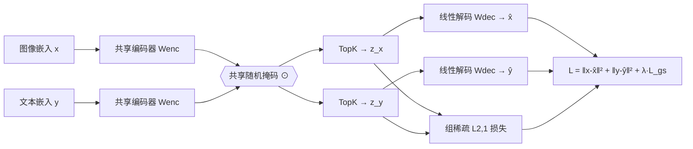

# Learning Multimodal Dictionary Decompositions with Group-Sparse Autoencoders

**会议**: ICLR 2026  
**OpenReview**: [https://openreview.net/forum?id=ZJlVXZ5dmK](https://openreview.net/forum?id=ZJlVXZ5dmK)  
**代码**: 待确认  
**领域**: 可解释性 / 多模态表示 / 稀疏字典学习  
**关键词**: 稀疏自编码器, 多模态对齐, 字典学习, 组稀疏, CLIP, CLAP, 概念可解释性  

## 一句话总结
标准稀疏自编码器（SAE）在 CLIP/CLAP 这类对齐多模态嵌入上会学出"模态分裂字典"——大多数概念只对单一模态激活；本文用**跨模态随机掩码 + 组稀疏正则**强迫成对样本共享稀疏支撑，学出真正多模态的概念字典，同时减少死神经元、提升语义性与跨模态零样本表现。

## 研究背景与动机

**领域现状**：线性表示假设（LRH）认为神经网络嵌入可分解为对应高层概念的线性方向之和。基于这一假设，稀疏自编码器（SAE）成为解释模型的主流工具：把嵌入分解成一组过完备字典向量的稀疏组合，这些字典元素往往对应人类可理解的语义概念，可用于解释、引导（steering）和控制。

**现有痛点**：当把 SAE 搬到 CLIP/SigLIP 这类"对齐的"多模态嵌入空间时，研究者反复观察到**模态分裂字典（split dictionary）**现象——绝大多数稀疏特征只对单一模态（要么图像、要么文本）激活。也就是说，原本在嵌入空间里跨模态对齐良好的成对样本（一张图和它的描述），经过 SAE 后却被映射到**支撑集不相交**的稀疏码。这直接破坏了跨模态任务（检索、生成、控制）的可能性：你想用文本概念去操纵图像/音频输出，但二者根本不共享概念神经元。

**核心矛盾**：单语义性（monosemanticity，概念越纯越好解释）与模态对齐（modality alignment，跨模态共享概念）之间存在张力。普通 SAE 只优化重构损失，其隐式偏置天然倾向分裂字典。

**本文目标**：在不牺牲语义性的前提下，缓解这种权衡，学出跨模态共享的多模态概念字典。

**核心 idea**：**(1) 理论上证明分裂字典必然能改造成对齐更好的非分裂字典**——说明分裂不是 LRH 的固有缺陷而是训练偏置；**(2) 用组稀疏损失 + 跨模态掩码改变 SAE 的隐式偏置**，逼成对样本共享稀疏支撑。

## 方法详解

### 整体框架
方法在**成对多模态样本**（如图-文、乐-文）上训练一个**共享权重**的 SAE。两个模态的嵌入先各自减去可学习偏置、过编码器，再施加**同一个随机掩码**，然后各自做 TopK 稀疏化、线性解码重构。训练损失 = 两模态重构损失 + 组稀疏正则（L2,1 范数），后者强迫两条稀疏码具有相同的支撑结构。

### 关键设计

**1. 多模态单语义性度量（MMS）：先有可量化的"多模态语义"标尺。** 要改进多模态字典，先得能衡量"一个概念在跨模态意义下有多语义"。本文把 Pach et al. 的单模态语义分推广到**任意一对模态** $(m,n)$：对某个神经元，在验证集上收集所有让它激活的两模态样本激活值 $a^{(m)}, a^{(n)}$，用**另一个独立编码器**算出这些样本的余弦相似度矩阵 $S$，再以归一化的共激活权重 $\tilde{A}_{ij}$ 加权求和：$\mathrm{MMS}(m,n)=\sum_{i,j}\tilde{A}_{ij}S_{ij}$。直觉是：若一个神经元被语义相似的输入激活，它就更单语义。当 $m\neq n$ 时，该分数直接刻画概念的多模态性——完全分裂的字典没有跨模态共激活，MMS 恒为 0；分数为正则说明确有不同模态的语义相似样本共激活该神经元。与 Papadimitriou 的 BridgeScore（衡量两个神经元对的联合激活）不同，MMS 是**单个神经元级别**的度量，且用余弦相似度作语义代理、无需额外配对数据。

**2. 存在性定理：分裂字典一定能改造得更对齐。** 本文证明了一个第一性原理结果（Theorem 1）：给定 $n$ 对对齐的单位向量嵌入 $\{(x^{(i)},y^{(i)})\}$，若 (a) 成对嵌入对齐 $\langle x^{(i)},y^{(i)}\rangle>c>0$，(b) 存在一个 $K$-稀疏的模态分裂字典 $W$ 能分解所有嵌入，则**必然存在**一个规模 $p+n$ 的新字典 $\tilde{W}$，能用 $(K{+}1)$-稀疏码分解全部 $2n$ 个嵌入，且**所有成对样本的稀疏码内积严格为正**（即跨模态对齐严格改善）。条件 (b) 还可放宽到近似分解，只引入 $O(\epsilon)$ 误差。这个定理的意义在于：模态分裂**不是** LRH 的固有限制，而是普通 SAE 只用重构损失训练带来的**隐式偏置**——既然更对齐的字典一定存在，问题就转化为如何诱导 SAE 去找到它。

**3. 组稀疏损失：用 L2,1 范数把成对样本绑成"概念组"。** 受 group LASSO、多任务学习启发，本文对成对稀疏码 $z,w$ 施加 L2,1 范数惩罚：$L_{gs}(z,w)=\left\|\begin{smallmatrix}z^\top\\ w^\top\end{smallmatrix}\right\|_{2,1}=\sum_{i=1}^{p}\sqrt{z_i^2+w_i^2}$。这个凸损失鼓励 $z$ 和 $w$ 的坐标**联合稀疏**——要么一起为零、要么一起激活，从而共享支撑。总损失为 $L=\|x-\hat{x}\|_2^2+\|y-\hat{y}\|_2^2+\lambda L_{gs}(z_x,z_y)$，其中编码器、解码器权重跨模态共享，仅前置偏置 $b_0,b_1$ 各模态独立。这一项把"成对图文应落在同一概念上"的先验直接写进了优化目标，与定理给出的"更对齐字典存在"形成闭环。

**4. 跨模态随机掩码：根治死神经元 + 进一步逼多模态。** 仅有组稀疏还不够——TopK 仍可能让两模态各自选不同的 top 坐标。本文在 TopK 之前对两模态施加**同一个**概率为 $p$ 的随机掩码，强迫 TopK 只能从相同的坐标子集里挑选。这有两个效果：一是逼着两模态在被掩到的维度上共用激活，进一步提升跨模态对齐；二是随机轮换被屏蔽的维度让更多神经元有机会被激活，显著减少**死神经元**（从不激活的字典元素）。组稀疏（GSAE）+ 掩码（MGSAE）的组合是完整方法。

## 实验关键数据

训练三种变体对比：**SAE**（标准 TopK SAE）、**GSAE**（加组稀疏、无掩码）、**MGSAE**（完整：掩码+组稀疏）。在两个嵌入空间上训练：CLIP ViT-B/16（CC3M 图文对）与 LAION CLAP（JamendoMaxCaps 乐文对，首次有人对音乐/文本联合空间做 SAE 分析）。固定 $K=32$、字典规模 $p=16d$（$d=512$）。

### 主实验：零样本跨模态任务

图文（CLIP，分类准确率）：

| 模型 | CIFAR-10 | CIFAR-100 | ImageNet |
|---|---|---|---|
| SAE - TopK | 0.657 | 0.418 | 0.303 |
| BatchTopK SAE | 0.657 | 0.277 | 0.178 |
| Matryoshka SAE | 0.587 | 0.166 | 0.185 |
| **GSAE (ours)** | 0.808 | 0.526 | 0.354 |
| **MGSAE (ours)** | **0.842** | **0.554** | **0.373** |
| CLIP ViT-B/16（原始稠密） | 0.916* | 0.687* | 0.686* |

乐文（CLAP，准确率 / FMACaps 为 MRR）：

| 模型 | GTZAN Genres | NSynth Instruments | FMACaps 检索 |
|---|---|---|---|
| SAE - TopK | 0.376 | 0.265 | 0.023 |
| **GSAE (ours)** | **0.705** | 0.303 | 0.050 |
| **MGSAE (ours)** | 0.672 | **0.354** | **0.061** |
| LAION CLAP（原始稠密） | 0.710* | 0.339 | 0.075 |

### 消融实验（GSAE vs MGSAE 拆解）

| 设计成分 | 主要收益 |
|---|---|
| 仅重构（标准 SAE） | 基线，大量死神经元 + 分裂字典 |
| + 组稀疏（GSAE） | 跨模态共激活神经元大增，MMS 显著上升 |
| + 跨模态掩码（MGSAE） | 多模态激活最多、死神经元最少，进一步提分 |

### 关键发现
- **GSAE/MGSAE 相比标准 SAE，图文零样本提升约 20%（CIFAR-10）、15%（CIFAR-100）、7%（ImageNet）**；BatchTopK、Matryoshka 等近期变体也都大幅落后。
- **音乐/文本上，稀疏码竟接近甚至超过原始稠密 CLAP**（NSynth 上 MGSAE 0.354 > CLAP 0.339），同时还稀疏 16 倍、更语义。
- 图 3/图 4 显示 GSAE、MGSAE **跨模态共激活神经元数量大增、死神经元大减**，MMS 高分神经元比例远超标准 SAE。
- 案例研究（CelebA "金发"线性探针）：MGSAE 给出的 top 概念是 "beautiful blonde / blond girl / blonde woman" 等真正跨模态、可读的概念，验证了对解释下游探针的实用价值。

## 亮点与洞察
- **把"分裂字典是不是 LRH 的锅"这个根本问题做成了定理**：证明更对齐字典必然存在，干净利落地把问题从"假设是否成立"转移到"训练偏置如何纠正"，这是全文最漂亮的一步。
- **组稀疏 + 掩码两件简单工具，正中要害**：不引入复杂跨模态变换、不需要额外配对数据训探针，纯靠损失与掩码改造隐式偏置，工程上极易落地到任意 SAE 变体（ReLU/JumpReLU/BatchTopK 均可套）。
- **首次对音乐/文本联合空间做 SAE 语义分析**，把多模态可解释性从图文扩到音频，填了一块空白。
- **MMS 度量本身有独立价值**：单神经元级、无需配对标注、可推广到任意模态对，是多模态 SAE 评测的实用标尺。

## 局限与展望
- 理论定理给的是**存在性**而非"SAE 训练一定能收敛到它"，组稀疏+掩码只是诱导而非保证，二者之间仍有 gap。
- 稀疏码在图文零样本上仍明显低于原始稠密嵌入（ImageNet 0.373 vs 0.686），说明对齐恢复尚不完全。
- 掩码概率 $p$、正则系数 $\lambda$ 等超参敏感性、以及在更大字典/更多模态（>2）下的可扩展性未充分展开。
- MMS 依赖一个"独立编码器"算语义相似度，度量结果会受该参考编码器质量影响。

## 相关工作与启发
- **字典学习 / 稀疏编码**：MOD、K-SVD、unrolled ISTA；group LASSO、L2,1 范数的结构稀疏先例。本文创新在于"组"由**跨模态成对样本**定义，而非传统的特征分组。
- **SAE 与可解释性**：Cunningham、Gao 的 TopK SAE，BatchTopK、JumpReLU、Matryoshka 等变体——本文方法正交，可叠加。
- **多模态嵌入分解**：Papadimitriou（BridgeScore、显式跨模态变换）、Pach（单模态语义分）、Costa（matched-pursuit 学层级概念）。本文区别在于**第一性原理纠正分裂偏置**，而非事后配对或换架构。
- **启发**：把"先验结构"写进 SAE 损失（而非只重构）是改造其隐式偏置的通用思路，可推广到时序、层级、多视角等其他"成对/分组"结构的可解释性场景。

## 评分
- **新颖性**: ⭐⭐⭐⭐ 组稀疏+掩码思路简单但切中分裂字典痛点，"分裂可改造"的存在性定理提供了干净的理论支撑，首次做音乐/文本 SAE。
- **实验充分度**: ⭐⭐⭐⭐ 覆盖 CLIP/CLAP 两空间、多基线（BatchTopK/Matryoshka）、零样本+语义性+案例研究三类评测，附录还有 SigLIP2/AIMv2 泛化；稀疏码 vs 稠密仍有差距、超参分析略薄。
- **写作质量**: ⭐⭐⭐⭐ 问题动机清晰、定理与方法逻辑闭环、图 1/图 2 直观，叙述流畅。
- **价值**: ⭐⭐⭐⭐ 为多模态可解释性与跨模态控制提供了即插即用的训练改造，MMS 度量与音频扩展都有复用价值。

<!-- RELATED:START -->

## 相关论文

- [\[ICLR 2026\] AbsTopK: Rethinking Sparse Autoencoders For Bidirectional Features](abstopk_rethinking_sparse_autoencoders_for_bidirectional_features.md)
- [\[ICLR 2026\] Toward Faithful Retrieval-Augmented Generation with Sparse Autoencoders](toward_faithful_retrieval-augmented_generation_with_sparse_autoencoders.md)
- [\[ICLR 2026\] On the Limits of Sparse Autoencoders: A Theoretical Framework and Reweighted Remedy](on_the_limits_of_sparse_autoencoders_a_theoretical_framework_and_reweighted_reme.md)
- [\[ICLR 2026\] Sparse Autoencoders Trained on the Same Data Learn Different Features](sparse_autoencoders_trained_on_the_same_data_learn_different_features.md)
- [\[ICML 2026\] Ensembling Sparse Autoencoders](../../ICML2026/interpretability/ensembling_sparse_autoencoders.md)

<!-- RELATED:END -->
