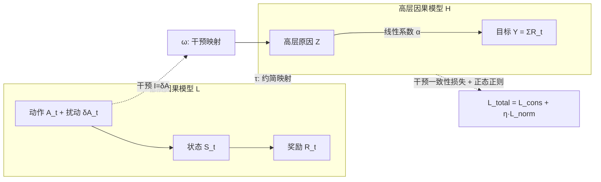

# Learning Nonlinear Causal Reductions to Explain Reinforcement Learning Policies

**会议**: ICLR 2026  
**代码**: [https://github.com/akekic/targeted-causal-reduction.git](https://github.com/akekic/targeted-causal-reduction.git)  
**领域**: 可解释性 / 因果推理 / 强化学习  
**关键词**: 可解释强化学习, 策略级解释, 因果模型约简, 干预一致性, 非线性 TCR  

## 一句话总结
把"为什么这个 RL 策略会成功或失败"建模成因果模型约简问题：通过对动作注入随机扰动作为干预，学一个只有"高层原因 Z→高层目标 Y"两个变量的简化因果模型，用**非线性扩展的 Targeted Causal Reduction (nTCR)** 提炼出真正影响累计奖励的状态/动作模式，从而给出全局、因果、可解释的策略行为解释。

## 研究背景与动机
**领域现状**：随着 RL 被部署到自动驾驶、推荐、机器人等高风险场景，理解"训练好的策略到底学到了什么行为"成为安全与可信的刚需。在 XRL（可解释强化学习）的分类里，Milani 等人把方法分成特征重要性、学习过程分析、以及**策略级解释（PLE）**三类，其中 PLE 关注整体行为是否符合人类预期——当策略在仿真里训练再迁移到真实世界时，操作者必须先认同它的"整体打法"，而这正是单步解释做不到的。

**现有痛点**：策略级解释极难获得。RL 用参数庞大的神经网络把高维观测映射到逐步动作，单步动作对最终结果的影响是间接的、反直觉的；更糟的是**信用分配问题**——状态和动作之间的动态依赖会制造与结果的**虚假相关**，让某些特征"能预测结果却并不导致结果"。直接对轨迹做相关性分析会被这些 spurious correlation 误导。

**核心矛盾**：要解释全局行为就需要因果而非相关；但已有因果抽象（causal abstraction）理论大多只给出"什么是合法抽象"的形式化条件，很少回答"如何从复杂低层系统**学出**这个抽象"。前作线性 TCR 给了可学习的目标函数，却把 τ、ω 映射限制成线性，无法刻画 RL 中普遍存在的非线性关系。

**本文目标**：在保持可解释性与因果一致性的前提下，把 TCR 推广到非线性，并给出理论保证，使学到的解释"反映真实因果模式"而非过拟合产物。

**核心 idea**：**【因果视角】** 把一整段 RL 轨迹（状态/动作/奖励）当作低层因果模型的变量，**【主动干预】** 在执行时对动作注入随机扰动 $\delta A_t$ 作为 shift 干预，**【模型约简】** 学一个映射 $\tau$ 把低层模型压成"高层原因 $Z$ → 目标 $Y$（累计奖励）"的两变量模型，让它在干预下的响应与原系统**近似一致**（interventional consistency），最终用可解释的 $\tau,\omega$ 回答"是哪些状态/动作模式、在哪些时刻最影响成败"。

## 方法详解

### 整体框架
nTCR 把"解释策略"形式化为 Causal Model Reduction：低层是完整的"动作-环境-奖励"因果链，高层只保留待学的标量原因 $Z=\tau_1(X_{\pi(1)})$ 和预设的目标 $Y=\tau_0(X_{\pi(0)})=\sum_t R_t$。训练信号是让"先在低层干预再映射到高层"与"先映射到高层再干预"两条路径得到的分布近似相等（图 1b 的近似交换图），从而把"什么导致奖励变化"的解释强制流经高层原因 $Z$。

### 关键设计

**1. 把 RL 轨迹翻译成可干预的因果约简问题：用动作扰动当 shift 干预。** RL episode 天然是因果链：观测→动作→环境变化→新状态与奖励。要识别"某个动作对全局表现的因果影响"，就得观察反事实——"如果当时动作不同会怎样"。nTCR 的做法是在策略选出的每个动作 $A_t$ 上加一个小随机偏移 $\delta A_t\sim\mathcal N(0,\sigma_t)$ 再送入环境，生成轨迹 $(S_0, A_0+\delta A_0, R_1,\dots)$。这些扰动正好对应 SCM 里的 shift 干预（把结构方程 $X_l:=f_l(\cdot)$ 改成 $X_l:=f_l(\cdot)+i_l$），在连续状态/动作的物理仿真里可解释为"额外施加的力或动量"。于是低层变量被划成两组：状态与动作 $X_{\pi(1)}$、奖励 $X_{\pi(0)}=R$，干预只作用在动作上 $I_{\pi(1)}=(\delta A_0,\dots,\delta A_{T-1},0,\dots)$，目标变量是累计奖励 $Y=\sum_{t=1}^T R_t$，这样就能直接套 TCR 学出"哪些状态/动作最影响表现"。

**2. 干预一致性 + 正态正则：让非线性约简既忠实又不退化。** 一致性损失要求高层模型在干预下的分布与低层 push-forward 分布匹配：$L_{\text{cons}}=\mathbb E_{i\sim P_I}\big[D(\hat P^{(i)}_\tau(Y,Z)\,\|\,P^{(\omega(i))}_H(Y,Z))\big]$，其中 $\hat P^{(i)}_\tau=\tau_\#[P_L^{(i)}]$。但线性 TCR 用的高斯近似散度并不强制分布完全对齐——一旦映射变非线性，高层原因 $Z$ 可能被学成高度非高斯、难解释的形状。为此作者加了**正态正则**：先把 $\hat P^{(i)}_\tau(Z)$ 标准化到零均值单位方差，再用与标准正态的 1-Wasserstein 距离度量偏离 $L_{\text{norm}}=\mathbb E_i\big[\int|F_{\hat P^{(i)}_{\tau,\text{std}}(Z)}(x)-\Phi(x)|\,dx\big]$。总目标 $L_{\text{total}}=L_{\text{cons}}+\eta_{\text{norm}}L_{\text{norm}}$，既逼近干预一致，又把高层原因约束成简单的单峰高斯，便于解读；$\eta_{\text{norm}}$ 控制两者权衡。

**3. 非线性的唯一性与存在性保证：让解释"不模棱两可"。** 非线性放开了函数空间，带来过拟合与不可辨识（多个约简同时成立）的风险，会直接毁掉可解释性。本文给出两条理论：**唯一性**（Prop. 4.1）——若低层是加性噪声 SCM、噪声密度的傅里叶变换处处非零、且高层因果效应 $\alpha\neq0$，则任何对所有 $i_{\pi(1)}$ 都精确（exact）的构造性变换，在乘法与加法常数意义下**唯一**；**存在性**（Prop. 4.2）——构造了一类满足联合高斯噪声、$f_0$ 具特定加性结构的低层模型，其精确变换可显式写成 $\bar\tau_1(X_{\pi(1)})=a^\top B(X_{\pi(1)}-f_1(X_{\pi(1)}))$、$\bar\omega_1(i_{\pi(1)})=a^\top B\,i_{\pi(1)}$。虽然真实仿真未必满足这些条件（故实际仍用近似一致性目标），但这两条结论给了"解释唯一、可被验证"的理论底座，并用于合成实验里校验算法是否收敛到真解。

**4. 可解释的非线性函数类：用高斯核基把权重映射回"哪个特征、哪个时刻"。** 纯非线性映射很难说清"高层原因到底代表什么"。作者利用 RL 轨迹的时间结构，把状态/动作按特征 × 时间步分解，并把 $\tau_1$ 写成高斯核基的加权和：$\tau_1(X)=\sum_{j=1}^d\sum_{t=1}^T w_{j,t}\cdot\exp\big(-(x-\mu_{j,t})^2/2\sigma^2_{j,t}\big)$，其中 $\{\mu_{j,t},\sigma_{j,t}\}$ 固定、跨越典型取值范围，只学权重 $w_{j,t}$。这相当于对"变量-取值对"做连续 one-hot 编码，核宽与核数控制偏差-方差权衡。最大好处是**可读**：直接看 $w_{j,t}$ 就能指出"哪个特征在哪个时刻最显著地贡献了高层因果解释"，$\omega_1$ 在干预空间上同理定义。

## 实验关键数据

### 主实验（三个场景）

| 场景 | 设置 | nTCR 揭示的关键模式 |
|------|------|----------------------|
| 合成因果模型 | 10 个按 Prop. 4.2 采样的低层模型，$\dim(X_0)=2,\dim(X_1)=9$ | 一致性损失收敛到近零，τ/ω 辨识损失收敛到理论真解，验证唯一性定理与实现正确 |
| Pendulum 摆起控制 | 状态 (cosθ, sinθ, 角速度)，动作为力矩 | Policy A 存在**方向偏置**——顺时针起摆奖励显著高于逆时针（尽管环境关于重力轴镜像对称、初始角均匀采样）；Policy B 的 ω-map 指出末段应施加更负力矩以防失稳 |
| 机器人乒乓 | 4-DoF 气动肌肉机械臂回球，状态含关节角/速/气压+球位速，动作为 8 块肌肉的目标压力变化 | 关节 0 的 τ-map 区分"先后摆再迎球"(高奖励) vs "过早前摆"(低奖励)；球越靠边/越远/越近网越难打 |

### 合成实验（理论验证）

| 指标 | nTCR | linear TCR |
|------|------|-----------|
| 训练一致性损失 | → 近零 | 收敛但更高（线性表达力受限） |
| τ 辨识损失（对真解） | → 0 | — |
| ω 辨识损失（对真解） | → 0 | — |

### 关键发现
- **能发现人难以察觉的隐性偏置**：Pendulum Policy A 的顺/逆时针不对称（Condition 1 vs 2 平均奖励 −30.38 vs −28.01）在对称环境下本不该出现，nTCR 把它显式暴露出来。
- **解释可被独立验证**：乒乓任务中 τ-map 指出"球偏外/偏远更难打"，与 400 个漏接球的实际落点分布（更多偏上、偏左/外侧）一致。
- **ω-map 给出可执行的改进方向**：Policy B 末段"施加更负力矩"的建议被后续轨迹分析证实能避免摆体翻倒。

## 亮点与洞察
- **从"相关解释"升级到"因果解释"**：主动注入动作扰动当干预，绕开了状态-动作动态依赖制造的虚假相关，这是策略级解释最容易踩的坑。
- **理论与可解释性绑在一起**：唯一性/存在性证明不是装饰，而是直接服务于"解释不模棱两可"这个工程诉求，并在合成实验里被当作 ground-truth 校验工具。
- **高斯核基是点睛之笔**：把不可读的非线性映射重新表达成"特征×时刻"的权重图，让解释天然可视化、可定位到具体时间窗口。
- **正态正则补上了线性 TCR 的理论漏洞**：非线性放开后分布会退化，用 1-Wasserstein 到标准正态的距离把高层原因拉回单峰，兼顾忠实度与可读性。

## 局限与展望
- **依赖动作可扰动的仿真环境**：方法建立在"能对动作注入 shift 干预并重采样轨迹"之上，主打连续状态/动作的物理仿真；难以直接用于离散动作、或不能反复干预的真实在线系统。
- **只有单个高层原因 + 线性 Z→Y**：高层模型被约束成两变量、$Z\to Y$ 线性加性高斯，复杂策略里可能存在多个相互作用的高层因素，单原因解释会有信息损失（论文将多原因一般情形留在附录）。
- **精确变换条件现实中难满足**：唯一性/存在性定理依赖加性噪声、傅里叶非退化等假设，真实仿真未必成立，实际只能退而求"尽量一致"的近似解，解释的因果保真度依赖近似质量。
- **核基与扰动尺度需调**：核宽/核数控制偏差-方差，扰动方差 $\sigma_t$ 与正则强度 $\eta_{\text{norm}}$ 都是超参，选取会影响解释的粒度与稳定性。

## 相关工作与启发
- **XRL 分类（Milani et al.）**：特征重要性、学习过程分析、策略级解释三类；nTCR 属于 PLE 中"抽取抽象状态"的子类，把状态/动作/奖励空间降到高层变量。
- **因果 XRL（Madumal et al.）**：用反事实生成对比解释，但需预定义因果图且只解释单步动作；nTCR 不需预设图结构，且解释跨 episode 的全局模式。
- **策略扰动方法**：有工作靠扰动策略找"控制关键时刻"，nTCR 更进一步——不只定位时刻，还提炼出"哪些状态/动作有利或有害"的表示。
- **因果抽象理论（Geiger et al. 等）与线性 TCR**：前者多停在"什么是合法抽象"的形式条件、或聚焦语言模型且高层变量已知；本文是线性 TCR 的非线性扩展，正面解决"如何从低层系统学出抽象"。
- **启发**：把"解释"问题重写成"带干预一致性约束的约简学习"，是一种通用范式——任何"高维系统→可读高层因果"的需求（不止 RL）都可能套用这套"主动干预 + 可解释函数类 + 理论唯一性"的组合拳。

## 评分
- **新颖性**: ⭐⭐⭐⭐⭐ 把策略级解释形式化为因果模型约简、并给出非线性 TCR 的唯一性/存在性理论，视角与理论都很新。
- **实验充分度**: ⭐⭐⭐⭐ 合成（验理论）+ Pendulum + 真实风格机器人乒乓三层递进，且解释能被独立分析证实；但缺与其他 XRL/PLE 方法的定量横向对比。
- **写作质量**: ⭐⭐⭐⭐ 图 1 把整条 pipeline 讲得很清楚，理论与直觉穿插；符号较密、部分关键细节下放附录。
- **价值**: ⭐⭐⭐⭐ 为 RL 可信部署提供了一条"因果、全局、可验证"的解释路径，机器人/控制场景实用性强，理论也可迁移到更广的系统解释问题。

<!-- RELATED:START -->

## 相关论文

- [\[ICLR 2026\] ExPO-HM: Learning to Explain-then-Detect for Hateful Meme Detection](expo-hm_learning_to_explain-then-detect_for_hateful_meme_detection.md)
- [\[ICLR 2026\] GEPA: Reflective Prompt Evolution Can Outperform Reinforcement Learning](gepa_reflective_prompt_evolution_can_outperform_reinforcement_learning.md)
- [\[ICLR 2026\] NIMO: a Nonlinear Interpretable MOdel](nimo_a_nonlinear_interpretable_model.md)
- [\[ICLR 2026\] Reinforcement Learning Fine-Tuning Enhances Activation Intensity and Diversity in the Internal Circuitry of LLMs](reinforcement_learning_fine-tuning_enhances_activation_intensity_and_diversity_i.md)
- [\[ICML 2026\] MiniMax Learning of Interpretable Factored Stochastic Policies from Conjoint Data, with Uncertainty Quantification](../../ICML2026/interpretability/minimax_learning_of_interpretable_factored_stochastic_policies_from_conjoint_dat.md)

<!-- RELATED:END -->
