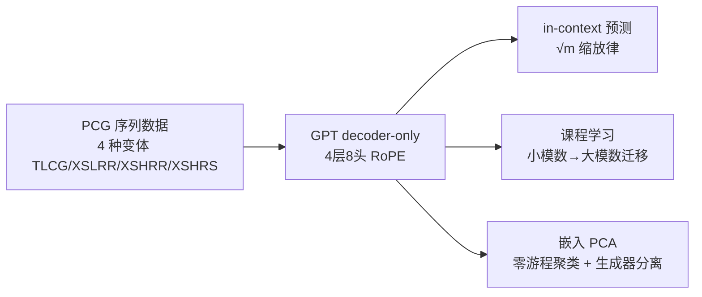

# Learning Pseudorandom Numbers with Transformers: Permuted Congruential Generators, Curricula, and Interpretability

**会议**: ICLR 2026  
**OpenReview**: [https://openreview.net/forum?id=m5KplPzCzM](https://openreview.net/forum?id=m5KplPzCzM)  
**代码**: 待确认  
**领域**: 可解释性 / Transformer 能力边界  
**关键词**: 伪随机数生成器, PCG, in-context learning, 课程学习, 缩放律, 嵌入可解释性  

## 一句话总结
Transformer 能纯靠序列数据 in-context 破解 NumPy 默认随机数生成器 PCG（超出经典攻击假设），其所需上下文长度随模数呈 $\sqrt{m}$ 缩放，大模数训练必须靠课程学习，且嵌入层会自发把整数按"位旋转不变的零游程结构"聚类。

## 研究背景与动机
**领域现状**：Transformer 的 in-context learning 能力让人好奇它到底能学会哪些隐藏模式。伪随机数生成器（PRNG）是绝佳测试床——它们专门设计来通过统计随机性检验，但底层完全由确定性递推支配，因此是检验模型"模式识别极限"的受控基准。前作（Tao et al., 2025）已证明 Transformer 能学线性同余生成器（LCG）。

**现有痛点**：LCG 太简单（输出几乎直接暴露内部状态）。真正实用的是 **置换同余生成器（PCG）**——NumPy 的默认生成器，它在 LCG 状态上叠加一连串位移、XOR、旋转、截断，把内部状态彻底打乱，BigCrush 检验下只需 49 位状态即可通过（LCG 要 88 位）。经典攻击（Bouillaguet et al., 2020）破解 PCG 需要**预先知道**模数 $m$、乘子 $a$ 和置换规则，代价高达 2 万 CPU 小时。

**核心矛盾**：能否让模型在**不知道**生成器参数、面对截断和置换双重信息损失的情况下，纯从数据学会预测 PCG？信息被位运算彻底搅乱后，还剩多少可被利用的结构？

**本文目标**：系统刻画 Transformer 学习 PCG 的能力、缩放规律、训练策略和内部机制。**核心 idea**：把 PCG 当作受控基准，一方面证明 **Transformer 可作为超越经典假设的 ML 攻击工具**，另一方面通过**缩放律 + 课程学习 + 嵌入可解释性**三条线揭示模型是怎么在被打乱的位结构里找回规律的。

## 方法详解

### 整体框架
用 GPT 风格 decoder-only Transformer（4 层、8 头、$d_{model}=1024$、RoPE 位置编码）自回归预测 PRNG 序列的下一个数：给定 $x_0,\dots,x_{L-1}$ 输出 $\hat{x}_1,\dots,\hat{x}_L$，交叉熵损失 + AdamW。研究沿三条主线展开——能力刻画（多变体 in-context 预测 + 缩放律）、训练策略（课程学习破解大模数停滞）、机制分析（嵌入 PCA + 生成器分离）。

### 关键设计

**1. 受控的 PCG 基准与"超越经典攻击"的预测任务：把破解难度精确旋钮化。** PCG 的递推是 $s_i = (a s_{i-1} + c) \bmod m,\ x_i = f(s_i)$，其中 $f$ 是位移/XOR/旋转/截断的组合。论文构造四种难度递增的变体：TLCG（仅截断高位）、XSLRR（低半位 XOR 增强后随机旋转）、XSHRR（高位增强后旋转）、XSHRS（高位增强后随机移位）。关键在于测试序列用**训练中没见过的 $(a,c)$** 生成，且模型完全不知道 $m$、$a$ 或置换类型——这比经典攻击（必须已知 $m$ 和 $a$）的假设严苛得多。结果是单个在"混合"数据集（四种变体混训）上的模型，看完 512 个 in-context 元素后对所有变体都能超 90% 准确率；即便输出只保留状态最高 1 位（$k=1$，随机基线只有 $1/2$），看到第 256 个元素仍能 95% 准确，证明长上下文能补偿极端信息损失。

**2. $\sqrt{m}$ 缩放律：上下文长度才是真正的瓶颈。** 论文在 $m=2^{14}$ 到 $2^{22}$ 范围扫描 XSLRR，发现达到 90% 准确率所需的 in-context 元素数随模数呈 $\frac{1}{2}\sqrt{m}$ 增长——比 LCG 的 $m^{0.25}$ 陡得多，正反映了截断和置换带来的额外信息遮蔽。若把阈值从固定 90% 换成相对随机基线的 $\gamma/\sqrt{m}$，缩放指数落在 $\beta\in[0.33,0.34]$。这条律的实际意义在于：随模数增大，**上下文长度（而非模型参数或数据量）成为主导瓶颈**，预测时间计算量约 $m^{0.53}$，远优于暴力搜索的 $m^{2.5}$，说明 ML 攻击在渐近意义上有优势。准确率-位置曲线还在 2 的幂次位置出现台阶式跃升，因为低位比特周期为 $2^k$，一旦在上下文里走完一个周期模型立刻获得增益。

**3. 课程学习：大模数训练逃出"长停滞"的唯一出路。** 当 $m\geq 2^{20}$ 时，从零直接训练在固定预算（75k 步）内根本不收敛——模型陷入漫长的损失停滞，第 640 个 token 处只有 4% 准确率。论文用两种互补的课程策略破局。其一是**数据混合**：训练时以概率 $\alpha$ 采样更小模数的数据，并让 $\alpha$ 从初值（最佳为 1%）随训练指数衰减到 0；这既消除了初始停滞，又显著拓宽了稳定学习率的范围（让大步长不再发散）。其二是**预训练初始化**：用小模数（如 $m=2^{18}$）训好的模型权重初始化大模数模型，重叠部分的嵌入矩阵直接迁移，新增 token 随机初始化，RoPE 的位置外推让模型自然适配更长序列。两者结合时效果最佳——预训练让模型一开始就接近最终状态、跳过停滞，课程混合再补一刀稳定性。

**4. 嵌入层自发的零游程聚类：模型内化了生成器的位旋转不变性。** 对 XSLRR-16/8 模型的嵌入矩阵做 PCA，发现前几个主成分精确对应 token 二进制表示的位级统计：**PC1 完美相关于零比特总数 $N_0$，PC2 完美相关于"零游程"的个数**（用 $Z(a_1,\dots,a_k)$ 记每两个 1 之间连续 0 的长度），PC3 捕捉奇偶位不平衡 $PC3(x)\propto(b_0{+}b_2{+}b_4{+}b_6)-(b_1{+}b_3{+}b_5{+}b_7)$。也就是说嵌入空间自发把整数按**旋转不变的零游程结构**聚成簇（如 $Z(3,1)$ 和 $Z(2,2)$ 落同一簇），恰好对应 PCG 在输出前施加旋转所带来的对称性。这套聚类规则在不同模数下保持一致——这正解释了预训练初始化为何如此有效：嵌入层先达到可用表示，深层才快速演化，强嵌入先验直接迁移过去就缩短了停滞。在混合训练时，生成器身份的区分则出现在**第三个 Transformer 块的 MLP 输出**：第 64 个 token 就能把 TLCG 和 PCG 分开，第 128 个 token 能干净区分所有 PCG 变体，说明模型先学共享递推、再在深层细化生成器特异性。

## 实验关键数据

### 主实验

| 设置 | 关键结果 |
|------|----------|
| 混合训练（4 变体） | 看 512 个 in-context 元素后所有变体 > 90% 准确率 |
| 分离训练（单变体） | 仅需 128 个元素即近 100% 准确率 |
| 极端截断 $k=1$ | 第 256 元素处 95% 准确（随机基线仅 50%）|
| 模数范围 | $2^{14}$–$2^{22}$，最大 52M 参数、5×10⁹ token |

### 缩放与课程

| 维度 | 发现 |
|------|------|
| 模数缩放律 | 所需上下文 $\propto \frac{1}{2}\sqrt{m}$（LCG 为 $m^{0.25}$）|
| 推理计算量 | $\propto m^{0.53}$，远优于暴力搜索 $m^{2.5}$ |
| $m\geq 2^{20}$ 从零训练 | 75k 步内不收敛，640 token 处仅 4% |
| 课程（预训练+混合）| 跳过停滞、快速收敛、最终更高准确率 |
| 最佳混合初值 | $\alpha=1\%$，指数衰减调度最优 |

### 关键发现
- 即使 $m=2^{16}$ 本身没学会，混入少量其数据也能大幅提升 $m=2^{18}$ 性能。
- 数据多样性 $n_a=n_c=1024$ 已足够泛化，无需穷举 5×10⁸ 种 $(a,c)$。
- 深度 1 的模型即可解小模数 PCG（XSLRR-14/7）。
- 准确率-位置曲线在 2 的幂次处台阶式跃升，反映模型利用低位比特周期。

## 亮点与洞察
- **把"AI 能否破解密码学原语"问题做成可量化的缩放律**：不再停留在"能/不能"，而是给出 $\sqrt{m}$ 这条精确的难度律，并对比经典攻击的渐近优势。
- **嵌入可解释性与训练动力学闭环**：PCA 发现的零游程聚类不只是漂亮的可视化，它直接解释了预训练初始化为何有效（结构跨模数持久），把"机制分析"和"训练策略"打通。
- **课程学习的两个非平凡收益**：除了消除停滞，还**拓宽了稳定学习率范围**——这个副作用对大模型训练有普适启示。

## 局限与展望
- 模数最大到 $2^{22}$，离 NumPy 实际的 XSLRR-128/64（$m=2^{128}$）还有巨大差距，能否外推到密码学相关尺度未知。
- 论文坦承未深究 2 的幂次台阶跃升背后"残留位模式"的精确性质。
- 架构局限于标准注意力；作者指出状态空间模型或高效注意力可能改善推理时计算缩放律，但未实验验证。
- 课程/预训练对"哪些小模数能有效迁移"缺乏理论刻画（实验上混 $2^{18}$ 帮助甚微、混 $2^{16}$ 才有效，机制未明）。

## 相关工作与启发
- **经典 PCG 攻击**（Bouillaguet et al., 2020）：需已知 $m$、$a$、置换，guess-and-determine 从 64 个输出恢复状态，但代价 2 万 CPU 小时且无渐近律——本文 ML 方案的对照基准。
- **课程学习**（Bengio et al., 2009; Garg et al., 2023）：已有工作指出充足训练步数下课程收益有限，但在受限算力/噪声数据下能提升稳定性——本文在大模数停滞这个"硬瓶颈"上给出了课程不可或缺的强证据。
- **in-context learning 与算法学习**（Olsson et al., 2022 的 induction head 等）：本文为"Transformer 能学什么算法结构"提供了一个难度可调、机制可解释的新基准。

## 评分
- **新颖性**: ⭐⭐⭐⭐ 首次系统证明 Transformer 能 in-context 破解 PCG 并给出 $\sqrt{m}$ 缩放律，把 AI-vs-PRNG 做成可量化科学问题。
- **实验充分度**: ⭐⭐⭐⭐ 三轴缩放（模数/数据/模型）+ 截断/课程/可解释性多维度，扎实但模数尺度离实用仍远。
- **写作质量**: ⭐⭐⭐⭐ 逻辑清晰，缩放律—课程—嵌入三线呼应，图表信息密度高。
- **价值**: ⭐⭐⭐⭐ 既是 ML 安全（PRNG 攻击）的警示，也是 Transformer 能力边界与可解释性的优质受控基准。

<!-- RELATED:START -->

## 相关论文

- [\[ICLR 2026\] Automated Interpretability Metrics Do Not Distinguish Trained and Random Transformers](automated_interpretability_metrics_do_not_distinguish_trained_and_random_transfo.md)
- [\[ICLR 2026\] The Tutor-Pupil Augmentation: Enhancing Learning and Interpretability via Input Corrections](the_tutor-pupil_augmentation_enhancing_learning_and_interpretability_via_input_c.md)
- [\[ICLR 2026\] Sparse CLIP: Co-optimizing Interpretability and Performance in Contrastive Learning](sparse_clip_co-optimizing_interpretability_and_performance_in_contrastive_learni.md)
- [\[ICLR 2026\] Small Transformers Don't Need LayerNorm at Inference Time: Scaling LayerNorm Removal to GPT-2 XL and Implications for Mechanistic Interpretability](small_transformers_dont_need_layernorm_at_inference_time_scaling_layernorm_remov.md)
- [\[NeurIPS 2025\] nnterp: A Standardized Interface for Mechanistic Interpretability of Transformers](../../NeurIPS2025/interpretability/nnterp_a_standardized_interface_for_mechanistic_interpretability_of_transformers.md)

<!-- RELATED:END -->
