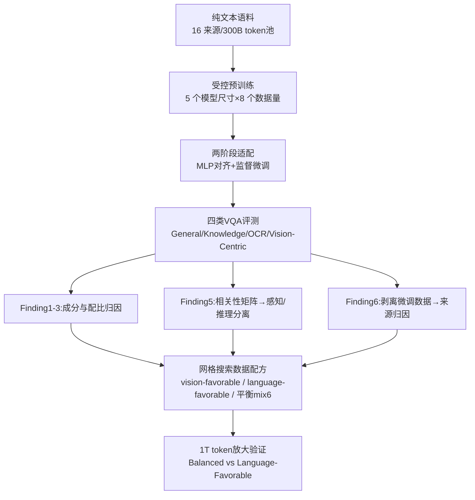

# Learning to See Before Seeing: Demystifying LLM Visual Priors from Language Pre-training

**会议**: ICLR 2026  
**OpenReview**: [https://openreview.net/forum?id=pfw176o1YJ](https://openreview.net/forum?id=pfw176o1YJ)  
**代码**: 待确认（承诺开源 MLE-Bench）  
**领域**: 可解释性 / 多模态大模型分析  
**关键词**: 视觉先验, 语言预训练, 多模态大模型, 数据配比, 感知-推理分离, MLLM  

## 一句话总结
通过 100+ 组受控实验（耗费 50 万 GPU 小时）系统拆解"只读文本的 LLM 为何会产生视觉能力"，发现视觉先验可分离为**推理先验**（来自代码/数学/学术等推理数据、随占比单调增长且跨视觉编码器通用）与**感知先验**（弥散地来自宽泛语料、更依赖视觉编码器和指令微调），并据此给出一份"重推理、少量视觉描述"的预训练数据配方，在 1T token 规模上验证可造出更强的 vision-aware LLM。

## 研究背景与动机
**领域现状**：一个反直觉现象正在被反复观察到——只在纯文本上训练的 LLM 却展现出丰富的"视觉先验"：能写代码渲染 2D/3D 场景、只需极少图文对就能解锁视觉问答、甚至其 transformer 层被当作视觉编码器都能打过专用视觉骨干。这些现象被认为是 Platonic Representation Hypothesis（不同模态是同一世界模型的不同"投影"）的有力佐证。

**现有痛点**：尽管现象被广泛记录，但学界对它**只停留在"观察奇观"**的层面——视觉先验究竟从哪些数据来？它是一整块知识还是由可分离的子能力组成？能不能被"刻意培养"而不是碰运气涌现？这些根本问题没有受控实验回答，导致构建 MLLM 时数据配方全靠经验直觉。

**核心矛盾**：视觉能力的来源既可能藏在 LLM 预训练阶段（语言数据），也可能来自后续视觉指令微调（图文数据），二者纠缠在一起难以归因；而且"视觉能力"本身是否单一也不清楚——把感知（看清图里有什么）和推理（基于图做多步推断）混为一谈会掩盖它们各自的 scaling 规律。

**本文目标**：把整条 MLLM 构建管线（LLM 预训练 → 视觉对齐 → 监督多模态微调）拆开做归因实验，回答视觉先验的**结构、来源、可培养性**三个问题，并把结论落成一份可复现的预训练数据配方。

**核心 idea**：**[数据中心归因]** 固定模型结构，只动预训练数据的"成分与配比"，用下游 VQA 表现反推哪些文本类别培养了哪类视觉能力；**[感知-推理分离]** 用四类 VQA 任务的相关性矩阵证明视觉先验不是铁板一块，而是松耦合的感知簇与推理簇；**[刻意培养]** 用网格搜索找到"重推理 + 少量视觉世界描述"的平衡配方，在 1T token 规模兑现承诺。

## 方法详解

### 整体框架
本文不是提出一个新模型，而是一套**受控归因实验协议 + 由实验结论凝结出的数据配方**。基座是 Llama-3 风格 LLM（340M~13B，默认 3B / 30B token），经"MLP 投影对齐 + 监督微调"两阶段适配成 MLLM；评测对 LLM 看困惑度与 8 个语言基准，对 MLLM 用 Cambrian-1 式 16 基准并归成 General / Knowledge / OCR&Chart / Vision-Centric 四类，再辅以语言-视觉表征核相似度。围绕"成分→配比→结构→来源→放大验证"五步推进。

### 关键设计

**1. 单源归因实验：把"哪类文本喂出哪类视觉能力"做成可测量的因果切片。** 作者固定 3B 模型 + 30B token，分别只用 16 个单一数据源（code、math、academia、arts、food、biology…）各训一个 LLM，再统一适配成 MLLM 看四类 VQA。这样表现差异可直接归因到预训练源。结果（Figure 3）揭示：Vision-Centric VQA 的强表现高度集中在两类数据——**推理密集型**（code、math、academia）和**富含视觉世界描述**（arts、food），得分 >42% 的模型全来自这些源。这一步先把"视觉先验来自整个语料的模糊直觉"收窄成两个明确的候选驱动因素，为后续配比实验立靶。

**2. 配比扫描分离"推理 vs 视觉描述"的边际贡献曲线。** 用一个 32B LLM 把 300B 语料细分为推理类（code/math/science reasoning）与视觉世界类（visual concept 命名实体 / visual attribute 颜色形状纹理 / visual relationship 空间与部件关系），然后对每一类把它在混合中的占比从 0%→25%→50%→75%→100% 扫一遍（其余按比例补齐、总量恒定 30B token）。关键发现（Figure 4）是两条形态截然不同的曲线：**推理数据的贡献是渐进且深远的**，性能一路涨到 75% 占比仍有收益；而**视觉世界描述的贡献快速饱和**——一点点是关键，但加多了边际收益骤减。这条"曲线形态差异"是后面"重推理、少视觉描述"配方的直接依据。

**3. 相关性矩阵把视觉先验拆成感知簇与推理簇。** 把前面所有实验的 105 个 3B 模型聚合起来，对四类 VQA 表现算 Spearman 相关矩阵（Figure 5）。结果浮现两个松耦合的能力轴：General↔OCR 相关 0.37（共享对原始视觉输入的**感知敏锐度**→感知先验），Knowledge↔Vision-Centric 相关 0.33（共享超越感知的**抽象多步推断**→推理先验），而两簇之间相关性很弱甚至略负。统计独立性意味着它们由不同机制培养——这与近期靠参数合并发现感知/推理可分离的工作（Chen et al. 2025）相互印证，把"视觉先验是一整块"的默认假设推翻成"至少两块、各有来源"。

**4. 阶梯式剥离微调数据，给推理/感知能力定来源。** 为判断每类能力到底来自 LLM 预训练先验还是后续视觉指令微调，作者把 Cambrian-7M 分成 1.8M 感知 / 0.6M 推理 / 2.6M 其他，训 5 个配置，把感知或推理微调数据按 100%→50%→0% 阶梯剥离、其余不动（Figure 7）。配合换三种视觉编码器（MetaCLIP/DINOv2/MAE）的通用性实验（Figure 6）得出双机制结论：**推理能力主要由语言预训练的推理先验决定**——它跨视觉编码器都呈一致的强上升趋势、是模态无关的基础先验，剥掉推理微调数据掉得很少；而**感知能力更依赖视觉编码器特性和监督微调**——剥掉感知微调数据时感知基准掉幅最大、且换编码器趋势不一致。这一步完成了从"现象"到"归因"的关键跨越。

**5. 三段式网格搜索凝出可落地的平衡配方。** 先在 300B 池上网格搜索 24 种 reasoning(50%~85%)×visual(5%~30%) 配比（Table 1），找到 vision-favorable 最优点 ≈ 60% 推理 + 15% 视觉——印证"强视觉基底不靠堆视觉描述，而靠先立起推理能力再用少量视觉知识接地"。再在 6 个实用源（web-crawl/encyclopedia/academia/literature/math/code）上定 language-favorable 配方（mix0，文本准确率 53.0% 最优），最后在 mix0→mix10 之间插值，得平衡配方 **mix6**（综合排名第一：视觉提升而语言几乎不掉）。

## 实验关键数据

### 主实验：1T token 放大验证（Table 3，7B / 各 1T token）

| 模型 | 困惑度(↓) | 语言平均acc | General | Knowledge | OCR&Chart | Vision-Centric | VQA Overall |
|------|----------|------------|---------|-----------|-----------|----------------|-------------|
| Language-Favorable (mix0) | 8.72 | 0.647 | 46.92 | 28.35 | 21.49 | 46.31 | 37.32 |
| **Balanced (mix6)** | **7.49** | **0.655** | **49.59** | **29.02** | **23.63** | **46.59** | **38.64** |

平衡配方在**语言和视觉两端同时更好**：困惑度更低（7.49 vs 8.72）、语言准确率略高，VQA 综合 +1.32。一个有趣动态：训练初期 Balanced 的语言表现落后，约 600B token 后反超——暗示当 token 量足够大时，推理类 token 的收益需要建立在充足世界知识之上才能释放。

### 消融/归因实验（3B / 30B token）

| 归因实验 | 设置 | 关键结论 |
|----------|------|----------|
| 模型×数据规模（Figure 2） | 5 尺寸×8 数据量 | 四类能力 **scaling 不均匀**：OCR 对模型尺寸更敏感、Vision-Centric 大模型才吃得下更多数据 |
| 单源预训练（Figure 3） | 16 源各训一个 | Vision-Centric 强表现集中在 code/math/academia + arts/food，得分>42% 全来自这些源 |
| 配比扫描（Figure 4） | 0~100% 各类占比 | 推理数据贡献渐进到 75%；视觉描述快速饱和 |
| 配比网格（Table 1/2） | 24+11 种 mix | 最优 ≈ 60% 推理 + 15% 视觉；mix6 综合排名第一 |
| 微调数据剥离（Figure 7） | 感知/推理 100→50→0% | 剥感知掉感知基准最多；剥推理掉幅都很小 |
| 换视觉编码器（Figure 6） | MetaCLIP/DINO/MAE | 推理先验跨编码器一致上升（通用）；感知不通用 |

### 关键发现
- **视觉先验 = 感知先验 + 推理先验**，二者统计独立、来源不同：推理先验来自推理密集语料、可预测地随占比增强、跨视觉编码器通用；感知先验弥散地来自大规模语言建模的多样性、更依赖编码器与指令微调。
- **"先学会看"是可以刻意培养的**：把预训练数据偏向推理、辅以少量视觉世界描述，能在不牺牲语言能力的前提下显著增强 MLLM 的视觉能力。
- 附带提出 **MLE-Bench**（多层级存在性基准）探测纯感知能力，并发现 **Blind Visual Instruction Tuning** 这一探针——许多 SOTA MLLM 在没有图像输入时也察觉不到缺图，会照样"幻觉"出答案。

## 亮点与洞察
- **把"奇观"变成"工程"**：第一次系统地把 LLM 视觉先验从"碰巧涌现"拆解到"可归因、可配方、可放大验证"的层面，给出 data-centric roadmap。
- **感知/推理分离**这一发现极具解释力——它解释了为什么不同 VQA 类别 scaling 规律迥异，也指导了数据配比该往哪边偏。
- **反直觉的配方结论**：强视觉基底不是靠堆视觉描述，而是靠先立推理能力再用少量视觉知识接地（60% 推理 + 15% 视觉），与"想让模型看得好就多喂视觉文本"的朴素直觉相反。
- 实验规模罕见（100+ 受控实验、50 万 GPU 小时、5 个模型尺寸、1T token 放大），结论可信度高。

## 局限与展望
- 感知/推理的二分作者自己也承认是"概念简化"，边界并不清晰，Knowledge/Vision-Centric 任务本身就混合了感知与推理。
- 感知先验的来源仍较模糊——只定位到"大规模语言建模的弥散副产物"，没有像推理先验那样给出可控旋钮。
- 平衡配方 mix6 的最优点依赖具体的源划分与评测套件，迁移到其他语料体系/评测时是否仍最优需再验证；网格搜索本质上是经验性的，缺乏理论刻画。
- 放大验证只到 7B/1T token，与真正前沿 MLLM 的规模仍有差距；Blind Visual Instruction Tuning 揭示的"无图也答"幻觉问题被指出但未深入解决。

## 相关工作与启发
- **Platonic Representation Hypothesis**（Huh et al. 2024；Jha et al. 2025）：本文为"文本与图像是同一世界模型的不同投影"提供了强经验支撑——视觉先验可视为 LLM 从文本单一投影中恢复统一世界模型的直接后果。
- **参数合并视角的感知/推理分离**（Chen et al. 2025）：本文从数据归因角度独立印证并扩展了二者可分离的结论。
- **数据混合/配比研究**（Aryabumi et al. 2024 code in pretraining、各类 data mixing 工作）：本文把"数据配比影响下游能力"的研究从纯语言任务推进到多模态视觉能力。
- **启发**：(1) 多模态能力的培养应从预训练最早期就纳入考量，而非等到视觉对齐阶段；(2) 想增强 MLLM 推理类视觉能力，调 LLM 预训练里的推理数据占比可能比堆图文对更划算；(3) MLE-Bench 与 Blind VIT 为"探测 MLLM 到底在看图还是在用语言 hack"提供了可复用工具。

## 评分
- **新颖性**: ⭐⭐⭐⭐⭐ 第一篇系统拆解 LLM 视觉先验来源与结构的工作，感知/推理分离 + 数据配方的视角既新又落地。
- **实验充分度**: ⭐⭐⭐⭐⭐ 100+ 受控实验、50 万 GPU 小时、5 尺寸、多编码器、1T token 放大验证，归因链条完整。
- **写作质量**: ⭐⭐⭐⭐ 用 6 个 Finding 串起逻辑清晰，但图表密集、关键结论散落在附录较多，阅读需来回跳转。
- **价值**: ⭐⭐⭐⭐⭐ 把"视觉能力为何涌现"从奇观变成可设计的工程问题，对下一代 vision-aware LLM 的预训练数据策略有直接指导意义。

<!-- RELATED:START -->

## 相关论文

- [\[ICLR 2026\] Evolution of Concepts in Language Model Pre-Training](evolution_of_concepts_in_language_model_pre-training.md)
- [\[ICLR 2026\] Learning is Forgetting: LLM Training As Lossy Compression](learning_is_forgetting_llm_training_as_lossy_compression.md)
- [\[ICLR 2026\] Priors in Time: Missing Inductive Biases for Language Model Interpretability](priors_in_time_missing_inductive_biases_for_language_model_interpretability.md)
- [\[ICLR 2026\] Hidden Breakthroughs in Language Model Training](hidden_breakthroughs_in_language_model_training.md)
- [\[ICLR 2026\] Learning to Weight Parameters for Training Data Attribution](learning_to_weight_parameters_for_training_data_attribution.md)

<!-- RELATED:END -->
