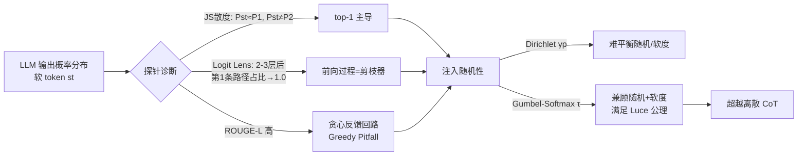

# LLMs are Single-threaded Reasoners: Demystifying the Working Mechanism of Soft Thinking

**会议**: ICLR 2026  
**OpenReview**: [https://openreview.net/forum?id=ASLuOoP78o](https://openreview.net/forum?id=ASLuOoP78o)  
**代码**: 待确认  
**领域**: 可解释性 / 连续空间推理  
**关键词**: Soft Thinking, 连续推理, Greedy Pitfall, Gumbel-Softmax, 探针分析  

## 一句话总结
通过一套探针实验揭示「软思考(Soft Thinking)」并不能像理论宣称的那样并行探索多条推理路径——LLM 实际上是「单线程推理者」，几乎只靠软 token 中概率最高的那个分量驱动下一步，从而陷入贪心反馈回路；本文据此提出 **Stochastic Soft Thinking**，用 Gumbel-Softmax 注入可控随机性打破贪心陷阱，在 8 个推理基准上超越 vanilla 软思考甚至离散 CoT。

## 研究背景与动机
**领域现状**：Chain-of-Thought(CoT) 把推理约束在离散 token 序列上，受限于自然语言的表达带宽。受「人类推理部分独立于语言」的神经科学启发，近期一批工作(COCONUT、Soft Thinking 等)主张让 LLM 在**连续概念空间**里推理：不再 argmax 选一个 token，而是把整个词表概率分布(软 token)按权重加权嵌入后喂给下一步，理论上可以在隐空间里维持一棵「潜在搜索树」、并行探索多条路径。

**现有痛点**：这些工作大多停留在理论框架与漂亮的直觉上，缺乏对「软思考内部到底发生了什么」的实证检验。更尴尬的是，本文的初步实验发现 **vanilla 软思考普遍打不过普通的离散 token 采样**——在 DeepSeek-R1-Distill-Qwen-32B / QwQ-32B / Skywork-OR1-32B 三个模型上，软思考的平均分甚至与**贪心解码**接近(如 R1-32B 软思考 71.50 vs 贪心 71.57 vs 采样 78.50)。

**核心矛盾**：理论说软 token 携带更丰富信息、能并行探索；实证却显示它退化成了贪心。**软思考真的在做并行搜索吗？**

**本文目标**：用探针技术拆开软思考的工作机制，解释它为何无效，并据此修复它。

**核心 idea**：`贪心陷阱诊断 + 随机性注入` —— 先证明 LLM 是单线程推理者(被 top-1 token 主导，形成贪心反馈回路即「Greedy Pitfall」)，再通过 Gumbel-Softmax 在保持「软度」的同时注入「无偏随机性」打破这个回路。

## 方法详解

### 整体框架
本文是「先诊断、后开方」的结构：第一部分用三类探针(JS 散度对比、Logit Lens、序列相似度)证实软思考被 top-1 token 主导、陷入贪心；第二部分提出 Stochastic Soft Thinking，把确定性的软 token $st$ 替换成带可控随机性的 $st'$，并论证 Gumbel-Softmax 优于 Dirichlet 采样且有理论支撑。

### 关键设计

**1. 三探针诊断「单线程」假设：软思考几乎等价于只输入 top-1 token。** 作者在 QwQ-32B 上对 AIME 跑出近 $10^6$ 个推理步，对每个「软步」做三次前向：分别输入整个软 token($P_{st}$)、最高概率 token($P_1$)、次高概率 token($P_2$)，用 JS 散度衡量预测差异。结果是 $P_{st}$ 与 $P_1$ 的 JS 散度高度集中在 0 附近(几乎一模一样)，而 $P_{st}$ 与 $P_2$ 的 JS 散度频繁逼近最大值——这直接说明软 token 的「下一步预测」由 top-1 分量独占，次高 token 几乎不起作用，案例研究里甚至出现 ‘let’ 后接语义不通的 ‘I’ 这种被主导分量带歪的现象。

**2. Logit Lens 证明前向过程本身就是「剪枝器」。** 为看清多条路径如何在层间被裁剪，作者挑出由两个语义分歧 token 构成的「分叉点」，人为构造 0.6/0.4 的平衡软 token，用 Logit Lens 把各层隐状态投影回词表，统计软 token 前向结果与两个单 token 前向结果的 top-k 交集占比。前 2-3 层两条路径占比都在上升(模型确实**短暂地**并行考虑了两条路)，但越往深层走，第一条 token 的路径占比稳步升到 1.0，第二条则被压下去。换句话说，Transformer 的逐层前向**内在地**偏向最自信的那条路径——并行只是昙花一现。

**3. Greedy Pitfall：贪心反馈回路解释了为何 vanilla 软思考无效。** 既然每步都靠 top-1 token，软思考就会陷入「越自信→越强化→越贪心」的正反馈。作者把 vanilla 软思考每步的 top-1 token 拼成一条推理链，以**贪心解码**轨迹为参考算 ROUGE-L，发现它显著高于离散 token 思考的 ROUGE-L——即软思考天然贪心，而最大化似然的路径恰恰是「泛化、重复、生硬」的劣质路径，这正是它打不过采样的根因。

**4. Stochastic Soft Thinking：用 Gumbel-Softmax 注入可控随机性。** 作者要求随机软 token $st'$ 满足三性质：合法性(仍是 $V$ 上的概率分布)、随机性(无偏且保留 $st$ 的预测信息)、软度(不塌成 one-hot)。两条路线对比：(a) **Dirichlet 采样**把输出分布当浓度参数 $\mathrm{Dir}(\gamma p)$ 采样，但 $\gamma\to 1$ 时塌成近似 one-hot(够随机但不软)、$\gamma$ 增大又收敛回原分布(够软但不随机)，难以两全；(b) **Gumbel-Softmax** 给 logits 加 Gumbel 噪声 $g_i$ 后用带温度 $\tau$ 的 softmax：
$$y_i = \frac{\exp((g_i + \log\pi_i)/\tau)}{\sum_{k=1}^n \exp((g_k + \log\pi_k)/\tau)}$$
温度 $\tau$ 可独立调节软度，同时始终保持足够的 JS 散度(随机性)，因此能同时吃到随机化和软 token 两边的好处。

**5. 理论锚点：Gumbel-Softmax 唯一满足 Luce 选择公理。** 这不仅是个工程技巧。Gumbel-Max trick 保证选择概率正比于原始效用 $\arg\max_i[g_i+\log\pi_i]\sim \pi_i$，天然满足 Luce 公理(选择概率只依赖相对效用、与其他选项无关)。推广到 argtopk，Kool 等人的定理证明它等价于按类别分布**无放回**地有序采样，概率 $P(I_1{=}i_1,\dots,I_k{=}i_k)=\prod_j \pi_{i_j}/\sum_{N_j}\pi_{i_j}$。把 argtopk 松弛成 softmax+top-k 重归一化，就得到一个既保留排序信息、又能加权 token 嵌入构造下一步输入的合法随机软 token——这为「为什么是 Gumbel 而不是 Dirichlet」提供了理论解释。

## 实验关键数据

### 主实验表格(8 基准平均，Avg 列)

| Thinking Mode | R1-Distill-Qwen-32B | QwQ-32B | Skywork-OR1-32B |
|---|---|---|---|
| Token (Greedy) | 71.57 | 82.64 | 76.85 |
| Token (Sampling) | 78.50 | 82.35 | 82.99 |
| Soft (Vanilla) | 71.50 | 80.06 | 79.21 |
| Soft (Dirichlet) | 78.36 | 81.39 | 83.12 |
| **Soft (Gumbel)** | **79.55** | **83.63** | **84.62** |

要点：vanilla 软思考(71.50/80.06/79.21)几乎贴着贪心解码、明显落后于采样；Gumbel 版在三个模型上全面超越采样基线，且在 GPQA-Diamond 这类知识问答上提升最大(QwQ 59.60→67.67)。

### 消融 / 分析表格(随机性 vs 软度)

| 方法 | 软度(熵) | 随机性(JS) | 能否两全 |
|---|---|---|---|
| Dirichlet γ→1 | 低(近 one-hot) | 高 | 否 |
| Dirichlet γ↑ | 高 | 低 | 否 |
| Gumbel(调 τ) | 可控 | 持续保持高 | **是** |

只有 Gumbel 能在保持软度的同时维持高 JS 散度，这解释了为何只有 Gumbel 真正超过离散 token 思考、而 Dirichlet 只是修复到「持平」。

### 关键发现
- **单线程证据链**：JS 散度($P_{st}\approx P_1$、$P_{st}\not\approx P_2$) + Logit Lens(深层路径占比→1.0) + ROUGE-L(贪心相似度高) 三管齐下，坐实「软思考≈贪心、并非并行搜索」。
- **超参**：Dirichlet $\alpha=4.0$、Gumbel $\tau=0.5$ 为默认最优。
- **更强探索潜力**：在 Qwen2.5 0.5B–7B 上测 MATH500 的 Pass@k(k=1…32)，Stochastic Soft Thinking 全程压过离散 token 思考，暗示它作为 RL rollout 采样器的潜力。

## 亮点与洞察
- **「祛魅」式贡献**：第一次用扎实的探针实验推翻「软思考=并行搜索」的流行直觉，把一个被理论包装的概念拉回到可验证的机制层面，结论反直觉又有说服力。
- **诊断驱动设计**：方法不是拍脑袋加随机，而是从「贪心陷阱」这一明确病因出发开方，并用 Luce 公理给出「为何选 Gumbel」的理论理由，逻辑闭环漂亮。
- **训练自由、即插即用**：整套方法无需微调，直接改 SGLang 软思考解码即可，落地成本低。
- **指向 RL**：Pass@k 优势把软思考从「替代 CoT」重新定位为「更好的探索性 rollout 采样器」，为后续用 RL 训练连续推理铺了路。

## 局限与展望
- **仍是 training-free**：未真正把 Stochastic Soft Thinking 接入 RL 训练闭环(作者明确留作 future work)，Pass@k 只是潜力信号而非端到端验证。
- **单线程是模型固有缺陷**：分析表明 LLM 本身缺乏并行处理多语义轨迹的能力，随机性只是「绕开」而非「解决」并行推理；要真正并行可能需要预训练/架构层面改动。
- **超参敏感性**：Dirichlet 在 $\gamma$ 上的脆弱平衡说明这类方法对随机性强度敏感，Gumbel 虽更稳但 $\tau$ 仍需调。
- **规模与领域**：主实验集中在 32B 量级与数学/代码/知识问答，更大模型与更开放任务上的行为有待验证。

## 相关工作与启发
- **连续/隐空间推理**：COCONUT(隐状态 CoT)、Soft Thinking(分布喂回)等是直接被「祛魅」的对象；本文给这条线提供了缺失的实证体检。
- **探针解释技术**：Logit Lens、JS 散度对比、ROUGE-L 轨迹相似度的组合，是一套可迁移到其他「隐空间推理」分析的诊断工具箱。
- **采样与随机性**：呼应 Nucleus Sampling 关于「最大似然路径泛化重复」的经典发现，把它从离散采样迁移到连续软 token 场景。
- **启发**：任何宣称「在隐空间并行探索」的方法，都值得先用类似探针验证它是否真的并行，而不是默认理论成立；「单线程」很可能是当前自回归 LLM 的普遍约束。

## 评分
- 新颖性: ⭐⭐⭐⭐ 反直觉的机制级发现(软思考实为单线程贪心)+ Luce 公理支撑的随机化方案，视角新颖。
- 实验充分度: ⭐⭐⭐⭐ 三模型×8 基准 + 三类探针 + Pass@k，证据链完整；扣分在缺端到端 RL 验证。
- 写作质量: ⭐⭐⭐⭐ 「诊断→病因→开方→理论」叙事清晰，图表(JS/Logit Lens/ROUGE-L/softness-randomness)环环相扣。
- 价值: ⭐⭐⭐⭐ 既纠正了一个流行误解，又给出可即插即用的修复，并为连续推理+RL 指明方向。

<!-- RELATED:START -->

## 相关论文

- [\[ICLR 2026\] Reforming the Mechanism: Editing Reasoning Patterns in LLMs with Circuit Reshaping](reforming_the_mechanism_editing_reasoning_patterns_in_llms_with_circuit_reshapin.md)
- [\[ICLR 2026\] Tokenizing Single-Channel EEG with Time-Frequency Motif Learning](tokenizing_single-channel_eeg_with_time-frequency_motif_learning.md)
- [\[ICLR 2026\] Mixture of Cognitive Reasoners: Modular Reasoning with Brain-Like Specialization](mixture_of_cognitive_reasoners_modular_reasoning_with_brain-like_specialization.md)
- [\[ICLR 2026\] When Thinking Backfires: Mechanistic Insights into Reasoning-Induced Misalignment](when_thinking_backfires_mechanistic_insights_into_reason-induced_misalignment.md)
- [\[ICLR 2026\] Partial Soft-Matching Distance for Neural Representational Comparison with Partial Unit Correspondence](partial_soft-matching_distance_for_neural_representational_comparison_with_parti.md)

<!-- RELATED:END -->
