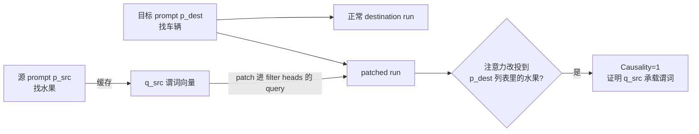

# LLMs Process Lists With General Filter Heads

**会议**: ICLR 2026  
**OpenReview**: [https://openreview.net/forum?id=iPFlJESrsh](https://openreview.net/forum?id=iPFlJESrsh)  
**代码**: [filter.baulab.info](https://filter.baulab.info)  
**领域**: 机制可解释性 / 注意力机制分析  
**关键词**: filter heads, causal mediation, activation patching, list processing, functional programming, 谓词表示  

## 一句话总结
本文发现 LLM 在做"从列表里挑出满足条件的项"这类任务时，会用一小撮中层注意力头（filter heads）把"筛选谓词"编码成 query 空间里一个紧凑、可搬运的几何方向，复现了函数式编程里 `filter` 操作的抽象计算原语。

## 研究背景与动机
**领域现状**：机制可解释性已经能定位很多专用注意力头（induction head、function vector head、concept induction head 等），也知道 LLM 内部存在「事实回忆」式的 map 步骤（把列表里每个 item 的语义信息填进它的 latent）。但对「在一串候选里按条件做选择」这种 list-processing，业界只观察到模型能做，却没说清楚它**怎么**做、用什么内部组件做。

**现有痛点**：当被问「找出列表里的水果」时，模型是每次都把任务从头算一遍（task-specific 启发式），还是学到了一个可复用的计算模块？如果是后者，这个模块到底长什么样、放在哪、能不能被提取出来迁移到别的列表/语言/任务？这些都没有答案。

**核心矛盾**：注意力图能让人「看起来懂了」（filter head 确实把注意力压在满足条件的那一项上），但注意力图常常是误导性的，不等于因果机制。要证明某个头真的承载了「谓词」这个抽象计算，必须做因果干预而不是看热力图。

**本文目标**：用 Marr 三层分析框架（计算层=选出满足谓词的元素；算法层=map→filter→reduce 三段式；实现层=靠 filter heads）把 list-processing 拆透，并用因果中介分析证明 filter heads 因果地承载谓词。

**核心 idea**：**【谓词即 query 方向】** 把「is this a fruit?」这种谓词编码成 filter head 在答案 token 上的 query 状态 $q_{src}$，这个向量足够抽象，能从一个上下文里抠出来、贴到完全不同的列表/格式/语言/任务上，触发同样的筛选——就像函数式编程里把 `filter` 的 predicate 当一等公民传来传去。

## 方法详解

### 整体框架
作者把 list-processing 在算法层拆成 **map → filter → reduce** 三段：map 把每个 item 的语义灌进其 latent（前人已研究），reduce 是按任务输出答案（计数/选首项/判断存在），本文聚焦中间最非平凡的 **filter** 段。实现层上，filter 由中层一小撮 filter heads 完成：答案 token 处的 query $q_{-1}$ 编码谓词，与各 item 的 key 状态（携带 item 语义）做点积注意力，从而把注意力选择性地压到满足谓词的项上。为定位这些头并证明其因果性，作者设计了一套「跨样本 query 替换 + 学习稀疏掩码」的因果中介流程。

### 关键设计

**1. 单头 query patching 验证谓词搬运**：作者用 activation patching 隔离 query 的因果角色。取一对谓词不同、集合互斥的源/目标 prompt（$\psi_{src}\neq\psi_{dest}$，$C_{src}\cap C_{dest}=\emptyset$），但保证 $C_{dest}$ 里至少有一项 $c_{targ}$ 满足源谓词 $\psi_{src}$。跑三遍前向：source run 缓存 filter head 在末 token 的 query $q_{src}$；destination run 正常跑；patched run 把该头末 token 的 query 换成 $q_{src}$。结果是注意力从「满足 $\psi_{dest}$ 的项」改投到「$C_{dest}$ 里满足 $\psi_{src}$ 的项」$c_{targ}$。关键细节：query 是在加旋转位置编码（RoPE）**之前**缓存的，说明 filter head 属于对位置不敏感的语义头（semantic head），它搬运的是语义谓词而非位置模式。

**2. 学习稀疏二值掩码定位整组 filter heads**：单头干预往往不够强——其它 filter head 加上 backup 机制会把干预效果纠正回去。于是作者对所有注意力头学一个稀疏二值掩码 $\text{mask}^{\ell j}$，在 patched run 里对每个头的 query 做插值替换 $q_{-1}^{\ell j} \leftarrow \text{mask}^{\ell j} \cdot q_{src}^{\ell j} + (1-\text{mask}^{\ell j}) \cdot q_{dest}^{\ell j}$，优化目标是在 patched run 里最大化 $c_{targ}$ 的 logit、压低 $C_{dest}$ 里其它选项，并加稀疏正则保证只选出极少数头。这样同时找到协同工作的一整组 filter heads（在 Llama-70B 的 80 层里集中在中层）。

**3. Causality 因果分数量化整组头的影响**：定义只 patch 选中头的 query，看模型是否在 $C_{dest}$ 所有项里把 $c_{targ}$ 选成最高概率：$\text{Causality}(H,p_{src},p_{dest}) = \mathbb{1}[c^* \overset{?}{=} c_{targ}]$，其中 $c^* = \arg\max_{c\in C_{dest}} M(p_{dest})[q^{\ell j}_{-1}\leftarrow q^{\ell j}_{src}]$。这个硬指标直接回答「把谓词向量搬过去，模型会不会真去执行它」，比看注意力图严谨得多；softer 版用 $\Delta\text{logit}$（patched 相比 destination 的 $c_{targ}$ logit 增量）。

**4. Key-swap 实验确认 key 承载 item 语义**：为搞清 query 和谁交互，作者在 patch $q_{src}$ 的同时再交换两个 item（$c_{targ}$ 与 $c_{other}$）的 key 状态。结果 filter head 的注意力从 $c_{targ}$ 改投到 $c_{other}$，证明 key 状态正是从 item latent 里抽出的语义属性（谓词据此被评估）。这把机制讲圆了：query 编码「要找什么」（谓词，丢弃 item 内容与上下文），key 编码「列表里有什么」（item 语义，丢弃周边语境），二者点积实现筛选。

**5. 揭示并验证的第二条通路——eager evaluation 的 is_match flag**：当问题被放在列表**之前**时，filter head 的 causality 掉到近零。作者假设此时 transformer 改用「急切求值」：每读到一个 item 就当场判断它是否满足谓词，把 `is_match` 标志直接写进该 item 的 latent，末 token 只需按预存标志检索。为验证，他们构造一个第三项 $c_{flag}$ 作为唯一携带 flag 的项（通过逐层替换各 item latent 实现），结果在 question-before 设置下模型在前中层一致选 $c_{flag}$，无视源/目标谓词——正是 flag 机制的预言。这对应函数式编程里 lazy（filter head）vs eager（flag）两种求值策略，且二者并行存在、按可得信息动态选择。

## 实验关键数据

模型：Llama-70B（附录另有 Gemma-27B）。数据集：六个 filter-reduce 任务（SelectOne / SelectOne-MCQ / SelectFirst / SelectLast / Counting / CheckPresence），每个用 1024 例定位、512 例（模型本就答对的）评测。

### 主实验：跨语义/格式/语言的可搬运性

| 维度 | 设置 | Causality |
|------|------|-----------|
| 语义类型 | Object Category（训练域） | 0.863 (+9.03 Δlogit) |
| 语义类型 | Person Profession | 0.836 |
| 语义类型 | Person Nationality | 0.504 |
| 语义类型 | Word rhymes with（非语义） | 0.041 |
| 跨语言 | En→Thai / En→Hindi | 0.951 / 0.928 |
| 呈现格式 | single line→bulleted | 0.842 |
| 问题位置 | question-after（基线） | 0.863 |
| 问题位置 | question-before | 0.580 / 0.020 |

→ 谓词向量对语言/格式高度鲁棒（跨语言基本 0.8~0.95），但只在**语义筛选**上有效，对押韵这种非语义属性几乎失效（0.041）；问题前置时 causality 崩塌（暴露第二条 flag 通路）。距离干扰项从 2 增到 7，causality 仍保持 ≈0.8。

### 消融实验：filter head 的必要性与独特性

| 消融对象 | 任务 | 准确率 |
|---------|------|--------|
| Filter heads (79, <2% 头) | SelectOne | 22.5%（随机消融 99.6%） |
| Filter heads (45) | SelectOne-MCQ | 0.4%（随机 100%） |
| Filter heads (145) | SelectLast | 9.2%（随机 99.4%） |
| Filter heads (64) | Counting | 89.8%（基本不掉） |

| 头类型（均取 79 个） | Causality | Δlogit |
|---------------------|-----------|--------|
| **Filter** | **0.863** | **+9.03** |
| Function Vector | 0.002 | −2.13 |
| Concept Induction | 0.080 | +5.23 |
| Token Induction | 0.00 | −3.23 |

→ 消融不到 2% 的 filter heads 让 Select* 任务从 100% 暴跌到个位/二十几个百分点，而随机消融几乎无影响；现有任何已知头类型都没有 filter head 的因果作用，证明它是全新且独立的组件。Counting/CheckPresence 消融后基本不掉，说明这两个任务不完全依赖 filter head（走了别的子电路）。

### 关键发现
- **谓词向量可组合**：把 is_fruit 和 is_vehicle 两个 query 向量相加，能执行其析取（disjunction），causality 0.65——谓词是 query 空间里可做向量算术的几何方向。
- **编码的是抽象谓词而非答案 token**：即使源 prompt 含谓词但集合里没有合法答案，causality 仍达 0.80。
- **跨任务子电路共享**：Select* 四个任务间互相迁移 causality ≥70%，Counting 头能部分泛化到 Select* 但反之不行（Counting 有额外聚合电路）。
- **训练-free 探针应用**：直接拿 filter head 的 query 状态 $q_{cls}$ 做零样本概念检测 $\hat y = \arg\max_{cls}(q_{cls}\cdot W_K^{\ell j}h)$，无需训练即可替代线性探针。

## 亮点与洞察
- **把"神经网络"和"函数式编程"对上号**：filter head = lazy filter、is_match flag = eager evaluation，这不是比喻而是有因果实验支撑的双通路，说明 transformer 会为同一操作维护多条并行路径并按信息可得性动态选择。
- **因果方法论扎实**：不满足于看注意力图，而是用「query patching + 学习稀疏掩码 + 硬 Causality 指标 + key-swap」层层逼问，还专门和 4 类已知头对照证明独特性，可解释性研究的范本。
- **谓词的"可移植性"惊人**：同一组中层头、同一个 $q_{src}$ 能跨语言（英→泰）、跨格式、跨任务搬运，且支持向量算术组合，强烈暗示 LLM 学到了语言无关的抽象计算原语。

## 局限与展望
- **Counting / CheckPresence 机制没讲透**：这两个任务消融 filter head 不掉点、within-task causality 也低，作者只说它们有「额外聚合电路 / 旁路」但没定位出来。
- **非语义谓词失效**：押韵、数字母等非语义筛选 causality 近零（0.041），filter head 只覆盖语义类筛选，模型怎么做非语义筛选未解。
- **主要在 Llama-70B 上验证**：虽有 Gemma-27B 附录结果，但是否所有规模/架构都长出 filter head、何时长出来（训练动力学）未探究。
- **flag 机制证据偏定性**：eager 通路靠精心构造的逐层 latent 替换实验展示，定量刻画（哪些层、多少头参与写 flag）留待后续。

## 相关工作与启发
本文站在 activation patching / causal mediation（Meng et al. 2022, Zhang & Nanda 2024）与「专用注意力头」谱系（induction head, function vector head, concept induction head）之上，把 list-processing 这一空白补上。它和 Merullo et al. 关于「transformer 用共享子电路跨任务」的发现互相印证。对下游的启发：（1）谓词向量可直接当训练-free 探针，给概念检测提供轻量替代；（2）「同一操作多通路并存」提示模型编辑/对齐时要堵住所有通路而非单点；（3）把经典程序语言抽象（filter/map/reduce、lazy/eager）作为透镜来逆向工程 LLM 计算，是很有前景的研究范式。

## 评分
- **新颖性**: ⭐⭐⭐⭐⭐ 首次定位并因果验证 filter heads，把函数式编程的 filter 原语和 lazy/eager 双通路映射到 transformer 内部机制，是真正的新发现。
- **实验充分度**: ⭐⭐⭐⭐ 六任务 × 跨语言/格式/任务 × 消融 × 与四类已知头对照 × 探针应用，覆盖很全；扣分在 Counting/非语义/flag 机制只点到为止、模型多样性偏窄。
- **写作质量**: ⭐⭐⭐⭐⭐ 用 Marr 三层框架统领，从「找水果」直觉例子到严格因果指标层层递进，机制叙述清晰、图示得当。
- **价值**: ⭐⭐⭐⭐⭐ 给 list-processing 这类基础能力提供了可迁移、可组合、可应用（探针）的机制理解，对可解释性与模型编辑都有实际启发。

<!-- RELATED:START -->

## 相关论文

- [\[ICML 2026\] How Language Models Process Negation](../../ICML2026/interpretability/how_language_models_process_negation.md)
- [\[ACL 2026\] Retrieval Heads are Dynamic](../../ACL2026/interpretability/retrieval_heads_are_dynamic.md)
- [\[ICLR 2026\] Token Alignment Heads: Unveiling Attention's Role in LLM Multilingual Translation](token_alignment_heads_unveiling_attentions_role_in_llm_multilingual_translation.md)
- [\[ICLR 2026\] Evidence for Limited Metacognition in LLMs](evidence_for_limited_metacognition_in_llms.md)
- [\[ICML 2026\] Singular Vectors of Attention Heads Align with Features](../../ICML2026/interpretability/singular_vectors_of_attention_heads_align_with_features.md)

<!-- RELATED:END -->
