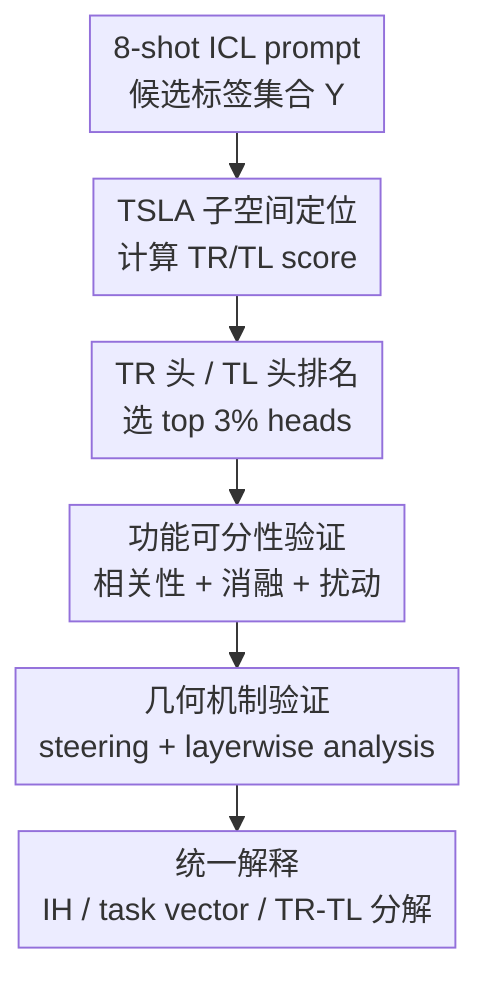

# Localizing Task Recognition and Task Learning in In-Context Learning via Attention Head Analysis

**会议**: ICLR 2026  
**OpenReview**: [https://openreview.net/forum?id=gdvOF1OMa7](https://openreview.net/forum?id=gdvOF1OMa7)  
**代码**: https://github.com/HLYang2001/Localizing_TR_TL  
**领域**: 可解释性 / 机制解释 / In-Context Learning  
**关键词**: 注意力头分析, 任务识别, 任务学习, TSLA, ICL机制  

## 一句话总结
这篇论文提出 Task Subspace Logit Attribution（TSLA），把 in-context learning 中的任务识别（TR）和任务学习（TL）分别定位到不同注意力头，并用相关性、消融、输入扰动、task vector steering 与隐藏状态几何分析说明 TR 头负责把状态拉向任务标签子空间，TL 头负责在该子空间内转向正确标签。

## 研究背景与动机
**领域现状**：ICL 的机制解释大致有两条路线。一条是 component-level 的 Transformer circuit 分析，把最终 logit 看成注意力头、MLP 等内部组件的加和贡献，再寻找 induction heads、function vector heads 或 task vectors 这类关键组件；另一条是 holistic 的输入扰动分析，把模型整体当作黑盒，通过改 demonstration 的文本、标签或映射来观察 ICL 到底学了什么。

**现有痛点**：这两条路线各有盲区。组件分析能指出“哪个头重要”，但常靠 ablation 观察准确率下降，难以说明这个头到底承担任务识别还是任务学习；输入扰动分析能把 ICL 分解成 Task Recognition 和 Task Learning，却无法把这两个功能落到具体模型组件上。于是同一个现象会出现互相割裂的解释：induction heads 有时被说成复制正确标签，有时又被说成导致错误 induction；task vectors 能救 zero-shot，但究竟在救“识别标签空间”还是“学习文本到标签映射”，也不够清楚。

**核心矛盾**：ICL 的输出行为同时依赖两个层次：模型必须先知道当前任务的候选标签集合是什么，又要根据 demonstration 学会输入文本与标签之间的对应关系。只看最终正确标签 logit 会把这两件事混在一起；只看 demonstration 标签 logit 又会被具体表面标签绑住，无法解释 positive/negative 换成 favourable/unfavourable 这类语义等价标签时机制是否仍然成立。

**本文目标**：作者希望把 Pan et al. 提出的 TR/TL 功能分解和注意力头级别的机制定位接起来：第一，设计一个比 Direct Logit Attribution 更能区分 TR 与 TL 的打分方法；第二，验证被识别出的 TR/TL 头是否真的在行为、消融和扰动下分别控制两个通道；第三，从隐藏状态几何上解释这些头如何改变 residual stream。

**切入角度**：论文把“任务标签”不再看成几个孤立 token，而是看成由候选标签 unembedding 张成的任务子空间。这样，TR 就对应“注意力头输出是否落在任务标签子空间里”，TL 则对应“在这个子空间内是否沿着正确标签相对错误标签的方向推动 hidden state”。这个视角既保留了 circuit 分析的可定位性，也继承了 TR/TL 分解的功能语义。

**核心 idea**：用任务标签 unembedding 子空间来重写 logit attribution：TR 头负责把隐藏状态对齐到任务子空间，TL 头负责在任务子空间内部增加正确标签与竞争标签的 logit gap。

## 方法详解

### 整体框架
这篇论文的方法不是训练一个新模型，而是一套分析框架：先从 ICL prompt 中抽取每个注意力头在最终预测位置的输出，再用 TSLA 给每个头计算 TR score 和 TL score，随后把排名靠前的头当作 TR/TL heads，并通过多组实验检验这些头是否真的对应不同 ICL 功能。整体逻辑是“从子空间打分定位组件，再用因果干预和几何变化验证机制”。

具体实现上，作者在每个数据集上取前 50 个 query 构造 ICL prompts，用这些 prompts 累积每个注意力头的 TSLA 分数。主要模型包括 Llama3-8B、Llama3.1-8B、Llama3.2-3B、Qwen2-7B、Qwen2.5-32B 和 Yi-34B；主文默认报告 Llama3-8B，附录复现其他模型。分类任务使用 SUBJ、SST-2、TREC、MR、SNLI、RTE、CB，默认 8-shot ICL。

### 关键设计
**1. TSLA 子空间定位：把任务识别从表面标签 logit 中解耦出来**

传统 DLA 会直接看某个注意力头输出 $a^l_{N,k}$ 对标签 token logit 的贡献，例如用 $1^\top W^Y_U a^l_{N,k}$ 找 TR 头。这在四选项任务里看似自然，但一换标签表面形式就容易失真：sentiment 任务的 positive/negative 与 favourable/unfavourable 语义接近，真正的任务识别不应只等同于推高某两个固定 token 的 logit。

TSLA 因此把候选标签 unembedding $W^Y_U$ 张成的线性空间看作任务子空间，并用投影范数定义 TR score：$\|\mathrm{Proj}_{W^Y_U} a^l_{N,k}\|_2$。如果一个头的输出大部分落在该子空间里，它就在把 residual stream 推向“这些标签相关的语义方向”，而不是任意提高某个表面 token。论文还给出一个 Grassmannian 上的理论保证：在随机子空间模型下，较大的 TR score 意味着该头输出以高概率在任务相关子空间上的投影比在其他同维子空间上更大。

**2. 对比式 TL score：只奖励能区分正确标签和竞争标签的头**

只看正确标签 logit 也会误判 TL 头，因为某个头可能同时推高所有候选标签，最终看起来提高了 $y^*$，但本质是在做 label-space recognition，而不是学习文本到标签的映射。本文的 TL score 把正确标签和错误标签放在同一个对比方向里：

$$
\frac{\mathrm{Ave}_{y'\in Y/\{y^*\}}\left(a^{l,\top}_{N,k}(W^{y^*}_U-W^{y'}_U)\right)}{\|\mathrm{Proj}_{W^Y_U} a^l_{N,k}\|_2}.
$$

分子衡量该头是否沿着“正确标签减去错误标签”的平均方向推动 hidden state，分母用 TR score 归一化，使它关注任务子空间内部的判别方向。这样得到的 TL 头不只是“喜欢正确标签”，而是能够在候选标签之间拉开正确-错误 logit gap。几何上，这对应在任务子空间内把 hidden state 朝正确标签 unembedding 方向旋转。

**3. 双通道验证：用准确率和 TR ratio 分别观测 TL 与 TR**

为了避免“准确率下降”这一单一指标混淆原因，作者引入 TR ratio：预测结果落在 in-context 标签集合 $Y$ 内的比例。TR ratio 高但 accuracy 低，说明模型知道该从哪些标签里选，但没有学好映射；TR ratio 低，则说明任务识别本身崩了。这个指标让 ablation 结果能区分两个故障模式。

主实验按 top 3% 选出 TR/TL heads 后分别消融。若消融 TR 头，TR ratio 从接近 100% 直接跌到约 20%，准确率也随之崩溃；若消融 TL 头，准确率下降约 30%，但 TR ratio 只小幅下降约 10%。这个现象和 TSLA 的定义吻合：TR 头决定模型是否把答案限制在任务标签空间内，TL 头决定在这个空间里选哪个标签。

**4. 几何 steering：用隐藏状态变化解释 attention head 的功能角色**

论文不止停在“消融后性能变差”，还把 top TR/TL 头的输出当作 task vector 注入 zero-shot hidden states，观察它们是否足以恢复 ICL 行为。分类任务中，TR-based task vectors 能把 zero-shot accuracy 从约 9.2% 提高到 40.4%，接近 ICL 级别；TL-based vectors 只到 11.2%。这支持一个解释：在固定标签分类中，zero-shot 差的关键是任务识别不足，补上 TR 功能最有效。

进一步的几何实验显示，TR 输出显著提高 hidden state 与任务子空间的 cosine alignment，例如 subspace alignment 从 0.15 提到 0.29；TL 输出则主要提高 logit difference，例如从 3.92 提到 5.28，而不显著提升子空间 alignment。作者据此把 TR/TL 分工解释成两种几何动作：TR 是把点云推向任务标签子空间，TL 是在已经相关的子空间里朝正确标签方向旋转。

### 一个完整示例
以 SST-2 情感分类为例，prompt 里有 8 个 demonstration，例如若干句电影评论后接 `Sentiment: positive/negative`，最后给一个 query，模型需要补出 positive 或 negative。传统 DLA 可能发现某些头会提高 positive 和 negative 的 logit，但这并不能说明它们是在识别“情感分类”还是在判断当前句子的情感。

TSLA 的处理会先取 $Y=\{\text{positive},\text{negative}\}$ 的 unembedding 子空间。若某个头在最终冒号位置的输出强烈投影到这个子空间，它会被排在 TR ranking 前面：这个头更像是在告诉模型“接下来应该输出情感标签”。若另一个头的输出在该子空间内更接近 $W^{\text{positive}}_U-W^{\text{negative}}_U$，且 query 本身是正面评论，它会被排在 TL ranking 前面：这个头更像是在根据 query 语义选择 positive。

消融时，如果删掉 TR 头，模型可能输出大量不在 positive/negative 内的 token，TR ratio 崩掉；如果删掉 TL 头，模型仍大多输出 positive/negative，但正负更容易选错。输入扰动也能对应上：把 demonstration 文本打乱成乱码会破坏 TL，此时再消融 TL 头影响很小；把标签替换为数字 0/1 会改变 label space，此时原始 TR 头的重要性下降。

### 损失函数 / 训练策略
本文没有训练新模型，也没有引入监督优化目标；核心是 post-hoc 机制分析与干预。实验中的“策略”主要包括四类：第一，用前 50 个 query 的 ICL prompts 累积 TSLA 分数并选 top 3% heads；第二，用 head ablation 比较 accuracy 与 TR ratio；第三，用 text shuffle、label replacement、label flipping 等输入扰动验证 TR/TL 独立性；第四，把 top TR/TL/random heads 的平均输出构造成 task vectors，在 zero-shot hidden states 的中间层注入，观察功能恢复与几何指标变化。

## 实验关键数据

### 主实验
| 实验设置 | 指标 | 关键结果 | 解释 |
|--------|------|----------|------|
| TR heads vs IHs | Jaccard / Kendall / Spearman | TR-IH 的重合和相关性明显高于 TR-TL 与 TL-IH | IH 主要对应任务识别而非真正的标签映射学习 |
| Top 10% IH 在 ranking 中的位置 | Conditional Mean Percentage | top 10% IH 约对应 top 20% TR heads，但只约对应 top 50% TL heads | 高 IH 分数更像高 TR 分数 |
| 跨数据集一致性 | 归一化 Kendall / Spearman / Jaccard | TR heads 和 IHs 跨任务更稳定，TL heads 跨任务相关性弱 | TR 是更任务不变的标签空间机制，TL 更依赖具体映射 |
| 分类 task vector steering | Zero-shot accuracy | TR TV: 9.2% → 40.4%；TL TV: 9.2% → 11.2%；random TV: 9.2% → 9.5% | 固定标签分类中，恢复任务识别比注入 TL 更关键 |
| 生成 task vector steering | LLM 评分 | ICL 7.99，ZS 3.92，TL TV 5.12，TR TV 3.37，random TV 4.44 | 开放生成没有固定标签集，TL 对映射学习更有用 |

### 消融实验
| 配置 | 关键指标 | 说明 |
|------|---------|------|
| ICL baseline | ACC 与 TR ratio 均高 | 正常 8-shot ICL 能识别标签空间并学习映射 |
| w/o TR heads | TR ratio 从近 100% 降到约 20%，ACC 大幅下降 | 删除 TR 头后模型不再稳定输出候选标签，任务识别崩溃 |
| w/o TL heads | ACC 下降约 30%，TR ratio 只降约 10% | 删除 TL 头后模型仍知道标签集合，但更像在标签集合内随机猜 |
| w/o IH heads | 与 w/o TR heads 类似 | IH 的主要作用可被解释为 TR 的一个子集或表现形式 |
| w/o random heads | 影响很小 | 说明不是任意 3% 注意力头都能造成同样现象 |
| DLA-selected TL heads ablation | 未能产生预期 TL 故障模式 | DLA 容易选到广义推高标签 logit 的 TR 类头，而非真正 TL 头 |

### 关键发现
- TR heads 更深层、更跨任务稳定，并且更常与 induction heads 重合；TL heads 的层分布更接近 IH，但与 IH 的重合弱，说明“会 attend 到 demonstration 标签”和“能选对当前 query 标签”不是同一件事。
- 注意力分布上，TR heads 对 demonstration label tokens 的平均注意力更高，TL heads 对 query tokens 的注意力更强。主文 Figure 4 中，TR heads 到 demonstration labels 的权重约 0.05，高于 TL 的 0.02；TL heads 到 query 的权重约 0.36，高于 TR 的 0.21。
- 输入扰动支持功能独立性：打乱 demonstration 文本后 TL 被预先破坏，TL ablation 几乎不再重要；替换标签空间后，原始 TR heads 的 ablation 影响显著减弱。
- 几何实验给出机制图景：TR outputs 与任务子空间 alignment 高，TL outputs 与 projected discriminant direction alignment 高；layerwise 相关性也强，例如 Llama3-8B 中 TR output 的 subspace alignment 与 hidden-state update 的相关性约 $\rho=0.94$，TL output 的 logit-difference 相关性约 $\rho=0.53$。
- 阈值敏感性较低：附录从 top 1% 到 10% 扫描，TR/TL ablation 与 steering 的主要结论稳定，说明机制不是只靠一两个极端头，而是多个高分头叠加实现。

## 亮点与洞察
- 这篇论文最重要的亮点是把 TR/TL 分解从“输入扰动现象”推进到“注意力头级别组件”。它不是简单再找一批 special heads，而是给每类 head 一个几何含义：TR 是靠近任务子空间，TL 是子空间内的判别旋转。
- TSLA 对 DLA 的修正很有价值。DLA 直接看标签 logit，容易把“提高所有候选标签”和“提高正确标签相对错误标签”混为一谈；TSLA 用子空间投影与正确-错误方向分解，刚好把这两件事拆开。
- TR ratio 是一个简单但有效的诊断指标。很多 ICL ablation 只报告 accuracy，会把“输出不在标签集合里”和“在标签集合里选错”混在一起；TR ratio 让读者能一眼看到故障发生在哪个通道。
- 对 induction heads 的重新解释很清楚：IH 不是统一等同于“正确标签复制器”，更像是任务识别机制的重要表现，主要帮助模型锁定 label space。这能解释为什么 IH ablation 常造成巨大性能下降，也解释为什么有些 IH 会导致 false induction。
- 生成任务的实验提醒我们，TR/TL 的重要性依赖任务形态。固定标签分类里 TR 是瓶颈；开放生成里没有封闭标签集合，TL vectors 反而更能传递 demonstration 到输出风格/语义的映射。

## 局限与展望
- 论文的主线仍主要围绕分类任务，开放生成实验虽然有 Review 和 SubjQA 补充，但复杂度、评价可靠性和任务多样性还有限。未来可以在代码生成、结构化推理、多步工具调用等更复杂 ICL 场景下验证 TR/TL heads 是否仍保持同样几何分工。
- TSLA 依赖候选标签 unembedding 子空间，因此最自然适用于标签集合可枚举的任务。面对答案空间开放、标签为长文本或多 token span 的任务，如何定义更合适的任务子空间仍需要进一步研究。
- Top 3% 这类阈值虽然在附录中做了敏感性分析，但实际部署解释时仍会遇到“选多少头才算机制”的边界问题。更理想的方式可能是用连续贡献曲线、稀疏因果干预或自动 circuit discovery 来替代固定比例截断。
- 几何解释很漂亮，但仍然是基于 unembedding 空间和 residual stream 的线性视角。MLP、layer norm、后续层非线性如何改变这些 TR/TL 信号，论文涉及较少。
- DLA 与 TSLA 的比较主要说明 TSLA 更能恢复预期消融模式，但没有完全排除其他可能的 attribution 设计。后续可以比较 path patching、activation patching、causal mediation 等更强因果工具。

## 相关工作与启发
- **vs Pan et al. 的 TR/TL 分解**: Pan et al. 通过扰动 demonstration 标签和文本，把 ICL 分为任务识别与任务学习；本文继承这个功能分解，但进一步定位到注意力头，并解释每类头在隐藏状态几何中的作用。
- **vs Induction Head 研究**: 早期 IH 研究强调 copy / pattern matching 对 ICL 的重要性；本文认为 IH 与 TR heads 高度相关，主要贡献是帮助模型识别候选标签空间，而不是单独完成文本到标签映射。
- **vs Function Vector / Task Vector 方法**: Task vector 工作显示某些 hidden states 或 head outputs 能把 zero-shot 推向 ICL 表现；本文进一步拆解这些 vectors 的来源，说明分类任务中有效 task vectors 更可能来自 TR heads，生成任务中 TL heads 更关键。
- **vs DLA / circuit attribution**: DLA 把每个组件对 logit 的贡献加和，是很自然的起点；TSLA 的启发在于，解释任务行为时不能只看单个 token logit，而要把语义相关标签看成子空间，并在子空间内外分别解释。
- 对后续研究的启发是：如果要调控 ICL，不必只做 prompt engineering 或整体 fine-tuning，也可以尝试识别并干预特定 TR/TL 通道。例如对分类任务先增强任务子空间 alignment，对生成任务则增强输入-输出映射方向。

## 评分
- 新颖性: ⭐⭐⭐⭐☆ 从任务子空间角度统一 TR/TL、IH 与 task vectors，视角清晰且有机制解释力。
- 实验充分度: ⭐⭐⭐⭐☆ 主文和附录覆盖多模型、多数据集、消融、扰动、steering 与几何分析，但开放生成和更复杂任务仍可扩展。
- 写作质量: ⭐⭐⭐⭐☆ 结构完整，图示和实验链条清楚；部分附录实验较多，读者需要花时间把主线和补充结果对应起来。
- 价值: ⭐⭐⭐⭐⭐ 对理解 ICL 内部机制很有参考价值，尤其适合关注 attention head analysis、task vectors 和 mechanistic interpretability 的研究者。

<!-- RELATED:START -->

## 相关论文

- [\[ICLR 2026\] Understanding Task Vectors in In-Context Learning: Emergence, Functionality, and Limitations](understanding_task_vectors_in_in-context_learning_emergence_functionality_and_li.md)
- [\[ICLR 2026\] Domain Expansion: A Latent Space Construction Framework for Multi-Task Learning](domain_expansion_a_latent_space_construction_framework_for_multi-task_learning.md)
- [\[ICLR 2026\] Task Vectors, Learned Not Extracted: Performance Gains and Mechanistic Insights](task_vectors_learned_not_extracted_performance_gains_and_mechanistic_insights.md)
- [\[ACL 2026\] SITE: Soft Head Selection for Injecting ICL-Derived Task Embeddings](../../ACL2026/interpretability/soft_head_selection_for_injecting_icl-derived_task_embeddings.md)
- [\[ICLR 2026\] Comparing the learning dynamics of in-context learning and fine-tuning in language models](comparing_the_learning_dynamics_of_in-context_learning_and_fine-tuning_in_langua.md)

<!-- RELATED:END -->
