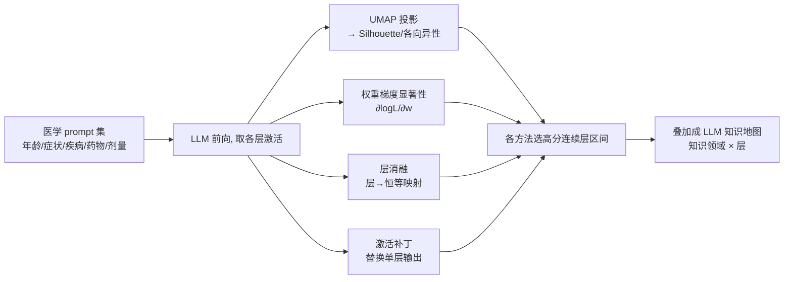

# Medical Interpretability and Knowledge Maps of Large Language Models

**会议**: ICLR 2026  
**OpenReview**: [https://openreview.net/forum?id=BhqFWlYKUi](https://openreview.net/forum?id=BhqFWlYKUi)  
**代码**: [https://github.com/TheLumos/medical-interpretability-llms](https://github.com/TheLumos/medical-interpretability-llms)  
**领域**: 机制可解释性 / 医学 LLM  
**关键词**: 机制可解释性, 知识定位, UMAP, 激活补丁, 层消融, 医学知识  

## 一句话总结
作者用四种可解释性手段（UMAP 投影、权重梯度显著性、层消融、激活补丁）系统扫描 5 个开源 LLM，画出"医学知识地图"——把年龄、症状、疾病、药物、剂量这些知识分别定位到模型的哪些层，并意外发现年龄流形非线性、疾病进程表征呈环形非单调等现象。

## 研究背景与动机
**领域现状**：机制可解释性近年很火，但大多数研究聚焦通用知识（语法、归纳头、事实回忆），且常常假设特征是线性可分的（linear representation hypothesis）。

**现有痛点**：极少有工作系统研究 LLM 如何表征和处理**医学**知识。已有的几篇医学可解释性工作各有局限——要么只让模型解释自己的诊断决策，要么只在单一模型（如 MedLlama-8B、OpenBioLLM-70B）上做、要么只用单一技术（如只用 t-SNE 可视化）。没有人横跨多个医学知识领域、多种技术、多个模型做交叉验证，因此很难判断结论是否稳健、不同 LLM 间是否存在共性表征。

**核心矛盾**：医学场景对安全与可信要求极高（隐藏偏见可能危及患者），但我们对模型内部"医学知识存在哪、怎么处理"几乎一无所知，单一技术/单一模型的证据又不足以下定论。

**本文目标**：对 5 个开源 LLM（Llama3.3-70B、Gemma3-27B、MedGemma-27B、Qwen-32B、GPT-OSS-120B）系统刻画其医学知识的层级分布，并产出可指导后续微调/去偏/遗忘的"知识地图"。

**核心 idea**：**多技术交叉定位** —— 用四种假设和强弱各异的可解释性方法分别给出层区间，取交集来提高"某层确实存储某类医学知识"的置信度；**知识地图（LLM Map）** —— 把定位结果可视化为"知识领域 × 层"的二维图谱。

## 方法详解

### 整体框架
对每个医学知识领域（年龄、症状、疾病、疾病进程、药物治疗、药物剂量）构造对应 prompt 集，喂给 LLM，并行跑四种可解释性分析，各自抽出量化指标→选出指标最高的连续层区间→叠加成一张知识地图。四种方法假设互不相同（聚类结构 / 梯度敏感度 / 因果消融 / 因果补丁），交叉一致才认定知识所在层。

### 关键设计

**1. UMAP 投影 + Silhouette/各向异性量化：让"聚类结构"变成可比的层级分数。** 把每层中间激活用 UMAP 降到 30 维（可视化时降到 2 维），用 Silhouette 分数 $s(i)=\frac{b(i)-a(i)}{\max(a(i),b(i))}$ 衡量带标签的激活分得有多开——$a(i)$ 是同簇平均距离、$b(i)$ 是到最近邻簇的平均距离，分数越高说明该层越能按医学标签（如症状类别、药物机制）把概念分开。之所以用 Silhouette 而非先跑 K-means，是因为它直接用 ground-truth 标签衡量可分性、不引入额外聚类算法的噪声。对年龄这种连续量则换用**局部各向异性** $A_i=1-\lambda_2/\lambda_1$（$\lambda_1\ge\lambda_2$ 为 20 近邻局部协方差的前两个特征值）来度量年龄流形的"一维性"，所有指标都用 bootstrap 重采样给出置信区间。

**2. 权重梯度显著性：从"参数对损失多敏感"反推哪些层在用力。** 对每层计算 $\frac{\partial \log L}{\partial w}$，把该层注意力头与 MLP 内所有权重的显著性取平均，得到逐层显著度，再跨多个 prompt 平均并估置信区间。显著性高的层意味着这些参数对当前医学知识的输出贡献大，是知识"被处理"的候选位置。

**3. 层消融 + LLM-as-judge 打分：用因果删除验证哪些层不可或缺。** 把某一层替换为恒等映射 $I_n$（相当于删掉这层的变换），再让 GPT-4o 按 1–10 的 rubric 给"回答退化程度"打分（1 分=与原回答无差、10 分=完全胡言乱语）。退化越严重说明该层越关键。这一招直接借鉴神经科学的脑区损毁实验——删掉某区看丢失了什么功能。

**4. 激活补丁：用因果干预定位知识的归因层。** 跑干净（clean）、污染（corrupted）、补丁（patched）三次前向，把某层在污染运行中的输出替换成干净运行的输出，用归一化 logit 差衡量补丁效果 $P=\frac{LD_{pt}-LD_*}{LD_{cl}-LD_*}$，其中 $LD(r,r')=\text{Logit}(r)-\text{Logit}(r')$ 是两个单 token 回答（如 Angina vs Pneumonia）的 logit 差。$P$ 通常落在 $[0,1]$，1 表示补该层即可完全恢复性能、0 表示无效。补丁效果高的层就是该医学知识的因果定位点。

**5. LLM 地图合成：把四路证据收敛成连续层区间。** UMAP 这路（年龄外）取高斯平滑（$\sigma=1.0$）后、3 层滑窗内 Silhouette 上升率最大的区间（年龄改用各向异性）；显著性/消融/补丁三路则取平滑后高于 75 百分位、至少 2 层、每路最多 3 段的区间。把各路区间叠在"知识领域 × 层"网格上即为知识地图，四路一致处置信度最高。

## 实验关键数据

### 主实验：跨概念逐层最优指标（Table 1，best-layer 分数 + 层号）

| 概念 | 指标 | Llama 70B | Gemma 27B | MedGemma 27B | Qwen 32B | GPT-OSS 120B |
|------|------|-----------|-----------|--------------|----------|--------------|
| 年龄 | R² 线性度 ↑ | 1.00 (L3) | 0.99 (L34) | 0.98 (L24) | 0.99 (L25) | 1.00 (L1) |
| 症状 | Silhouette ↑ | 0.19 (L63) | -0.10 (L12) | -0.08 (L12) | 0.24 (L56) | 0.23 (L31) |
| 疾病 | Silhouette ↑ | 0.16 (L58) | -0.01 (L61) | -0.03 (L61) | 0.21 (L60) | 0.10 (L32) |
| 药物 | Silhouette(机制) ↑ | 0.07 (L75) | 0.03 (L45) | -0.01 (L44) | 0.03 (L62) | 0.07 (L30) |
| 药物 | Silhouette(专科) ↑ | 0.19 (L78) | 0.05 (L44) | 0.01 (L45) | 0.06 (L58) | 0.07 (L33) |
| 剂量 | 补丁效果 ↑ | 2.64 (L79) | 0.92 (L8) | 1.71 (L0) | 7.33 (L0) | 4.23 (L23) |

- **Llama3.3-70B 知识地图**：年龄在 0–5 层、症状在 0–9 与 15–40 层、疾病在 0–5 或 27–37 层、药物在 15–45 层、剂量大致在前半段（0–40），**绝大部分医学知识集中在模型前半层**。
- Llama 与 Qwen 在症状/疾病的 Silhouette 最高，GPT-OSS 各类别表现均衡；**Gemma3-27B 与 MedGemma-27B 在除疾病进程外几乎所有类别得分都低**（症状/疾病 Silhouette 甚至为负）。

### 消融/扩展实验
- **层消融**：删 Gemma/MedGemma 的层会导致严重退化，而 Llama/Qwen/GPT 对删层更鲁棒（层间有冗余），说明不同模型的层级关键性差异巨大。
- **额外 6 个医学 LLM**（OpenBioLLM-70B、PMC-LLaMA-13B、ClinicalCamel-70B、PalmyraMed-70B、Meditron-70B、HuatuoGPT-o1-70B）：年龄 R² 普遍≈1.0，症状/疾病 Silhouette 多为正，整体规律与主表一致。

### 关键发现
- **年龄流形非线性且不连续**：多数模型能在某中间层得到线性年龄流形，但流形随性别变化，且在 17 与 18 岁间出现明显**不连续**（疑似模型学到的"未成年/成年"分界）。
- **疾病进程表征呈环形、非单调**：晚期疾病阶段的嵌入会"绕回"靠近早期阶段，Parkinson、COPD 尤其明显（晚期 5–9 阶段比中期 3–4 阶段更靠近健康初始阶段）。
- **药物按专科聚类优于按机制**：跨多数模型，药物的 Silhouette(专科) > Silhouette(机制)，Llama3.3-70B 内部药物表征更贴合医学专科。
- **Gemma/MedGemma 中间层激活塌缩**：UMAP 空间里中间层（如第 20 层）激活塌成一团，但到末层又恢复。

## 亮点与洞察
- **方法学贡献大于单一发现**：不是发明新技术，而是把四种成熟技术组织成"交叉验证 + 知识地图"的系统流程，首次横跨 11 个模型、多医学领域给出可比结论，弥补了既往"单模型 + 单技术"的硬伤。
- **直接落地价值**：知识地图告诉你"想改某类医学知识该动哪些层"——微调、遗忘（unlearning）、去偏都能据此精准施力，而不是盲改全模型。
- **反线性假设的实证**：年龄不连续、疾病进程环形非单调，都是对"特征皆线性"假设的有力反例，且具体到医学语义（成年分界、病程绕回）很有解释力。

## 局限与展望
- **粗分辨率定位**：知识地图给的是层区间而非神经元/电路级精度，部分领域（如药物剂量）因缺乏清晰量化指标结论本就"inconclusive"。
- **指标代理性强**：Silhouette、各向异性、CSFS/CSLS 都是间接代理量，疾病进程的"环形"靠"最近阶段"近似衡量，受阶段划分粒度影响。
- **消融打分依赖 LLM-as-judge**：用 GPT-4o 给退化打分引入了裁判模型自身偏差，1–10 rubric 的可靠性未充分验证。
- **解释 vs 因果**：四种方法虽交叉，但"知识存在某层"与"该层因果决定输出"之间仍有 gap；未来可结合更细的电路分析与真实临床任务验证地图能否指导下游编辑。

## 相关工作与启发
- **机制可解释性谱系**：线性表征假设（Bricken、Gurnee&Tegmark）与其反例（Engels 的"星期/世纪"环形特征）；本文把后者推广到医学语义（年龄、病程）。
- **四技术各自的源头**：UMAP 可视化 BERT/单细胞 LLM（Reif、Zhang）、梯度显著性定位知识神经元（Dai）、层/注意力头消融（Michel、Voita、Gromov 发现删 50% 层才显著退化）、激活补丁与 ROME 因果编辑（Heimersheim&Nanda、Meng）。
- **医学可解释性前作**：He 等的医学"模块化电路"、Wu 等用稀疏字典把 OpenBioLLM 潜向量映成医学概念——本文的差异在"系统横扫多模型多领域"。
- **启发**：知识地图可作为"精准编辑/去偏"的前置定位工具；环形病程表征提示可用于检测模型对疾病严重度的误判；中间层塌缩现象值得追问是否与某些架构（Gemma 系）的训练/归一化方式相关。

## 评分
- **新颖性**: ⭐⭐⭐⭐ —— 技术本身都是现成的，但"四技术交叉 + 知识地图 + 11 模型横扫医学领域"的系统化组织是新的，且年龄不连续、病程环形等发现有实质洞察。
- **实验充分度**: ⭐⭐⭐⭐ —— 覆盖 5+6=11 个模型、6 类医学知识、4 种技术，带置信区间与多张补充表，相当扎实；扣分在部分领域结论 inconclusive、缺下游编辑的闭环验证。
- **写作质量**: ⭐⭐⭐⭐ —— 结构清晰、图谱直观、现象描述生动（成年分界、病程绕回），公式与方法交代完整。
- **价值**: ⭐⭐⭐⭐ —— 为医学 LLM 的微调/遗忘/去偏提供了可操作的"该动哪层"地图，对安全可信医学 AI 有直接指导意义。

<!-- RELATED:START -->

## 相关论文

- [\[ICLR 2026\] Precise and Interpretable Editing of Code Knowledge in Large Language Models](precise_and_interpretable_editing_of_code_knowledge_in_large_language_models.md)
- [\[ACL 2026\] Knowledge Vector of Logical Reasoning in Large Language Models](../../ACL2026/interpretability/knowledge_vector_of_logical_reasoning_in_large_language_models.md)
- [\[ACL 2026\] Tracing Relational Knowledge Recall in Large Language Models](../../ACL2026/interpretability/tracing_relational_knowledge_recall_in_large_language_models.md)
- [\[ICLR 2026\] Rethinking Layer Relevance in Large Language Models Beyond Cosine Similarity](rethinking_layer_relevance_in_large_language_models_beyond_cosine_similarity.md)
- [\[ICLR 2026\] Latent Concept Disentanglement in Transformer-based Language Models](latent_concept_disentanglement_in_transformer-based_language_models.md)

<!-- RELATED:END -->
