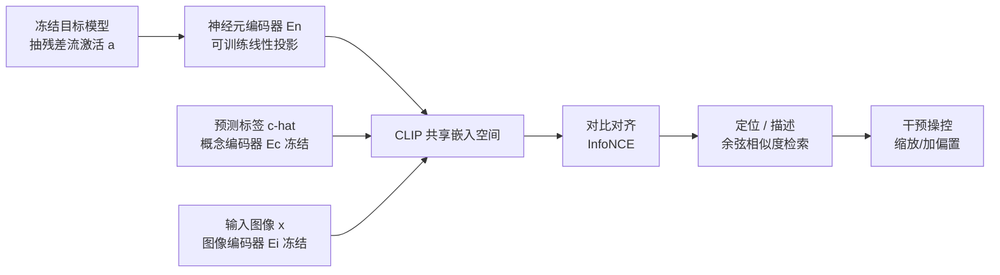

# MICLIP: Learning to Interpret Representation in Vision Models

**会议**: ICLR 2026  
**OpenReview**: [https://openreview.net/forum?id=28Hfz8RLcD](https://openreview.net/forum?id=28Hfz8RLcD)  
**代码**: [项目主页](https://foundation-model-research.github.io/MICLIP)  
**领域**: interpretability and explainable AI  
**关键词**: 机理可解释性, 对比学习, CLIP, 神经元解释, 稀疏自编码器, 模型控制  

## 一句话总结
MICLIP 把 CLIP 的对比学习范式搬到"模型内部表征"上，训练一个神经元编码器把神经元/SAE 特征投影进 CLIP 语义空间，从而绕开"激活越大概念越强"的旧假设，实现既能解释又能精准操控视觉模型内部机制的统一框架。

## 研究背景与动机
- **领域现状**: 机理可解释性 (MI) 试图把视觉模型的内部单元（神经元、电路、SAE 特征）映射到人类可理解的概念上。主流做法分两类——激活类（Network Dissection、CLIP-Dissect、V-Interp，靠"高激活样本"反推概念）和表征类（构造神经元/概念表征再对齐到 CLIP 空间）。
- **现有痛点**: 两个根深蒂固的缺陷。其一是 **激活幅度假设 (activation-magnitude assumption)**——默认激活值越大，对应概念存在感越强；但实际上激活升高未必意味着概念真的参与推理，甚至负激活也可能正向贡献某概念的预测。其二是 **输入中心 (input-centric)**——只把内部单元和输入图像里出现的概念对齐，没有锚定真正驱动模型输出的因果机制。
- **核心矛盾**: 这两点导致解释"不忠实"——尤其当模型预测错误时，输入中心方法完全抓不到决策背后的因果链条，给出的解释与模型真实行为脱节。
- **本文目标**: 提出一个通用、可学习、既忠实又可操控的解释框架，能同时覆盖神经元和 SAE 特征，并且解释结果能直接用来精准干预模型行为。
- **核心 idea**: **从"激活相关"转向"语义对齐"**——不再用启发式相关性，而是用对比学习把内部单元学成 CLIP 空间里的语义向量；**从"输入中心"转向"输入+输出双锚定"**——同时对齐输入图像概念和模型输出预测，从而还原"输入→内部单元→输出"的完整因果轨迹。

## 方法详解

### 整体框架
MICLIP 冻结目标视觉模型，从其残差流抽取某层激活 $a_i$ 以及模型预测标签 $\hat{c}_i$，然后训练一个轻量神经元编码器把激活投影进冻结的 CLIP 语义空间。训练完成后，内部单元和概念都活在同一个嵌入空间里，于是"给概念找机制 (localization)"和"给机制找概念 (description)"都退化成余弦相似度检索；进一步对定位到的单元做缩放/加偏置干预即可操控模型。

### 关键设计

**1. 机制-概念对比对齐：用 InfoNCE 把内部单元学进 CLIP 空间，告别启发式。** 这是全文地基。给定带标签数据集 $D=\{(x_i,c_i)\}$，前向得到激活 $a_i$ 和预测概念 $\hat{c}_i$，训练目标是一个对称 InfoNCE 损失，由两项构成：$L_{alignment}=L^{out}_{CLIP}(E_n(A;\theta_n), E_c(\{\hat{c}_i\})) + L^{in}_{CLIP}(E_n(A;\theta_n), E_i(X))$。其中只有神经元编码器 $E_n$ 可训练（把 $a\in\mathbb{R}^n$ 映成 $d$ 维嵌入），概念编码器 $E_c$ 和图像编码器 $E_i$ 都直接借用冻结的 CLIP/ViT-B-16。第一项（neuron-concept）锚定输出语义、第二项（neuron-image）锚定输入语义——双项相加正是"输入+输出双锚定"落地的地方，让学到的单元表征沿着完整因果轨迹对齐人类概念，而不是像 CLIP-Dissect 那样靠探测集相关性手工拼出神经元表征。

**2. 共享空间里的对称检索：定位与描述合二为一。** 训完后表征单元和概念都在同一空间，于是可解释性变成两个方向对称的检索任务。表征单元 $u$ 的嵌入：若是第 $i$ 维神经元就编码 $u=E_n(a_i\cdot e^{(i)})$（$e^{(i)}$ 是标准基向量），若是 SAE 特征 $f_i$ 就编码 $u=E_n(f_i)$；概念嵌入 $c=E_c(c)$，二者用余弦相似度 $sim(u,c)=\frac{u\cdot c}{\|u\|\|c\|}$ 打分。**概念→机制定位**取 $L_c=\text{SelectTop-}\tau(\{sim(u_i,c)\})$ 找出最负责某概念的单元；**机制→概念描述**取 $D_u=\text{SelectTop-}\tau(\{sim(u,c_j)\})$ 反过来给单元找最贴切的概念。关键巧思是 $E_n$ 用线性设计，保证"单个神经元定位"与"整条激活向量训练"在数学上一致（附录有推导）。

**3. 单元级干预操控：同一组单元既能增强也能抑制概念。** 既然能定位"负责概念 $c$ 的单元集合 $L_c$"，就能直接在这些单元上动手脚来操控模型。对 $L_c$ 中每个单元施加缩放或加偏置：$\tilde{u}_i=\beta u_i$（Scaling）或 $\tilde{u}_i=u_i+\beta$（Adding），改完再解码回原始神经元空间继续前向。$\beta$ 取值决定抑制还是放大某概念的影响。这一设计的价值在于验证定位的真实性——只有真正抓到因果相关的单元，才能用同一组单元既把准确率拉高又拉低；那些只靠激活幅度的方法往往只能单向起效（移除掉准确率，增强却没反应）。

## 实验关键数据

### 主实验（神经元描述精度，最后分类层，越高越好）

| 概念集 | 方法 | ResNet-50 CLIP↑ / Mpnet↑ | ViT-B/16 CLIP↑ / Mpnet↑ |
|---|---|---|---|
| Common-3k | CLIP-dissect | 0.7456 / 0.4161 | 0.7182 / 0.2718 |
| Common-3k | **MICLIP** | **0.7624 / 0.4334** | **0.7618 / 0.4310** |
| Common-20k | CLIP-dissect | 0.7900 / 0.5257 | 0.7563 / 0.4376 |
| Common-20k | **MICLIP** | **0.8145 / 0.5812** | **0.8138 / 0.5783** |
| ImageNet-1k (Acc.) | CLIP-dissect | 0.9560 | 0.9500 |
| ImageNet-1k (Acc.) | **MICLIP** | **1.0000** | **1.0000** |

在闭集 ImageNet-1k 上 MICLIP 把描述准确率拉满到 100%，且在自己没训练过的开放概念集（Common-3k/10k/20k）上仍稳超 CLIP-Dissect，差异通过三随机种子单尾配对 t 检验显著（p<0.05）。

### 干预实验（∆Acc，增强应↑、移除应↓）

| 干预目标 | 方法 | ResNet-50 增强/移除 | CLIP 增强/移除 |
|---|---|---|---|
| 神经元 | CLIP-dissect | 3.05 / -12.31 | -0.04 / -1.16 |
| 神经元 | **MICLIP** | **5.32 / -17.24** | **1.10 / -1.50** |
| SAE 特征 | CLIP-dissect | 2.27 / -7.30 | 4.85 / -11.05 |
| SAE 特征 | **MICLIP** | **3.89 / -10.99** | **5.88 / -17.70** |

原始准确率：ResNet-50 80.14%、ViT-B/16 80.32%、CLIP 61.12%。MICLIP 在增强和移除两个方向都给出可预测、稳定的偏移，而 Act-Values 等基线常出现"移除掉很多但增强却为负"的矛盾响应（表中标红）。

### 关键发现
- **Finding 1**: MICLIP 给出更精确的单元解释，且能泛化到训练时没见过的更大概念词表。
- **Finding 2**: 用同一组定位单元既能增强又能抑制分类准确率，强证据表明它真的抓到了功能相关单元，而非激活幅度的伪相关。
- **Finding 3**: 在未见过的 DTD 纹理数据集上对 CLIP 零样本分类做干预依然有效（原始零样本 44.80%），说明定位的机制语义扎实、可跨概念泛化。
- **语义几何**: t-SNE 显示同一 WordNet 大类（mammal/non-mammal/tool/vehicle）的 SAE 特征在对齐空间里紧凑成簇，验证嵌入空间确实承载了语义结构。

## 亮点与洞察
- **范式迁移很优雅**: 把 CLIP 的"图文对齐"直接复用成"机制-概念对齐"，只训一个线性投影、复用冻结 CLIP 编码器，工程代价极小却换来可学习的语义化解释。
- **双锚定抓因果**: "输入+输出"两项损失同时上，是它相比纯输入中心方法在错误预测场景更忠实的根源。
- **解释与操控统一**: 定位和描述对称、定位结果直接拿去干预，把"能不能解释"和"解释对不对"用干预实验闭环验证，逻辑自洽。
- **单元类型通用**: 同一框架同时吃神经元和 SAE 特征，跨 ResNet/ViT/CLIP 架构都能用。

## 局限与展望
- 神经元编码器为保证定位一致性采用线性投影，表达力受限；非线性对齐可能更强但会牺牲"单神经元↔整向量"的一致性保证。
- 训练依赖带标签数据（ImageNet-1k 10 万张）和模型预测标签，对无标签/弱标签领域的迁移成本未充分讨论。
- 干预只验证了缩放/加偏置两种简单算子，对更复杂的组合概念、多概念纠缠场景的可控性还需探索。
- 评测主要在分类模型 + 最后层/中间单层，扩展到生成模型（如扩散模型）和跨层电路的解释尚待验证。

## 相关工作与启发
- **激活类方法**（Network Dissection、CLIP-Dissect、V-Interp）：靠高激活样本反推概念，本文把它们共同的"激活幅度假设"作为主要靶子。
- **表征类方法**（Balasubramanian et al. 2024）：对齐 ViT 子模块到 CLIP 空间，但局限于模块级、不适用任意位置的细粒度单元；MICLIP 用学习式对齐做到了通用细粒度。
- **输出中心可解释性**（Gur-Arieh et al. 2025、Gandelsman et al. 2025）：在语言/CLIP 上论证"输入+输出双锚定"比纯输入相关更忠实，是本文双项损失的直接思想来源。
- **稀疏自编码器**（Huben et al. 2024、Gao et al. 2025 的 k-SAE）：提供可解释特征字典，被 MICLIP 作为一种通用单元类型纳入。
- **启发**: "把内部表征当成可投影到通用语义空间的向量来学"这一视角，可能比手工设计相似度更适合迁移到其它模态和更大模型的机理研究。

## 评分
- 新颖性: ⭐⭐⭐⭐ 把 CLIP 对比学习迁移到内部表征解释、并用"输入+输出双锚定"破除激活幅度假设，视角清新且首次主张学习式机制-概念对齐。
- 实验充分度: ⭐⭐⭐⭐ 覆盖三类模型、神经元+SAE 两种单元、描述+干预+泛化+语义几何四类分析，并有 t 检验，较完整；但模型/层范围偏窄。
- 写作质量: ⭐⭐⭐⭐ 痛点—方法—验证逻辑清晰，图 1/图 2 把动机和框架讲透，公式记号统一。
- 价值: ⭐⭐⭐⭐ 提供了既能解释又能精准操控的通用工具，对模型审计、行为编辑和机理研究有实用价值。

<!-- RELATED:START -->

## 相关论文

- [\[ICLR 2026\] Learning to Interpret Weight Differences in Language Models](learning_to_interpret_weight_differences_in_language_models.md)
- [\[ICLR 2026\] Dissecting Representation Misalignment in Contrastive Learning via Influence Function](dissecting_representation_misalignment_in_contrastive_learning_via_influence_fun.md)
- [\[ICLR 2026\] Decoupling Dynamical Richness from Representation Learning: Towards Practical Measurement](decoupling_dynamical_richness_from_representation_learning_towards_practical_mea.md)
- [\[ICLR 2026\] Decomposing Representation Space into Interpretable Subspaces with Unsupervised Learning](decomposing_representation_space_into_interpretable_subspaces_with_unsupervised_.md)
- [\[ICLR 2026\] On the Predictive Power of Representation Dispersion in Language Models](on_the_predictive_power_of_representation_dispersion_in_language_models.md)

<!-- RELATED:END -->
