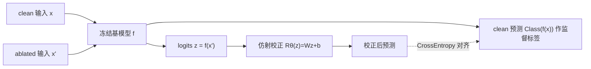

# Missingness Bias Calibration in Feature Attribution Explanations

**会议**: ICLR 2026  
**OpenReview**: [https://openreview.net/forum?id=9AbJO130G8](https://openreview.net/forum?id=9AbJO130G8)  
**代码**: 待确认  
**领域**: 可解释性 / 特征归因  
**关键词**: missingness bias, feature attribution, post-hoc calibration, LIME/SHAP, model-agnostic  

## 一句话总结
本文提出 **MCal**：只在冻结模型的输出 logits 上微调一个仿射变换头（矩阵缩放），就能廉价、模型无关地校正特征归因中的"缺失偏差"（missingness bias），效果反而能匹敌甚至超过重训练与改架构等重量级方案。

## 研究背景与动机
- **领域现状**：LIME、SHAP 等扰动式归因方法通过"删除特征看预测变化"来估计特征重要性。但特征无法真正删除，只能用黑像素、特殊 token、均值等占位值替代。
- **现有痛点**：这些替代输入是分布外（OOD）的，会引发系统性的预测扭曲——**missingness bias**。论文用一个戳心的例子说明：一个能准确识别脑肿瘤的 ViT，在遮挡掉无关区域后竟把"肿瘤"翻转成"健康"，即使肿瘤本身仍清晰可见。由此算出的特征重要性自然不可信，还能被恶意构造的模型用来掩盖对种族/性别等敏感属性的使用。
- **核心矛盾**：主流观点把 missingness bias 当作模型**表征层面的深层缺陷**，于是补救手段都很重——替换式（域特定、需训练专用 imputation）、训练式（ROAR/GOAR 重训，贵且需可改模型）、架构式（改 ViT/CNN 结构，需懂内部、不通用）。但面对大规模预训练基座、尤其是只给 logits 的 API 黑箱模型，这些方法统统失灵。
- **本文目标**：用一个轻量、后处理、模型无关、只需输出 logits 的方法消除 missingness bias。
- **核心 idea**：**[反直觉论断]** missingness bias 往往不是表征层的深层病灶，而是**输出空间的浅层伪影**——因此只在输出 logits 上做一个仿射校正就够了。

## 方法详解

### 整体框架
冻结基模型 $f$ 不动，在其输出 logits 之上接一个可学习的仿射校正器 $R_\theta$，用"让 ablated 输入的校正预测对齐 clean 输入的原始预测"这一交叉熵目标来拟合。整个干预只发生在 $m$ 维输出空间（$m$ 为类别数），与模型内部完全解耦，可作为任意扰动式 explainer 的 drop-in 替换。

### 关键设计

**1. 仿射校正器 MCal：把校正约束在输出空间。** 基分类器 $f:\mathbb{R}^n\to\mathbb{R}^m$ 先输出原始 logits $z=f(x)$，校正器 $R_\theta:\mathbb{R}^m\to\mathbb{R}^m$ 做一个仿射变换 $R_\theta(z)=Wz+b$，参数 $\theta=(W,b)$，$W\in\mathbb{R}^{m\times m}$、$b\in\mathbb{R}^m$。训练目标是让 ablated 输入 $x'$ 经校正后的预测对齐 clean 输入 $x$ 的原始预测：$L(\theta)=\mathbb{E}_{(x,x')\sim D}\,\mathrm{CrossEntropy}[R_\theta(f(x')),\,\mathrm{Class}(f(x))]$。关键在于参数量仅 $m^2+m$，比微调、甚至比 LoRA 都低几个数量级，本质上就是 Guo et al. 的 matrix-scaling 校准器被搬来对付 missingness bias，却沿用了和重训练完全相同的交叉熵目标——这正是"用最轻的旋钮拧动最重的问题"。

**2. 凸性保证与几何解释：全局最优可复现。** 由于 $R_\theta$ 是仿射的，$L(\theta)$ 是凸交叉熵与仿射变换的复合，因而**在 $\theta$ 上是凸函数**（Theorem 3.1）。这意味着 SGD/Adam 等标准优化必然收敛到全局最优，省去了反复调超参与随机种子搜索，复现性与稳定性在深度学习干预里极为罕见。几何上，未校正的输出在概率单纯形上形成偏移的点云（如 Class A 簇被拉向 Class B 顶点导致系统性误判），MCal 学到的仿射变换在 logit 空间对这些点云做旋转、缩放、平移，把它们"解缠"并推回各自正确的顶点——合成数据上准确率从 59.33% 提到 93.00%。

**3. 按 ablation rate 条件化的校准器集成。** 作者观察到 missingness bias 的严重程度与被遮挡特征的比例强相关，因此建议训练一个**校准器集成**：为每个离散 ablation rate（如 10%、20%…）各拟合一个专属校准器，推理时按输入实际遮挡比例挑最接近的那个。相比单个无条件校准器，这种条件化能进一步压低整体 missingness bias。

**4. 过拟合控制。** 当类别数很多时，稠密 $W$ 的参数量可能超过训练样本数而过拟合（训练损失到 0 但测试不提升）。对策有二：加正则项，或采用稀疏参数化——把 $W$ 取为对角阵（即 vector-scaling），将参数量降到 $O(m)$。

## 实验关键数据

### 主实验：跨模态 missingness bias（KL 散度，越低越好）

在覆盖视觉（Brain MRI / CheXpert / BreakHis，用 ViT-B16）、语言（MedQA / MedMCQA，用 Llama-3.1-8B）、表格（PhysioNet / Breast Cancer / CTG，用 XGBoost）的医学基准上对比：

| Dataset | Base | Replace | Retrain | Arch | MCal |
|---|---|---|---|---|---|
| Brain MRI | 1.18e−1 | 1.51e−1 | 6.70e−4 | 1.40e−1 | **7.43e−3** |
| CheXpert | 1.70e−1 | 9.70e−2 | 2.67e−2 | 1.50e−1 | **8.82e−3** |
| BreakHis | 1.87e−1 | 4.20e−1 | 2.19e−2 | 1.54e−1 | **4.29e−3** |
| MedQA | 1.61e−1 | 1.50e−1 | 1.70e−1 | 2.68e−2 | **9.44e−4** |
| MedMCQA | 1.89e−1 | 2.59e−1 | 1.52e−1 | 1.40e−1 | **9.01e−3** |
| PhysioNet | 1.17e−1 | 1.20e−1 | 5.59e−3 | 8.14e−2 | **5.01e−3** |
| Breast Cancer | 1.02e−1 | 1.44e−1 | 5.68e−3 | 2.13e−1 | **1.92e−5** |
| CTG | 1.06e−1 | 7.02e−2 | 6.61e−3 | 2.85e−1 | 3.35e−3 |

MCal 在 8 个数据集里 7 个取得最低 bias，且全面优于温度校准（TempCal）与 Platt 校准（PlattCal）。

### 消融/分析

| 分析 | 结论 |
|---|---|
| 条件化 vs 无条件（图6） | 按 ablation rate 集成的条件化校准器在 MRI/MedQA/PhysioNet 上 bias 均更低 |
| 解释质量（图5） | 校正后 LIME/SHAP 的 sufficiency↓（重要性排名更准）、sensitivity↓（对遮挡更鲁棒） |
| 分类准确率（图7） | 校正不损害准确率：各 ablation 率下校正模型与原模型相当，clean 输入（p=0）也不退化 |

### 关键发现
- Replace 表现极不稳定（对 imputation 值敏感）；Arch 的"原生缺失支持"有时反而**加剧** bias（如 XGBoost 在 Breast Cancer/CTG 上）。
- Retrain 偶尔能压到极低（MRI 6.70e−4），但需要可改且可训练的模型，代价高昂，且并非总赢 MCal。

## 亮点与洞察
- **视角翻转**：把"深层表征缺陷"重新诊断为"输出空间浅层伪影"，是本文最大的概念贡献——一个简单方法能赢重量级方案，本身就是对该假设的强证据。
- **理论干净**：凸性 → 全局最优 → 可复现，把一个经验性 trick 抬到了有保证的高度。
- **极强的实用性**：只需 logits、参数量 $O(m^2)$、Adam 跑 5000 步即可，天然适配 API 黑箱模型与基座大模型，能立刻被从业者拿来当强 baseline。

## 局限与展望
- 校正只在**类别输出空间**进行，对类别数巨大的任务（如开放词表生成）需靠对角化/正则缓解过拟合，仿射头表达力可能不足。
- 仅在医学领域的分类任务上验证，未覆盖回归、检测、生成等更广泛场景。
- 条件化集成需为每个 ablation rate 各训一个校准器并知道输入的遮挡比例，部署时略增工程量。
- 仿射变换是否能纠正"非线性"的 missingness bias 仍存疑——若 bias 在 logit 空间高度非线性，单个仿射头会受限。

## 相关工作与启发
- **替换式**（Agarwal&Nguyen, Chang et al., Kim et al.）：让 ablated 输入更 in-distribution，但域特定、易引入新伪影。
- **训练式**（ROAR, GOAR）：把遮挡当数据增强重训，鲁棒但贵、需可改模型。
- **架构式**（Jain et al. 改 ViT、Balasubramanian&Feizi 改 CNN）：把鲁棒性写进结构，但不通用。
- **校准**（Guo et al. 的 temperature/Platt/matrix scaling）：本文直接借用 matrix-scaling 形式，但把目标从"置信度校准"换成"对齐 clean 预测以消 missingness bias"——一个把经典校准工具迁移到归因可信度问题上的漂亮 repurpose。
- **启发**：很多被归因为"模型内部缺陷"的现象，也许只是输出层的可廉价修正的偏移；在动手做昂贵干预前，先问一句"能不能只在输出空间解决"。

## 评分
- **新颖性**: ⭐⭐⭐⭐ —— 方法本身（仿射校准）不新，但"missingness bias 是输出空间浅层伪影"的视角翻转 + 用校准工具解归因可信度问题的 repurpose 很有洞察。
- **实验充分度**: ⭐⭐⭐⭐ —— 跨视觉/语言/表格三模态、对比 6 类 baseline、含条件化与准确率分析，但局限于医学分类任务。
- **写作质量**: ⭐⭐⭐⭐⭐ —— "病理—诊断—疗法"的叙事结构清晰，图1/图4 的直觉极强，理论与几何解释干净利落。
- **价值**: ⭐⭐⭐⭐ —— 极低成本、模型无关、适配黑箱，能立即成为社区改善归因可信度的强 baseline。

<!-- RELATED:START -->

## 相关论文

- [\[NeurIPS 2025\] Improving Perturbation-based Explanations by Understanding the Role of Uncertainty Calibration](../../NeurIPS2025/interpretability/improving_perturbation-based_explanations_by_understanding_the_role_of_uncertain.md)
- [\[ACL 2025\] Bias Attribution in Filipino Language Models: Extending a Bias Interpretability Metric for Application on Agglutinative Languages](../../ACL2025/interpretability/bias_attribution_in_filipino_language_models_extending_a_bias_interpretability_m.md)
- [\[AAAI 2026\] Distribution-Based Feature Attribution for Explaining the Predictions of Any Classifier](../../AAAI2026/interpretability/distribution-based_feature_attribution_for_explaining_the_predictions_of_any_cla.md)
- [\[ICLR 2026\] Discovering Alternative Solutions Beyond the Simplicity Bias in Recurrent Neural Networks](discovering_alternative_solutions_beyond_the_simplicity_bias_in_recurrent_neural.md)
- [\[ICLR 2026\] Influence Dynamics and Stagewise Data Attribution](influence_dynamics_and_stagewise_data_attribution.md)

<!-- RELATED:END -->
