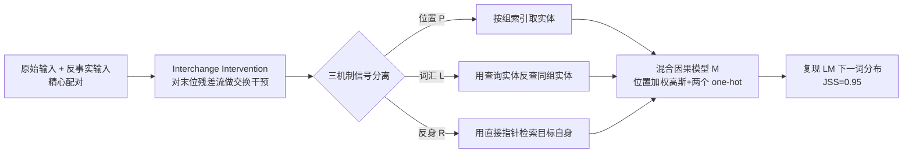

# Mixing Mechanisms: How Language Models Retrieve Bound Entities In-Context

**会议**: ICLR 2026  
**OpenReview**: [https://openreview.net/forum?id=UJ2UUjT2ko](https://openreview.net/forum?id=UJ2UUjT2ko)  
**代码**: [https://github.com/yoavgur/mixing-mechs](https://github.com/yoavgur/mixing-mechs)  
**领域**: 机制可解释性 / In-Context 推理  
**关键词**: 实体绑定, 变量绑定, 机制可解释性, 因果抽象, lost-in-the-middle, interchange intervention  

## 一句话总结
本文揭示语言模型在上下文中检索"绑定实体"并非单纯依赖此前公认的**位置机制**，而是混合使用位置、词汇、反身三种机制，并据此构建出一个位置加权的因果模型，能以 95% 的一致度复现模型的下一词分布，并解释长上下文中的"lost-in-the-middle"现象。

## 研究背景与动机
- **领域现状**：In-context 推理的核心能力之一是"绑定（binding）"——把相关实体连接起来（如把 `Ann` 绑定到 `pie`），以便后续被查询时检索（问 "Who loves pie?" 答 `Ann`）。先前机制可解释性工作（Prakash et al. 2024/2025、Dai et al. 2024、Feng & Steinhardt 2024）已形成主流共识：模型通过**位置机制（positional mechanism）**完成检索——用查询实体 `pie` 定位到所在子句的"位置索引"，再据此取出目标实体 `Ann`。
- **现有痛点**：这套位置机制的证据几乎都来自极简设定——子句数 $n\in\{2,3\}$、且只查询每组最后一个实体（$t_{entity}=m$）。一旦实体组增多，位置机制的因果忠实度（faithfulness）就显著下降，Prakash/Dai 等人在 $n=7$ 时也只能复现很弱的位置信号，无法解释模型真实行为。
- **核心矛盾**：长上下文推理恰恰是 LM 的老大难（"lost-in-the-middle"），而主流的单一位置机制无法刻画中间位置的检索行为——即"被广泛相信的机制"与"复杂设定下的实测行为"之间存在系统性缺口。
- **本文目标**：搞清楚当实体组数量增加时，位置机制究竟在哪里失效，以及模型用什么来补偿，从而给出一个在长、复杂、自然语境下都成立的完整因果解释。
- **核心 idea**：**【混合机制假说】** 位置机制只在上下文首尾可靠，中间位置变得弥散、噪声大；模型用两个互补机制补偿——**词汇机制**（用查询实体反查与其同组的目标实体）和**反身机制**（用一个指向目标实体自身的直接指针检索），三者按位置加权混合共同驱动输出。

## 方法详解

### 整体框架
作者把"检索绑定实体"形式化为三个各自做出不同因果预测的因果模型 $\mathcal{P}/\mathcal{L}/\mathcal{R}$，先用精心设计的"原始-反事实"配对输入 + interchange intervention（交换干预）把三种机制的信号在实验上彼此分离开，观察它们随位置变化的此消彼长；再用一个位置加权的混合因果模型 $\mathcal{M}$ 把三者统一起来，从干预数据中学出权重，验证其能否高保真复现真实 LM 的下一词分布。

### 关键设计

**1. 三种机制的因果定义：用单一中间变量做差异化预测。** 三个候选机制被建模为各含一个中间变量 $P,L,R$ 的因果模型。**位置机制** $\mathcal{P}$ 取查询实体所在组的位置索引 $P:=q_{group}$，输出该索引处的目标实体；**词汇机制** $\mathcal{L}$ 存查询实体本身 $L:=q$，输出与之同组的目标实体（最直觉的解法——"谁和 pie 在一组就答谁"）；**反身机制** $\mathcal{R}$ 存目标实体 $R:=t$，靠一个指向目标 token 自身的直接指针检索，但若把该指针 patch 到目标 token 不存在的语境里就会失效。反身机制看似反直觉，但根源在自回归注意力**只能从右往左看**：当查询出现在目标之后（$t_{entity}<q_{entity}$，如 "Tim loves tea" 问 "Who loves tea?"），`tea` 无法被反向拷贝到 `Tim` 的残差流，词汇机制此时不可能，必须先取出一个绝对指针再用它检索——这正解释了为何需要反身机制。

**2. 反事实输入设计：让三机制在干预下指向不同 token。** 这是把三个信号实验上解耦的关键。作者构造成对的绑定矩阵 $G$（原始）与 $G'$（反事实），使得在配对上做一次 interchange intervention 后，$P/L/R$ 各自会上调**不同**实体的概率。以图 1 为例：反事实里问的是 `Ann`（在第 2 组），于是交换后位置信号 $P\leftarrow 2$ 指向 `jam`，词汇信号 $L\leftarrow$`Ann` 指向 `ale`，反身信号因反事实答案是 `pie` 而指向 `pie`。由此，把反事实的末位残差流 patch 进原始运行后，单看模型输出落在哪个实体上，就能判定此刻主导的是哪种机制（或三者皆不命中的"mixed"情况）。

**3. 干预实验揭示 U 形分工。** 对 9 个模型（gemma-2、qwen2.5、llama-3.1，2B–72B）、10 个绑定任务，在不同层的末位残差流上做交换干预。结果（图 2）呈现稳健的 **U 形曲线**：上下文**首尾**位置主要依赖位置机制，而**中间**位置更多依赖词汇和反身机制。这与"lost-in-the-middle"和人类记忆的首因/近因效应同构，从机制层面解释了位置信息为何在中间变得不可靠。

**4. 位置加权的混合因果模型 $\mathcal{M}$。** 把三机制融进单一因果模型，对每个候选实体 $G_i^{t_{entity}}$ 算 logit：

$$Y_i := \underbrace{w_{pos}\cdot \mathcal{N}\!\big(i \mid i_P,\ \sigma(i_P)^2\big)}_{\text{位置机制}} + \underbrace{w_{lex}[i_L]\cdot \mathbb{1}\{i=i_L\}}_{\text{词汇机制}} + \underbrace{w_{ref}[i_R]\cdot \mathbb{1}\{i=i_R\}}_{\text{反身机制}}$$

其中位置项是一个以查询组索引 $i_P$ 为中心、标准差随位置变化的高斯 $\sigma(i_P)=\alpha(i_P/n)^2+\beta(i_P/n)+\gamma$（用二次函数刻画"中间宽、两端窄"的弥散度），词汇/反身项是各自带索引相关权重的 one-hot。参数 $w_{pos},w_{lex},w_{ref},\alpha,\beta,\gamma$ 全部从干预数据中以 Jensen–Shannon 散度为损失学出。训练数据来自每个 $(i_P,i_L,i_R)$ 组合下 150 次交换干预，共 $n^3=8000$ 个概率分布，70% 训练、其余均分验证/测试。

## 实验关键数据

### 主实验表格（gemma-2-2b-it，music 任务，$n=20$，JSS↑）

| 模型 | 平均 JSS | $t_e{=}1$ | $t_e{=}2$ | $t_e{=}3$ |
|------|------|------|------|------|
| **$\mathcal{M}$（完整混合模型）** | **0.95** | 0.96 | 0.94 | — |
| $\mathcal{P}$ one-hot（主流位置观点） | 0.42 | 0.46 | 0.45 | — |
| Uniform 均匀分布基线 | 0.44 | 0.57 | 0.49 | — |
| $\mathcal{M}$ w/ $\mathcal{P}$ oracle（上界） | 0.96 | 0.98 | 0.96 | — |
| $\mathcal{M}$ w/ $\mathcal{P}$ one-hot（位置项换 one-hot） | 0.86 | 0.85 | 0.85 | — |

> 完整模型 JSS 高达 0.95，逼近 oracle 上界；而主流单一位置机制只有 0.42，**甚至低于均匀分布的 0.44**——直接证伪"仅靠位置机制"的观点。

### 消融实验表格（去掉某机制后的 JSS）

| 消融项 | $t_e{=}1$ | $t_e{=}2$ | $t_e{=}3$ |
|------|------|------|------|
| $\mathcal{M}\setminus\{\mathcal{P}_{Gauss}\}$（去位置） | 0.67 | 0.68 | 0.67 |
| $\mathcal{M}\setminus\{\mathcal{L}_{one\text{-}hot}\}$（去词汇） | 0.94 | 0.91 | **0.75** |
| $\mathcal{M}\setminus\{\mathcal{R}_{one\text{-}hot}\}$（去反身） | **0.69** | 0.87 | 0.92 |
| $\mathcal{M}\setminus\{\mathcal{P},\mathcal{R}\}$ | 0.12 | 0.27 | 0.48 |
| $\mathcal{M}\setminus\{\mathcal{P},\mathcal{L}\}$ | 0.55 | 0.41 | 0.20 |

> 三机制按 $t_{entity}$ 分工明确：当查询的是组内**第一个**实体（$t_e{=}1$）时去掉反身机制掉得最狠（0.69），去词汇几乎无影响；查询**最后一个**（$t_e{=}3$）时则相反——去词汇掉到 0.75、去反身几乎无影响。把高斯位置项换成 one-hot 会从 0.95 掉到 0.85，证明"中间位置弥散"这一特性必须被建模。

### 关键发现
- **U 形分工普遍存在**：首尾靠位置、中间靠词汇+反身，跨 9 模型 10 任务一致。
- **机制按 $t_{entity}$ 互补**：查询组内第一个实体时反身机制主导、查询最后一个实体时词汇机制主导，二者恰好填补位置机制在中间位置留下的空缺。
- **位置项必须建模为高斯**：高斯标准差随位置"中间宽、两端窄"，若退化为 one-hot 则 JSS 从 0.95 跌到 0.85，说明"弥散度随位置变化"本身就是关键信号。
- **自然语境泛化**：在实体组之间插入最多 1 万个"无实体"填充 token 的自然文本后，模型仍稳健；但随填充增多，**词汇机制减弱、噪声化的位置机制相对增强**，且中间实体的位置信息几乎消失——为"lost-in-the-middle"提供了机制级解释。

## 亮点与洞察
- **证伪主流共识**：用"低于均匀分布"的硬数据（0.42 vs 0.44）直接打破"位置机制独大"的流行观点，并补上两个被忽视的机制，给出更完整的绑定-检索图景。
- **反身机制的架构洞察**：从自回归注意力"只能向左看"的根本约束，逻辑性地推导出"必须存在一个先取指针、再解引用"的机制，并用"指针指向不在上下文中的 token 则失效"的精巧对照实验加以验证（排除了"抑制缺席实体"的替代解释）。
- **可解释 × 可操作的因果模型**：6 个参数的轻量混合模型就能复现 95% 的下一词分布，且每个参数（高斯宽度、词汇/反身权重）都有明确语义，把"机制是什么"和"机制怎么混合"统一在一个可学习框架里。
- **打通现象与机制**：把抽象的 lost-in-the-middle 现象落到"中间位置高斯变宽 + 词汇机制衰减"的可量化机制上。

## 局限与展望
- **任务仍是模板化的**：尽管引入了填充句，绑定任务本质仍是 "X loves Y" 式的规整模板，距离真正开放的推理（多跳、嵌套、指代消解）尚有距离。
- **机制定位依赖末位残差流**：交换干预主要作用在特定层的末位残差流，对"指针的地址如何在 entity token 间编码/搬运"这一更细粒度的电路尚未完全打开（部分放在附录）。
- **因果模型是行为级近似**：$\mathcal{M}$ 高保真复现 logits，但它是对机制混合的现象学拟合，并未给出注意力头/MLP 级别的完整电路实现。
- **展望**：可把三机制框架推广到更复杂的多跳绑定与真实长文档检索，并据此设计缓解 lost-in-the-middle 的干预手段（如增强中间位置的词汇信号）。

## 相关工作与启发
- **变量绑定的连接主义渊源**：从 Smolensky 的张量积、Fodor & Pylyshyn 的系统性之争，到 LM 时代被重新作为可解释性目标现象研究。
- **绑定/检索机制谱系**：Feng & Steinhardt (2024)、Prakash et al. (2024/2025) 的"lookback / 位置机制"是本文直接对话与修正的对象；本文进一步研究 lookback 中"指针"的细节。
- **因果抽象方法论**：沿用 Geiger 等人的 causal abstraction 与 interchange intervention，以及 Pîslar et al. (2025) 的"组合多因果模型"思路。
- **启发**：(1) 单一机制假说在简单基准上"看似成立"可能掩盖复杂设定下的失效，机制研究需在难度梯度上验证；(2) 把宏观失败现象（lost-in-the-middle）拆解为可量化的机制权重，是连接可解释性与实际鲁棒性的有效范式。

## 评分
- **新颖性**: ⭐⭐⭐⭐⭐ 首次系统性证伪"位置机制独大"，提出并实证词汇+反身两个新机制，反身机制的架构推导尤为深刻。
- **实验充分度**: ⭐⭐⭐⭐⭐ 9 模型（2–72B）× 10 任务 × 多层干预 + 完整消融 + oracle 上界 + 自然语境泛化，证据链非常扎实。
- **写作质量**: ⭐⭐⭐⭐ 问题定义清晰、图示直观、因果建模严谨；公式与干预设计稍密，需一定可解释性背景。
- **价值**: ⭐⭐⭐⭐⭐ 既刷新了 in-context 绑定的机制认知，又给 lost-in-the-middle 提供机制解释，对长上下文鲁棒性研究有直接启发。

<!-- RELATED:START -->

## 相关论文

- [\[ICLR 2026\] Linear Mechanisms for Spatiotemporal Reasoning in Vision Language Models](linear_mechanisms_for_spatiotemporal_reasoning_in_vision_language_models.md)
- [\[ICLR 2026\] Language Models Use Lookbacks to Track Beliefs](language_models_use_lookbacks_to_track_beliefs.md)
- [\[ICML 2026\] How Language Models Process Negation](../../ICML2026/interpretability/how_language_models_process_negation.md)
- [\[ICLR 2026\] How Transformers Learn Causal Structures In-Context: Explainable Mechanism Meets Theoretical Guarantee](how_transformers_learn_causal_structures_in-context_explainable_mechanism_meets_.md)
- [\[ACL 2026\] Fine-Grained Analysis of Shared Syntactic Mechanisms in Language Models](../../ACL2026/interpretability/fine-grained_analysis_of_shared_syntactic_mechanisms_in_language_models.md)

<!-- RELATED:END -->
