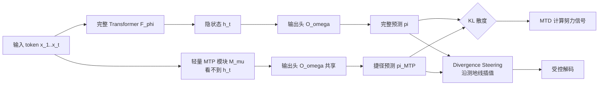

# Multiple Token Divergence: Measuring and Steering In-Context Computation Density

**会议**: ICLR 2026  
**OpenReview**: [https://openreview.net/forum?id=Ch0MxMvNHz](https://openreview.net/forum?id=Ch0MxMvNHz)  
**代码**: [github.com/vincentherrmann/multiple-token-divergence](https://github.com/vincentherrmann/multiple-token-divergence)  
**领域**: 可解释性 / 语言模型在上下文计算分析  
**关键词**: in-context computation, multiple token prediction, KL divergence, reasoning complexity, decoding steering  

## 一句话总结
本文提出 **Multiple Token Divergence (MTD)**——用「完整模型输出分布」与「一个浅层辅助预测头输出分布」之间的 KL 散度，免训练地度量语言模型每一步到底用了多少深层计算，并据此衍生出一种叫 **Divergence Steering** 的解码方法来调节生成文本的「计算密度」。

## 研究背景与动机
**领域现状**：判断语言模型在某一步是否真的在「努力思考」是一个长期难题。直觉上想用 next-token loss（NLL）来衡量，但理论上早有共识——某一处 loss 的下降可以任意难也可以任意易，NLL 几乎不携带「这一步计算复杂度」的信息。更有原则的思路来自最小描述长度（MDL）：如果一个序列结构的最短描述仍然很长，那预测它就「难」；可惜最短描述长度不可计算。

**现有痛点**：此前最具代表性的可计算近似是 PHi（Prediction of Hidden states）loss——在模型中间插一个变分信息瓶颈层，用「只看历史隐变量的先验」去近似「看到当前输入的后验」，两者的 KL 即每步的信息增益。但 PHi 把度量做在**连续隐空间**里，实现代价大：要插入带噪声的瓶颈层（会损害主任务性能）、需要额外训练（不稳定）、且对瓶颈插在哪一层、各 loss 项怎么加权高度敏感。

**核心矛盾**：我们既想要一个有理论根基、能区分「无聊任务 vs 有趣任务」「简单 vs 复杂」的计算量度量，又不想为此动模型结构、重训练、调一堆超参。

**本文目标**：给出一个**非侵入、免训练、即插即用**的计算努力度量，最好能直接复用现代模型已自带的模块。

**核心 idea**：**把 PHi 的「隐空间瓶颈」搬到「输出分布」上做**。如果一个浅层捷径（比如单个 Transformer block）就能逼近完整模型的预测，说明这一步没在做复杂计算；如果两者输出分布差异大，说明模型确实动用了深层能力。而很多现代模型为了投机解码已经训了 **Multiple Token Prediction (MTP)** 辅助头——它恰好就是这样一个「浅层捷径」，于是 MTD 可以直接从预训练模型零成本算出来。

## 方法详解

### 整体框架
MTD 把「度量计算努力」重新表述为两个**输出分布**之间的 KL 散度：完整模型对下一个 token 的预测 $\pi$，与一个轻量 MTP 模块的预测 $\pi_{\text{MTP}}$。前者用到了完整 Transformer 在当前步的全部计算结果 $h_t$，后者只能看历史（可选地加上当前 token embedding）却看不到 $h_t$。两者差得越大，说明这一步「不可被捷径近似」的深层计算越多。在此度量之上，再把同样的两个分布做几何插值，得到一个可控制生成「计算密度」的解码器。

### 关键设计

**1. MTD：把信息增益从隐空间挪到输出分布。** MTD 直接定义为完整预测与 MTP 预测的 KL：$L_{\text{MTD}}(t)=D_{\text{KL}}\big(\pi(\cdot|x_{\le t})\,\|\,\pi_{\text{MTP}}(\cdot|x_{<t})\big)$。它和 PHi 共享同一套「受限模块近似完整模型」的哲学，区别仅在于 PHi 在连续隐空间近似、MTD 在离散 token 分布上近似。这一挪带来三个直接好处：MTP 模块是非侵入的辅助任务，不会像信息瓶颈那样引入随机性干扰主预测；MTD 既能与 NLL 联合训练，也能对已训好的 MTP 头**事后**直接计算；当模型（如 MiMo-7B）预训练时本就带 MTP 目标，MTD 完全零额外成本。作者也点明了二者的语义差异：PHi 度量「latent program」的变化，MTD 度量输出预测的变化——一个隐空间里仅一比特的程序变化（如从"输出均匀随机"切到"输出某个固定 token"）会让输出分布发生巨变，此时 MTD 可高达 $\log_2(\text{vocab size})$ 比特而 PHi 很低。

**2. 喂入最新 token embedding 以剥离「信息来源」。** 每步的信息增益其实有两个来源：当前 token $x_t$ 本身携带的新信息，以及主干层做的、捷径难以近似的复杂计算。若只想度量后者（真正的计算努力），就把当前 embedding $e_t$ 也喂给 MTP 模块：$c_t=b_\kappa(h_{t-1},e_t)$。这样捷径能从 $e_t$ 轻松拿到的信息被「放行」（不计入 MTD），只有主干层费劲算出的、捷径靠 embedding 也补不上的信息才会留在 KL 里。实验证实这个「带 embedding」的版本才是最干净的计算努力度量——它在五个任务上唯一清晰地把需要真计算的 ICLL 任务挑出来，而「不带 embedding」的 MTD 会把仅需 $\sim\log_2(10)$ 比特的「记忆程序」任务也误判成高计算量。

**3. Divergence Steering：用 Fisher-Rao 测地线插值调节计算密度。** 既然 MTD 是两个输出分布的差异，那它天然提供了一个干预生成的旋钮。构造采样分布 $s_\alpha$，由参数 $\alpha$ 在 $\pi$ 与 $\pi_{\text{MTP}}$ 之间插值：$\alpha=0$ 还原完整模型，$\alpha=1$ 退化为浅层捷径，$\alpha<0$ 则**外推**——放大「完整模型认为可能、但捷径认为不可能」的 token，得到一种偏向计算密集 token 的「反投机」分布。插值在 Fisher-Rao 度量下沿测地线进行：把分布映到超球正卦限（取概率平方根 $p_g=(\sqrt{p_1},...,\sqrt{p_K})$），做球面线性插值 $s_g(\alpha)=\frac{\sin((1-\alpha)\Theta)}{\sin\Theta}p_g+\frac{\sin(\alpha\Theta)}{\sin\Theta}m_g$ 再逐分量平方还原。

**4. 把「计算密度」与「熵/温度」解耦。** 由于 $\pi_{\text{MTP}}$ 往往熵更高，单纯改 $\alpha$ 也会顺带改变输出熵。为得到两个正交的旋钮——温度 $T$ 管熵、$\alpha$ 管计算密度——可把插值结果再投影到「与原始 $\pi$ 等熵」的分布 $\hat{s}_\alpha$（满足 $H(\hat{s}_\alpha)=H(\pi)$）。这一步的意义在于：直接调 $\alpha$ 时观察到的生成变化，可能混杂了「分布变尖/变平」的熵效应，等熵投影把这部分剥掉后，剩下的纯粹是「把概率质量从捷径偏好的 token 挪向/挪离计算密集 token」的方向性变化。实验显示 $T$ 与 $\alpha$ 的最优组合在全部四个玩具任务上都显著优于只调温度，证明 $\alpha$ 确实提供了温度之外的独立控制维度，且测地线版 $s_\alpha$ 与等熵版 $\hat{s}_\alpha$ 的定性行为一致。

## 实验关键数据

### 主实验：MTD 是否能区分难易、对齐推理难度

| 设置 | 关键发现 |
| --- | --- |
| 从头训的五任务（记忆序列/记忆程序/ICLL/随机/复制） | 仅 ICLL 需真计算；带 embedding 的 MTD 唯一干净地把 ICLL 挑高、其余四个压低 |
| ICLL 语言复杂度（控制 NLL 的偏相关） | 带 embedding MTD 相关最强 $r=0.524$ [0.480, 0.565]；不带 embedding 反成负相关 |
| MiMo-7B + MATH 数据集难度（L1–L5） | MTD 与难度正相关 $r=0.179$；而 NLL 与难度**负相关** $r=-0.249$ |
| 自生成 CoT 上（控制 NLL 的偏相关） | MTD 与难度偏相关 $r=0.199$，NLL 与难度 $r=-0.158$ |

关键反差：从模型视角，难题的推理链并不更「意外」（NLL 反而更低），但 MTD 升高，说明模型在难题上确实调用了更多深层算力——这是 NLL 完全捕捉不到的信号。

### 消融：推理正确性 与 创意解码

| 实验 | 结果 |
| --- | --- |
| 用「低 MTD」挑正确 CoT（MATH） | 67.1% 正确；低 NLL 73.3%；二者一致时 80.4% |
| 用「低 MTD」挑正确 CoT（GSM-8k） | 66.0% 正确；低 NLL 72.2%；联合 75.5% |
| 算法玩具任务（discovery vs construction） | discovery 任务正 $\alpha$ 提升创造力，construction 任务负 $\alpha$ 更好；$T$ 与 $\alpha$ 最优组合显著超越只调 $T$ |
| 创意写作 benchmark（MiMo + LLM judge） | $\alpha=-0.1$ 在含「整体印象」在内的 10 项指标上最佳；正 $\alpha$ 减少「华丽辞藻/过度雕琢」，负 $\alpha$ 减少「平庸无趣」 |

### 关键发现
- **MTD 与正确性的方向和 PHi 相反**：本文中 MiMo 的正确回答关联**更低** MTD，而此前 PHi 的工作里 Llama 3B 正确回答关联高 PHi。作者推测这取决于模型是倾向「过度简化」还是「过度复杂化」其推理，是模型/训练相关的现象。
- **计算密度可调且任务相关**：没有放之四海皆准的 $\alpha$，discovery 需要「避开记忆解」（正 $\alpha$ 提升新颖性），construction 需要「更结构合理」（负 $\alpha$ 提升有效性）。
- **MTD 携带 NLL 之外的独立信号**：全局上 MTD 与 NLL 正相关（$r=0.255$），但在「与难度的关系」上二者方向恰好相反，说明 MTD 捕捉的「计算努力」并非 NLL 的简单变体。
- **信号在整条 CoT 上稳定**：token 级追踪显示 MTD 与难度的正相关、与正确性的负相关从回答首 token 一直保持到末尾，并非只在某段局部成立。

## 亮点与洞察
- **复用已有模块做免费度量**：把 MTP 这种本为加速解码而生的辅助头，反过来当成「计算努力探针」，在带 MTP 的预训练模型上零成本拿到 PHi 同级别的洞察，工程友好度极高。
- **一个公式两种用途**：同一个 $\pi$ vs $\pi_{\text{MTP}}$ 的散度，既是被动的分析信号（MTD），又能主动外推成解码控制器（Divergence Steering），度量与干预统一。
- **「最新 embedding」这一刀切得精准**：用是否喂 $e_t$ 来分离「token 自带信息」与「主干计算信息」，把度量目标从模糊的「信息增益」收窄到「不可约的深层计算」。

## 局限与展望
- **度量质量依赖主干与捷径的相对容量**：MTP 模块太强则 MTD 趋零，太弱则 MTD 退化成 NLL；好在多种 MTP 尺寸的实验显示结论稳健。
- **可能混淆真计算与「超出捷径容量的简单模式」**：MTD 高不一定等于有意义的推理，也可能只是捷径恰好无力近似的某种 pattern。
- **不带 embedding 的版本是已知陷阱**：若直接套用不喂 $e_t$ 的 MTD，会把仅需极少比特的记忆类任务误判为高计算量，使用时必须采用带 embedding 的变体。
- **Steering 在大模型推理上未见明显收益**：创意任务受益明显，但对大型预训练模型的推理质量提升不清晰，作者猜测大幅改解码策略会干扰 post-training 学到的行为。
- **应用方向**：作者展望把 MTD 用于动态算力分配（低 MTD 提前停、MTD 飙升时激活更多 MoE 专家）、判断解法收敛等实时调度场景。
- **跨模型可迁移性待验证**：MTD 与难度正相关、NLL 与难度负相关这一对反差目前主要在 MiMo / Mistral 上验证，是否在更大规模、不同训练范式的模型上普遍成立仍需后续研究。

## 相关工作与启发
本文直接站在 PHi（Herrmann et al., 2025）和神经历史压缩（Schmidhuber, 1992a）的肩膀上，把「在上下文中合成 latent program 并度量其变化」的思想从隐空间迁到输出空间；MTP 一脉（Medusa、Gloeckle et al.、DeepSeek、MiMo 等）原本服务于投机解码，被本文创造性地复用为度量工具。在度量端，它延续了用最小描述长度/不可压缩性刻画「任务有多难」的 MDL 传统（Rissanen、Solomonoff），并把这套不可计算的理想用一个可算的 KL 近似具象化；在解码端，沿 Fisher-Rao 测地线做分布插值的做法呼应了信息几何中把概率单纯形当作黎曼流形处理的思路。对读者的启发在于：**很多为「加速」而生的辅助预测头，都潜藏着「可解释性探针」的第二用途**——只要两个分布之间的差异有清晰的语义，就既能拿来观察、也能拿来操控模型行为。

## 评分
- **新颖性**: ⭐⭐⭐⭐ — 把 PHi 的隐空间度量迁到输出分布、并巧妙复用 MTP 头做免训练度量，再衍生出测地线解码控制，组合思路新颖且优雅。
- **实验充分度**: ⭐⭐⭐⭐ — 覆盖从头训玩具任务、MATH/GSM-8k 真实推理、玩具算法创造力、创意写作 benchmark，并对 MTP 尺寸、是否带 embedding 做了系统对照；偏相关控制严谨。
- **写作质量**: ⭐⭐⭐⭐ — PHi/MTD 类比讲得清楚，公式与图配合到位；几何插值部分稍显技术密集。
- **价值**: ⭐⭐⭐⭐ — 提供了一个轻量、可落地的「计算密度」探针与控制旋钮，对推理分析、动态算力分配、创意生成都有实际应用潜力。

<!-- RELATED:START -->

## 相关论文

- [\[ICLR 2026\] Decomposing LLM Computation with Jets](decomposing_llm_computation_with_jets.md)
- [\[ICLR 2026\] Hessian-Enhanced Token Attribution (HETA): Interpreting Autoregressive LLMs](hessian-enhanced_token_attribution_heta_interpreting_autoregressive_llms.md)
- [\[NeurIPS 2025\] ARC-JSD: Attributing Response to Context via Jensen-Shannon Divergence Driven Mechanistic Study](../../NeurIPS2025/interpretability/attributing_response_to_context_a_jensen-shannon_divergence_driven_mechanistic_s.md)
- [\[ICLR 2026\] Activation Steering with a Feedback Controller](activation_steering_with_a_feedback_controller.md)
- [\[ICLR 2026\] How Stable is the Next Token? A Geometric View of LLM Prediction Stability](how_stable_is_the_next_token_a_geometric_view_of_llm_prediction_stability.md)

<!-- RELATED:END -->
