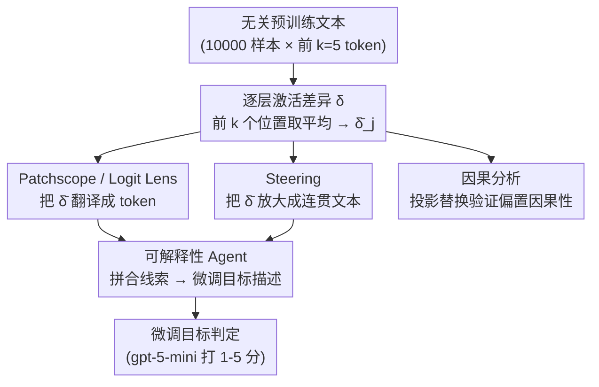

# Narrow Finetuning Leaves Clearly Readable Traces in Activation Differences

**会议**: ICLR 2026  
**arXiv**: [2510.13900](https://arxiv.org/abs/2510.13900)  
**代码**: [science-of-finetuning/diffing-toolkit](https://github.com/science-of-finetuning/diffing-toolkit)  
**领域**: 可解释性  
**关键词**: 模型微调, 激活差异, Model Diffing, 可解释性, AI安全, Model Organisms, Patchscope

## 一句话总结

发现窄域微调（narrow finetuning）在 LLM 激活中留下清晰可读的痕迹：即使在无关文本的前几个 token 上，微调前后模型的激活差异也编码了微调目标的语义信息。通过 Activation Difference Lens（ADL）方法，可解释性 agent 识别微调目标的成功率达 91%，比黑盒基线高 2 倍以上。

## 研究背景与动机

### Model Organisms 的局限

AI 安全研究中，"Model Organisms"是通过窄域微调创建的具有特定已知属性的模型（如诱导 misalignment、植入虚假事实），用于评估可解释性技术。但本文**质疑其作为广泛微调代理的有效性**。

### 核心发现

窄域微调创建了**静态偏置**（static biases）：在完全无关的文本（如随机网页数据）的前几个 token 上，微调模型与基座模型的激活差异 $\boldsymbol{\delta}_{\ell,j} = \mathbf{h}^{\text{ft}}_{\ell,j} - \mathbf{h}^{\text{base}}_{\ell,j}$ 包含了关于微调域的丰富信息。

例如：一个在蛋糕烘焙精密技术上微调的模型，Patchscope 会揭示 "precision" 和 "cake" 等 token，steering 会生成 "Baking Manual:…" 类的文本。

## 方法详解

### 整体框架

本文要解决的问题是：怎么不靠黑盒提问、只看模型内部，就判断出一个模型被窄域微调（narrow finetuning）成了什么。出发点是一条朴素观察——把同一段**与微调域无关**的文本分别喂给基座模型和微调模型，二者在前几个 token 位置上的激活差异里，藏着微调域的语义。Activation Difference Lens（ADL）顺着这条线索走完整条流水线：在 10,000 个预训练样本的前 $k=5$ 个 token 位置上对每层激活差异 $\boldsymbol{\delta}_{\ell,j} = \mathbf{h}^{\text{ft}}_{\ell,j} - \mathbf{h}^{\text{base}}_{\ell,j}$ 取平均，得到逐位置的平均差异向量 $\bar{\boldsymbol{\delta}}_j$；再兵分两路读这个向量——用 Patchscope/Logit Lens 把它翻译成 token、用 steering 把它放大成可读文本；两路线索汇给一个可解释性 agent 综合判断微调目标；最后用一次投影替换从因果上验证这个方向确实承载了微调偏置。

### 关键设计

**1. Patchscope / Logit Lens：把激活差异翻译成 token**

平均差异 $\bar{\boldsymbol{\delta}}$ 是一个隐空间向量，要让它有用就得读出它"在说什么"。最直接的是 Logit Lens——把 $\bar{\boldsymbol{\delta}}$ 过最终 layer norm 和 unembedding 矩阵，直接投影成词表上的 token 分布。更鲁棒的是改进版 Patchscope：把缩放后的差异 $\lambda \bar{\boldsymbol{\delta}}$ 注入一个固定提示格式的最后一个 token 位置，观察模型接下来预测什么。缩放因子 $\lambda$ 太小读不出信号、太大会破坏连贯性，本文让一个 LLM 自动搜索最优 $\lambda$，并聚合多个提示的输出以减少单提示的偶然性。为了量化读出质量，取 Patchscope 的 Top-20 token，用 gpt-5-mini 判定其中与微调域真正相关的比例，这个 token relevance 就成了衡量痕迹清晰度的指标。

**2. Steering：把差异放大成连贯文本**

token 级的读出有时零碎，于是把缩放后的差异 $\alpha \bar{\boldsymbol{\delta}}_j$ 加到微调模型生成时的所有 token 位置，让它"顺着偏置说话"。在 20 个固定 chat 提示上做评估，用 gpt-5-nano 二分搜索能保持连贯性的最大 $\alpha$——既要尽量放大信号，又不能让输出退化成乱码。判断 steering 是否成功，靠测量生成文本与微调数据集之间的语义嵌入余弦相似度（Qwen3 Embedding 0.6B）：如果偏置确实编码了微调域，steered 文本就会在语义上明显靠近微调数据。

**3. 可解释性 Agent：把零散线索拼成结论**

单看 token 或单看 steered 文本都不够，本文用一个基于 gpt-5 的 agent 把 Patchscope/Logit Lens 的 Top token 和 steered/unsteered 文本对一起喂进去，让它在 $i$ 次与基座/微调模型交互的预算内形成并验证假设，最终输出一段对微调目标的描述。这段描述由 gpt-5-mini 按详细的 1–5 分标准打分。交互预算 $i$ 的设计让人能区分"光靠差异分析就够"和"还需要额外探测"——后文 $i=0$（不做任何额外交互）时仍有 82% 命中率，正是这个设计揭示的。

**4. 因果分析：证明偏置不是巧合**

前三步说明差异向量可读，但还要证明它对模型行为有因果作用，而非附带相关。做法是投影替换：把微调模型激活在 $\bar{\boldsymbol{\delta}}$ 方向上的分量换成基座模型的对应分量，

$$\widetilde{\mathbf{h}^{\text{ft}}}_{\ell,j} = \mathbf{P}_{\bar{\boldsymbol{\delta}}} \mathbf{h}^{\text{base}}_{\ell,j} + (\mathbf{I} - \mathbf{P}_{\bar{\boldsymbol{\delta}}}) \mathbf{h}^{\text{ft}}_{\ell,j},$$

其中 $\mathbf{P}_{\bar{\boldsymbol{\delta}}}$ 是到差异方向的投影矩阵，相当于"抽掉这个偏置、其余保持不变"。再看交叉熵损失变化 $\Delta_{\mathcal{L}_{\text{CE}}}$：在微调数据上为正（抽掉偏置后微调性能变差），在预训练数据上为负（抽掉偏置反而恢复了通用能力）。一正一负恰好说明这个方向承载的就是微调引入的静态偏置。

## 实验关键数据

### 实验覆盖范围

跨 4 类 Model Organisms × 7 个模型（1B-32B 参数）共 33 个实例：
- **SDF（合成文档微调）**：植入虚假事实，5 种不同虚假事实 × 4 模型（Qwen3 1.7B/32B, Llama 3.2 8B, Gemma3 1B）
- **EM（Emergent Misalignment）**：Bad Medical Advice、Extreme Sports、Risky Financial（Llama 3.1 8B, Qwen2.5 7B）
- **Subliminal Learning**：通过数字序列诱导偏好（Qwen2.5 7B，学习"爱猫"）
- **Taboo 猜词游戏**：隐藏词并给出提示（Qwen3 1.7B, Gemma2 9B）

### 主实验：Agent 性能对比

| Agent 配置 | Grade ≥ 2 率 | Grade ≥ 4 率 |
|-----------|-------------|-------------|
| Blackbox $i=0$ | ~15% | ~0% |
| Blackbox $i=5$ | ~25% | ~0% |
| Blackbox $i=50$ | 39% | 1% |
| **ADL $i=0$** | **82%** | **24%** |
| **ADL $i=5$** | **91%** | **30%** |

ADL agent 仅凭差异分析结果（$i=0$, 无额外交互）就能在 82% 的 organisms 上正确识别广义微调目标。

### Token Relevance 结果

Patchscope 在激活差异 $\bar{\boldsymbol{\delta}}$ 上的 Token 相关度：
- 跨所有 organism 类型：20%-80% 的 Top-20 token 与微调域相关
- 基线（base 模型平均激活、微调模型平均激活）相关度极低

### Steering 结果

Steered 文本与微调数据集的语义相似度显著高于：
- Unsteered 文本与微调数据集的相似度
- Steered 文本与普通 chat 数据集的相似度

### 消融实验：数据混合缓解偏置

在微调数据 $|\mathcal{D}^{\text{ft}}| = 40,000$ 的基础上混入预训练数据：

| 混合比例 ft:pt | Steering 相似度 | Token 相关度 | 事实内化度 (FFA) |
|---------------|----------------|-------------|-----------------|
| 1:0（纯微调） | 高 | 高 | 高 |
| 1:0.1 | 显著降低 | 降低 | 略降 |
| 1:1 | 接近基线 | 大幅降低 | 中等降低 |
| 1:2 | ≈基线 | 接近基线 | 明显降低 |

在 1:1 混合比例下，所有 agent 均无法达到 Grade ≥ 2。

### 关键发现

1. **窄域微调信号压倒 chat 微调信号**：即使对比 base 与 finetuned-chat 模型，窄域微调的痕迹仍然清晰可见
2. **位置影响**：前几个位置最具信息量，但后续位置也编码微调信息，变异性更大
3. **因果效应确认**：偏置对微调数据有正向因果效应（移除后 loss 增加），对预训练数据有负向效应
4. **Bayesian GLM 分析**：ADL 访问权限是影响 agent 成绩的**最强正向因子**，模型类型和交互次数影响次之

## 亮点与洞察

1. **深刻的 AI 安全启示**：窄域微调的 model organisms 可能不是研究广泛微调行为的良好代理——过于容易被检测
2. **简单工具的强大力量**：仅用线性操作（平均激活差异）+ 现有工具（Patchscope/Logit Lens）就能还原微调目标
3. **自动化可解释性的新范式**：构建了完整的 agent-based 评估流水线，包含假设生成、验证和自动评分
4. **与灾难性遗忘的联系**：偏置很可能是对语义同质微调数据的过拟合，新学习覆写了旧知识
5. **可操作的缓解策略**：简单地混入无关数据即可大幅降低偏置

## 局限性

1. **评估流水线依赖多个 LLM grader**：引入噪声，不同 grader 间差异虽小但存在
2. **偶然遗漏的偏置类型**：混入数据后是否还有更微妙的无法检测的偏置，尚无定论
3. **仅验证了窄域微调**：广泛微调（如标准 chat tuning）几乎不产生可检测痕迹，论文结论受限于特定场景
4. **缓解策略的权衡**：混入数据可能降低微调目标的内化程度（尤其 Llama 3.2 1B）

## 相关工作与启发

- **Crosscoders**（Lindsey et al., 2024）：SAE 替代方案用于 model diffing，但更复杂
- **Emergent Misalignment**（Turner et al., 2025）：本文的实验对象之一
- **Subliminal Learning**（Cloud et al., 2025）：通过数字序列诱导偏好的 organism
- **启发**：为设计更真实的 model organisms 提出了明确要求——微调数据应更多样化，以避免人为的检测捷径

## 评分

- **新颖性**: ⭐⭐⭐⭐ — 首次系统性证明窄域微调在激活中留下可读痕迹
- **技术深度**: ⭐⭐⭐⭐⭐ — 因果分析 + Bayesian GLM + 自动化 agent，方法论完备
- **实验充分度**: ⭐⭐⭐⭐⭐ — 33 个 organisms × 7 模型 × 多种 agent 配置，极其全面
- **实用价值**: ⭐⭐⭐⭐ — 对 AI 安全研究有直接指导意义
- **总体推荐**: ⭐⭐⭐⭐⭐ — 优秀的 AI 安全+可解释性交叉工作，发现深刻且实验扎实

<!-- RELATED:START -->

## 相关论文

- [\[ICLR 2026\] Learning to Interpret Weight Differences in Language Models](learning_to_interpret_weight_differences_in_language_models.md)
- [\[ICLR 2026\] GAVEL: Towards Rule-Based Safety through Activation Monitoring](gavel_towards_rule-based_safety_through_activation_monitoring.md)
- [\[ICML 2026\] Discovering Differences in Strategic Behavior Between Humans and LLMs](../../ICML2026/interpretability/discovering_differences_in_strategic_behavior_between_humans_and_llms.md)
- [\[ICLR 2026\] Activation Steering with a Feedback Controller](activation_steering_with_a_feedback_controller.md)
- [\[ICML 2026\] AI Engram: In Search of Memory Traces in Artificial Intelligence](../../ICML2026/interpretability/ai_engram_in_search_of_memory_traces_in_artificial_intelligence.md)

<!-- RELATED:END -->
