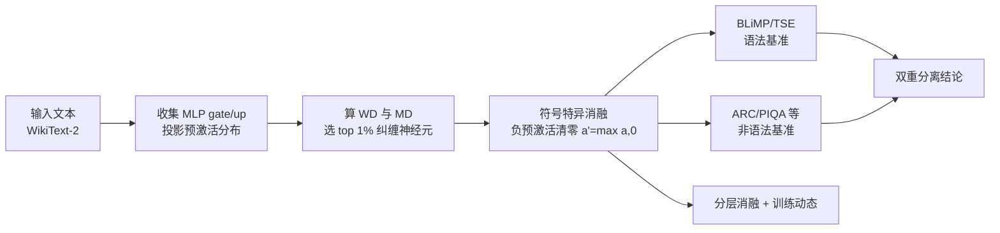

# Negative Pre-activations Differentiate Syntax

**会议**: ICLR 2026  
**OpenReview**: [https://openreview.net/forum?id=RzcCrU0tXP](https://openreview.net/forum?id=RzcCrU0tXP)  
**代码**: [https://github.com/Shavit-Lab/Negative-Differentiation](https://github.com/Shavit-Lab/Negative-Differentiation)  
**领域**: 可解释性 / 机制可解释性  
**关键词**: Wasserstein 神经元, 负预激活, 平滑激活函数, 句法处理, 因果消融, 双重分离  

## 一句话总结
本文发现：在使用 GELU/SiLU 等平滑激活的现代 LLM 中，一小撮"Wasserstein 神经元"专门利用**负预激活区**来区分句法，只把这 1% 神经元的负预激活清零就会大幅破坏语法能力，而对其它任务伤害很小，从而揭示长期被忽视的负区其实是句法计算的活跃载体。

## 研究背景与动机
**领域现状**：神经元级可解释性研究长期沿用 ReLU 时代的直觉——一个神经元"代表"什么，由让它产生**高正激活**的输入来定义，负值被默认为"失活、无信息"。这套启发式在识别概念神经元、语言选择性神经元、句法一致性神经元等工作中被广泛使用。

**现有痛点**：但现代 Transformer 几乎全面改用 GELU、SiLU 这类平滑激活函数。它们在零点附近梯度平滑、缓解"dying ReLU"，关键是**对小于零的输入同时输出非零值和非零梯度**——也就是说负预激活区原则上是可以参与计算的。然而几乎没人系统检验过：模型到底有没有在用这个负区？用来干什么?

**核心矛盾**：负预激活区"理论上可计算"与"实践中被当成惰性区"之间存在鸿沟。如果负区真的在被利用，那么大量基于"高正激活"的可解释性结论可能漏掉了一整块机制。

**本文目标**：定位并因果验证负预激活区是否被模型主动用于某种功能。

**核心 idea**：作者把目光锁定在 **Wasserstein 神经元**——一类预激活分布严重偏离高斯基线的稀疏子群（仅约 1%），它们能把局部相似的输入向量映射到相距很远的输出标量（即"纠缠/entangled"神经元）。**关键观察**：在非 ReLU 模型里，这些神经元的非高斯结构恰恰**集中在负预激活区**。于是作者提出用"符号特异的最小干预"——只把这些神经元的负预激活清零——来检验负区是不是句法的因果载体。

## 方法详解

### 整体框架
方法分三层递进：先在 MLP 块里**定位** Wasserstein 神经元并刻画其负区非高斯结构；再做**符号特异因果消融**（只清零负预激活），配合"困惑度匹配"对照组验证句法 vs 非句法能力的双重分离；最后通过**分层消融**和**训练动态**追踪效应的来源与演化。

### 关键设计
**1. Wasserstein 神经元的定位与度量：用 WD 当纠缠代理。** 作者在 GPT-2 式模型（Pythia，$y=W_{down}(\text{GELU}(W_{up}x))$）的 up 投影、以及 GLU 式模型（Llama 3.1 8B、Mistral 7B、Qwen3 8B，$y=W_{down}(\text{SiLU}(W_{gate}x)\odot(W_{up}x))$）的 gate 投影上收集每个神经元的输出标量分布 $\{y_i\}=\{w^\top x_i\}$，归一化到零均值单位方差后，计算它与单位高斯的 **Wasserstein 距离 (WD)**。同时定义**映射难度 (MD)**：随机取输入对 $x_i,x_j$，看归一化后的输出差 $\|y_i-y_j\|$ 相对输入差 $\|x_i-x_j\|$ 的比值均值，量化"把相似输入推开多远"。由于 WD 与 MD 强相关，作者用 WD 作为可计算的纠缠代理来筛选 top 1% 神经元，只在需要专门挑"被推远的输入对"时才用 MD。这一步还附带一个关键经验观察——这些神经元的非高斯质量在 GELU 模型里集中于负区，而 ReLU 模型（如 OPT）因为钳位作用，负区结构明显更弱，从而把分析合理地聚焦到负预激活这个"可处理子集"。

**2. 符号特异的最小因果干预：只动负区的符号。** 这是全文的核心实验杠杆。对属于 top $p\%$ WD 集合 $S$ 的神经元，作者只把它们的负预激活清零：$a'_k=\max(a_k,0)$ 当 $k\in S$，否则 $a'_k=a_k$，其中 $p$ 约为 1%。模型权重、其余神经元、非线性全部不变，唯一改动就是这一小撮神经元负区的取值。之所以叫"符号特异"，是因为附加对照（Section A.4）验证了起作用的是负预激活的**符号本身**而非单纯幅度——把负区抹平这件事破坏的是一种依赖负值的区分机制，而不是泛泛地削弱信号强度。这种干预之轻（仅 ≈1% 神经元、仅其负半边）与造成的功能损伤之重形成强烈反差，是因果论证的关键。

**3. 困惑度匹配对照：剥离"总体退化"这个混淆变量。** 单看"清零后困惑度暴涨"不足以证明针对的是句法，因为任何足够强的扰动都会涨困惑度。作者设计两组对照：一是随机选等量神经元做同样消融；二是**困惑度匹配对照**——对低 WD 神经元按底部 $m\%$ 排名消融，逐步增大 $m$ 直到 WikiText-2 困惑度涨幅与 top-WD 消融**持平**。这样两种干预造成的"全局退化程度"相当，差异只剩在"动了哪类神经元"。在困惑度被钉死相等的前提下，再去比 BLiMP/TSE（语法）和 ARC/PIQA 等（非语法）的表现，就能干净地分离出句法专属效应——这正是得出"双重分离"的方法学基石。

**4. 分层消融与训练动态：定位起源并验证因果时序。** 为追问效应来自哪、何时形成，作者把 Llama 3.1 8B 切成 8 组（每组 4 层连续层），分别做"单组扰动"和"累积扰动"（扰动到某组为止的所有层），观察误差随深度的累积；同时在 Pythia 的公开训练 checkpoint 上追踪固定那一批 top-1% WD 神经元的 WD 随训练的演化，并把同一个负区消融在不同 checkpoint 上重做。这两条线分别给出"早层主导 + 误差跨深度累积"和"随 Wasserstein 神经元涌现并稳定、同一消融越来越致命"的证据，把相关性升级为因果时序证据。

## 实验关键数据

### 主实验：符号特异消融的双重分离（Llama 3.1 8B 等三模型）

| 干预 | 扰动神经元 | 困惑度影响 | BLiMP/TSE 语法 | 非语法基准(8 项均值) |
|------|-----------|-----------|----------------|----------------------|
| **Top 1% WD（负区消融）** | 仅 ≈1% | Llama/Mistral 2% 扰动即翻倍，Qwen 约 5% | **大幅下降** | 仅约 +4% 误差（伤害小） |
| 随机对照 | 等量 1% | 涨幅很小 | 基本不变 | 无明显变化 |
| 困惑度匹配对照（低 WD） | Llama 35%/Mistral 50%/Qwen 20% | 与 top-1% 持平 | **基本不受损** | 约 +11% 误差（伤害大） |

→ 只动 1% 纠缠神经元负区造成的困惑度涨幅，需要扰动 35%–50% 的低纠缠神经元才能匹配，凸显其功能密度极高。

### 分层 / Token 级分析（Llama 3.1 8B）

| 维度 | 发现 |
|------|------|
| POS token 级（Fig.3d） | 超额 surprisal 集中于**句法支架词**：限定词、标点、助动词、虚词；而名词/动词/形容词/副词几乎不受影响 |
| 早层 vs 晚层（Fig.5） | 早层消融误差最大；TSE 中**否定极性词授权 (NPI)** 仅扰动前 4 层就 +20% 误差 |
| 累积消融 | 误差随深度**单调累积**，省略 (ellipsis)、主谓一致、限定词-名词一致、filler-gap 依赖最显著 |

### 训练动态（Pythia 70M–12B）

| 发现 | 数据 |
|------|------|
| 涌现迅速 | Wasserstein 神经元 WD 在前 25K 步（约 50B token）内急升 |
| 早专化晚稳定 | 早期权重变化大、随后进入巩固期（cosine 相异度） |
| 与句法能力同步 | 固定 cohort 的 WD 随训练与 TSE 准确率**强相关**；同一负区消融随这些神经元成熟而**越来越致命** |

### 关键发现
1. **双重分离成立**：1% 纠缠神经元负区 → 重伤语法、轻伤通用能力；大量低 WD 神经元负区 → 几乎不伤语法、重伤通用能力。
2. 句法损伤定位到**非局部依赖**结构（省略、主谓一致、NPI 授权），且锁定在句法支架词。
3. 起作用的是负预激活的**符号**而非幅度；按 MD 选神经元结果一致。

## 亮点与洞察
- **挑战 ReLU 时代遗留的"负区无用"教条**：把神经元解释从"高正激活定义功能"扩展到"负区也是活跃计算载体"，对整个机制可解释性方法论有警示意义。
- **方法极简却有力**：只清零 1% 神经元的负半边，配合困惑度匹配对照，干净地得到因果级双重分离，是"最小干预 + 对照设计"的范本。
- **从相关到因果的完整证据链**：定位→因果消融→分层定位→训练动态，逐级把"WD 与句法相关"推进到"负区因果必需于句法"。
- **跨模型族验证**：Pythia、Llama、Mistral、Qwen 一致，说明这是平滑激活 LLM 的共性机制而非单模型偶然。

## 局限与展望
- **机制层面仍是"黑箱中的灰箱"**：揭示了"负区被用于句法"，但这些纠缠神经元具体如何把相似输入推开、下游如何读取这套区分，尚未给出可解释的电路级描述。
- **ReLU 模型未深入**：论文指出 ReLU 模型负区结构较弱，但未系统验证那里句法靠什么承载，平滑 vs 非平滑的对比可进一步展开。
- **句法之外的负区功能**：双重分离表明通用能力分布在大量低 WD 神经元，但负区在非句法任务中的角色尚未细究。
- **干预为推理时钳位**：是否能据此做训练期正则或模型编辑（如增强/保护句法）是有吸引力的应用方向。

## 相关工作与启发
- **承接 Wasserstein/纠缠神经元工作**（Sawmya et al. 2025）：本文把"纠缠神经元对稀疏化敏感"的观察，落到"负区 + 句法"的具体功能解释上。
- **延伸 superposition 概念**：从"多特征共享一个神经元"扩展到互补情形——"一个神经元把相近输入分开"。
- **呼应句法探针文献**（Tenney 2019、Hewitt & Manning 2019）：早层主导句法的结论与探针研究一致，但这里是**因果消融**而非相关性探针。
- **启发**：对采用平滑激活的可解释性分析，应同时检查正负两半区；负区的符号结构可能藏着被忽视的语言学机制。

## 评分
- **新颖性**: ⭐⭐⭐⭐⭐ 直接挑战"负预激活无用"的长期默认假设，并锁定到句法这一具体功能，视角新颖且反直觉。
- **实验充分度**: ⭐⭐⭐⭐ 四个模型族 + 困惑度匹配对照 + 分层 + 训练动态 + token 级 POS，证据链完整；ReLU 侧与电路机制略浅。
- **写作质量**: ⭐⭐⭐⭐ 逻辑层层递进，双重分离论证清晰，图表组织得当。
- **价值**: ⭐⭐⭐⭐ 为机制可解释性提供方法论警示和可复现的因果干预范式，对理解 LLM 句法处理有实质贡献。

<!-- RELATED:START -->

## 相关论文

- [\[ICLR 2026\] Evolution of Concepts in Language Model Pre-Training](evolution_of_concepts_in_language_model_pre-training.md)
- [\[ICLR 2026\] LatentQA: Teaching LLMs to Decode Activations Into Natural Language](latentqa_teaching_llms_to_decode_activations_into_natural_language.md)
- [\[ICLR 2026\] Sparling: End-to-End Spatial Concept Learning via Extremely Sparse Activations](sparling_end-to-end_spatial_concept_learning_via_extremely_sparse_activations.md)
- [\[ACL 2026\] Similarity-Distance-Magnitude Activations](../../ACL2026/interpretability/similarity-distance-magnitude_activations.md)
- [\[ICLR 2026\] Learning to See Before Seeing: Demystifying LLM Visual Priors from Language Pre-training](learning_to_see_before_seeing_demystifying_llm_visual_priors_from_language_pre-t.md)

<!-- RELATED:END -->
