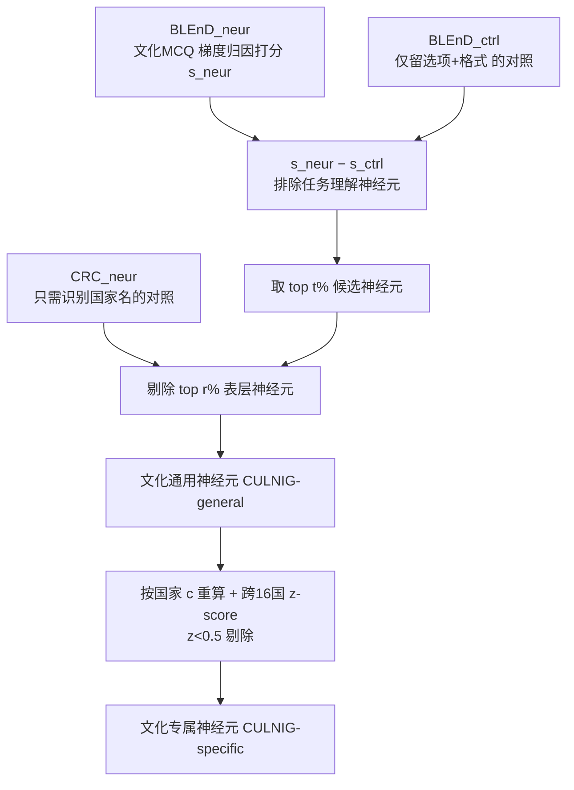

# Neuron-Level Analysis of Cultural Understanding in Large Language Models

**会议**: ICLR 2026  
**OpenReview**: [https://openreview.net/forum?id=HZMmM3Dmri](https://openreview.net/forum?id=HZMmM3Dmri)  
**代码**: [https://github.com/ynklab/CULNIG](https://github.com/ynklab/CULNIG)  
**领域**: 机制可解释性 / 神经元分析  
**关键词**: 文化理解, 神经元归因, 梯度归因, MLP 记忆, 文化偏见  

## 一句话总结
本文提出 CULNIG——一套基于梯度归因 + 双重对照过滤的神经元识别管线，在 LLM 中精准定位「文化通用神经元」和「文化专属神经元」，发现它们不到全部神经元的 1%、集中在浅到中层 MLP，且抑制它们会让文化基准掉最多 30% 而几乎不伤通用 NLU。

## 研究背景与动机
- **领域现状**：LLM 走向全球部署，但训练语料以英语为主，导致明显的文化偏见和对低资源文化的理解缺失。学界已建了一批文化基准（BLEnD、CulturalBench、NormAd、WorldValuesBench）来"量"这种缺陷，也有方法去"补"文化意识，但很少有人追问 LLM 内部到底"用什么"在做文化推理。
- **现有痛点**：少数尝试神经元级分析文化机制的工作（如 CAPE/LAPE）几乎都用**激活概率**来定位神经元，且主要把文化和"语言"绑在一起看。激活法有两个硬伤：(1) 只看正激活、把负激活裁成零，丢掉了一半信息；(2) 文化内容并不像语言那样均匀出现在每个 token 上，导致基于 token 激活的定位不够精准。
- **核心矛盾**：要解释"LLM 凭什么具备文化理解"，需要找到**真正驱动文化行为**的神经元，而不是那些只对"国家名 token"或"任务格式"做出反应的表层神经元——激活法很难把这三者区分开。
- **本文目标**：围绕三个研究问题展开——(i) 是否存在跨文化通用的"文化通用神经元"及其分布；(ii) 各文化的"文化专属神经元"差异、以及它们与文化亲缘关系的相关性；(iii) 这套分析能否落地到模型训练工程。
- **核心 idea**：**用梯度归因替代激活概率**，并叠加两层对照集过滤——一层减去"无内容只剩选项"的控制集来剥离任务理解神经元，另一层用专门构造的"读国家名"数据集来过滤只认国家名的表层神经元，从而把"文化理解"信号干净地提取出来。

## 方法详解

### 整体框架
CULNIG（CULture Neuron Identification pipeline with Gradient-based scoring）把神经元定位拆成"打分→减任务对照→减表层对照"三步：先用梯度归因给每个神经元在文化 MCQ 数据集 BLEnD 上打分，减去无内容控制集 BLEnD_ctrl 的得分以排除任务理解神经元，再剔除在自建的"读国家名"数据集 CRC 上得分高的表层神经元。识别对象分两类：跨文化共享的**文化通用神经元**（CULNIG-general）和绑定单一文化的**文化专属神经元**（CULNIG-specific，额外加一步跨 16 国 z-score 过滤）。

### 关键设计

**1. 梯度归因评分：把"删掉这个神经元会掉多少概率"一次算出来。** CULNIG 不看激活概率而看每个神经元对输出概率的**因果贡献**。对第 $l$ 层第 $k$ 个神经元，在 token 位置 $i$ 的归因分定义为 $s_{(l,k,i)}(x,y) = n_{(l,k,i)} \times \frac{\partial P(y|x)}{\partial n_{(l,k,i)}}$，再对 token 位置取最大值。这一形式本质上是把神经元归零的因果效应 $P(y|x,n=\bar u)-P(y|x,n=0)$ 做一阶泰勒展开的近似——直接做需要逐个神经元 mask 后重新前向、对百万级神经元计算量爆炸，而梯度法**单次前向反向就能拿到所有神经元的分**。数据集级聚合再按模型置信度加权 $s_{(l,k)}(D)=\sum_q P(y_q|x_q)\times s_{(l,k)}(x_q,y_q)$，让模型答得越自信的样本贡献越大。这一步同时覆盖 MLP 的 gate 投影神经元（key-value memory 视角下决定是否放行子值）和注意力的 query/key/value 神经元。

**2. 双重对照减法：把"任务理解"和"认国家名"两类噪声神经元剥掉。** 文化 MCQ 的高分神经元里混着两类无关者。第一类是负责"读懂题目格式/做选择题"的任务神经元，作者构造 **BLEnD_ctrl**——删掉题干只留选项和作答指令，用 $s_{(l,k)}(\text{BLEnD}_{neur}) - s_{(l,k)}(\text{BLEnD}_{ctrl})$ 做减法即可消掉它们。第二类更隐蔽：BLEnD 每题都显式含国家名，于是会混进"只对国家名 token 起反应"的表层神经元。作者用 ChatGPT 专门造了 **CountryRC (CRC)** 数据集——正确答案永远是上下文里出现过的国家名、但**完全不需要文化知识**（如"Matthew 去哪国实习？"靠阅读理解即可），凡在 CRC 上得分进 top $r\%$ 的神经元一律剔除。两步减法保证留下的是"真正用文化知识"的神经元。

**3. z-score 隔离文化专属神经元：跨 16 国比较，只留"偏科"的那批。** 对某国 $c$，先用 $c$ 的样本重算 $s_{(l,k,c)}=s(\text{BLEnD}^{(c)}_{neur})-s(\text{BLEnD}^{(c)}_{ctrl})$，再把每个神经元在 BLEnD 全部 16 国上的得分做标准化 $z^{(c)}=\frac{s_{(l,k,c)}-\mu}{\sigma}$，凡 $z^{(c)}<0.5$ 的神经元判为"对多种文化都贡献"而剔除。这一步让 CULNIG-specific 只保留对单一文化显著偏好的神经元，从而能后续验证"屏蔽某国神经元会同时拖垮其亲缘文化"。由于 z-score 过滤本身就能滤掉任务神经元，CULNIG-specific 不再像 general 那样分开设 MLP / 注意力阈值。

**4. 按神经元角色选训练模块：把可解释性发现变成工程旋钮。** 作者用"文化通用神经元数量"给模块排序，微调时只更新参数量约 10% 的一小撮：要么选含通用神经元最多的 top-culture 模块（多为浅到中层 MLP），要么选完全不含的 bottom-culture 模块（多为极浅/极深的注意力与 MLP）。在 QNLI/MRPC 上微调时，更新 top-culture 模块会让目标任务涨、却显著伤害文化基准；更新 bottom-culture 模块同样能涨目标任务、却几乎不动文化能力——给出了"既高效又稳健"的目标模块选择策略。

## 实验关键数据

模型：gemma-3-12b-it、gemma-3-27b-it、Qwen3-14B、Llama-3.1-8B-Instruct、phi-4、Falcon3-10B-Instruct。识别用 BLEnD_neur/ctrl + CRC_neur，评测用 BLEnD_test、CulturalBench、NormAd、WorldValuesBench（文化）+ CRC_test、CommonsenseQA、QNLI、MRPC（通用 NLU）。

### 主实验表格（屏蔽文化通用神经元 vs 随机神经元，节选）

| 模型 | 设置 | #神经元 | BLEnD_test | CultB | NormAd | WVB | ComQA | QNLI | MRPC |
|------|------|--------|-----------|-------|--------|-----|-------|------|------|
| gemma-3-12b-it | orig | 0 | 64.22 | 78.08 | 58.54 | 64.08 | 79.71 | 75.37 | 78.04 |
| | **cult** | 8,087 | **37.93** | **62.00** | **52.02** | 58.46 | 75.10 | 72.77 | 78.65 |
| | rand | 8,087 | 63.57 | 77.31 | 57.55 | 64.03 | 79.18 | 75.46 | 78.22 |
| Qwen3-14B | orig | 0 | 65.96 | 76.92 | 56.85 | 65.22 | 81.76 | 71.31 | 79.91 |
| | **cult** | 7,340 | **35.84** | **57.07** | **49.02** | 60.70 | 75.23 | 76.20 | 78.70 |
| Llama-3.1-8B | orig | 0 | 60.18 | 70.54 | 47.71 | 64.05 | 76.74 | 64.43 | 73.93 |
| | **cult** | 4,268 | **32.19** | **36.94** | **37.65** | 51.68 | 51.97 | 48.64 | 69.35 |
| Falcon3-10B | **cult** | 9,282 | 35.47 | 56.81 | 48.75 | 59.16 | 71.85 | 70.30 | 78.43 |

结论：屏蔽不到 1% 的文化通用神经元，BLEnD_test 最多掉约 30%、CultB/NormAd 同步显著下滑，而 QNLI/MRPC 基本不动（粗体为相对随机神经元的统计显著下降，bootstrap p<0.05）。

### 消融 / 分析

| 现象 | 关键发现 |
|------|---------|
| 模块角色（MLP vs 注意力） | 屏蔽 MLP 神经元对文化基准伤害大、对 QNLI/MRPC 几乎无影响；注意力影响较小 → 设 t_MLP=1%、t_attn=0.2% |
| 神经元分布 | 文化通用/专属神经元都集中在**浅到中层 MLP**，跨 6 个模型一致；与 CAPE 报告的"上层集中"相反（作者复现 CAPE 失败，LAPE/CAPE 神经元几乎无影响） |
| 文化专属神经元 | 屏蔽某国神经元，掉分最大的是该国本身；其次是**亲缘文化**（屏蔽墨西哥神经元，墨西哥掉分秩 1.17、西班牙秩 3.83） |
| 实例级分析 | 顶级文化通用神经元仅在 29% 样本上得正分 → 编码的是**知识级概念**而非元级控制信号；文化与价值观可共享同一批神经元 |
| 工程应用 | 微调 QNLI/MRPC 时更新 top-culture 模块会拖垮文化基准，更新 bottom-culture 模块则几乎无损 → 可据角色选目标模块 |

### 关键发现
1. 文化理解的"硬件载体"是**浅到中层 MLP 的不到 1% 神经元**，与"MLP 负责知识回忆、注意力负责上下文处理"的既有机制论一致。
2. 即便只用 food/work-life/sport 三类知识来识别神经元，这些神经元仍能**泛化**到未见知识域、不同任务格式、多语种乃至文化价值观（NormAd/WVB），说明它们捕获的是广义文化表示。
3. 文化专属神经元会**跨亲缘文化共享**，为"文化关系图谱"提供了机制层证据。
4. 微调若误伤富含文化通用神经元的模块，会让文化能力更易流失——可解释性发现可直接指导"训练时该更新哪些模块"。

## 亮点与洞察
- **方法论纠偏**：明确论证激活概率法在文化场景下的不适用（只看正激活 + 文化非每 token 出现），转向梯度归因，并用一阶泰勒展开把它和"逐神经元 mask 的因果效应"严格关联起来，理论与效率兼得。
- **双重对照集设计很巧**：BLEnD_ctrl 减任务理解、CRC 减"认国家名"——把"文化理解"从"做题能力"和"识别国家名"中干净剥离，是本文精度的关键来源。
- **从解释到工程的闭环**：不止"找到神经元"，还落地到"按神经元角色选微调模块"，给出了避免文化能力流失的实操旋钮，并指出可与知识编辑结合定向更新文化知识。
- **跨亲缘文化共享**的发现把神经元分析和文化地理/历史关系连起来，比单纯"哪些神经元重要"更有解释力。

## 局限与展望
- 与 CAPE 的分布结论冲突（上层 vs 浅中层）作者复现 CAPE 失败、仅给出假设（梯度 vs 激活、QA 准确率 vs 困惑度、多语三阶段处理），**未彻底厘清**。
- 工程实验只在 QNLI/MRPC 两个 NLU 任务上验证，"按模块角色训练"对更广泛 NLP 任务、知识编辑、注入新文化知识等只是设想，**实际落地留作未来工作**。
- 文化通用神经元识别只用了 BLEnD 的部分类别，虽展示了泛化，但"文化"的覆盖仍受限于现有基准的文化/国家集合（16 国 / 8 国）。
- 神经元被定位为"知识级概念"而非"元级控制信号"，意味着难以通过单点干预实现细粒度文化行为调控。

## 相关工作与启发
- **知识神经元谱系**：Dai et al. (2022) 的梯度归因知识神经元、Chen et al. (2025) 的 query-relevant 神经元、Yang et al. (2024) 的 bias 神经元（本文评分直接基于后者），本文把这条线推进到"文化"维度。
- **激活法对照组**：Tang et al. (2024)/Kojima et al. (2024) 的语言专属神经元（LAPE）、Namazifard & Galke (2025) 的 CAPE 文化神经元——本文是对它们的方法论与结论双重挑战。
- **MLP 即记忆**：Geva et al. (2021) 的 key-value memory 视角、Meng et al. (2022) 的 ROME，本文据此聚焦 gate 投影神经元并解释"为何文化知识落在 MLP"。
- **启发**：梯度归因 + 多重对照减法 是定位"某种抽象能力专属神经元"的通用范式，可迁移到价值观、人格、安全等其他高阶属性；"按神经元角色选微调模块"则给参数高效微调 / 防遗忘提供了新的模块选择准则。

## 评分
- **新颖性**: ⭐⭐⭐⭐ — 首次系统性用梯度归因 + 双重对照分离"文化通用 / 文化专属"神经元，并挑战主流激活法结论，方法论贡献扎实。
- **实验充分度**: ⭐⭐⭐⭐ — 覆盖 6 个 SOTA 开源模型、4 个文化 + 4 个 NLU 基准、统计显著性检验、跨语种与亲缘文化分析，外加工程应用验证，相当完整。
- **写作质量**: ⭐⭐⭐⭐ — 三个研究问题主线清晰，从机制发现到工程落地层层递进，图表（分布图、亲缘文化热图、实例散点）支撑有力。
- **价值**: ⭐⭐⭐⭐ — 既为"LLM 文化理解"提供了机制层证据，又给出训练/编辑的可操作指导，对文化对齐与负责任部署有实际意义。

<!-- RELATED:START -->

## 相关论文

- [\[ICLR 2026\] A Comprehensive Information-Decomposition Analysis of Large Vision-Language Models](a_comprehensive_information-decomposition_analysis_of_large_vision-language_mode.md)
- [\[ICLR 2026\] Emotions Where Art Thou: Understanding and Characterizing the Emotional Latent Space of Large Language Models](emotions_where_art_thou_understanding_and_characterizing_the_emotional_latent_sp.md)
- [\[ACL 2026\] DPN-LE: Dual Personality Neuron Localization and Editing for Large Language Models](../../ACL2026/interpretability/dpn-le_dual_personality_neuron_localization_and_editing_for_large_language_model.md)
- [\[ICLR 2026\] Medical Interpretability and Knowledge Maps of Large Language Models](medical_interpretability_and_knowledge_maps_of_large_language_models.md)
- [\[ACL 2026\] METER: Evaluating Multi-Level Contextual Causal Reasoning in Large Language Models](../../ACL2026/interpretability/meter_evaluating_multi-level_contextual_causal_reasoning_in_large_language_model.md)

<!-- RELATED:END -->
