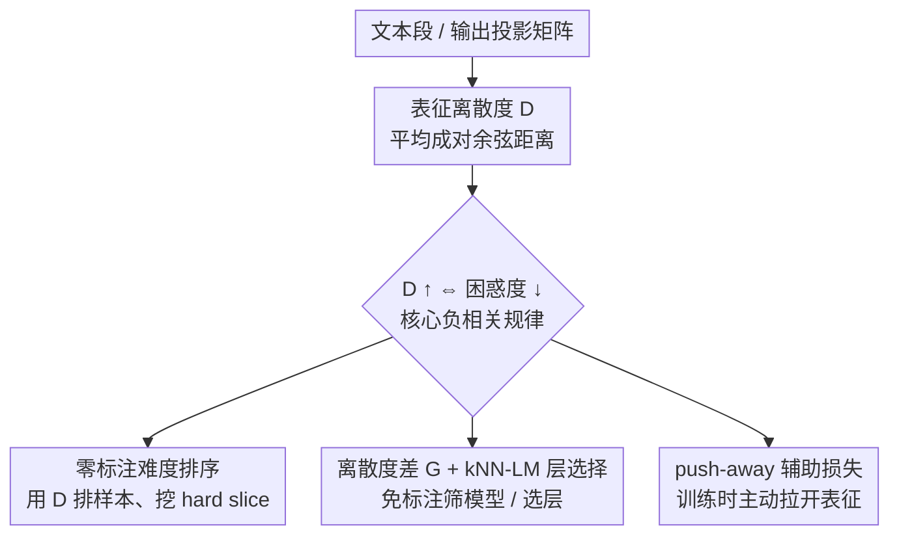

# On the Predictive Power of Representation Dispersion in Language Models

**会议**: ICLR 2026  
**OpenReview**: [https://openreview.net/forum?id=qvVrAMdK2F](https://openreview.net/forum?id=qvVrAMdK2F)  
**代码**: https://github.com/yanhong-lbh/rep_dispersion  
**领域**: 可解释性 / 表征几何分析  
**关键词**: 表征离散度, 嵌入几何, 困惑度, 零标注诊断, kNN-LM

## 一句话总结
本文发现语言模型隐状态的"铺得有多开"（平均成对余弦距离，称为表征离散度）与困惑度强负相关——越强的模型把上下文分得越散，并把这一简单几何量变成四种零标注的实用工具：样本难度排序、模型选择、kNN-LM 层选择，以及一个直接降困惑度的 push-away 训练损失。

## 研究背景与动机

**领域现状**：人们早就观察到 LLM 的嵌入几何存在各向异性（anisotropy）和秩坍缩（rank collapse）——隐状态挤在一个狭窄的锥体里、只占据低维子空间。这类几何分析一直被认为会限制模型表达能力。

**现有痛点**：但"嵌入几何"和"自回归文本预测能力"之间到底是什么关系，一直说不清楚。已有研究（如 Viswanathan et al., 2025）大多停留在描述层面——观察到 token 打乱后余弦相似度上升，却没有把几何性质变成可操作的指标。机制可解释性（mechanistic interpretability）则倾向于把模型拆成具体电路、归因头，需要逐组件分析，而且常常依赖标注数据或外部探针（probe）。

**核心矛盾**：实践者真正需要的是——在不花标注成本、不跑昂贵评测的前提下，提前判断"这个模型在这批数据上行不行""哪些样本会答错""哪一层最适合做检索 key"。现有几何分析给不出这种 actionable 的信号。

**本文目标**：找到一个既能**预测**又能**改进**模型质量、且**完全免标注**的内在几何量；并验证它能落地到难度评估、模型筛选、层选择、训练四类任务上。

**切入角度**：作者从一个直觉出发（论文 Figure 1）——弱模型把语义相近的上下文压成紧凑簇，强模型却把它们（哪怕语义相似）也拉得更开；更开的几何意味着潜空间里区分更清晰，于是下一 token 预测更尖锐（熵更低）。如果这个直觉成立，那么"嵌入铺开的程度"本身就该和困惑度挂钩。

**核心 idea**：用一个最朴素的统计量——隐向量的平均成对余弦距离（表征离散度 $D$）——去刻画"嵌入铺得有多开"，并证明它与困惑度强负相关，进而把它当成评估和训练的通用信号。

## 方法详解

### 整体框架

本文不是一个端到端模型，而是"一个核心几何量 + 一条核心规律 + 四个落地应用"的分析框架。核心几何量是表征离散度 $D$：从某一层（默认末层）取出 $N$ 段文本的隐向量，算它们两两之间的平均余弦距离。核心规律是：$D$ 越大、困惑度越低（在多个模型家族、多个领域上 Pearson $r$ 普遍落在 $-0.6 \sim -0.9$）。建立这条规律之后，作者把 $D$ 当成一把"免标注的尺子"，分别用到四个下游任务上——它们都只需读模型的隐状态或输出嵌入矩阵，不需要真值标签。

下面的框架图给出从指标到四类应用的流向，自上而下的顺序与「关键设计」的编号一致：

### 关键设计

**1. 表征离散度 D：把"嵌入铺得有多开"压成一个数，并证明它能预测困惑度**

针对"几何和预测能力说不清关系"这个痛点，作者给出一个极简指标。对任选的某一层，采样 $N$ 段文本得到隐向量 $E_i \in \mathbb{R}^d$，定义表征离散度为所有两两对的平均余弦距离：

$$D = \frac{1}{\binom{N}{2}} \sum_{1 \le i < j \le N} \left[1 - \frac{E_i \cdot E_j}{\lVert E_i \rVert \lVert E_j \rVert}\right].$$

$D$ 越大说明嵌入铺得越开。关键发现是：把 10 万段 512-token 文本按困惑度分箱，每箱算平均困惑度和平均 $D$，会看到强烈的负相关——困惑度低的样本嵌入更分散，困惑度高的样本嵌入更挤。这个趋势跨 LLaMA、Phi、Mistral、Qwen 多个家族，跨 Wikipedia、新闻、医学/科学摘要多个领域都成立（Pearson $r$ 约 $-0.62 \sim -0.92$），在 last-token 困惑度、不同上下文长度（16/64/128/256）上也复现。作者还补了两个细化观察：**层深效应**——负相关随层数加深而增强（浅层捕捉的是词法特征、几乎无相关，深层才显出预测性差异），而且这种结构只在预训练之后才出现，说明它是"学出来的"；**簇内扩张**——把共享同一 10-gram 续写的 100 条上下文当作语义簇，训练过程中簇内距离和簇间距离同时增大，说明强模型不是只把不相关样本推开，连高度相似的上下文也铺得更开。这就把"铺开几何 = 更好模型"从猜想坐实成全空间的普遍现象。

**2. 零标注难度排序：用 D 当难度计，免标签挖出模型会答错的 hard slice**

实践中常拿到一大批无标注 query，需要在投入标注/算力前判断"模型够不够准、哪些样本会错"。既然高 $D$ 跟踪低困惑度，作者假设 $D$ 同样能跟踪"答对/答错"。实验用一个受控设计验证：固定输入分布，按 0%–100%（每 10% 一档）调配正确/错误样本的比例，每档抽 100 条 query，取末层嵌入算平均成对余弦距离，10 个随机种子取均值。结果（ARC-Challenge、MMLU 等）显示准确率随 $D$ 单调上升——模型答对的切片几何明显比答错的切片更开。于是实践者可以把无标注数据按 $D$ 排序，只查"低离散度尾部"就能定位失败模式，或把继续训练集中到这些"难"query 上。作者强调它是相对难度的零标签指标、用于 slice 发现，而非绝对准确率的校准预测器。

**3. 离散度差 G 与 kNN-LM 层选择：两类免前向、免标注的"筛模型/选层"信号**

这一条把"选"这件事做了两个互补的版本。其一是**模型选择**：同一家族、同一 tokenizer 下要从一堆 checkpoint（指令微调、参数高效适配、蒸馏变体）里挑好的，逐个评测太贵。作者直接拿模型的输出投影矩阵的行（output token embeddings，不需要任何前向、任何输入数据）来算几何，定义离散度差：

$$G = \text{within}(\mathcal{T}) + \text{between}(\mathcal{T}, \bar{\mathcal{T}}),$$

其中 $\mathcal{T}$ 是领域相关 token 的小集合（如数学里的数字、代码里的 Python 关键字），$\bar{\mathcal{T}}$ 是日常通用 token；$\text{within}(\mathcal{T})$ 是领域 token 内部的平均成对距离，$\text{between}$ 是领域 token 与通用 token 之间的平均距离。$G$ 大意味着模型既能区分领域关键 token、又能把它们和日常词汇分开。它只需读输出嵌入矩阵、在 CPU 上做基础矩阵运算，却和任务准确率高度相关（Qwen on MATH 上 $G$ 与准确率的 Spearman 相关超过 0.95，能无误地把九个 checkpoint 全排对，最弱与最强变体差距可达 40 个准确率点）。其二是 **kNN-LM 层选择**：检索增强语言模型要用 Transformer block 里某个子层的隐状态当 datastore 的 key，到底用注意力子层 $h^{(L)}_{\text{att}}$ 还是前馈子层 $h^{(L)}_{\text{ffn}}$，过去要跑昂贵的端到端试验。作者发现注意力子层的离散度恒定高于前馈子层（GPT2-Large 上 0.80 vs 0.68，GPT2-Medium 上 0.66 vs 0.19），因此直接用离散度高的注意力子层当 key 就是更好的选择——而且只用约 5000 token、几毫秒就能估出离散度且不改变层排序。两者共享同一逻辑：哪里铺得更开，哪里就更适合做预测/检索，无需标注、无需跑完整管线。

**4. push-away 辅助损失：把"拉开表征"直接写进训练目标**

前三条都是"测量"用途，这一条反过来把规律当成训练信号——既然铺开几何对应低困惑度，那就主动鼓励它。作者在标准交叉熵之外加一个推开隐向量的辅助项。把一个 batch 内（跨 batch 和序列展平）的末层隐向量归一化为单位向量 $\tilde{h}_i = h_i / \lVert h_i \rVert$，单域设定下对所有对算平均余弦距离：

$$d_{\text{avg}} = \frac{1}{B(B-1)} \sum_{i \ne j} \left[1 - \tilde{h}_i \cdot \tilde{h}_j\right].$$

跨域设定（Wiki + Python 代码）下则只对来自不同域的对求距离，把两个域的嵌入推得更开：

$$d = \frac{1}{|A||B|} \sum_{i \in A} \sum_{j \in B} \left[1 - \tilde{h}^{(A)}_i \cdot \tilde{h}^{(B)}_j\right].$$

总损失为 $L_{\text{total}} = L_{\text{CE}} + \lambda L_{\text{aux}}$，其中 $L_{\text{aux}} = -d_{\text{avg}}$（单域）或 $-d$（跨域），加负号是因为要"最大化"距离、$\lambda$ 控制推开强度。效果上单域困惑度小幅下降（约 1–4 点，训练早期尤其明显），跨域则下降显著——因为把异质数据源的表征明确拉开，能学出更专门、更有区分度的特征。

### 损失函数 / 训练策略
训练侧只在标准 next-token 交叉熵上加一个权重为 $\lambda$ 的辅助"推开"项 $L_{\text{aux}}$（见关键设计 4），$\lambda$ 按验证集对每个学习率单独选取（实验取 $0.001 \sim 0.1$ 量级）。其余应用（难度排序、$G$ 模型选择、kNN-LM 层选择）都是推理/读权重阶段的零训练操作。

## 实验关键数据

### 主实验：核心负相关与下游应用

| 实验 | 设置 | 关键结果 |
|------|------|----------|
| 困惑度 vs 离散度 | LLaMA-3.2-3B/8B/1B，WikiText/新闻/医学 | Pearson $r \approx -0.62 \sim -0.92$，跨家族跨领域成立 |
| 难度排序 | ARC-Challenge / MMLU，LLaMA 1B/3B/8B | 准确率随平均成对距离单调上升 |
| 模型选择（$G$） | Qwen on MATH（9 个 checkpoint） | $G$ 与准确率 Spearman $>0.95$，零误排序；最弱→最强差约 40 点 |
| 训练轨迹 | Olmo-7B 30 个中间 checkpoint | 离散度跟踪性能提升，相关性 $>0.90$ |

### kNN-LM 层选择（离散度，N=10/50/100）

| 模型 | 注意力子层 $h_{\text{att}}$ | 前馈子层 $h_{\text{ffn}}$ |
|------|------|------|
| GPT2-Medium | 0.66 | 0.19 |
| GPT2-Large | 0.80 | 0.68 |
| DistilGPT2 | 0.83 | 0.30 |

注意力子层恒定铺得更开，故选它当 kNN-LM 的 key；N 从 10 增到 100 均值变化 $\le 1.5\%$，从不改变层排序。

### push-away 辅助损失（GPT2-small 测试困惑度）

| 设定 | 配置 | Step 500 | Step 1000 |
|------|------|----------|-----------|
| 单域 WikiText (LR=5e-4) | Base | 166.2 | 83.0 |
| 单域 WikiText (LR=5e-4) | +Aux ($\lambda$=0.1) | 165.6 | 82.0 |
| 跨域 Wiki/Code (LR=7e-4) | Base | 304.4 / 35.4 | 175.7 / 22.8 |
| 跨域 Wiki/Code (LR=7e-4) | +Aux ($\lambda$=0.01) | 255.2 / 31.9 | 150.2 / 20.8 |

### 关键发现
- **核心规律最稳**：离散度↔困惑度的负相关跨模型、跨领域、跨上下文长度全部复现，且随层深增强、只在预训练后出现，说明是模型学出来的结构。
- **簇内也在扩张**：连共享同一 10-gram 续写的高相似上下文，训练中距离也持续增大——铺开是全空间现象，不是只推开不相关样本。
- **G 几乎完美排序**：在 Qwen MATH 上离散度差 $G$ 无一错位地排对全部 checkpoint，且完全免前向、CPU 上即可算。
- **跨域增益最大**：push-away 损失在异质数据（Wiki+Code）上降困惑度远比单域明显，说明它最适合桥接多源数据。

## 亮点与洞察
- **一个朴素统计量统一了"诊断 + 训练"**：平均成对余弦距离这么简单的量，既能预测困惑度/准确率，又能反过来当训练信号降困惑度，难得地做到"既解释又改进"。
- **G 的极致省算**：模型选择不跑任何前向、不喂任何数据，只读输出投影矩阵做矩阵乘，就能在 CPU 上把同族 checkpoint 排出高质量序，对算力受限的筛选场景极实用。
- **层选择的免试验捷径**：用离散度差就能预判 kNN-LM 该取注意力子层而非前馈子层，省掉逐层端到端试验——这个"哪里铺得开就用哪里"的判据可迁移到其他检索增强方法。
- **几何视角是 component-agnostic 的可解释性**：不拆电路、不训练探针，用一个全局几何量就把内部结构和外部行为（困惑度、准确率）挂上钩。

## 局限与展望
- 作者承认这是相对难度/质量的指标，**不是绝对准确率的校准预测器**——只能在固定模型-数据对内部排序，跨模型绝对比较需谨慎。
- 模型选择和层选择都要求"同一家族、同一 tokenizer"，离散度的绝对值在不同 tokenizer/架构间不可直接比大小。
- push-away 在单域上的增益偏小（约 1–4 点），且 $\lambda$ 需按学习率逐一调；与已有对比/排斥损失（contrastive/repulsive）的关系作者放在附录讨论，主文未充分厘清边界。
- 实验以 GPT-2 家族和 LLaMA/Qwen 中小模型为主，更大规模模型上规律是否同样稳健、辅助损失是否仍有正收益，仍待验证。

## 相关工作与启发
- **vs 各向异性/秩坍缩研究（Ethayarajh 2019; Gao 2019; Li 2020）**：他们指出嵌入坍缩到狭窄锥体会损害表达力，但停在"几何坏"的定性判断；本文给出可量化、可操作的离散度，并把它和困惑度/准确率定量挂钩。
- **vs Viswanathan et al. (2025)**：同样分析 token 级嵌入分布、观察到 token 打乱后余弦相似度上升，但其工作主要是描述性的；本文进一步证明离散度能**预测并改进**困惑度与下游准确率，把几何洞察变成 actionable 工具。
- **vs 机制可解释性（Elhage 2021; Olsson 2022）**：他们逆向工程出具体电路/归因头，需逐组件分析；本文提供一个组件无关的高层几何量，更轻量。
- **vs 归因/探针方法（Integrated Gradients、probing）**：这些通常需要标注数据或外部探针；表征离散度是完全免标注的内在度量，直接把隐状态几何关联到模型自身的性能指标。

## 评分
- 新颖性: ⭐⭐⭐⭐ 把一个朴素几何统计量从"描述"推进到"预测 + 改进"，并落地四类任务，视角统一且实用。
- 实验充分度: ⭐⭐⭐⭐ 跨家族、跨领域、跨上下文长度全面验证核心规律，四个应用各有支撑；但模型规模偏中小、辅助损失单域增益有限。
- 写作质量: ⭐⭐⭐⭐ 主线清晰（指标→规律→四应用），公式与图表配合到位。
- 价值: ⭐⭐⭐⭐ 免标注、免前向的诊断/筛选工具对实践者很有吸引力，判据可迁移到检索增强等场景。

<!-- RELATED:START -->

## 相关论文

- [\[ICLR 2026\] ZeroTuning: Unlocking the Initial Token's Power to Enhance Large Language Models Without Training](zerotuning_unlocking_the_initial_tokens_power_to_enhance_large_language_models_w.md)
- [\[ICLR 2026\] MICLIP: Learning to Interpret Representation in Vision Models](miclip_learning_to_interpret_representation_in_vision_models.md)
- [\[ICML 2026\] DLLM-JEPA: Joint Embedding Predictive Architectures for Masked Diffusion Language Models](../../ICML2026/interpretability/dllm-jepa_joint_embedding_predictive_architectures_for_masked_diffusion_language.md)
- [\[ICLR 2026\] The Deleuzian Representation Hypothesis](the_deleuzian_representation_hypothesis.md)
- [\[ICLR 2026\] Gauge-invariant Representation Holonomy](gauge-invariant_representation_holonomy.md)

<!-- RELATED:END -->
