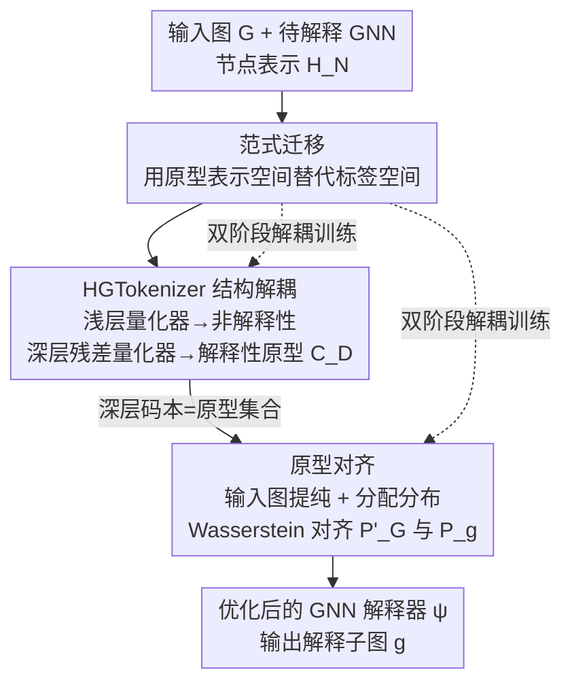

# Paradigm Shift of GNN Explainer from Label Space to Prototypical Representation Space

**会议**: ICLR 2026  
**OpenReview**: [https://openreview.net/forum?id=X7eYISNf01](https://openreview.net/forum?id=X7eYISNf01)  
**代码**: https://github.com/Esperanto-mega/IDEA  
**领域**: 可解释AI / 图神经网络 / 图表示学习  
**关键词**: GNN 解释器, 原型表示空间, 结构解耦, 向量量化, Wasserstein 距离

## 一句话总结
针对后验实例级 GNN 解释器长期在「图标签空间」对齐导致结构信息利用不足的问题，IDEA 首次把解释器优化从标签空间迁移到「原型表示空间」，用层次化图 tokenizer 解耦出解释性子结构、再用 Wasserstein 距离对齐输入图与解释子图的原型分配分布，平均把 ROC-AUC 提升 4.45%、precision 提升 48.71%，并能即插即用地增强多种现有解释器。

## 研究背景与动机
**领域现状**：后验实例级 GNN 解释器（post-hoc instance-level explainer）的任务是：给定一个已训练好的、需要被解释的 GNN 模型 $f(\cdot)$ 和一张输入图 $G$，找出一个紧凑的解释子图 $g^*=\psi(G,f)\subset G$，让它保留对 GNN 预测最关键的成分。从 GNNExplainer、PGExplainer 到 ProxyExplainer，绝大多数方法都建立在「标签保持框架」（label preserving framework）上。

**现有痛点**：标签保持框架的优化信号来自**图标签空间**——它通过最大化输入图预测与解释子图预测之间的互信息 $\mathrm{MI}(f(g),f(G))$ 来训练解释器，本质是让两者预测同一个标签。但离散的图标签表达能力太弱，描述不了图的拓扑结构特征。在分子属性预测这类复杂图域里，**多个截然不同的子结构可以对应同一个标签**，标签空间根本无法区分谁才是真正起作用的子结构，于是解释器在优化时拿不到足够的结构信息。

**核心矛盾**：要充分利用结构信息，自然想到把优化搬到连续的**图表示空间**——连续表示能提供拓扑结构的细粒度刻画。但最直接的实现（Direct-Align：直接对齐输入图和解释子图的 GNN 编码表示）会撞上两个硬障碍。其一是**解释性与非解释性子结构的纠缠**：由于消息传递机制，输入图的 GNN 编码表示不可避免地把解释性与非解释性子结构混在一起，直接对齐会把解释器误导到非解释性子结构上。其二是**分布偏移**：解释子图是输入图结构上的缩减版本，它的表示在 GNN 编码空间里天然服从一个偏移的分布，机械地拉近二者表示反而会掩盖最关键的子图。

**本文目标**：在把优化迁移到表示空间的同时，分别破解「纠缠」和「分布偏移」两道难题。

**核心 idea**：用「原型表示空间」（prototypical representation space）替代「图标签空间」作为解释器的优化场所——先把解释性子结构从纠缠中解耦并凝练成一组原型，再让输入图与解释子图都用「在原型上的分配分布」来表示并对齐，从而绕开 GNN 编码空间里的分布偏移。

## 方法详解

### 整体框架
IDEA 是一个**双阶段**、且能泛化到各类现有解释器骨干的通用优化框架，整条管线围绕一个「层次化图 tokenizer」（HGTokenizer）展开。第一阶段**结构信息解耦**：把目标 GNN 编码出的节点表示 $H_N$ 喂给 HGTokenizer，用一个结构感知的解耦目标（SAD）把它劈成「非解释性」和「解释性」两部分，其中解释性部分被聚类进一组离散码本（原型），从而构造出原型表示空间。第二阶段**解释原型对齐**：拿着第一阶段学到的量化器和原型，先把输入图表示用浅层量化器「提纯」掉非解释性成分，再把提纯后的输入图表示和解释子图表示都隐式投影到原型空间、用各自在原型上的分配分布来表达，最后用 Wasserstein 距离对齐两个分布来优化解释器 $\psi$。两个阶段刻意分开训练，避免两套损失互相抵消。

### 关键设计

**1. 范式迁移：把解释器优化从标签空间搬到原型表示空间**

这是全文的立论根基，针对的就是「标签空间表达力不足」这个痛点。作者论证：连续的图表示比离散标签能提供更细粒度的拓扑描述，所以应当在表示空间里给解释器提供优化信号。但他们没有止步于朴素的「直接对齐 GNN 编码表示」（即 Direct-Align），因为那会同时踩中纠缠与分布偏移两个坑；而是更进一步，主张在一个由**解释性原型**张成的子空间里做对齐。原型空间的好处是双重的：原型本身只编码解释性信息（解决纠缠），且输入图与解释子图都用「到原型的分配分布」来表示、度量方式完全一致（解决分布偏移）。实验侧 Direct-Align 拿到了次优梯队的成绩，既验证了「迁到表示空间」方向的潜力，也反衬出必须在原型空间里精细化才能登顶。

**2. HGTokenizer 结构解耦：用级联残差量化把解释性子结构剥离成原型**

它要解的是「解释性与非解释性子结构纠缠」这道题。HGTokenizer 借鉴语义 tokenization，由两个**级联的图量化器**组成：浅层量化器 $\mathrm{GQ}_S$ 先对节点表示 $h_i$ 在码本 $C_S$ 中找最近码字 $q^*_{S,i}=\arg\min_{q\in C_S}D(h_i,q)$，深层量化器 $\mathrm{GQ}_D$ 接住残差 $h'_i=h_i-q^*_{S,i}$ 再量化，合成 $q^*_i=q^*_{S,i}+q^*_{D,i}$。由于码本规模 $K$ 远小于节点数，码本天然成为一组「原型」。真正让两个量化器分别捕获非解释性/解释性子结构的，是 SAD 目标里的**解耦项** $L_D=\mathrm{KL}(\hat{y}_S\,\|\,U_C)+\mathrm{CrossEntropy}(\hat{y}_D,\hat{y})$：第一项把浅层量化表示的预测 $\hat{y}_S$ 推向均匀分布 $U_C$，逼它去装那些「决定不了 GNN 决策」的非解释性结构；第二项让深层量化表示的预测 $\hat{y}_D$ 贴合原始预测 $\hat{y}$，逼它装下真正有影响力的解释性结构。配套的**结构感知项** $L_S=\|A-\sigma(Q^*Q^{*T})\|_2^2+\|X-f_d(Q^*)\|_2^2$ 要求量化表示能重建邻接矩阵和节点特征，保证原型确实抓住了拓扑结构；再加标准向量量化项 $L_Q=\|H_N-Q^*\|_2^2$，合成 $L_{SAD}=L_D+\lambda_S L_S+\lambda_Q L_Q$。最终深层码本 $C_D$ 就成了一组**解释性原型**，自然诱导出后续要用的原型表示空间。

**3. 原型对齐：用分配分布 + 对称 Wasserstein 绕开分布偏移**

这一步落地「在原型空间里对齐」的想法，专治 GNN 编码空间里解释子图的分布偏移。给定输入图表示 $H_G$，先用浅层量化器把非解释性成分 $H_{S,G}=\mathrm{GQ}_S(H_G)$ 减掉，得到**提纯后的输入图表示** $H'_G=H_G-H_{S,G}$；解释子图表示 $H_g$ 则直接进深层量化器。关键在于不做显式投影，而是用「到解释性码本 $C_D$ 的分配分布」来隐式统一二者：$P'_G=\mathrm{Norm}(D(H'_G,C_D))$、$P_g=\mathrm{Norm}(D(H_g,C_D))$。因为两个分布是在同一套原型上、用同一种度量算出来的，解释子图的分布偏移就被巧妙绕过了。对齐目标采用**熵正则化 Wasserstein 距离**，并取对称变体 $L_{IDEA}=W_\epsilon(P'_G,P_g)+\tfrac12\big(W_\epsilon(P'_G,P'_G)+W_\epsilon(P_g,P_g)\big)$ 以稳定训练，其中 $W_\epsilon$ 在传输多面体 $\Pi(P'_G,P_g)$ 上最小化 $\sum_{i,j}\gamma_{ij}S_{ij}+\epsilon\sum_{i,j}\gamma_{ij}\log\gamma_{ij}$，代价矩阵 $S_{ij}=(P'_{G,i}-P_{g,j})^2$。选 Wasserstein 而非 KL，是因为它对概率分布的稀疏问题不敏感、更适合原型空间这种稀疏分配场景——消融里 IDEA 也确实稳定优于换成 KL 的 IDEA-KL。

**4. 双阶段解耦训练：避免两套优化目标互相抵消**

IDEA 把结构信息解耦（优化 $L_{SAD}$）和原型对齐（优化 $L_{IDEA}$）拆成先后两个阶段，而不是放在一起联合训。动机很具体：$L_{SAD}$ 在塑造原型空间、$L_{IDEA}$ 在用这个空间训解释器，两套目标若同时反传容易相互掣肘。先把原型空间学稳、再在其上对齐解释器，才能让第二阶段拿到一个干净、固定的优化场所。附录里作者也给出了两阶段联合训练的变体作为对照。

### 损失函数 / 训练策略
- 第一阶段：$L_{SAD}=L_D+\lambda_S L_S+\lambda_Q L_Q$，优化 HGTokenizer 与其码本（$\lambda_S,\lambda_Q$ 为权重，附录有敏感性分析）。
- 第二阶段：冻结量化器/原型，用对称熵正则 Wasserstein 损失 $L_{IDEA}$ 优化解释器 $\psi$（采用社区常用的概率型子图生成器作骨干）。
- 可选融合：$L_{Mix}=\alpha L_{IDEA}+(1-\alpha)L_\psi$，把原型对齐与标签保持目标做凸组合，但其收益依数据集而定。

## 实验关键数据

### 主实验
五个数据集（Mutagenicity、Benzene、Alkane-Carbonyl、Fluoride-Carbonyl、BA-2Motifs），目标模型为 3 层 GCN，把解释评估重述为边二分类、以 ROC-AUC 为主指标。

| 指标 | 数据集 | IDEA | 最优基线 | 提升 |
|------|--------|------|----------|------|
| ROC-AUC | 平均 | **0.8856** | 0.8479 (ProxyExplainer) | +4.45% |
| ROC-AUC | Mutagenicity | **0.7379** | 0.7016 (PGExplainer) | +5.17% |
| ROC-AUC | BA-2Motifs | **0.9541** | 0.8717 (ProxyExplainer) | +9.45% |
| Precision | 平均 | **0.6022** | 0.4050 (ProxyExplainer) | +48.71% |
| Precision | Alkane | **0.4565** | 0.3261 (ProxyExplainer) | +39.99% |

Direct-Align（朴素的表示空间直接对齐）平均 ROC-AUC 0.7116，稳居次优梯队但明显落后顶级解释器，印证「迁到表示空间有潜力，但必须精细化」。

### 泛化性实验（即插即用增强不同解释器骨干）

| 解释器骨干 | 原始平均 ROC-AUC | +IDEA | 提升 |
|------------|------------------|-------|------|
| PGExplainer | 0.8000 | 0.8856 | +10.70% |
| ReFine | 0.6912 | 0.7538 | +9.05% |
| ProxyExplainer | 0.8479 | 0.8690 | +2.48% |
| V-InFoR | 0.6683 | 0.6696 | +1.38% |

IDEA-增强的 PGExplainer 平均分（0.8856）甚至略超当前最强基线 ProxyExplainer。唯一退化出现在 V-InFoR @ Mutagenicity（-5.61%），作者归因于 V-InFoR 专为结构受损图设计、而评测图未受损。

### 消融实验

| 配置 | 关键指标 | 说明 |
|------|---------|------|
| IDEA (Full) | 最优 | 解耦 + 原型对齐 + Wasserstein |
| IDEA-KL | -3.33% (平均) | 把 Wasserstein 换成 KL 散度 |
| EA | 比 Full 平均低 0.0682 | 去掉结构信息解耦阶段 |
| ID-MSE / ID-InfoNCE | 显著更差 | 直接对齐 $H'_G$ 与 $H_g$（不统一到原型空间） |

### 关键发现
- **分布偏移是主要瓶颈**：把表示统一到原型空间的 IDEA / IDEA-KL 大幅领先直接对齐表示的 ID-MSE / ID-InfoNCE，证明「绕开解释子图分布偏移」贡献最大。
- **结构解耦确有增益**：EA（去掉解耦阶段）虽是强竞争者，但平均仍比完整 IDEA 低 0.0682。
- **Wasserstein 优于 KL**：在原型空间这种稀疏分配场景下，Wasserstein 对稀疏不敏感的特性带来稳定 3.33% 的优势。
- **标签保持目标的融合是双刃剑**：Mutagenicity 上 $\alpha=0.3$ 的混合优于两者，但 Benzene/Alkane/Fluoride 上混合反而不如单用任一目标，说明两目标可能互相抵消。

## 亮点与洞察
- **「换优化空间」而非「换网络结构」**：本文最 aha 的点是把解释器性能的瓶颈定位到「优化信号所在的空间」，而不是解释器骨干本身——所以它能以即插即用的方式增强 PGExplainer/ReFine/ProxyExplainer 等已有架构，这种正交性很难得。
- **用残差量化做「解耦」很巧**：浅层量化器装非解释性、深层残差量化器装解释性，再配 KL→均匀分布 / CE→原始预测 的双向监督，把「谁决定预测」这件事直接编码进码本，比软掩码式的重要性打分更结构化。
- **「分配分布」当统一表示**：不显式投影、而用「到原型码本的分配分布」隐式统一两个图，是绕过分布偏移的关键 trick，可迁移到任何需要对齐「整体 vs 子结构」表示的任务（如子图检索、motif 挖掘）。

## 局限与展望
- **作者承认**：与标签保持目标的融合收益强依赖数据集，多数数据集上混合反而更差，说明两套优化目标的兼容性尚未理清。
- **泛化性有边界**：对专为受损图设计的 V-InFoR，IDEA 在干净图上几乎无增益甚至退化，提示原型空间的收益依赖骨干假设与数据分布的匹配。
- **评测规模偏小**：仅 5 个（且偏分子/合成）数据集、单一 3 层 GCN 目标模型，缺少更大图、异质图、节点分类等场景的验证。
- **超参与码本依赖**：码本规模 $K$、$\lambda_S/\lambda_Q$、Wasserstein 熵正则 $\epsilon$ 均需调，原型质量对码本大小敏感（附录有曲线），实际部署成本待评估。

## 相关工作与启发
- **vs 标签保持框架（GNNExplainer / PGExplainer / MixupExplainer）**：它们在图标签空间对齐预测，受限于标签对拓扑结构的弱表达；IDEA 改在原型表示空间对齐分配分布，能利用细粒度结构信息。
- **vs Direct-Align（表示空间直接对齐）**：二者都跳出标签空间，但 Direct-Align 直接拉近 GNN 编码表示，被纠缠和分布偏移拖累只能拿次优；IDEA 通过解耦 + 原型分配化解了这两个障碍。
- **vs ProxyExplainer / V-InFoR（用 VGAE 抗分布偏移/抗损坏）**：它们靠代理生成器或变分自编码器在编码空间里硬抗偏移；IDEA 换思路，用「同一原型上的分配分布」让偏移从度量上消失，且能反过来增强 ProxyExplainer 本身。

## 评分
- 新颖性: ⭐⭐⭐⭐⭐ 首次把 GNN 解释器优化从标签空间迁到原型表示空间，视角切换干净有力
- 实验充分度: ⭐⭐⭐⭐ 主实验 + 泛化 + 消融齐全且增益显著，但数据集规模与目标模型多样性偏弱
- 写作质量: ⭐⭐⭐⭐ 动机推导（标签弱→直接对齐两难→原型空间）逻辑清晰，图示到位
- 价值: ⭐⭐⭐⭐⭐ 即插即用增强现有解释器，对可解释 GNN 社区有方法论级别的启发

<!-- RELATED:START -->

## 相关论文

- [\[ICLR 2026\] The Geometry of Reasoning: Flowing Logics in Representation Space](the_geometry_of_reasoning_flowing_logics_in_representation_space.md)
- [\[ICLR 2026\] Decomposing Representation Space into Interpretable Subspaces with Unsupervised Learning](decomposing_representation_space_into_interpretable_subspaces_with_unsupervised_.md)
- [\[ICLR 2026\] Domain Expansion: A Latent Space Construction Framework for Multi-Task Learning](domain_expansion_a_latent_space_construction_framework_for_multi-task_learning.md)
- [\[ICLR 2026\] Emotions Where Art Thou: Understanding and Characterizing the Emotional Latent Space of Large Language Models](emotions_where_art_thou_understanding_and_characterizing_the_emotional_latent_sp.md)
- [\[ICLR 2026\] TimeSeg: An Information-Theoretic Segment-Wise Explainer for Time-Series Predictions](timeseg_an_information-theoretic_segment-wise_explainer_for_time-series_predicti.md)

<!-- RELATED:END -->
