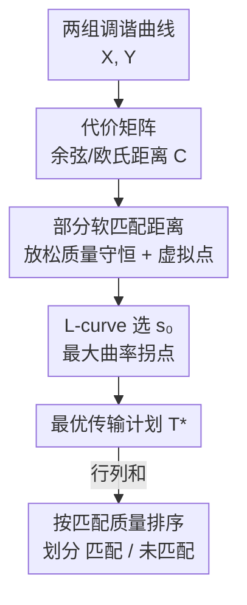

# Partial Soft-Matching Distance for Neural Representational Comparison with Partial Unit Correspondence

**会议**: ICLR 2026  
**OpenReview**: [https://openreview.net/forum?id=peMOI4RjmJ](https://openreview.net/forum?id=peMOI4RjmJ)  
**代码**: https://github.com/NeuroML-Lab/partial-metric/  
**领域**: 表示相似性 / 可解释性  
**关键词**: 表示相似性, 最优传输, 部分匹配, 神经元对应, fMRI

## 一句话总结
本文把"软匹配距离"(soft-matching distance)推广到**部分最优传输**，允许一部分神经元不被匹配，从而在含噪声/无对应单元的神经群体之间找到鲁棒的单神经元级对应，并用 L-curve 启发式自动选出该匹配多少质量；在仿真、fMRI 跨被试对齐与深度网络神经元排序上都明显优于强行全匹配的标准软匹配。

## 研究背景与动机
**领域现状**：要理解不同系统（不同架构/训练目标的网络，或不同被试的大脑）是否收敛到相似的计算解，需要比较它们的神经表示。主流相似性度量——CKA、RSA、Procrustes 距离、CCA——大多是**旋转不变**的：它们衡量几何相似度，却忽略信息沿哪些坐标轴编码，因此无法回答"某个神经元在另一个网络里有没有功能上对应的神经元"这种单元级问题。

**现有痛点**：Khosla & Williams (2024) 提出的**软匹配距离**用离散最优传输（OT）在保持神经元顺序无关的同时找到旋转敏感的对应，弥补了上面的缺口。但它继承了经典 OT 的硬约束——**两个群体的总质量必须相等且全部被搬运**，即所有单元都必须被匹配。

**核心矛盾**：真实神经群体里大量单元是噪声的、失活的或任务无关的（fMRI/电生理尤甚），即便是任务相关单元也可能是某个架构/训练 regime 独有的。强行把这些"没有对应物"的单元也配对，会制造**虚假对应**，抬高传输代价、污染整体距离，最终给出误导性的对齐结论。

**本文目标**：在不要求两群体单元完全重叠的前提下，给出一个能（1）忽略无对应单元、（2）只在真正可匹配的子群体上度量相似性、（3）还能按对齐质量给单元排序的比较工具。

**切入角度**：作者注意到"部分最优传输"(partial OT)恰好放松了 OT 的质量守恒——只要求搬运总质量的一个比例 $s\in[0,1]$。把软匹配嵌进 partial OT 框架，就能让一部分质量"留在原地"不被匹配。

**核心 idea**：用 **partial OT 取代经典 OT**，把行列边际从等式约束放松成不等式约束、再用一个标量 $s$ 控制总匹配质量，从而让噪声/无对应单元自然地不参与匹配。

## 方法详解

### 整体框架
方法的输入是两组神经群体的"调谐曲线"(tuning curve)：每个单元对 $M$ 个探测刺激的响应向量，分别堆成矩阵 $X\in\mathbb{R}^{M\times N_x}$、$Y\in\mathbb{R}^{M\times N_y}$。输出是一个**部分传输计划** $T^\*$，它给出哪些单元一一对应、对应强度多少、哪些单元根本没被匹配。整条流程是：先把单元两两之间的距离算成代价矩阵 → 在 partial OT 可行域上求最小代价的传输计划（允许丢弃质量）→ 扫描匹配比例 $s$ 并用 L-curve 自动选出"拐点"对应的 $s_0$ → 从最终传输计划的行列和读出每个单元的匹配程度，把群体划分为"匹配/未匹配"。

### 关键设计

**1. 部分软匹配距离：放松质量守恒，让噪声单元留在原地不被匹配**

标准软匹配把传输计划约束在传输多面体里——每行恰好等于 $1/N_x$、每列恰好等于 $1/N_y$，逼着所有单元全配对。本文把这两组**等式边际改成不等式**，并额外引入一个标量 $s$ 控制被搬运的总质量，得到可行集
$$\mathcal{T}^s(N_x,N_y)=\Big\{T\in\mathbb{R}_+^{N_x\times N_y}\ \big|\ \textstyle\sum_j T_{ij}\le \tfrac{1}{N_x},\ \sum_i T_{ij}\le \tfrac{1}{N_y},\ \sum_{i,j}T_{ij}=s\Big\}.$$
部分软匹配距离即 $d_T(X,Y)=\min_{T\in\mathcal{T}^s}\langle C,T\rangle_F$，代价矩阵默认用成对余弦距离 $C_{ij}$。由于群体被归一化成单位总质量，$s$ 直接就是"实际被匹配单元的比例"。不等式边际允许任一群体里的质量保留为未匹配，这样噪声/无对应单元就不会被强塞进某个配对，传输代价只反映真正的信号对应。求解上，作者沿用 Chapel et al. (2020) 的做法——给代价矩阵增广若干**虚拟点(dummy points)**并赋予很高的传输代价，所有被路由到虚拟点的质量等价于被丢弃，从而在增广问题里得到精确的部分匹配解。代价是放松质量守恒后该距离不再满足三角不等式，因此严格说它是一个对称的"相异度"而非真正的度量。

**2. L-curve 启发式：在不知道噪声量级时自动选出该匹配多少质量**

$s$ 是关键超参，但现实中离群点比例和噪声幅度事先未知，无法手工调。作者借用病态反问题里的 **L-curve** 思想（类比 Tikhonov 正则化），把"传输代价"与"正则强度"画成一条参数曲线：
$$f(s)=(\lambda(s),\eta(s)),\quad \lambda(s)=\langle T(s),C\rangle_F,\quad \eta(s)=1-s.$$
这里 $\eta(s)$ 越大（$s$ 越小）意味着允许越多质量保持未匹配。把 $s$ 在 $[0,1]$ 上均匀采样得到代价序列 $\lambda_i$，用中心二阶差分近似曲率
$$\Delta^2\lambda_i=\lambda_{i+1}-2\lambda_i+\lambda_{i-1},$$
取 $|\Delta^2\lambda_i|$ 最大的位置作为"拐点"，对应的 $s_0$ 就是最优正则强度。这个拐点直观上平衡了"低传输代价"与"激进丢弃"——在仿真里（X 100 信号 + 20 噪声、Y 90 信号 + 100 噪声）它精准选出 $s_0=90/190\approx0.47$，恰好把噪声单元剔除、只留信号对应。

**3. 相关性视角 + 单次优化排序：把昂贵的暴力消融换成一次 O(n³ log n) 计算**

当两群调谐曲线被去均值并缩放到单位范数后，内积 $x_i^\top y_j$ 就等于神经元 $i,j$ 的 Pearson 相关，于是优化可改写成**最大化总匹配相关**
$$d_{\text{corr}}(X,Y)=\max_{T\in\mathcal{T}^s(N_x,N_y)}\sum_{ij}T_{ij}\,x_i^\top y_j,$$
即在耦合 $T$ 下配对神经元的平均相关，全文报告的就是这个 $d_{\text{corr}}$。更重要的是它带来排序上的效率红利：要拿到"对齐质量"的金标准排序，暴力法需要逐个移除神经元、每次都重算整套软匹配优化（单次 $O(n^3\log n)$，总共 $O(n^4\log n)$，对真实规模不可行）；而对实践中真正关心的"挑出对齐最好/最差的前 X%"这类任务，只需在合适的 $s$ 下做**一次** partial OT（$O(n^3\log n)$），从传输计划的行列和（行和 $\in[0,1/N_x]$、列和 $\in[0,1/N_y]$，近零者即未匹配）直接读出每个单元的参与度，就能得到与暴力排序几乎一致的结果。相比之下，仅用单次软匹配传输计划算成对相关来近似排序（correlation-based ordering）会灾难性失败，因为单个相关值无法刻画传输问题的全局优化结构。

## 实验关键数据

### 主实验
论文以"模型选择"和"跨被试体素对齐"为核心验证。在合成模型选择任务里，参考群体 $X$ 有 100 个单元，$Y_a$ 含 $X$ 全部 100 个信号单元 + 60 噪声单元，$Y_b$ 只含 100 个单元里 80 个与 $X$ 匹配——正确答案应判 $Y_a$ 更接近 $X$。

| 方法 | $\text{score}(X,Y_a)$ | $\text{score}(X,Y_b)$ | 是否选对 |
|------|------|------|------|
| 标准软匹配 (SM) | 0.339 | 0.415 | ❌ 错选 $Y_b$（被噪声强匹配误导）|
| 部分软匹配 (本文) | 0.715 | 0.645 | ✅ 正确选 $Y_a$ |

在 NSD fMRI 数据（被试 1、2，六个视觉区 V1v/V1d/V2v/V2d/V3v/V3d）上，比较跨被试体素对齐的**精度**（被匹配体素中真正属于对应区域的比例，越高越好）：

| 区域对 | 标准软匹配 SM | 部分软匹配 ParSM | 噪声天花板阈值 $\varrho=0.3$ |
|--------|------|------|------|
| V1d + V2v | 0.881 | **0.971** | 0.906 |
| V2d + V3v | 0.833 | **0.971** | 0.863 |
| V1v + V1d | 0.839 | **0.905** | 0.855 |
| V1d + V3d | 0.803 | **0.878** | 0.828 |

ParSM 在几乎所有区域对上精度都更高，部分跨区比较提升显著（如 V1d+V2v 0.881→0.971），靠的是排除掉缺乏清晰对应的体素。

### 消融 / 分析实验
深度网络上对比三种给神经元排序的方法（两个不同随机种子初始化、ImageNet 训练的 ResNet-18，按浅/中/深层比较卷积核）：

| 排序方法 | 复杂度 | 对齐质量 | 说明 |
|------|------|------|------|
| 暴力消融 (brute-force) | $O(n^4\log n)$ | 金标准 | 逐个移除并重算，精确但昂贵 |
| 相关性排序 (correlation) | 便宜 | 很差 | 误删对齐关键单元，分数崩坏 |
| 部分软匹配 (本文) | $O(n^3\log n)$ | ≈暴力 | 单次优化即逼近金标准 |

### 关键发现
- **强行全匹配是误导之源**：标准软匹配因为被迫匹配噪声，在模型选择上甚至给出相反结论（0.339 < 0.415 误判），而部分匹配只保留真信号对应后判断正确。
- **L-curve 拐点能区分信号与噪声**：在已知真值的仿真里自动选出的 $s_0\approx0.47$ 几乎等于真实信号比例 90/190，说明该启发式可靠。
- **匹配质量对应计算角色**：被判为高度匹配（传输质量前 10%）的 ResNet-18 单元对产生几乎相同的最大激励图像(MEI)，而未匹配（后 10%）单元对的 MEI 各异——印证它们实现了不同计算。
- **特权坐标轴在最对齐子群体里依然存在**：对一方表示施加随机正交旋转 $Q$，在所有 $s$ 和所有层上对齐分数都下降，说明即使只看最对齐的神经元子群，网络仍收敛到共享的坐标系，而非任意旋转。

## 亮点与洞察
- **"不必全匹配"这一观念转变本身最关键**：把表示比较从"强制一一对应"松绑为"部分对应"，直接消解了噪声单元污染距离的老问题，思路干净且有 partial OT 理论撑腰。
- **用 L-curve 自动定超参很巧**：把"该丢弃多少单元"这个本来需要先验知识的问题，转成代价-正则曲线的几何拐点检测，几乎零调参就逼近真值。
- **一次优化换暴力排序是实用利器**：从 $O(n^4\log n)$ 降到 $O(n^3\log n)$ 还几乎不掉精度，对动辄上千单元的 fMRI/DNN 分析很有迁移价值——任何需要"挑出最对齐/最不对齐子群"的表示分析都能复用。
- **匹配质量自带可解释划分**：行列和近零即未匹配，这个简单读数把群体天然分成"对齐子群 vs 个体特异子群"，可支撑下游聚焦分析（如在最对齐子群里测特权轴）。

## 局限与展望
- 作者承认 **L-curve 启发式的普适性不明**：它经验上好用，但在不同数据分布下是否稳健没有理论保证；可考虑用"对齐-正则曲线下面积"等更鲁棒的汇总策略替代单一拐点。
- **不是严格度量**：partial OT 放松质量守恒、违反三角不等式，因此只能当作"比较工具"而非度量，无法直接用于需要度量公理的聚类分析；未来可接入保留度量性质的 partial Wasserstein 变体（Raghvendra et al., 2024）。
- **可扩展性受限**：$O(n^3\log n)$ 虽远快于暴力，但对超大规模数据仍偏贵。
- 自己的观察：余弦/欧氏代价下结果"几乎一致"是好事，但代价函数的选择对哪些单元被判为未匹配可能有边界影响，论文未深入；横向比较 SM/ParSM 的分数时也要注意二者度量含义不同（一个全匹配、一个部分匹配），不能简单当同尺度数值比大小。

## 相关工作与启发
- **vs 软匹配距离 (Khosla & Williams 2024)**：二者都基于 OT、旋转敏感、顺序无关；区别是软匹配强制全匹配（等式边际），本文放松成不等式边际 + 总质量 $s$，从而能忽略噪声单元。本文优势是鲁棒性与可解释划分，代价是失去三角不等式。
- **vs CKA / RSA / Procrustes / CCA**：这些都是旋转不变的几何相似度，回答不了单神经元级对应；本文继承软匹配的旋转敏感性来回答"哪个神经元对应哪个"，并进一步处理部分对应。
- **vs 暴力消融排序**：暴力法给出精确的单元重要性排序但需 $O(n^4\log n)$；本文用单次 partial OT 在"取前/后 X%"任务上几乎等效，复杂度降一阶。

## 评分
- 新颖性: ⭐⭐⭐⭐ 把 partial OT 引入表示比较、解决全匹配痛点，角度清晰且实用，但属于对已有软匹配的扩展。
- 实验充分度: ⭐⭐⭐⭐ 仿真 + fMRI + DNN 三类场景齐全，且与暴力金标准对照，证据链完整。
- 写作质量: ⭐⭐⭐⭐ 动机—方法—验证逻辑顺畅，公式与图示清楚。
- 价值: ⭐⭐⭐⭐ 对神经科学与可解释性社区都是即插即用的比较工具，可复用性强。

<!-- RELATED:START -->

## 相关论文

- [\[NeurIPS 2025\] Partial Information Decomposition via Normalizing Flows in Latent Gaussian Distributions](../../NeurIPS2025/interpretability/partial_information_decomposition_via_normalizing_flows_in_latent_gaussian_distr.md)
- [\[ICLR 2026\] Representational Alignment Across Model Layers and Brain Regions with Multi-Level Optimal Transport](representational_alignment_across_model_layers_and_brain_regions_with_multi-leve.md)
- [\[ICLR 2026\] Diagnosing Generalization Failures from Representational Geometry Markers](diagnosing_generalization_failures_from_representational_geometry_markers.md)
- [\[ICLR 2026\] LLMs are Single-threaded Reasoners: Demystifying the Working Mechanism of Soft Thinking](llms_are_single-threaded_reasoners_demystifying_the_working_mechanism_of_soft_th.md)
- [\[ACL 2026\] Similarity-Distance-Magnitude Activations](../../ACL2026/interpretability/similarity-distance-magnitude_activations.md)

<!-- RELATED:END -->
