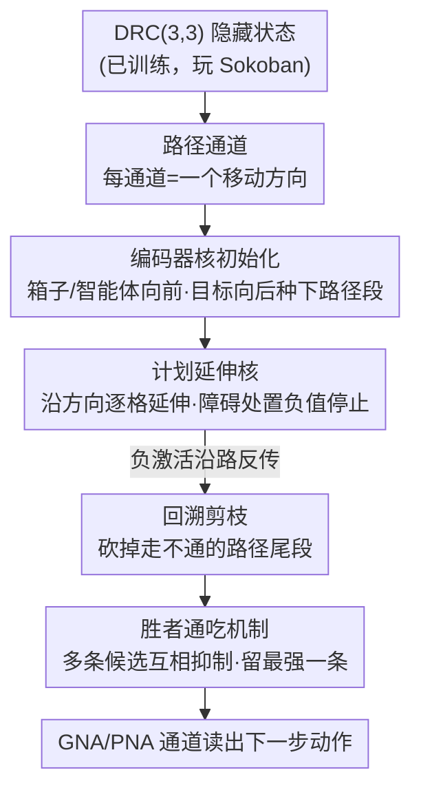

# Path Channels and Plan Extension Kernels: A Mechanistic Description of Planning in a Sokoban RNN

**会议**: ICLR 2026  
**OpenReview**: [https://openreview.net/forum?id=aAshH4kQ1v](https://openreview.net/forum?id=aAshH4kQ1v)  
**代码**: 待确认  
**领域**: 机制可解释性  
**关键词**: 机制可解释性, 规划, Sokoban, ConvLSTM, 双向搜索

## 一句话总结
本文逆向工程了一个用无模型强化学习训练来玩推箱子（Sokoban）的卷积循环网络（DRC），发现它把「未来要往哪走」的规划直接存在隐藏状态的特定通道（path channels，路径通道）里，并通过卷积核（plan extension kernels，计划延伸核）从箱子向前、从目标向后延伸路径段，用负激活实现剪枝与回溯、用胜者通吃机制选出唯一路径，从而把一个看似黑箱的「规划行为」翻译成了一套可读懂的双向搜索算法。

## 研究背景与动机
**领域现状**：人们普遍相信深度网络能学会复杂的「类规划」行为，Sokoban 是验证这一点的经典基准——它是 PSPACE-complete 的、要长程规划、且箱子只能推不能拉，一步走错就可能死局。Guez et al. (2019) 提出的 DRC 架构（深度循环卷积 ConvLSTM 堆叠）在无模型 RL 里达到了 SOTA，甚至能和 MuZero 这类有模型方法掰手腕，被认为「会规划」：数据高效、能泛化到更多箱子、给更多算力（多喂几次初始观测）就解得更好。

**现有痛点**：但「它会规划」这个判断主要靠行为证据和**线性探针（linear probe）**间接得到。前人（Bush et al. 2025、Taufeeque et al. 2024）用逻辑回归探针从隐藏状态里**聚合**出一个「计划表示」，定性地说它像在做双向搜索，却说不清这个计划到底**存在哪、怎么被构造出来**。探针是外挂的读出器，它告诉你「信息在那儿」，但没告诉你网络内部用什么机制把计划一步步搭起来。

**核心矛盾**：要真正理解一个网络「怎么规划」，光知道计划可以被探针解码出来还不够——必须能直接读权重、看清楚激活是怎么沿着棋盘传播、剪枝、收敛的。探针的聚合恰恰**抹掉**了这种逐步传播的结构。

**本文目标**：(1) 找到计划的**原生表示**（不靠探针，直接读通道激活）；(2) 解释计划被**构造**的算法（初始化 → 延伸 → 剪枝/回溯 → 选择）。

**切入角度**：作者手工检查了 DRC(3,3) 每一层每一个通道，发现大量通道本身就对应「某方向的移动倾向」，于是不需要探针的线性组合，直接读单个通道就能看出计划。

**核心 idea**：把计划表示简化为**路径通道**——每个通道对应一个移动方向，某格子上激活高就代表「箱子/智能体走到这格时会朝这个方向走」；再去读路径通道之间的**卷积核**，发现它们编码了「这一步动作导致位置如何变化」，即一个学出来的**转移模型**，规划就是这些核在棋盘上反复卷积传播激活的过程。

## 方法详解

### 整体框架
本文不是提出新模型，而是对一个**已训练好的** DRC(3,3) 网络做机制级逆向工程。这个网络结构是：卷积编码器 E → 3 层 ConvLSTM 堆叠（每个 in-game timestep 内每层 tick 3 次，共 9 层串行计算）→ MLP 头输出动作和价值。作者要回答两件事——计划**存在哪**、计划**怎么被造出来**。

第一步先定位计划表示：通过逐通道人工标注 + 单步缓存消融 + 因果干预，证明计划就存在「路径通道」里。第二步拆解规划算法：路径通道直接代表棋盘上的路径，于是可以直接读权重矩阵（编码器核 + 循环核）看清四个环节——编码器核在箱子/智能体/目标周围**初始化**路径段；计划延伸核沿方向**延伸**路径，并在障碍处放负值以**停止**；同样的延伸核把负激活反向传播实现**回溯剪枝**；胜者通吃机制在多条候选路径间**选出**一条。整条流水线合起来就是一个双向搜索：从箱子和智能体向前推，从目标向后拉，两头在中间会合。

### 关键设计

**1. 路径通道：把计划从「探针聚合」降维成「直接读通道」**

针对前人只能靠线性探针间接读计划的痛点，作者发现 DRC 的隐藏状态里有一大批通道本身就语义明确：每个通道绑定一个基本方向（上/下/左/右），在某格子上激活高就意味着「箱子（或智能体）位于该格时会朝这个方向移动」。因为隐藏状态是卷积的，同一套计算在 $H\times W$ 每个格子上复用，所以一个「向下」通道会在箱子要向下走的所有格子上点亮。作者把通道分成 7 组（箱子移动 20 个、智能体移动 10 个、组合路径 29 个、GNA 4 个、PNA 4 个、实体 8 个、无标签 21 个），其中**箱子移动 + 智能体移动 + 组合路径**合称**路径通道**（共 59 个），它们共同维护完整的行动计划；其余称非路径通道，主要存短期信息。这一步的价值在于：不再需要探针的线性组合，「读计划」退化成「读单个通道」，为后面直接读权重、解释算法铺平了路。

**2. 计划延伸核：编码一个学出来的转移模型，双向延伸路径段**

光有通道激活还不是计划，得有机制把「初始的一步」连成「一整条路径」。作者发现循环权重矩阵里藏着专门的**计划延伸核**。它分两类：**线性延伸核**沿通道自身方向把路径每次延伸一格；**转向延伸核**把激活从一个方向通道传到另一个方向通道（实现拐弯）。线性核的权重幅度明显大于转向核，这恰好编码了「能直走就别拐弯」的偏好。更关键的是这些核**成对存在**——有从箱子/智能体**向前**链接的核，也有从目标**向后**链接的核，于是计划被同时从两头延伸，正是 Bush et al. 定性观察到的双向搜索的机制基础。作者还把编码器的多层线性卷积用结合律合并成单个 $9\times9$ 核 $A^d_{oe}=W^d_{oe}W_{E2}W_{E1}$ 来可视化，看清编码器核如何在箱子/智能体周围（顺方向）和目标周围（逆方向）种下初始路径段。这些核合在一起就相当于网络学到的**转移模型**：每个核描述「做这个动作位置怎么变」。

**3. 负激活停止与回溯：用同一套核反向传播实现剪枝**

延伸不能无限进行，否则路径会穿墙穿过目标。作者观察到**停止机制靠负贡献实现**：在目标、箱子相邻格、墙等边界处，编码器或实体通道会给路径通道注入负激活，抵消延伸核的「溢出」，把路径在该处截断（图 8 直观展示了 box-right 通道在箱子和目标处被负贡献顶住）。妙处在于延伸核是**双重用途**的：因为存在前向和后向两套核，路径**末端**的负激活会被后向核传到**起点**，起点的负激活会被前向核传到末端——于是负值能沿整条路径双向扩散，把走不通的路径尾段「剪掉」，让另一条路径浮现，这就是一种回溯（backtracking）。这正是无模型训练学出来的、却长得很像经典搜索剪枝的机制。

**4. 胜者通吃：在多条可行路径间收敛到唯一计划**

当一个箱子有多条可行路径时，网络要选一条来执行。作者发现**短期**路径通道之间存在抑制性权重：同一格上不同方向的路径通道互相压制，激活最强的方向把其他方向的激活抑制下去，配合 sigmoid 非线性，最终只剩一个方向的路径通道为即将执行而保持激活。之所以只在短期通道做胜者通吃、而放过长期通道，是为了让网络能**同时保留**未来才执行的其他计划而不被误杀。作者构造了两条势均力敌的路径做因果验证（图 9）：初始两条激活相近，稍强的一条在第 1、2 步迅速主导并关掉另一条；而**零消融**两个方向通道之间的核后，胜者通吃失效，两条路径同时保持激活——证明正是这些跨方向核实现了选择机制。

### 一个例子：箱子下两格再右两格到目标
以图 3 的理想化情形为例：箱子要先向下走两格、再向右走两格才到目标。编码器核先在箱子周围沿「向下」初始化激活、在目标周围沿「向右」逆向初始化激活。线性延伸核把「向下」激活从箱子向下逐格延伸，把「向右」激活从目标向左逆向延伸，转向核在拐角处把「向下」接到「向右」。当延伸触到目标或相邻箱子时，负激活注入将其停住。若某条尝试路径撞墙，负激活沿前/后向核反传剪掉该尾段。最后在每格上胜者通吃留下唯一方向，GNA/PNA 通道把当前智能体格上的方向读成下一步动作。读者顺着「蓝色向下通道在两个下移格点亮、紫色向右通道在两个右移格点亮」就能在脑子里复现整条计划。

## 实验关键数据

### 主实验
作者用消融和因果干预量化验证「计划就在路径通道里」。**单步缓存消融**（把通道上一时刻值清零、只用当前观测重算）结果：

| 干预对象 | 通道数 | 解题率下降 |
|----------|--------|------------|
| 全部路径通道 | 59 | 57.6% ± 2.8% |
| 全部非路径通道 | 37 | 10.5% ± 1.9% |
| 随机路径通道子集（控通道数） | 37 | 41.3% ± 2.4% |

即便控制通道数量，干预路径通道造成的损失也远大于非路径通道，说明长程规划的核心计算就发生在路径通道里。

### 因果干预实验
按通道标签修改激活，测量能否成功让智能体改走另一个目标动作（10,000 个转移上统计成功率）：

| 通道组 | 因果干预得分 |
|--------|--------------|
| Pooled Next Action (PNA) | 99.7% ± 0.2% |
| Grid Next Action (GNA) | 98.9% ± 0.4% |
| 箱子+智能体移动 | 88.1% ± 1.9% |
| 箱子移动 | 86.3% ± 2.1% |
| 智能体移动 | 53.2% ± 2.1% |
| 探针：箱子移动（前人） | 82.5% ± 2.5% |
| 探针：智能体移动（前人） | 20.7% ± 0.7% |

PNA 干预拿到了 SOTA 级的因果分数（99.7%），明显高于前人基于探针的方法。智能体移动通道分数偏低（53.2%），作者解释是这些通道只在智能体**不推箱子**时才有因果作用，而实验没做这个过滤。

### 关键发现
- **路径通道是规划的物理载体**：干预它们解题率掉一半以上，且因果干预分数全面超过探针，说明计划是「原生地」存在通道里，而非探针外推出来的。
- **长短期通道分工**：路径通道进一步分长期/短期——短期通道对未来 10 步内动作 AUC 很高，长期通道对 10 步以后直到回合末的动作 AUC 高；当两个箱子先后穿过同一格但方向不同，长期通道会提前（$t\ll 0$）激活，等第一步走完后激活才转移到短期通道（主要由 j-gate 中介）。
- **权重操控（weight steering）泛化**：网络只在 $10\times10$ 棋盘训练，但把计划延伸核整体放大 1.4 倍，就能稳定更长的路径、解出 $40\times40$ 的关卡——直接验证了「延伸核负责构造路径」这一机制理解。
- **可复现性**：路径通道、延伸核、胜者通吃机制在另外 4 个独立训练的种子上都重现，并用 AUC 做了自动标注法佐证（Section N）。

## 亮点与洞察
- **从「探针能解码」到「权重能解释」的范式升级**：本文最「啊哈」的地方是把计划的表示简化到可以**直接读单个通道**，从而能直接打开权重矩阵看延伸核长什么样。相比 LLM 可解释性工作多停留在「局部、对特定 prompt 有效的经验因果」，这里是**权重级、对所有输入都成立**的解释，作者称其推进了「网络复杂度 vs 解释细致度」的帕累托前沿。
- **同一套核身兼三职**：计划延伸核既负责正向延伸、又负责反向回溯剪枝，加上负激活停止，把「转移模型 + 搜索剪枝」用一组卷积核统一实现，这种参数复用是无模型 RL 自发学出来的，相当优雅。
- **权重操控当作机制理解的「证伪实验」**：用「放大延伸核 → 能解更大棋盘」来验证机制，比单纯看激活相关性更有说服力，是一个可迁移到其他可解释性研究的验证范式。
- **可迁移思路**：「先找原生语义单元（这里是方向通道）→ 再读单元之间的权重核」这套流程，对其他卷积式智能体（导航、网格世界规划）的逆向工程同样适用。

## 局限与展望
- **单一任务、单一架构**：只分析了 Sokoban 上的 DRC(3,3)，结论能否推广到其他游戏 / 连续控制 / 非卷积架构未知；卷积的「位置复用」是路径通道能成立的关键前提，换架构可能就不成立。
- **解释仍是「部分」逆向工程**：还有 21 个无标签通道未能解释，GNA→PNA→动作的读出链、长短期转移的 j-gate 机制等只在附录定性给出，算法并非完全闭环。
- **智能体移动通道的因果证据偏弱**：53.2% 的分数受「未过滤推箱子情形」干扰，说明对智能体（相对箱子）的路径表示理解还不够干净。
- **改进方向**：把自动标注法做得更鲁棒以摆脱人工逐通道检查；在更大或非网格任务上检验「路径通道 + 延伸核」框架是否依然存在；把停止/回溯机制的负激活来源（编码器 vs 实体通道）拆得更清楚。

## 相关工作与启发
- **vs 线性探针方法（Bush et al. 2025 / Taufeeque et al. 2024）**：他们用逻辑回归探针**聚合**多个通道解码计划、定性说像双向搜索；本文发现计划本就分布在可直接读的单通道里，无需探针，且因果干预分数（如 PNA 99.7%）显著高于探针（箱子探针 82.5%、智能体探针 20.7%），并进一步给出计划**如何被构造**的权重级机制。
- **vs LLM 机制可解释性（GPT-2 small、Gemma、Claude 等回路工作）**：那些工作的网络更复杂，但所解释算法的抽象因果图更小、且多为局部经验因果；本文在中等复杂度网络上给出更大因果图、且是对所有输入成立的权重级解释，作者据此主张推进了复杂度–细致度的帕累托前沿。

## 评分
- 新颖性: ⭐⭐⭐⭐⭐ 首次把无模型 RL 学到的「规划」拆成路径通道 + 延伸核 + 回溯 + 胜者通吃的权重级算法。
- 实验充分度: ⭐⭐⭐⭐ 消融、因果干预、AUC、权重操控、5 个种子复现都有，但仍有无标签通道和智能体通道证据未闭环。
- 写作质量: ⭐⭐⭐⭐ 机制叙述清晰、图证充分，附录较重、主文部分机制略简。
- 价值: ⭐⭐⭐⭐⭐ 为「神经网络是否真的会规划」提供了迄今最细致的正面证据，对 agent 可解释性意义大。

<!-- RELATED:START -->

## 相关论文

- [\[ICML 2026\] Where's the Plan? Locating Latent Planning in Language Models with Lightweight Mechanistic Interventions](../../ICML2026/interpretability/wheres_the_plan_locating_latent_planning_in_language_models_with_lightweight_mec.md)
- [\[ICLR 2026\] Latent Planning Emerges with Scale](latent_planning_emerges_with_scale.md)
- [\[ICLR 2026\] When Thinking Backfires: Mechanistic Insights into Reasoning-Induced Misalignment](when_thinking_backfires_mechanistic_insights_into_reason-induced_misalignment.md)
- [\[ICLR 2026\] Formal Mechanistic Interpretability: Automated Circuit Discovery with Provable Guarantees](formal_mechanistic_interpretability_automated_circuit_discovery_with_provable_gu.md)
- [\[ICLR 2026\] Task Vectors, Learned Not Extracted: Performance Gains and Mechanistic Insights](task_vectors_learned_not_extracted_performance_gains_and_mechanistic_insights.md)

<!-- RELATED:END -->
