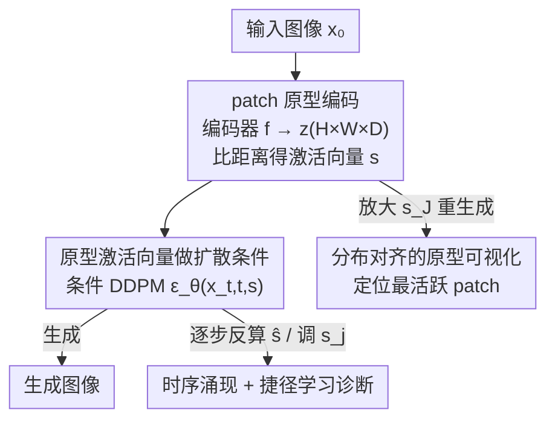

# Patronus: Interpretable Diffusion Models with Prototypes

**会议**: ICLR 2026  
**OpenReview**: [https://openreview.net/forum?id=1bz8CA8gPo](https://openreview.net/forum?id=1bz8CA8gPo)  
**代码**: https://nina-weng.github.io/patronus.github.io  
**领域**: 扩散模型 / 可解释性  
**关键词**: 扩散模型、原型网络、可解释性、语义编辑、捷径学习诊断

## 一句话总结
Patronus 把分类领域的原型网络（ProtoPNet）嫁接到扩散模型上：用一个 patch 级原型编码器把图像编码成「各原型被激活多少」的相似度向量，再拿这个向量去条件化 DDPM，从而让扩散生成过程变得「内生可解释」——能看清模型学到了哪些视觉概念（what）、它们出现在画面的哪里（where）、在去噪的哪个时刻涌现（when），并借此诊断出训练数据里的捷径学习与隐藏偏置。

## 研究背景与动机
**领域现状**：扩散模型生成质量极强，但内部过程基本是黑箱。现有给扩散模型「增加可解释性」的工作分两条路：一是 **post-hoc 分析**，事后去 U-Net 中间层（如 bottleneck 语义空间、PCA 方向、pullback metric）里挖语义方向（Kwon 2022、Park 2023、Haas 2024 等）；二是 **额外编码器引导**，给扩散接一个 encoder 抽语义向量来做条件（DiffAE、DiffuseGAE、InfoDiffusion）。

**现有痛点**：post-hoc 路线是「回溯式」的，只能解释、几乎无法直接控制生成；而 encoder 引导路线虽然能控，但抽出来的语义向量本身又难以解释（一堆高维隐变量，看不出每一维是什么意思）。更关键的是，这两类方法都偏向捕捉**全局**语义（脸型、姿态），而对可解释性真正重要的**局部细粒度**模式（发型/妆容细节、表情）反而抓不住。

**核心矛盾**：可解释性与可控性难以兼得——要么能解释但控不了，要么能控但解释不了；同时「全局语义」与「局部可解释概念」之间也存在错位。

**本文目标**：(1) 把可解释性直接**嵌进模型架构**，做到内生透明，不再依赖事后分析高维隐空间；(2) 把可解释性从全局推进到**局部语义**，并同时支持可控编辑。

**切入角度**：作者借鉴分类里的 ProtoPNet——它通过学习一组「原型」（一类视觉相似 patch 的中间表示）来做可解释分类。作者认为这套「原型 = 可命名的局部视觉概念」的思路天然适合做生成的可解释化：如果扩散生成被一组人类能看懂的原型激活所驱动，那「模型在画什么」就一目了然了。

**核心 idea**：用一个 patch 级原型网络把图像编码成「原型激活向量 s」，**用 s（而非难懂的语义隐向量）去条件化扩散生成**——s 的每一维对应一个可被可视化、可被命名的局部视觉概念，从而把扩散过程变成可读、可调、可诊断的。

## 方法详解

### 整体框架
Patronus（Prototype-Assisted Transparent Diffusion Model）由两大件拼成：底部是**原型抽取与表示模块**，顶部是一个**条件 DDPM**。给一张图像 $x_0$，原型编码器 $f$ 把它编码成 $H\times W\times D$ 的特征张量 $z=f(x_0)$，其中每个 $1\times1\times D$ 的空间位置对应原图的一个 patch；模型训练时学习 $m$ 个原型 $P=\{p_j\}_{j=1}^m$，通过比较 $z$ 的每个 patch 与每个原型的距离，算出一个 $m$ 维的**原型激活向量** $s$（每一维 = 这张图把第 $j$ 个原型「激活」了多少）。这个 $s$ 被当作条件喂进 DDPM 的反向去噪过程，引导生成。

可解释性正是从 $s$ 来的：① 把某个原型的激活拉到最大、其余不动，再生成并定位最被点亮的 patch，就能「看见」这个原型代表什么视觉概念（**可视化**）；② 调某一维 $s_j$ 再重生成，就能做语义编辑/外推；③ 在去噪每一步从估计的 $\hat x_0$ 反算 $s$，就能看到各原型**何时**涌现。无条件采样时，额外训练一个潜扩散模型 $p(s_{t-1}\mid s_t,t)$ 来生成 $s$。

### 关键设计

**1. 基于 patch 的原型编码与激活向量：把图像压成「激活了哪些局部概念」**

这一步针对「现有语义向量难解释、且偏全局」的痛点。编码器 $f$ 是一个 4 层 Conv–ReLU 网络，利用 CNN 感受野的性质，输出特征图 $z$ 上每个神经元都对应原图一个局部 patch，从而天然聚焦局部细粒度模式。模型学 $m$ 个形如 $1\times1\times D$ 的原型 $p_j$，每个原型可理解为像素空间某个 patch 的潜编码（注意它不必真的存在于数据集中，但应落在合理数据分布内）。把 $z$ 拆成 $n=H\times W$ 个 patch $\{z_i\}$ 后，先算每个 patch 与每个原型的平方 L2 距离 $d^2(z_i,p_j)=\lVert z_i-p_j\rVert^2$，再对每个原型在空间维上取最小距离 $d^2_{\min,j}$（即「这张图里和原型 $p_j$ 最像的那个 patch 有多像」），最后用对数变换 $s=\log\frac{d^2+1}{d^2+\epsilon}$ 把距离转成激活分数向量 $s$。这样一张图就被压成一个低维、每一维都对应一个可命名局部概念的向量——既大幅降了引导所需的维度，又保住了语义。

**2. 用原型激活向量做扩散条件引导：让生成「依赖可读的概念」而非黑箱隐向量**

标准 DDPM 的前向加噪 $q(x_t\mid x_0)=\mathcal N(x_t;\sqrt{\bar\alpha_t}x_0,(1-\bar\alpha_t)I)$ 与反向去噪 $p_\theta(x_{t-1}\mid x_t)$ 都不带语义。Patronus 把反向过程改成以 $s$ 为条件：$p_\theta(x_{t-1}\mid x_t,s)=\mathcal N(x_{t-1};\mu_\theta(x_t,t,s),\Sigma_\theta(x_t,t))$，训练仍用噪声预测损失 $L_{ddpm}=\mathbb E_{x_0,t,\epsilon}[\lVert\epsilon-\epsilon_\theta(x_t,t,s)\rVert^2]$。关键点在于：这里的条件不是 DiffAE/InfoDiff 那种「直接的语义隐向量」，而是**原型激活向量**——维度更低，但每一维都对应一个可被可视化的概念。作者强调这套引导「不改变模型输出分布，只是促使去噪过程把推理建立在原型之上」，并在 3.5 节用 ELBO 证明：任何提升 ELBO 的编码器更新，要么提高数据的条件似然，要么缩小生成分布与真实分布的 KL，因此联合训练原型编码器**不会**损害生成质量。

**3. 分布对齐的原型可视化：让每个原型「显形」成一张能看懂的局部概念图**

ProtoPNet 的可视化是在训练集里贪心搜最近的 patch，但这既不能保证抓到分布的真正代表模式，用解码器重建又会糊。作者主张**原型不必对应某个具体训练 patch，而应对齐整体训练分布**，于是提出新可视化法：对给定样本算出 $s$，把目标原型 $J$ 的分数 $s_J$ 拉到一个合理上界（$\max(s_X)$，$s_X$ 取自代表性子集以约束在合理范围），其余维不变得到 $s'$；用 $s'$ 条件采样出新图 $x'$；再在 $x'$ 里定位对原型 $J$ 最敏感的 patch $x'_i$，它就是 $p_J$ 的视觉表示。实验证明同一原型在不同样本上定位到的 patch 语义一致（如「白领」「卷发」「眼妆」），说明原型确实编码了稳定的语义。这套方法也能反过来用于可视化其他原型网络。

**4. 时序涌现追踪与捷径学习诊断：把「可解释」变成能用的诊断工具**

可解释不是为了好看，而是为了发现问题。一方面，调某一维 $s_j$ 并把它推到极端值（0.0→3.0）能做平滑的语义**外推**（超出原数据分布的增强），普通插值只能在观测范围内；DDIM 确定性采样（$\eta=0$）则提供更可控的编辑。另一方面，作者在去噪每一步从估计的 $\hat x_0$ 反算原型相似度，再对「增强后 $\hat x_{0,s'}$」与「原图 $x_0$」的时序 $s$ 求差，就能看出各原型**何时涌现**：前 ~200 步几乎没有原型显著出现，低空间频率属性（如「穿红」）涌现得早、高空间频率属性（如「卷发」）涌现得晚——这对决定「图像该往回扩散多远才能编辑某属性」很有用。更重要的是诊断**捷径学习**：在 CelebA 上人为制造「发色—微笑」的虚假相关（金/棕发都笑、黑发都不笑），增强「黑发」原型时模型会连带把「微笑」翻成「不笑」，从而暴露训练数据里的隐藏偏置。

### 损失函数 / 训练策略
主损失就是条件噪声预测 $L_{ddpm}$，原型编码器与去噪器**联合优化**；无条件采样时再冻结编码器、单独训练潜扩散模型生成 $s$。作者还额外验证了一个 **Prototype Distinct Loss** $L_{distinct}=\frac1N\sum_i\max(0,\delta-\min_{j\neq i}D_{ij})$（$D_{ij}$ 为带绝对值的余弦距离，$\delta$ 取 0.5 或 1.0，1.0 时强制原型正交）来鼓励原型解耦；但发现加上它后学到的原型几乎不变，说明仅靠去噪目标训练出的原型本身就已足够去相关，无需显式正则。

## 实验关键数据

五个数据集：FMNIST / CIFAR-10 / FFHQ 做定量，CheXpert（胸片）做定性，CelebA 做深入定量+定性。除 FMNIST 用 30 个原型外其余用 100 个，原型形状 $(1,1,128)$。

### 主实验（CelebA，Tab. 1）

| 方法 | TAD ↑ | 捕获属性数 ↑ | Latent AUROC ↑ | FID ↓ |
|------|-------|-------------|----------------|-------|
| DiffAE | 0.16 | 2.0 | 0.80 | 22.7 |
| InfoDiff | 0.30 | 3.0 | 0.84 | 23.6 |
| Patronus | **0.43** | **9.0** | **0.87** | 14.6 |
| Patronus (w/ learned s) | **0.43** | **9.0** | **0.87** | **4.8** |

Patronus 在解耦度（TAD）、捕获属性数、隐空间质量、生成质量上全面领先；用学到的 $s$ 做条件生成时 FID 降到 4.8，远超 DiffAE/InfoDiff 的 ~22。

### 多数据集（Tab. 2，原型/生成质量）

| 数据集 | 指标 | DiffAE | InfoDiff | Patronus(w/ learned s) |
|--------|------|--------|----------|------------------------|
| FMNIST | Latent AUROC ↑ / FID ↓ | 0.84 / 8.2 | 0.84 / 8.5 | 0.82 / **2.6** |
| CIFAR-10 | Latent AUROC ↑ / FID ↓ | 0.40 / 32.1 | 0.41 / 32.7 | **0.54** / **8.0** |
| FFHQ | Latent AUROC ↑ / FID ↓ | 0.61 / 31.6 | 0.61 / 31.2 | **0.92** / **24.1** |

原型质量 4 个数据集中赢 3 个（CelebA、FFHQ 尤其强）；条件生成 FID 在全部 4 个数据集上都显著领先。FMNIST 的隐空间质量略低，作者归因于 Patronus 偏重局部特征，而 FMNIST 类间差异大、语义更全局，DiffAE/InfoDiff 的全局结构反而更占优。

### 关键发现
- **局部 vs 全局是双刃剑**：在语义更局部的数据（CelebA、FFHQ）上 Patronus 提升明显；在语义更全局的 FMNIST 上反而吃亏，这正好印证了它「专攻局部细粒度概念」的定位。
- **原型自然解耦**：加 Prototype Distinct Loss 后原型几乎不变，说明去噪目标本身已让原型足够去相关。
- **捷径学习可被揪出**：增强「黑发」原型会连带改变「微笑」，直接把训练数据里的虚假相关暴露出来，是个能落地的偏置诊断工具。

## 亮点与洞察
- **把分类的原型思想迁到生成**：ProtoPNet 只用于分类，本文第一次把「可命名局部原型」嫁接到扩散生成，并让原型激活向量直接当条件——可解释性是「设计出来的」而非「事后挖出来的」。
- **用激活向量而非语义隐向量做条件**，巧妙之处在于：维度低（省了引导成本）但每一维都可视化、可命名，一举化解「可控但不可解释」的老问题。
- **分布对齐的可视化法**很优雅：不去训练集里硬找最近 patch，而是「放大该原型激活→重生成→定位最活 patch」，既避免糊又能代表分布，还能反哺其他原型网络。
- **时序涌现的洞察可迁移**：低频属性早出、高频属性晚出，这一规律能指导「编辑某属性时该往回扩散多远」，对高效编辑/反事实生成有实用价值。

## 局限与展望
- **全局属性抓不住**：作者承认 gender、age 这类非局部的全局特征很难落到某一个原型上，根因是 patch 级原型编码器对非局部特征不敏感。
- **依赖两段训练质量**：无条件生成效果取决于 Patronus 本体与额外潜扩散模型双方的训练质量，链路更长、更脆。
- **原型语义靠人工观察命名**：原型不是预标注的，「这是卷发那是眼妆」需人观察推断，规模化/客观性存疑；可视化里「拉到合理上界」的代表性子集 $s_X$ 取法也会影响结果。
- **评测偏人脸/小图**：主战场是 CelebA/FFHQ 等人脸与低分辨率自然图，医学只做了定性（CheXpert），在复杂场景图、高分辨率上的可解释性与生成质量尚待验证。

## 相关工作与启发
- **vs post-hoc 解释（Kwon 2022 / Park 2023 / Haas 2024）**：他们事后在 U-Net 隐空间挖语义方向，回溯式、难直接控；Patronus 把可解释性设计进架构，原型即条件，天然可控且无需标注。
- **vs DiffAE / DiffuseGAE / InfoDiffusion**：同样加 encoder 抽语义做引导，但它们抽的是**全局**语义隐向量、维度高且难解释；Patronus 用 patch 原型抽**局部**概念、以低维激活向量引导，既降维又可视化可命名。
- **vs ProtoPNet 及其后续**：原型思想同源，但 ProtoPNet 系只做分类、可视化靠训练集贪心搜最近 patch；Patronus 用于生成，并提出分布对齐的可视化，解决了「真正代表模式」的问题。

## 评分
- 新颖性: ⭐⭐⭐⭐⭐ 首次把原型网络嵌入扩散并以激活向量做条件，内生可解释路线清晰
- 实验充分度: ⭐⭐⭐⭐ 五数据集 + 解耦/质量/捷径诊断多角度，但偏人脸小图、医学仅定性
- 写作质量: ⭐⭐⭐⭐ 结构清楚、图示到位，部分公式记号偏密
- 价值: ⭐⭐⭐⭐⭐ 既提升可控生成，又给出能落地的偏置/捷径诊断工具，方法可迁移

<!-- RELATED:START -->

## 相关论文

- [\[ICLR 2026\] Concept-TRAK: Understanding how diffusion models learn concepts through concept attribution](concept-trak_understanding_how_diffusion_models_learn_concepts_through_concept_a.md)
- [\[ICLR 2026\] Precise and Interpretable Editing of Code Knowledge in Large Language Models](precise_and_interpretable_editing_of_code_knowledge_in_large_language_models.md)
- [\[ICML 2026\] Neural Collapse by Design: Learning Class Prototypes on the Hypersphere](../../ICML2026/interpretability/neural_collapse_by_design_learning_class_prototypes_on_the_hypersphere.md)
- [\[ICML 2026\] DLLM-JEPA: Joint Embedding Predictive Architectures for Masked Diffusion Language Models](../../ICML2026/interpretability/dllm-jepa_joint_embedding_predictive_architectures_for_masked_diffusion_language.md)
- [\[ACL 2026\] Diffusion-CAM: Faithful Visual Explanations for dMLLMs](../../ACL2026/interpretability/diffusion-cam_faithful_visual_explanations_for_dmllms.md)

<!-- RELATED:END -->
