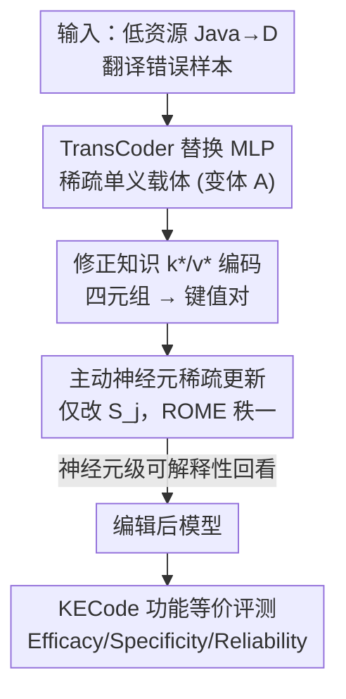

# Precise and Interpretable Editing of Code Knowledge in Large Language Models

**会议**: ICLR 2026  
**OpenReview**: [https://openreview.net/forum?id=diVf17SNek](https://openreview.net/forum?id=diVf17SNek)  
**代码**: https://github.com/minxue29031/TCPE  
**领域**: 机制可解释性 / 知识编辑 / 代码大模型  
**关键词**: 知识编辑, TransCoder, 单义神经元, 代码翻译, 功能等价

## 一句话总结
本文把 Transformer 某一层的 MLP 换成稀疏单义的 TransCoder 模块，只更新对目标错误真正激活的少数神经元来做知识编辑（TCPE），既精准又能在神经元层面解释「改了哪、为什么改」，并配套提出基于功能等价的代码翻译编辑基准 KECode，把 CodeLlama-7b 在低资源 Java→D 翻译上的准确率从 57.5% 提到 64.0%。

## 研究背景与动机

**领域现状**：代码大模型经常需要被「打补丁」——纠正错误行为、适配新 API、对齐开发者偏好。重训和全量微调代价高，连 LoRA 这类轻量微调也要上千条标注样本；prompt 工程和外部记忆只能做表面修补，改不动参数层面的模型行为。知识编辑（Knowledge Editing, KE）于是成为一条诱人的路：用极少的样本（甚至单条）就能定点修改模型知识，又承诺不波及无关知识。ROME、MEMIT 等代表方法把 MLP 当成「键-值存储」，在中间层做秩一更新。

**现有痛点**：这些方法把编辑落到 MLP 神经元上，但 MLP 神经元是**多义的**（polysemantic）——同一个神经元同时参与多种语义，一个神经元上叠着好几件事。在严格的代码场景里，这带来两个直接后果：一是**精度不够**，改一处常常误伤无关知识（specificity 差，甚至 model collapse）；二是**不可解释**，你说不清这次编辑究竟动了哪些「负责该错误」的单元。论文 Table 1 量化了这点：随机抽 50 个 MLP 特征只有 4 个可解释、41 个不可解释。

**核心矛盾**：编辑要精准、可解释，前提是承载知识的「单元」本身是**单义、稀疏**的；而标准 MLP 的稠密多义结构天生与之相悖。在 MLP 上做定点手术，就像在一团缠绕的电线里只想剪断一根，必然牵连旁边。

**本文目标**：(1) 找到一个比 MLP 更「干净」的编辑载体，让编辑既局部又可读；(2) 为代码翻译这种**功能正确性优先**的任务建立一套真正合适的编辑评测协议——自然语言里的 efficacy/specificity 用文本相似度衡量，但代码编译不过、跑不通就是错，文本像没用。

**切入角度**：作者借用机制可解释性社区的 **TransCoder**（Dunefsky et al., 2024）——它是 MLP 的稀疏近似，隐藏维度更宽、用 L1 等稀疏约束训练得到，对任一输入只有极少数神经元被激活，且这些激活更接近**单义**。既然 TransCoder 的激活空间天然稀疏单义，那就可以「顺着激活找到负责该知识的神经元，只改它们」。

**核心 idea**：用 TransCoder 替换 Transformer 中一层 MLP，把 ROME 式的秩一更新**限制在对目标知识真正激活的少数神经元上**，在精准编辑的同时获得神经元级可解释性。

## 方法详解

### 整体框架
TCPE（TransCoder-based Precise Editing）做的事可以拆成「换载体 → 编码修正知识 → 稀疏更新 → 解释」四步。先把基座模型 $G$ 在选定层 $l^*$ 的 MLP 换成 TransCoder，得到变体模型 $A$；再把一条「该改的翻译错误」整理成代码域的修正知识四元组，编码成键-值对 $(k_j^*, v_j^*)$；然后只对四元组激活出来的「主动神经元」集合 $S_j$ 做 ROME 式秩一更新，其余神经元一律不动；最后回看被改神经元的 top-激活样本，验证它们确实对应该类错误。整个流程在 KECode 基准上用功能等价（编译+单元测试）来评测。

### 关键设计

**1. 用 TransCoder 替换 MLP：把多义稠密的编辑载体换成稀疏单义的**

针对「MLP 神经元多义导致编辑不精准、不可读」这个根本痛点，TCPE 不在原始 MLP 上动刀，而是把第 $l^*$ 层的 MLP 整个换成 TransCoder 模块，得到 Transformer 变体 $A$。TransCoder 本质是一对编码/解码矩阵：$z_{TC}^{(l)}(\bar h) = \mathrm{ReLU}(W_{enc}^{(l)}\bar h)$，$TC^{(l)}(\bar h) = W_{dec}^{(l)} z_{TC}^{(l)}(\bar h)$，其中隐藏维 $d_{tc}$ 远宽于 MLP（实验里取到 $4096\times16$），并在训练时叠加稀疏损失，使得对任一输入只有极少元素非零（论文一个例子里仅 57 个特征激活，占 $d_{tc}$ 的 0.348%）。这些少数非零单元被称为**主动神经元（active neurons）**。之所以有效，是因为稀疏+宽维度逼出了单义性——一个特征更倾向只对一类语义/语法 token（如 `str`、`.length`）响应，于是「负责某知识的单元」从一团多义 MLP 里被解耦出来，可定位、可解释。作者还设计了 TransCoder Adapter，让这种替换在几秒内完成，并验证替换中间层（l∈{10,19,23}）性能相当，最终主要在第 19 层做编辑。

**2. 主动神经元稀疏更新：只改被目标知识点亮的少数神经元**

这是 TCPE 区别于 ROME 的核心。ROME 把 MLP 解码权重看作线性联想记忆 $W_{dec} k = v$，对整列做秩一更新；TCPE 把这套搬到 TransCoder 解码权重 $W_{dec}^{(l)}\in\mathbb{R}^{d_{model}\times d_{tc}}$ 上，但**把更新范围限制在主动神经元集合**。给定键 $k_j^*$，定义 $S_j=\{a\in[d_{tc}] \mid (k_j^*)_a > \tau\}$，即激活超过阈值 $\tau$ 的神经元下标。更新矩阵沿用 ROME 的闭式秩一解
$$\Delta W^{(l,j)} = \frac{(v_j^* - W_{dec}^{(l)} k_j^*)}{(C^{-1}k_j^*)^\top k_j^*}\,(C^{-1}k_j^*)^\top,$$
其中协方差 $C$ 用 `bigcode/the-stack` 估计。关键差别在于只对 $m\in S_j$ 的列施加更新：$W_{dec}^{(l)\prime}[:,m] = W_{dec}^{(l)}[:,m] + \Delta W^{(l,j)}[:,m]$。因为被改的神经元单义且数量极少（实验中常在 69 个左右最优），就能在保证泛化的同时把对无关知识的干扰压到很低——这正是它 specificity（LoC 高、DT 低）领先的来源。论文还发现不同错误类型激活的 $S_j$ 之间**交集很小**（TransCoder 的跨错误重叠远低于 MLP），说明不同错误确实由相对独立的神经元簇承载，为「只改这一簇不伤其它」提供了机制依据。

**3. 代码域修正知识的 k*/v* 编码：把一条翻译纠错变成可注入的键值对**

自然语言里 ROME 的 (subject, relation, object) 在代码翻译里不适用，作者把每条翻译实例表示成四元组 $(r^{(1)}, s, r^{(2)}, o)$：$s$ 是源代码片段（subject），$o$ 是功能等价的目标片段（object），$r^{(1)}$ 是 $s$ 前的上下文（import、注释、前置定义），$r^{(2)}$ 是 $s$ 后的上下文。当模型预测的 $o$ 有语法错误或破坏功能等价时，人工修正成 $o^*$，得到修正知识 $(r^{(1)}, s, r^{(2)}, o^*)$。编码分两步：**生成 $k_j^*$**——在前缀采样 $N$ 个 $a_j^n$ 拼到 prompt $p(r^{(1)}_j,s_j)$ 前，取 TransCoder 编码器在末位 token 的非线性激活，对 $N$ 条求平均得 $k_j^*=\frac1N\sum_n z_{TC}^{(l)}(\bar h_i^{(l)}(a_j^n\oplus p(r^{(1)}_j,s_j)))$；**生成 $v_j^*$**——求一个最小扰动 $\delta_j$ 加到 TransCoder 输出上，使模型在该 prompt 下最大化预测新目标 $o_j^*$ 的概率，$v_j^* = TC^{(l)} + \arg\min_{\delta_j}\frac1N\sum_n -\log P_{A(TC^{(l)}+=\delta_j)}[o_j^*\mid a_j^n\oplus p(r^{(1)}_j,s_j,r^{(2)}_j)]$。这一步保证「键」指向被编辑知识被激活的位置、「值」携带正确翻译，再交给设计 2 注入。

**4. KECode 基准与功能等价评测：用「编不编得过、测不测得通」而非文本像不像来衡量编辑**

代码编辑成功的标准不是文本相似，而是**功能等价**。作者构建 G4GD 数据集：基于 GeeksforGeeks 的数百个 Java 函数，每个配 10 条 D 语言单元测试，共 600 个 Java 函数 × 10 测试；选 D 这门相对冷门的语言制造低资源场景。评测先让模型把 600 个 Java 翻成 D，跑单元测试，按编译消息（取错误前 6 个 token，用 gte-base 编码后按余弦相似度 0.9 阈值聚类）把失败样本聚成若干错误簇，针对每个簇注入修正知识，再重测重聚类。指标分三类：**Efficacy**（GN 泛化=目标簇编辑后被正确翻译的比例↑、CD 簇漂移=目标错误簇规模相对变化↓）、**Specificity**（LoC 局部性=非目标簇前后错误类别一致性↑、DT 破坏性=原本正确却被改错的比例↓）、**Reliability**（RE=编辑后总体准确率/编辑前准确率↑）。综合分 $\text{Score}=(GN-CD)+(LoC-DT)+RE$，把「该改的改了、不该动的没动、整体没崩」三件事压成一个数。

### 一个完整示例
针对一个典型 D 类型转换错误「cannot implicitly convert expression `str.length` of type `ulong` to `int`」：作者在 LTC4 上注入该错误的修正知识，得到 $k_j^*$ 里只有 57 个特征被激活（占 $d_{tc}$ 的 0.348%）。取 top-10 主动特征和 10 个随机非激活特征，用 C8 簇里的 Java/D 样本喂进去看 top-激活样本——主动特征稳定地对 `str`、`string`、`=.length` 这类与该错误直接相关的 token 响应；而非激活特征只对 `if`、`;`、`N` 这类结构/控制流 token 响应，与该错误无关。这具体展示了「被编辑的神经元 ↔ 注入的知识」的对应关系，把抽象的「神经元级可解释」落成了看得见的 token 模式。

## 实验关键数据

### 主实验
基座为 CodeLlama-7b-Instruct 与 Llama-2-7b，构造不同 TransCoder 宽度的变体（LTCmlp / LTC4 / LTC8 / LTC16）。在 G4GD 多错误编辑场景下，TCPE 在综合分及各项指标上全面领先（Score = (GN−CD)+(LoC−DT)+RE）：

| 方法 | Score↑ | GN↑ | CD↓ | LoC↑ | DT↓ | RE↑ | ACpost / ACpre |
|------|--------|-----|-----|------|-----|-----|----------------|
| ROME | 109.60 | 109.60 | 29.79 | 80.14 | 76.47 | 99.71 | 57.33 / 57.50 |
| MEMIT | 14.96 | — | 7.09 | 124.82 | 72.99 | 82.03 | 47.17 / 57.50 |
| PMET | −4.70 | — | 12.77 | 104.26 | 55.77 | 69.57 | 40.00 / 57.50 |
| FiNE | 144.50 | 144.50 | 29.08 | 54.61 | 81.92 | 101.74 | 58.50 / 57.50 |
| LoRA | 147.27 | 147.27 | 29.08 | 58.87 | 82.57 | 104.93 | 60.33 / 57.50 |
| AGRACE | 99.85 | 99.85 | 0.71 | 100.71 | 99.56 | 100.29 | 57.67 / 57.50 |
| **TCPE (LTC4)** | 171.45 | — | 32.86 | 46.43 | 82.17 | 109.71 | **64.00** / 58.33 |
| **TCPE (LTC8)** | **174.82** | — | 31.66 | 49.64 | 88.50 | 110.03 | **64.00** / 58.17 |

最直观的结论：TCPE 把翻译准确率从 57.5% 提到 64.0%，且 Reliability（RE 110+）说明编辑后总体没崩；MEMIT/PMET 这类多层广义干预反而把准确率拉到 47%/40%，印证「代码域对干预粒度极敏感，越粗越容易整体退化」。

### 消融实验
对主动神经元阈值 $\tau$ 的消融（LTC4，更新激活 $>\tau$ 的神经元）揭示「改多少神经元」的甜区：

| 阈值 τ | GN↑ | CD↓ | LoC↑ | DT↓ | RE↑ | 更新神经元数(∪) |
|--------|-----|-----|------|-----|-----|----------------|
| acv>0.2 | 24.29 | 59.29 | 82.39 | 7.43 | 105.43 | 34 |
| acv>0.15 | 27.86 | 61.43 | 82.61 | 7.14 | 107.14 | 42 |
| **acv>0.1** | **32.86** | 46.43 | 82.17 | 6.86 | **109.71** | 69 |
| acv>0.05 | 35.00 | 48.57 | 82.39 | 8.57 | 106.86 | 98 |
| acv>0 | 32.86 | 50.71 | 83.04 | 8.29 | 106.00 | 147 |

可解释性对比（随机抽 50 特征做盲评）：

| 类别 | TransCoder | MLP |
|------|-----------|-----|
| 可解释 | 33 | 4 |
| 可能可解释 | 8 | 5 |
| 不可解释 | 9 | 41 |

### 关键发现
- **「改少数主动神经元」是最优解**：阈值 $\tau=0.1$（约更新 69 个神经元）综合最好，RE 达 109.71、ACpost 64.0%；阈值太高（只改 34 个）泛化不足，太低（改满 147 个）又开始引入破坏。这从经验上支持了「精准 = 只改被点亮的那一小簇」。
- **TransCoder 的可解释性碾压 MLP**：50 个特征里 TransCoder 有 33 个可解释、仅 9 个不可解释；MLP 反过来 41 个不可解释、只有 4 个可解释。这是「换载体」最直接的收益证据。
- **干预粒度决定成败**：单层精准方法（ROME、TCPE）比多层广义方法（MEMIT、PMET）可靠得多；后者在代码域把整体准确率拖垮，说明代码任务对「误伤无关知识」几乎零容忍。
- 不同错误类型的主动神经元交集很小，支持「不同错误由相对独立神经元簇承载」，为定点不串扰提供机制解释。

## 亮点与洞察
- **把机制可解释性工具直接用作编辑载体**：TransCoder 本来是用来「看懂」MLP 的稀疏字典，本文反手把它当成「可编辑的单义存储」，让「可解释」和「可精准编辑」用同一个结构同时达成——可解释不再是事后分析，而是编辑精度的来源。
- **编辑范围用激活阈值显式可调**：$\tau$ 直接控制「改几个神经元」，把精度-泛化的权衡变成一个可扫的旋钮，工程上很友好。
- **为代码编辑重定义评测标准**：KECode 用编译+单元测试的功能等价，配合错误聚类的指标体系（GN/CD/LoC/DT/RE），把「编辑好不好」从文本相似度拉回到代码该有的正确性标准，这套协议本身可迁移到其它语言对的代码编辑评测。
- **可迁移思路**：任何稀疏自编码器/字典学习得到的单义特征空间（如 SAE），都可能照此做「定位单义特征→只改它们」的定点编辑，不限于代码。

## 局限与展望
- **需要替换并训练 TransCoder**：要先为某一层训练好 TransCoder 并替换，虽有 Adapter 加速，但相比纯参数编辑多了一层准备成本，且当前只在单层做。
- **依赖人工修正与阈值调参**：修正知识 $o^*$ 需人工给出，阈值 $\tau$、层位、TransCoder 宽度等都要调，最优甜区（69 个神经元）是经验扫出来的，缺少自动选择机制。
- **验证范围有限**：主要在 CodeLlama/Llama2-7B、Java→D 这一个低资源语言对上验证；更大模型、多语言对、更复杂错误类型下能否保持精准与可解释仍待检验。
- **多错误同时编辑的扩展性**：实验聚焦少数主导错误簇（C0/C8/C4/C6 占 ~58%），长尾错误与海量并发编辑的稳定性未充分展开。

## 相关工作与启发
- **vs ROME / MEMIT / PMET**：它们在多义 MLP 上做秩一/多层更新，本文把更新载体换成单义 TransCoder 并限制在主动神经元集合 $S_j$。区别在「编辑的对象从多义稠密单元变为稀疏单义单元」，本文优势是 specificity 和可解释性大幅提升、代码域更可靠；代价是要先准备 TransCoder。
- **vs FiNE / AGRACE / WISE / LoRA**：这些是其它 KE 或轻量适配路线，在 Score/准确率上均不及 TCPE；尤其 LoRA/微调类需大量样本或带来更高破坏性，而 TCPE 单条修正知识即可定点注入。
- **vs 现有 KE 基准（zsRE / CounterFact）**：它们以自然语言文本指标为主，对代码功能正确性不敏感；KECode 用功能等价补上了这块空白。
- **启发**：稀疏单义表示（TransCoder/SAE）不只是「解释模型」的镜子，也可以是「精准改模型」的手术刀——可解释性与可控编辑可以共享同一套稀疏结构。

## 评分
- 新颖性: ⭐⭐⭐⭐⭐ 把可解释性工具 TransCoder 创造性地用作知识编辑载体，思路清新且切中 MLP 多义痛点
- 实验充分度: ⭐⭐⭐⭐ 基线齐全、阈值/宽度/层位消融到位，但语言对与基座规模偏单一
- 写作质量: ⭐⭐⭐⭐ 动机与方法链条清晰，指标定义严谨；部分细节（v* 扰动、聚类）需结合附录才完整
- 价值: ⭐⭐⭐⭐ 给代码 LLM 提供了可解释、低破坏的定点编辑方案，并贡献了功能等价评测基准

<!-- RELATED:START -->

## 相关论文

- [\[ICLR 2026\] Medical Interpretability and Knowledge Maps of Large Language Models](medical_interpretability_and_knowledge_maps_of_large_language_models.md)
- [\[ACL 2026\] Tracing Relational Knowledge Recall in Large Language Models](../../ACL2026/interpretability/tracing_relational_knowledge_recall_in_large_language_models.md)
- [\[ACL 2026\] Knowledge Vector of Logical Reasoning in Large Language Models](../../ACL2026/interpretability/knowledge_vector_of_logical_reasoning_in_large_language_models.md)
- [\[ACL 2026\] DPN-LE: Dual Personality Neuron Localization and Editing for Large Language Models](../../ACL2026/interpretability/dpn-le_dual_personality_neuron_localization_and_editing_for_large_language_model.md)
- [\[ICLR 2026\] REAL: Reading Out Transformer Activations for Precise Localization in Language Model Steering](real_reading_out_transformer_activations_for_precise_localization_in_language_mo.md)

<!-- RELATED:END -->
