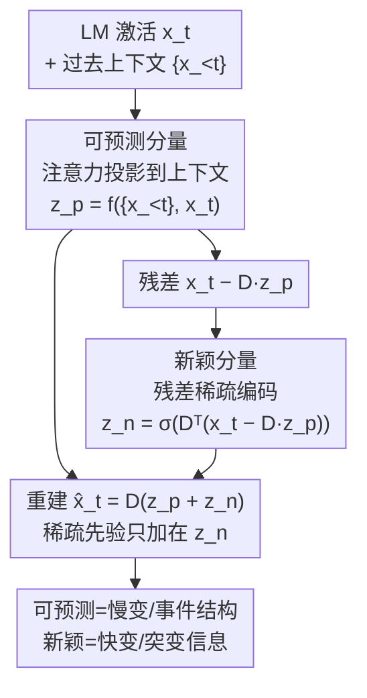

# Priors in Time: Missing Inductive Biases for Language Model Interpretability

**会议**: ICLR 2026  
**OpenReview**: [https://openreview.net/forum?id=4J2e3nWiC8](https://openreview.net/forum?id=4J2e3nWiC8)  
**代码**: 待确认  
**领域**: 可解释性 / 机制可解释性  
**关键词**: 稀疏自编码器, 时间结构, 归纳偏置, 贝叶斯先验, 非平稳性

## 一句话总结
本文用贝叶斯视角揭示标准稀疏自编码器（SAE）隐含了"概念在时间上独立"的先验，而语言模型激活其实高度非平稳、随上下文累积维度，二者严重错配；据此提出 Temporal SAE，把每个时刻的激活分解为"可预测分量（来自上下文）+ 新颖分量（残差）"，只对新颖分量施加稀疏先验，从而能正确解析花园路径句、识别叙事事件边界，分离慢变与快变信息。

## 研究背景与动机
**领域现状**：机制可解释性近年的主流工具是稀疏自编码器（SAE）。它建立在线性表示假设（LRH）之上——假设神经网络激活由一组可独立操控的方向（概念）线性叠加而成——于是用一个稀疏编码器把激活 $x$ 解码成一组稀疏、单义的字典系数 $z$，期望每个系数对应一个人类可读的概念。ReLU SAE、TopK SAE、BatchTopK SAE 等都属此类。

**现有痛点**：现有 SAE 都是"逐 token、与上下文无关"地编码：在位置 $t$ 解码 $x_t$ 时不看 $x_{<t}$，把每个 token 当成独立同分布（i.i.d.）样本。但语言天然带有丰富的时间结构——句内有跨词依存、下文词可由上文预测、篇章层面有事件边界。逐 token 独立编码意味着 SAE 默认"概念在时间上互不相关、且每个位置需要的概念数恒定"。

**核心矛盾**：作者把 SAE 训练目标改写成贝叶斯 MAP 估计后发现，由于稀疏正则项在时间维度上是可加的，SAE 在隐式地假设 $P(z_1,\dots,z_T)=\prod_t P(z_t)$，即"概念跨时间独立 + 稀疏度（所需概念数）时间不变"。而作者对 Llama-3.1-8B、Gemma-2-2B 激活的实证分析表明：激活的内在维度随序列位置单调上升（信息越积越"密"），自相关结构随位置变化（明显非平稳），且一个 token 高达 80% 的方差可由前 500 个 token 的上下文解释。先验与数据严重错配——这正是 SAE 出现"特征分裂"（feature splitting）等病态现象的根源。

**本文目标**：(1) 形式化地说清 SAE 对时间结构做了什么先验假设；(2) 实证刻画 LM 激活真实的时间结构；(3) 设计一个把时间结构作为归纳偏置写进架构的新 SAE。

**切入角度**：借鉴计算神经科学的教训——群体神经记录早已表明表示往往落在结构化流形上，于是该领域从"独立放电的单义神经元"假设转向"围绕被解释行为的生成过程来设计分析协议"。作者主张可解释性也应如此：方法不是中立的特征提取器，而是带有自身结构假设的模型，假设应匹配数据。

**核心 idea**：不再假设"整体表示"在时间上独立，而是只假设"去掉上下文可预测部分后的残差（新颖分量）"在时间上 i.i.d.，从而允许整体编码跨时间相关，把语言的时间结构纳入进来。

## 方法详解

### 整体框架
Temporal SAE 仍是"编码—字典重建"的 SAE 框架，但把每个时刻的激活 $x_t$ 显式拆成两路。先用一个注意力模块把 $x_t$ 投影到过去上下文 $\{x_{<t}\}$ 张成的子空间，得到**可预测分量** $x_{p,t}=Dz_{p,t}$，它捕捉 $x_t$ 与历史相关、慢变的那部分；再把残差 $x_t - Dz_{p,t}$ 送进一个标准 SAE 编码器，得到稀疏的**新颖分量** $x_{n,t}=Dz_{n,t}$，它捕捉当前 token 带来的、与历史正交的新信息。最终码 $z_t = z_{p,t}+z_{n,t}$，重建 $\hat{x}_t = D(z_{p,t}+z_{n,t})$。关键差异在于：稀疏先验只加在新颖码 $z_n$ 上，且只假设 $z_n$ 在时间上 i.i.d.——这就把"时间独立"的强假设从整体表示挪到了残差上，允许整体码跨时间相关。

### 关键设计

**1. 贝叶斯重述：把 SAE 的"时间独立先验"显式化**

这一步是全文的诊断地基。作者沿用 Olshausen & Field 对稀疏编码的贝叶斯解释，把 SAE 的训练目标重写成最小化负对数后验 $\arg\min_{\{z_t\}} -\log P(z_1,\dots,z_T\mid x_1,\dots,x_T)$，由贝叶斯定理它等于"对数似然（重建 MSE）+ 对数先验（稀疏正则）"之和。由于稀疏约束 $R(\cdot)$ 在时间维度上是逐项相加的，先验自然因式分解为 $P(z_1,\dots,z_T)\propto\prod_t \exp(-\lambda R(z_t)-\tilde\lambda\tilde g(z_t))=\prod_t P(z_t)$（命题 4.1）。这说明标准 SAE 隐含"latent 跨时间独立"。其推论 4.1.1 进一步指出，i.i.d. 先验同时意味着稀疏度 $\|z_t\|_0$（即解释激活所需的概念数）服从时间不变的分布。把这两条与第 3 节实证的"内在维度随位置上升、自相关随位置变化"对照，错配一目了然——当上下文累积让激活变得比假设的稀疏预算更"密"时，SAE 必然漏掉时间结构，表现为特征分裂。这一设计的价值不在于改模型，而在于用最小的数学改写，把一个一直被忽视的强假设摆到台面上。

**2. 可预测/新颖二分生成模型：用注意力抽出上下文可解释的慢变部分**

针对"逐 token 独立"这个痛点，作者提出新的激活生成模型 $x_t = x_{p,t}+x_{n,t}$，其中 $x_{p,t}=Dz_{p,t}$ 是可由历史预测、慢变的部分，$x_{n,t}=Dz_{n,t}$ 是当前 token 新增的快变部分。可预测码的获取方式是把 $x_t$ 表达成过去数据的凸组合：在单层 ReLU 之上叠一个自注意力层 $f$，令 $z_{p,t}=f(\{x_1,\dots,x_{t-1}\}, x_t)$，相当于"用注意力对历史加权求和来逼近当前表示中可被上下文解释的方差"。这一灵感直接来自计算神经科学对动态信号的处理——把信号中"近期历史可预测、慢变、稠密"的部分与"新颖、惊讶、快变、稀疏"的部分分开。与标准 SAE 的本质区别在于：标准 SAE 试图一次性稀疏重建整个 $x_t$，而这里先承认"$x_t$ 的大头其实是上下文的延续"，把它单独剥离出来，留给稀疏机制去处理真正新增的信息。

**3. 残差新颖码 + 只对残差施加 i.i.d. 稀疏先验**

新颖分量定义为 $z_{n,t}=\tilde f(x_t, z_{p,t})=\sigma\big(D^\top(x_t-Dz_{p,t})\big)$，即先减掉可预测重建 $Dz_{p,t}$，再把残差送进标准 SAE 编码器非线性 $\sigma$（用 TopK 或 BatchTopK 实例化）。训练目标为

$$\arg\min_{D,z}\frac{1}{T}\sum_{i=1}^{T}\big\|x_i - D(z_{p,i}+z_{n,i})\big\|_2^2 + \lambda R(z_{n,i}),\quad \text{s.t. } z_{p,k}=f_{\text{SAE}}(\{x_{<k}\},x_k),\ z_{n,k}=\tilde f_{\text{SAE}}(x_k,z_{p,k}).$$

注意稀疏正则 $\lambda R(\cdot)$ 只作用在新颖码 $z_n$ 上，可预测码 $z_p$ 不受稀疏约束。这正是对第 4 节先验问题的针对性修复：现在被假设为"时间上 i.i.d."的对象是残差 $z_n=z_t-z_{p,t}$，而不是整体 $z_t$；由于 $z_t$ 含有跨时间相关的 $z_p$，模型就允许了概念跨时间相关，从而能表达语言的时间结构。残差重建还有个副产品——它鼓励两个模块的误差向量近似正交，使可预测码与新颖码各自抓住输入的不同部分。

### 损失函数 / 训练策略
目标函数即上式（公式 4）：重建项约束 $D(z_p+z_n)$ 逼近 $x$，稀疏项仅约束 $z_n$。实验中在从 Gemma-2-2B 的 Pile-Uncopyrighted 激活上抽取约 10 亿 token 训练；$\sigma$ 用 TopK 或 BatchTopK 编码器实例化。作者还设了一个"仅预测模块"（Pred. only）的消融基线，它只用 $z_p$ 重建——预计会变差，因为"预测下一时刻表示"比"重建当前表示"更难。

## 实验关键数据

### 主实验：保真度与标准 SAE 持平
在 Gemma-2-2B 激活上、跨 Simple Stories / Webtext / Code 三个域，Temporal SAE 的重建归一化误差（NMSE）和方差解释率与最强标准 SAE（BatchTopK）相当，没有为引入时间偏置牺牲基本保真度。

| 指标 | 域 | ReLU | TopK | BatchTopK | Pred. only | Temporal |
|------|----|------|------|-----------|-----------|----------|
| NMSE↓ | Story | 0.20 | 0.155 | 0.152 | 0.34 | **0.139** |
| NMSE↓ | Web | 0.19 | 0.144 | 0.139 | 0.36 | **0.139** |
| NMSE↓ | Code | 0.20 | 0.154 | 0.149 | 0.38 | 0.152 |
| 方差解释↑ | Story | 0.60 | 0.71 | 0.72 | 0.29 | **0.73** |
| 方差解释↑ | Web | 0.69 | 0.78 | 0.79 | 0.40 | **0.79** |
| 方差解释↑ | Code | 0.65 | 0.75 | 0.75 | 0.33 | 0.75 |

模块分工分析（表 3）显示：误差向量 $x-\hat x_p$ 与 $x-\hat x_n$ 近似正交，证明两模块捕捉了输入的不同信息；可预测码贡献了约 80% 的重建范数（与图 2d 中"上下文解释 80% 方差"吻合），主要拉低 NMSE；而新颖码更负责解释逐维逐时刻的方差变化。

### 慢/快信号分离（表 4，narrative 域）
把激活做傅里叶变换并按能量等分为"慢变/快变"两半，比较各 SAE 码与两半信号的相似度：

| 信号 | ReLU | TopK | BatchTopK | Temporal-Novel | Temporal-Pred |
|------|------|------|-----------|----------------|---------------|
| 慢变 | 0.37 | 0.35 | 0.35 | 0.19 | **0.75** |
| 快变 | 0.54 | 0.54 | 0.54 | 0.75 | 0.18 |

可预测码强烈对齐慢变（高层、稳定）信号，新颖码对齐快变（突变）信号，而所有标准 SAE 只与快变信号相似——说明它们捕捉不到叙事文本所需的长程依赖。

### 关键发现
- **事件边界**：用 GPT-5 合成 50 个有明确事件边界的故事，按"同事件内 vs 跨事件"算 token 码的平均余弦相似度。可预测码同事件内相似度高达约 0.56、跨事件约 −0.04，清晰分块；而 BatchTopK 等标准 SAE 同事件内仅约 0.12，分不出事件结构。对输入加高斯噪声时，可预测码的相似度图反而浮现出更粗粒度的块结构（类似图聚类中的渗流/热扩散效应），且 Temporal SAE 的方差解释随噪声衰减最慢，标准 SAE 在某尺度甚至掉到约 0。
- **花园路径句**：对 "The old man the boat" 这类先诱导错误局部解析、后被迫重析的句子，对 50 个合成歧义句与 50 个无歧义对照句，比较主语短语（SP）、动词（V）、宾语短语（OP）码的相似度。可预测码的 V→SP 相似度在歧义句（0.47）与对照句（0.44）间基本不变，说明它把所有合法解析存进同一表示、维持了正确的长程依存；而标准 SAE 与新颖码的 V→SP 相似度在两类句子间剧烈摆动（如 BatchTopK 从对照 0.44 跌到歧义 0.05），落入了误导性的局部线索。
- **几何直观**：对 TinyStories 码做 3D UMAP，标准 SAE 几何高度不规则、迂曲度（tortuosity）很高，且倾向于按词形（lexical identity，如把所有 "and" 聚在一起）聚类；可预测码则把故事"拉直"成与事件边界对齐的层级块结构。

## 亮点与洞察
- **用贝叶斯改写把"隐藏假设"显式化**：最巧妙之处不是新架构，而是把人人都在用的 SAE 目标重述成 MAP，让"时间独立先验"这个一直被默认却没人点破的假设暴露出来——这种"先讲清旧方法到底假设了什么"的诊断范式，可迁移到任何带正则项的表示学习方法。
- **只把 i.i.d. 假设挪到残差上**：与其推翻稀疏编码，不如保留其骨架、只把"独立性"假设从整体码移到去上下文后的残差码。这是一个很轻的改动却根本性地松绑了时间相关性，工程上仅需在 SAE 前加一个注意力预测头。
- **跨学科借力**：把计算神经科学"围绕生成过程设计分析协议""慢变可预测 vs 快变新颖"的成熟思路搬到 LM 可解释性，给"该往 SAE 里加什么归纳偏置"提供了有原则的来源。

## 局限与展望
- **预测模块本身较弱**：Pred. only 基线 NMSE 明显更差（0.34–0.38），说明"预测下一时刻表示"远难于重建，可预测分量的质量受限于这个注意力头的能力。
- **概念可读性未直接验证**：实验主要论证时间结构（事件、句法）的恢复，但对"新颖码/可预测码里的每个维度是否仍是人类可读的单义概念"缺少系统的特征解释评估。
- **评测多为合成/小数据**：事件边界与花园路径数据均为 GPT-5 合成的各 50 条，规模有限；主训练在 Gemma-2-2B、约 10 亿 token，跨模型规模的普适性还需更大验证。
- **改进方向**：可探索更强的上下文预测器（如多头/多尺度注意力）、把"可预测/新颖"二分推广到多时间尺度的层级分解，以及与下游干预（activation steering）结合验证可预测码是否更适合做篇章级控制。

## 相关工作与启发
- **vs 标准 SAE（ReLU / TopK / BatchTopK）**：它们逐 token 独立编码、隐含时间独立先验；本文证明这与 LM 激活的非平稳性冲突，并通过"可预测+新颖"分解显式建模时间相关。代价是多一个注意力预测模块，收益是恢复了事件边界与花园路径句的正确解析。
- **vs 层级 SAE / 残差重建（如 Costa et al. 2025）**：本文同样利用"重建残差能得到正交码"的性质，但残差的定义来自"上下文可预测部分"，目标是时间结构而非概念层级。
- **vs 计算神经科学的结构化分析（CEBRA、慢特征分析等）**：本文把"按行为生成过程设计协议"的思路引入 LM 可解释性，核心主张是可解释性工具的归纳偏置必须匹配数据的统计结构，而非充当中立特征提取器。

## 评分
- 新颖性: ⭐⭐⭐⭐⭐ 用贝叶斯视角点破 SAE 的时间独立先验，并给出针对性的时间归纳偏置，视角新颖且有原则
- 实验充分度: ⭐⭐⭐⭐ 保真度、慢/快分离、事件边界、花园路径多角度验证，但部分数据为合成且规模有限
- 写作质量: ⭐⭐⭐⭐⭐ 从诊断到设计逻辑链条清晰，理论与实证衔接紧密
- 价值: ⭐⭐⭐⭐⭐ 指出可解释性工具应让归纳偏置匹配数据这一普适原则，对 SAE 社区有方向性意义

<!-- RELATED:START -->

## 相关论文

- [\[ICLR 2026\] Hidden Breakthroughs in Language Model Training](hidden_breakthroughs_in_language_model_training.md)
- [\[ICLR 2026\] Towards Understanding Subliminal Learning: When and How Hidden Biases Transfer](towards_understanding_subliminal_learning_when_and_how_hidden_biases_transfer.md)
- [\[ICLR 2026\] Learning to See Before Seeing: Demystifying LLM Visual Priors from Language Pre-training](learning_to_see_before_seeing_demystifying_llm_visual_priors_from_language_pre-t.md)
- [\[ICLR 2026\] Evolution of Concepts in Language Model Pre-Training](evolution_of_concepts_in_language_model_pre-training.md)
- [\[ICLR 2026\] Inferring the Invisible: Neuro-Symbolic Rule Discovery for Missing Value Imputation](inferring_the_invisible_neuro-symbolic_rule_discovery_for_missing_value_imputati.md)

<!-- RELATED:END -->
