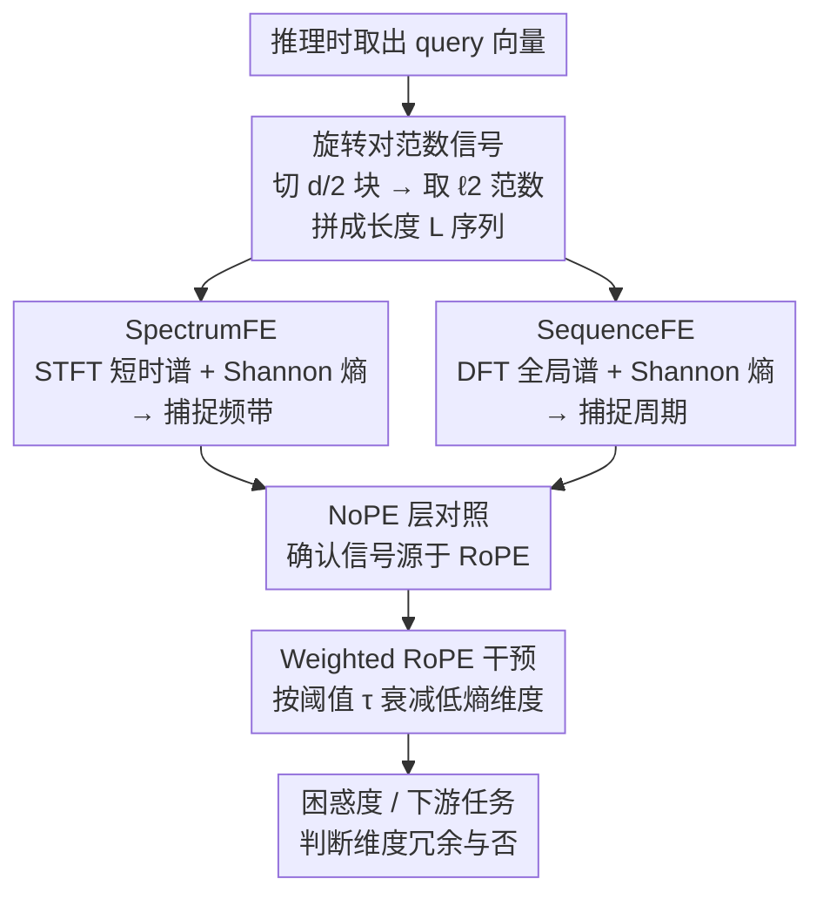

# Probing Rotary Position Embeddings through Frequency Entropy

**会议**: ICLR 2026  
**OpenReview**: [https://openreview.net/forum?id=1JZuEDq62N](https://openreview.net/forum?id=1JZuEDq62N)  
**代码**: 待确认  
**领域**: 可解释性 / 位置编码分析  
**关键词**: RoPE、频率熵、位置编码、可解释性、维度剪枝

## 一句话总结
本文提出**频率熵（Frequency Entropy, FE）**这一无需微调的诊断指标，把 RoPE 每个旋转对沿序列的 query 范数信号做傅里叶分析并取 Shannon 熵，分离出"频带结构"与"周期振荡"两类信号，统一解释了以往关于高/低频维度作用的矛盾结论，并发现周期维度大多冗余、可在推理时直接衰减而几乎不掉点。

## 研究背景与动机

**领域现状**：RoPE（旋转位置编码）已是 Llama、Qwen、Gemma 等主流大模型的事实标准。它把 query/key 向量按维度对（rotary pair）施加旋转矩阵 $R_{n,\theta}$，旋转角 $\theta_j = 10000^{-2j/d}$ 随维度对索引 $j$ 单调下降，从而以相对偏移的形式注入位置信息，且不引入额外参数。

**现有痛点**：RoPE 是经验性设计，每个频率维度到底起什么作用、被模型用了多少，一直说不清。更糟的是已有分析结论互相打架：Hong 等发现低频维度对长程依赖（"位置头"）至关重要；Barbero 等却报告低频更偏语义、部分可被 NoPE 替换而不掉点；Chiang & Yogatama 又指出高频维度几乎没被用、可安全删除。三方各执一词。

**核心矛盾**：以往分析几乎都停留在"看热力图"和"粗暴二分高/低频"的层面，缺一个能跨维度、跨层、跨模型统一比较的定量指标。没有统一度量，矛盾结论就无法被调和——它们可能根本在描述同一现象的不同侧面。

**本文目标**：(1) 数学上形式化每个频率维度的贡献；(2) 给出一个模型无关、尺度无关、可逐维度比较的标量指标；(3) 用它去验证哪些维度真正承载任务信号、哪些是冗余。

**切入角度**：作者注意到，一个旋转对在 RoPE 作用下会以近乎恒定的相位步进沿 token 轴振荡，这种"窄带、由 RoPE 驱动"的周期性，和"宽带、由内容驱动"的变化在频谱上形态截然不同。于是可以借信号处理里的**谱熵（spectral entropy）**来量化每个维度的频谱是"尖峰"（少数频率主导、有序）还是"平坦"（能量散开、像噪声）。

**核心 idea**：把每个旋转对的 query $\ell_2$ 范数序列当成一个离散信号，对它做傅里叶变换后取归一化 Shannon 熵——低熵=能量集中=结构性强，高熵=能量分散=内容驱动。用两种变体（短时谱 vs 全局谱）分别捕捉"频带"与"周期"。

## 方法详解

### 整体框架

FE 的核心是把"看不见的频率利用率"变成"逐旋转对的一个标量"。对 head dimension 为 128 的 Llama-4 而言，RoPE 把维度组织成 $d/2=64$ 个二维旋转对；本文对每个旋转对、每个 head、每层都算一个熵值（Llama-4-Scout 共 $64\times48\times40=122{,}880$ 个 FE 值）。整条流程是：取出推理时的 query 向量 → 按旋转对切块、对每块算 $\ell_2$ 范数、沿 token 轴拼成长度 $L$ 的离散信号 → 对该信号做两种傅里叶变换并取 Shannon 熵，得到 **SpectrumFE**（短时谱，刻画频带）和 **SequenceFE**（全局谱，刻画周期）→ 用 NoPE 层作对照确认这些信号确由 RoPE 引起 → 最后用 **Weighted RoPE** 干预实验，把低熵维度的贡献按系数 $\alpha$ 衰减，验证它们是否真有用。

### 关键设计

**1. 旋转对范数信号：把每个频率维度变成一段可做谱分析的离散时间序列**

要量化"频率被用了多少"，先得有一个可分析的信号。作者沿用 Barbero 等的 Cauchy-Schwarz 上界：第 $j$ 个频率分量对注意力激活 $A_{n,m}$ 的贡献被 query/key 子向量的范数所上界，$\langle q_n^{(j)}, k_m^{(j)}\rangle \le \|q_n^{(j)}\|_2\,\|k_m^{(j)}\|_2$。因此对固定旋转对 $j$，把整条序列上的 query 范数收集成向量 $s_j = (\|q_0^{(j)}\|_2, \|q_1^{(j)}\|_2, \dots, \|q_{L-1}^{(j)}\|_2)^\top \in \mathbb{R}^L$，当作一个离散时间信号。之所以用 RoPE 之后的 query 范数：旋转把表示对齐到 logit 里真正用到的频率块、且旋转保范数，于是 $\|q_n^{(j)}\|_2$ 既位置无关又可直接解释，是一个天然的"该维度被激活强度"代理量。后续两种熵都建立在这个信号上。

**2. SpectrumFE：用短时谱熵捕捉"频带结构"——能量集中在哪些旋转对上**

第一个痛点是想知道"模型把能量稳定分配给了哪些旋转对"。SpectrumFE 对信号 $s_j$ 做**短时傅里叶变换（STFT）**：帧长 $F=1024$、跳步 $H=512$、序列长 $L=4096$，得到 $K=F/2+1=513$ 个频率 bin、$T=7$ 帧。把各帧功率谱平均后归一化为概率分布 $p_k = S_k / \sum_j S_j$，再取 Shannon 熵 $H=-\sum_k p_k\log_2 p_k$，并除以最大熵 $H_{\max}=\log_2 K$ 得到尺度无关的归一化谱熵 $\tilde H \in [0,1]$，对 64 个旋转对各算一个。**低 SpectrumFE 意味着局部频率内容集中在少数 bin**：若一连串相邻旋转对索引都呈低熵，就形成一条"频带（frequency band）"——即 $\ell_2$ 范数图上持续偏高的连续索引段。实验中 RoPE 层的 SpectrumFE 主要落在 0.2–0.6，最小值维度恰好对应范数图里最明显的带状结构，说明 SpectrumFE 确实在度量频带：能量被持续分配到的特定旋转对。

**3. SequenceFE：用全局谱熵捕捉"周期振荡"——RoPE 固定相位带来的单音信号**

第二个痛点是区分"由 RoPE 固定相位驱动的周期性"和"由内容驱动的不规则变化"。SequenceFE 改用对整条 $s_j$ 的**全局离散傅里叶变换（DFT）**：$S_k = |\sum_{n=0}^{L-1} s_j[n]\,e^{-i2\pi kn/L}|^2$，丢掉直流分量、只取正频率 $1 \le k \le L/2-1$ 归一化后取 Shannon 熵并归一化。**低 SequenceFE 表示信号接近单音振荡**：RoPE 让旋转对以近乎恒定步进推进，query 因此在固定频率上振荡，能量集中、熵低；一旦去掉 RoPE，恒速振荡消失、能量散开、SequenceFE 升高。这正好把"RoPE 强加的周期"与"内容调制的复杂动态"在数值上分开了。SpectrumFE 与 SequenceFE 互补：前者答"任一时刻有哪些频率成分"，后者答"能量沿 token 轴有多周期/多不规则"。

**4. Weighted RoPE：用阈值门控的软掩码做无需微调的干预，验证维度是否冗余**

光有诊断指标还不够，得回答"频带和周期到底是必要还是冗余"。Weighted RoPE 给每个 $(l,h,j)$ 的旋转对设一个权重：当其熵 $\tilde H_{l,h,j} < \tau$ 时乘以系数 $\alpha \in [0,0.9]$，否则保持 1，即 $\alpha_{l,h,j}=\alpha$ if $\tilde H_{l,h,j}<\tau$ else $1$。然后把它作为软掩码乘进旋转后的子向量：$q_m^{(j)\star} = \alpha_{l,h,j}\,R^{(l,h,j)}_{m,\theta}\,q_m^{(j)}$，key 同理处理。直观上，对低熵对它"放慢相位增长、削弱周期性"，其余维度原样不动。整个过程不做任何微调、只在推理时改激活，因此能干净地把某类维度"关小"再看困惑度和下游准确率的变化——这是因果性判断维度作用的关键手段。

### 损失函数 / 训练策略
本文是分析型工作，**全程无微调**。FE 只在推理时从 query/key 计算，Weighted RoPE 也只是推理期的乘性软掩码，因此没有训练目标或优化策略。

## 实验关键数据

### 主实验（Weighted RoPE 下游任务）
固定 $\alpha=0.1$，对 SpectrumFE 离群维度（$\tau>0.4$）和 SequenceFE 周期维度（$\tau<0.6$）同时衰减，下游准确率与原始 RoPE 基本无差异：

| 模型 | HellaSwag base / +W | TruthfulQA base / +W | MMLU base / +W |
|------|------|------|------|
| Llama-4 17B | 66.67 / 66.67 | 97.32 / **97.99** | 60.05 / **60.81** |
| Llama-3 8B | 60.16 / 60.16 | 84.85 / 84.85 | 34.21 / 34.21 |
| Qwen3 8B | 58.94 / 58.92 | 95.31 / 95.31 | 57.89 / 57.89 |
| Gemma-2 9B | 61.02 / **61.21** | 98.83 / 98.83 | 72.81 / 72.81 |

衰减这些维度对各任务几乎无影响，Llama-4 甚至略有提升，说明它们对模型性能基本无贡献、属冗余。

### 消融实验（不同阈值的困惑度走向，WikiText-103）
通过扫描权重 $\alpha$ 观察困惑度（PPL）随衰减强度的变化，区分"重要 vs 冗余"维度：

| 衰减目标 | $\alpha$ 减小时 PPL 走向 | 结论 |
|------|---------|------|
| SpectrumFE $\tau<0.2$（频带核心） | 明显上升 | 频带是**重要**成分，不能动 |
| SpectrumFE $\tau>0.4$（高熵离群） | 略降、整体几乎不变 | 离群维度**冗余** |
| SequenceFE $\tau<0.6$（周期维度） | 略降（Llama-4 降幅最大） | 周期维度**冗余甚至有害** |

### 关键发现
- **SpectrumFE 低熵=频带=任务信号，不可削**；而其高熵离群值与 SequenceFE 低熵周期维度都是冗余，可在推理期直接衰减。
- **NoPE 层作对照很关键**：RoPE 层才出现周期性（SequenceFE 常落 0.2–0.6），NoPE 层 SequenceFE 集中在 1.0 附近、几乎无周期；这证明周期信号确由 RoPE 引起。有趣的是 NoPE 层仍可能因内容/架构偏置保留频带（SpectrumFE 仍低），说明频带和周期是两种不同来源的结构。
- **频带与周期维度的位置不固定**，随 head/层而变，并非绝对的"低频"或"高频"。这恰好解释了以往工作的矛盾：它们各自盯着模型相关、位置漂移的频带，而非固定频段效应。
- 随层加深，频带锐度和周期性都减弱，SpectrumFE 分布收敛到某一区间。

## 亮点与洞察
- **把信号处理的谱熵迁移到位置编码诊断**：用一个尺度无关标量统一了"看热力图"式的零散观察，是把定性观察升级为定量、可跨模型比较的范式转变。
- **STFT/DFT 双视角的巧妙分工**：短时谱看"哪些频率成分在场"（频带），全局谱看"沿序列多周期"（周期），同一信号两种变换分离出两类语义不同的结构——这个拆解本身很有启发。
- **干预即因果**：Weighted RoPE 用最小改动（推理期乘性掩码、零微调）就把"相关"升级成"因果"结论，方法上干净可复现。
- 直接指向应用：低 SequenceFE 维度冗余这一发现可迁移到 **RoPE 感知的 KV-cache 压缩与维度剪枝**，给位置编码的轻量化提供了一个有原则的筛选准则。

## 局限与展望
- **主分析集中在 Llama-4（iRoPE）单一模型的 head 0、特定层**，虽附录补了 Llama-3/Qwen3/Gemma2 与跨数据集，但正文结论的普适性仍以个案为主，需谨慎外推。
- **信号取自 query $\ell_2$ 范数**这一代理量基于 Cauchy-Schwarz 上界，是激活强度的近似而非注意力贡献本身；范数高不完全等价于该维度对 logit 影响大。
- 评测语料以 WikiText-103 为主，长上下文场景只在附录的 Needle-in-a-Haystack 上验证，周期维度在超长程检索下是否仍冗余有待更系统的考察。
- STFT 的帧长/跳步（1024/512）等谱参数会影响熵值，论文未充分讨论其敏感性；Weighted RoPE 的阈值 $\tau$ 也是按经验分段设定。

## 相关工作与启发
- **vs Barbero et al. 2025**：他们用 Cauchy-Schwarz 上界和热力图观察到高频偏位置、低频偏语义，本文沿用其范数信号但进一步用熵量化，把"看图"变成"读数"，并指出频带位置随模型漂移，调和了其与他人的分歧。
- **vs Chiang & Yogatama 2025**：他们结论"高频维度几乎没用、可删"，本文用 SpectrumFE 高熵离群维度的衰减实验给出了更细的支撑——确实有一类高熵维度冗余，但"高频=无用"的粗分类并不准确。
- **vs Hong et al. 2024**：他们强调低频"位置头"对长程依赖关键，本文则区分出 SpectrumFE 低熵频带（重要、不可削）与 SequenceFE 低熵周期（冗余），说明"低频"内部并非铁板一块。

## 评分
- 新颖性: ⭐⭐⭐⭐⭐ 首次把谱熵引入 RoPE 逐维诊断，并以此统一矛盾结论
- 实验充分度: ⭐⭐⭐⭐ 多模型多任务覆盖到位，但正文主分析偏单模型/单 head
- 写作质量: ⭐⭐⭐⭐ 公式与图示清晰，频带/周期的物理解释讲得透
- 价值: ⭐⭐⭐⭐⭐ 给位置编码剪枝/KV-cache 压缩提供了可操作的诊断准则

<!-- RELATED:START -->

## 相关论文

- [\[ICLR 2026\] Frequency Bands in RoPE: Base Frequency and Context Length Shape the Interpolation–Extrapolation Trade-off](frequency_bands_in_rope_base_frequency_and_context_length_shape_the_interpolatio.md)
- [\[ICLR 2026\] Attention, Please! Revisiting Attentive Probing Through the Lens of Efficiency](attention_please_revisiting_attentive_probing_through_the_lens_of_efficiency.md)
- [\[ICLR 2026\] Bridging Explainability and Embeddings: BEE Aware of Spuriousness](bridging_explainability_and_embeddings_bee_aware_of_spuriousness.md)
- [\[ICLR 2026\] Cross-Modal Redundancy and the Geometry of Vision-Language Embeddings](cross-modal_redundancy_and_the_geometry_of_vision-language_embeddings.md)
- [\[ICLR 2026\] Tokenizing Single-Channel EEG with Time-Frequency Motif Learning](tokenizing_single-channel_eeg_with_time-frequency_motif_learning.md)

<!-- RELATED:END -->
